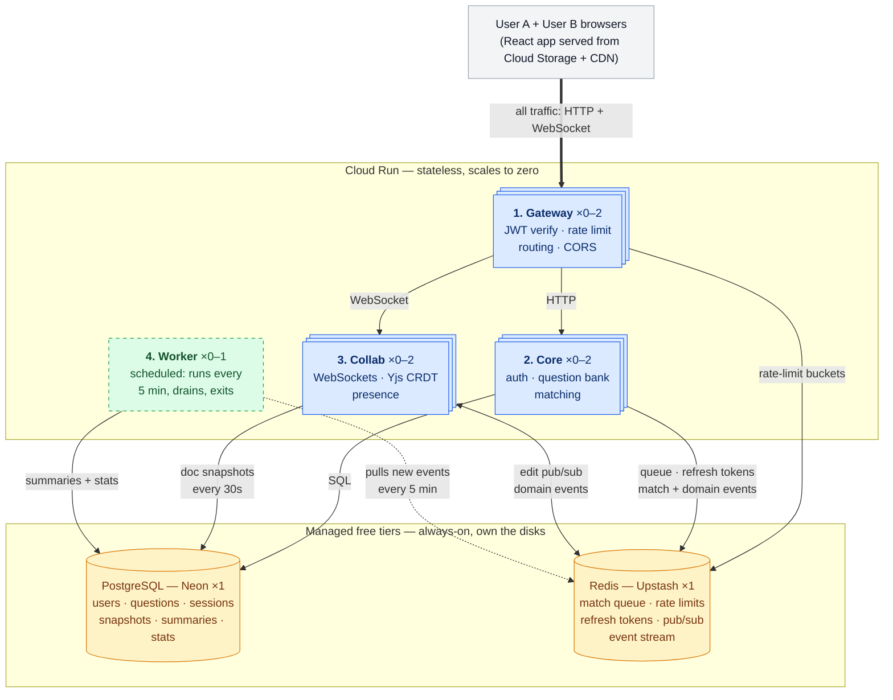
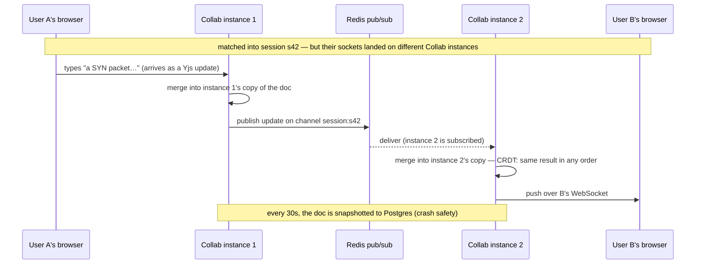

# DeepCS — Design Doc

> A deliberately lean, production-grade web backend: **real-time collaboration,
> microservices + gateway, auth, rate limiting, and a live cloud deploy.**

**Repo description:** CS fundamentals question bank with real-time
collaborative solving. Practice solo or get matched with someone.

---

## 1. What DeepCS proves

- Real-time collaborative editing with cross-instance sync, built on a CRDT
  (Conflict-free Replicated Data Type: concurrent edits on separate copies
  always merge to the same result, with no central referee — Yjs is the mature
  CRDT library used here).
- Microservices behind a custom gateway (JWT verification, routing, rate
  limiting; a JWT is a signed token proving who the user is).
- Stateful auth done properly (JWT + refresh rotation).
- An event-driven pipeline: services append domain events (facts like "match
  created", recorded as data) to a replayable log; a scheduled worker consumes
  them into session summaries and live stats.
- A system that's actually deployed at a live URL.

---

## 2. Product

**Core loop:**

1. Sign up.
2. Browse, search, and filter the question bank; read answers solo.
3. Optionally choose "solve with someone" and join the queue with topic +
   difficulty preferences.
4. Get matched with another waiting user.
5. Land in a shared scaffolded document seeded from the question's parts.
6. Co-write the answer in real time with presence + cursors.
7. Mutual-consent reveal of the reference answer.
8. End session; see a short summary.

**Domain:** a bank of multi-part CS fundamentals questions (OS, networking,
databases, concurrency), sourced from my existing notes repo — so the content
is already owned. Editing is symmetric: both users type into the same document
at the same time with equal rights, which is exactly the concurrent-edit
situation a CRDT exists to resolve, so the CRDT is genuinely load-bearing. The
public browsable question bank makes the live deploy useful to a single
visitor — matchmaking alone would demo as an empty room.

**In scope:** auth; public browsable question bank (search/filter/read solo);
join queue with topic + difficulty preferences; match; shared real-time
scaffolded session document with presence; mutual-consent reference reveal;
reconnect after disconnect; end session + summary; public stats endpoint
(sessions solved, popular topics — fed by the event log, §5).

**Out of scope:** AI features; mobile; polished UI (minimal functional React
only); payments; social features (friends/leaderboards); interviewer/interviewee
roles; role swapping; voice/video; rubrics and scoring; question authoring.

---

## 3. Architecture — 3 services + a scheduled worker

**Reading the diagram:** stacked blue boxes autoscale between 0 and 2
instances — nobody using the app means zero instances running. The dashed
green Worker never has an instance parked: one is started every 5 minutes and
exits when done. The amber cylinders are the only always-on machines, run by
Neon and Upstash, and they hold every byte of durable state — which is exactly
what lets everything blue be disposable.

Every browser request — HTTP or WebSocket — enters through the Gateway; Core
and Collab are never called directly, and the browser never talks to Postgres
or Redis.

**The 3 services**, split by scaling profile (what forces a service to add
instances) and failure domain (what breaks together), not by database table:

- **Gateway** — the single entry point and trust boundary: past it, services
  can assume every request's JWT was already checked. Verifies JWTs,
  rate-limits, routes requests to the other two services.
- **Core** — all the request/response CRUD (create/read/update/delete) work:
  auth, question bank, matching. Same workload shape, so one service.
- **Collab** — the real-time editor. Stateful and WebSocket-heavy (a WebSocket
  is a long-lived two-way connection, unlike HTTP's one-shot request→response),
  scaling on concurrent open connections — a completely different profile, so
  it gets its own service. The split also isolates failures: a Collab crash
  can't take down login or browsing.
- **Worker** — not a fourth service: a scheduled job (a container Cloud
  Scheduler — GCP's cron service — starts every 5 minutes; it runs to
  completion and exits, billed only for its seconds of runtime). It consumes
  the event stream and writes session summaries + aggregate stats to Postgres.
  No user request ever waits on it, and it takes no traffic at all.

---

## 4. Stack

| Layer | Choice | Why |
|-------|--------|-----|
| All services | TypeScript + Fastify (Node web framework) | One language = fast solo iteration. |
| Frontend | React + Vite (build tool) + TS | Minimal, just enough to demo. |
| Database | PostgreSQL (Neon, free) | Relational, plus built-in tag filtering (`text[]` column + GIN index) and full-text search (`tsvector`). |
| Cache/queue/pubsub | Redis (Upstash, free) | Queue, rate-limit state, cross-instance pub/sub, refresh tokens. |
| Real-time | WebSockets + Yjs (CRDT) | Concurrent edits merge without a central server ordering them; mature library. |
| Event log | Redis Streams (prod) + Kafka (dev only) | Replayable domain-event log feeding summaries/stats; one `EventLog` interface, two adapters — hands-on Kafka with zero hosting cost. |
| Container | Docker + docker-compose | Local dev; dev/prod parity. |
| Deploy | Cloud Run (GCP, `asia-southeast1`) | Scale-to-zero (idle services stop entirely: idle cost $0, at the price of a cold start on the next request), free at this scale, live URL. |
| CI (continuous integration) | GitHub Actions | Lint → test → build → deploy on merge. |

---

## 5. Services

### Gateway
- Verifies JWT — RS256: tokens are signed with a private key only Core holds
  and verified with a public key the Gateway caches, so the Gateway never has
  the signing secret. Then injects `X-User-Id` / `X-Request-Id` headers so
  downstream services know who's calling and logs can be correlated per request.
- Token-bucket rate limiting: each client gets a bucket of N tokens, a request
  spends one, tokens refill at a steady rate — bursts allowed, sustained
  flooding blocked. Implemented as a Redis Lua script, which Redis runs
  atomically (no other command interleaves), so two gateway instances can't
  double-spend the same bucket.
- Routes to Core and Collab; handles CORS (the browser rule controlling which
  websites may call the API — locked to the one frontend origin).
- Built custom (not an off-the-shelf gateway like Kong or Traefik) so the
  rate-limit + auth mechanics are implemented in this codebase rather than
  configured in a third-party product.

### Core
- **Auth:** signup with bcrypt password hashing (slow by design — the standard
  for storing passwords); short-lived JWT access token + rotating refresh token
  in Redis. The refresh token is an opaque random ID (it carries no data
  itself) stored server-side, exchanged for a new access token when the old
  one expires; rotation means each exchange also issues a fresh refresh token,
  so a stolen one dies fast.
- **Question bank:** list / filter / search / paginate, get by id. Row shape:
  `parts[]`, `reference_md`, `tags text[]`, `difficulty`.
- **Matching:** reactive — matching runs at the moment a user joins, not on a
  polling timer. On join: read the Redis queue, filter by compatible topic +
  difficulty preferences, atomically claim a pair via a Lua script, create the
  session row, publish a match event on Redis pub/sub (publish/subscribe: a
  message published on a named channel reaches every subscriber to that
  channel).
- **Matching crash recovery:** the claim (Redis) and the session row (Postgres)
  live in two systems, so no transaction spans them — if Core crashes between
  the two, a claimed pair would be out of the queue with no session and wait
  forever. Recovery is client-driven: if no match event arrives within ~10s,
  the client calls `match/status`; the server returns the user's active session
  if one exists (also covers a crash after the insert but before the pub/sub
  publish), otherwise re-enqueues them. Joining is idempotent (safe to repeat —
  re-joining while queued or matched changes nothing), so the retry can never
  double-book. Worst case a crash costs the user a few extra seconds of
  waiting.
- **Reveal rule:** the reference answer (`reference_md`) is served only after
  the server verifies both participants consented. It never reaches the client
  before that.

### Collab
- Authenticated WebSocket connections; one Yjs document per session.
- Doc is seeded from the question's `parts[]` — one heading per part, plus
  "## Our answer" and "## Scratch". The scaffold lets two people work in
  parallel without colliding; "## Scratch" doubles as the chat channel.
- Presence + cursors via Yjs awareness (its built-in side channel broadcasting
  who's online and where their cursor is).
- **Cross-instance sync** via a Redis pub/sub channel per session — needed
  because the two users may be connected to *different* Collab instances
  (edits flow: user A → instance 1 → Redis → instance 2 → user B).
- Snapshots the Yjs doc to Postgres every 30s, on disconnect, and before
  SIGTERM (the shut-down signal Cloud Run sends a container before killing
  it); restores from snapshot on reconnect. Needed because the live doc
  exists only in the instance's memory — without snapshots, a crash or restart
  would lose the session's text.

The distributed-systems moment, drawn out — one edit crossing instances (the
WebSocket's hop through the Gateway is omitted for clarity):

### Worker + the event log

- Core and Collab call a shared `emitEvent(type, data)` at six moments:
  `user.signed_up`, `queue.joined`, `match.created`, `session.started`,
  `reveal.consented`, `session.ended`. Each call appends one entry to an
  `events` Redis Stream (an append-only log inside Redis: entries get ordered
  IDs, reading never deletes them, and each reader keeps a server-side
  bookmark). Fire-and-forget inside a try/catch — a log hiccup never fails a
  user request.
- The worker reads everything past its bookmark, processes, then acks each
  entry; Redis keeps delivered-but-unacked entries in a pending list, so a
  crash mid-batch means redelivery, not loss. Delivery is therefore
  at-least-once — the worker can see an event twice — so its writes are
  idempotent, same rule as the rest of the system (§6).
- Outputs: on `session.ended`, the session-summary row behind
  `GET /sessions/:id/summary` (duration, topic, reveal used); plus aggregate
  stats (sessions per day, median match wait, popular topics) behind
  `GET /stats`.
- Because the log holds events while nobody is reading, the worker needs no
  always-on instance: Cloud Scheduler triggers it as a Cloud Run job every
  5 minutes; it drains the backlog and exits. Worst case a summary lands ~5
  minutes after the session ends (the session page shows it as pending until
  then). The kept log is also what makes reprocessing possible: rewind the
  bookmark after a bug fix, or add a second consumer later, and history is
  still there — the property plain pub/sub or a queue can't offer.
- In dev, docker-compose runs a single-node Kafka (KRaft mode — no ZooKeeper
  to manage), and the same code targets it through the 3-method `EventLog`
  interface (append / readBatch / ack) with Kafka and Redis Streams adapters.
  That's the hands-on Kafka — topics, offsets, consumer groups — without
  hosting a broker: free managed Kafka effectively no longer exists, and an
  always-on broker would break the §7 cost ceiling.

---

## 6. Shared concerns (auth, rate limiting, security, observability)

- **Auth:** JWT RS256, 15-min access token; opaque refresh token in Redis, 7-day TTL (time-to-live before Redis auto-deletes it), rotated on use; revoke on logout.
- **Rate limiting:** token bucket via Redis Lua. Per-IP at gateway (unauth), per-user general, tighter per-user on `/match/*`. Returns `X-RateLimit-*` headers.
- **Input validation:** zod (TypeScript schema-validation library) on every endpoint; reject malformed input with 400 before business logic runs. Parameterized queries always (values bound as query parameters, never concatenated into SQL — blocks injection).
- **Observability:**
  - Structured JSON logs via Pino (fast Node JSON logger), each line carrying
    `service` + `request_id` + `user_id`.
  - `/health/live` + `/health/ready` on every service (is the process up / is
    it ready to take traffic).
  - Prometheus-style metrics (the standard metrics text format) on each
    service: a `/metrics` endpoint via Fastify plugin exposing request rate,
    error rate, latency histograms, and WebSocket connection count — shipped to
    Grafana Cloud free tier for dashboards and watched live during the load
    test (§8).
  - Full OpenTelemetry distributed tracing (following one request across every
    service it touches) remains an explicit stretch, not core.
- **Security:** HTTPS (Cloud Run free), CORS to one origin, standard security headers via helmet middleware, secrets in GCP Secret Manager (never in code/logs), Dependabot (automated dependency-update PRs).
- **Graceful shutdown:** drain in-flight requests (finish what's processing, accept nothing new); Collab snapshots Yjs docs before exit.
- **Idempotency** (safe to run twice with the same effect as once): queue-join keyed by `user_id`, session-end by `session_id` — a retry can't double-join or double-end. Event consumption is keyed by entry ID: at-least-once delivery means the worker can see the same event twice, and must produce one summary, not two.

---

## 7. Deployment

- **Local:** `docker-compose up` → all 3 services + worker + Postgres + Redis
  + single-node Kafka (the dev backend for the event log).
- **Prod:** Docker images → GCP Artifact Registry (GCP's image store) → Cloud Run (`asia-southeast1`); Neon + Upstash via env vars; secrets in Secret Manager; frontend on Cloud Storage + CDN; the worker as a Cloud Run job triggered by Cloud Scheduler every 5 minutes (never always-on). One live URL, accessible from Singapore.
- **CI:** GitHub Actions — on PR: lint + test + build (no push); on merge to main: build → push → deploy to Cloud Run.

### Cost controls (before deploying anything)

The primary safety net is deploying on the GCP free trial ($300 credits /
90 days): during the trial GCP cannot charge the card — when credits run out,
services stop instead of billing. Upgrading to a paid account is a separate
decision, made only if the demo needs to outlive the trial and only with the
layers below in place.

GCP has no native "stop at $X" cap — budgets are alerts, not limits — so a
hard ceiling is built in layers. Day to day, `--max-instances` makes a big
bill nearly impossible at the source; the kill-switch guarantees a stop even
if a config is fat-fingered. Build the kill-switch (layer 1) before deploying
a single service.

| Layer | Mechanism | Purpose |
|---|---|---|
| 1. Kill-switch | Billing budget → Pub/Sub → Cloud Function that detaches the billing account (`projects.updateBillingInfo`) at $20. Google publishes the ~40-line sample. Not instant (few-min lag) and takes the whole project down. | The only true stop — a backstop, not the primary control. |
| 2. Cloud Run flags | On every service: `--max-instances=2` (hard ceiling on concurrent compute — excess requests queue or get HTTP 429 Too Many Requests instead of spinning up 100 containers) and `--min-instances=0` (idle cost ~$0). Then per service, because Cloud Run counts an open WebSocket as one in-flight request for its entire life and the socket traverses both Gateway and Collab: Core gets `--concurrency=80` (many requests per instance instead of scaling out per-request) and `--timeout=60s` (a hung request is killed in a minute instead of holding a slot and billing forever — ~1000× a normal request, so it never fires on real traffic); Gateway and Collab get `--concurrency=250` and `--timeout=3600s`, since a 60s timeout would sever every collab session each minute, and concurrency here is the hard cap on concurrent sockets (250 × 2 instances = 500). | The real day-to-day cap: a runaway bill comes from autoscaling under load/loops/bots; this caps it at the source. |
| 3. API surface | Enable only the APIs used: Cloud Run, Artifact Registry, Secret Manager, Cloud Storage, Cloud Scheduler. | Every disabled API is a whole category of bill that can't happen. |
| 4. Public URL | The gateway's token-bucket rate limit caps traffic that would drive Cloud Run scaling. Neon (0.5GB) and Upstash (10K cmd/day) throttle rather than overage-bill. | The stateful layer isn't the risk — Cloud Run is. |
| 5. Early warning | Budget alerts at 50 / 90 / 100% ($10 / $18 / $20). | Email before the kill-switch fires, so you can look first. |

### Infrastructure as code (Terraform) — second pass, not first

First deploy is manual (console + `gcloud`) to learn what the pieces are. Once
it works, capture it in Terraform: Cloud Run services (with the
max-instances/concurrency flags above), Artifact Registry, Secret Manager
secrets, the storage bucket, the Cloud Scheduler job, and budget alerts — all declared in `.tf` files in
the repo, applied with `terraform apply`. This makes the whole environment
reproducible from git and locks the cost-control flags in code so they can't be
fat-fingered away.

### Kubernetes — learning sprint, then migrate to Cloud Run

Cloud Run is the final production state (scale-to-zero, no cluster to run,
no idle cost). But k8s is worth learning hands-on, so it's worked in as a
deliberate phase rather than skipped:

1. **Learn on GKE (during the free trial):** write raw manifests for the 3
   services — Deployment, Service, Ingress, ConfigMap/Secret,
   liveness/readiness probes (the health checks k8s uses to restart or route
   around a broken pod) — and deploy to GKE Autopilot (Google-managed
   Kubernetes: you supply the YAML, Google runs the cluster machinery) on
   trial credits. Run the app there for a few days: roll out a release with
   `kubectl apply`, kill a pod and watch it self-heal, read logs via `kubectl`.
   No Helm (k8s package manager), no k3d (local-cluster shortcut) — raw YAML
   so every line is understood.
2. **Migrate to Cloud Run** as the permanent deploy, then delete the
   cluster (GKE bills while idle; Cloud Run doesn't). Keep the manifests in
   `k8s/` in the repo. ADR-05 documents the choice.

---

## 8. Testing + the headline load number

- **Unit:** matching logic, rate-limit token bucket, question-bank filters,
  worker idempotency (same event twice → one summary).
- **Integration:** testcontainers (a library that spins up real Postgres +
  Redis in Docker for the test run) for the auth flow and match flow.
- **One end-to-end happy path:** signup → match → collab edit syncs → end.
- **k6 load test on Collab, run twice** (k6 scripts fake users hammering the
  app and reports throughput + latency percentiles): first locally against
  docker-compose (find bugs cheaply), then against Cloud Run — watching the
  Grafana dashboard live — to produce the headline number: *"holds N
  concurrent WebSocket connections per instance at p95 X ms edit-propagation
  latency"* (p95: 95% of edits arrive faster than X ms). The Cloud Run run
  measures the system under the §7 flags — `--concurrency` counts each open
  WebSocket as one in-flight request, so the configured ceiling (250 per
  instance), not hardware, is the first limit N can hit; raise the flag before
  chasing a bigger number.

---

## 9. Architecture Decision Records (ADRs)

An ADR is a one-page document recording a significant technical decision:
the context, what was chosen, the alternatives rejected, and the tradeoffs
accepted. They live in `docs/adr/` in the repo. Purpose: anyone reading the
repo can see *why* each choice was made, not just what was built.

The 7 decisions worth recording:

1. **Service boundaries** — split by scaling profile and failure domain
   (3 services), not one service per database table.
2. **Yjs (CRDT) over Operational Transforms** for collaborative editing — OT
   (the older approach, used by Google Docs) needs a central server to order
   every edit; a CRDT converges without one.
3. **Reactive matching** with an atomic Redis Lua-script pair claim, instead
   of a polling loop.
4. **JWT + rotating refresh tokens**, instead of server-side sessions or a
   static refresh token.
5. **Cloud Run over Kubernetes for production** — deployed to GKE during
   development to learn it, migrated to Cloud Run for scale-to-zero and zero
   idle cost; manifests retained in `k8s/`.
6. **Reference answers never enter the shared doc** — a Yjs doc replicates to
   all peers, so the answer key can't live there; Core serves it per-user
   after server-side consent checks.
7. **A replayable event log for summaries/stats** (Redis Streams in prod,
   Kafka in dev) — log over queue semantics, so consumed events stay
   readable: rewind the bookmark to recompute after a bug, or add a consumer
   later and it still sees history. Considered: a Postgres events table
   (viable at this scale — rejected for the cleaner scale-up path and the
   learning value) and real Kafka in prod (no free managed option; an
   always-on broker breaks the §7 cost ceiling). Live Yjs sync stays on Redis
   pub/sub — latency-critical fanout is the wrong shape for a polled log.

---

## 10. Build phases

| Phase | Build | Demoable |
|---|---|---|
| 0 | Monorepo (one repo holding all services + frontend), docker-compose (PG+Redis), 3 hello-world Fastify services, CI lint/test, GCP project (free trial) + billing guard, Neon/Upstash accounts | `docker-compose up` runs |
| 1 | Core: auth (signup/login/JWT), refresh rotation in Redis; Gateway: JWT verify + route + per-IP rate limit | curl signup → login → protected call → refresh |
| 2 | Core: question bank (filter/search/paginate/get) + Redis cache; per-user rate limit; public bank UI (search, filter, read solo) | browse and read questions solo, cache hits visible |
| 3 | Core: reactive matching (Redis sorted set + Lua claim), session row, pub/sub match event | two users join → matched → session exists |
| 4 | **Collab (hardest):** WebSockets + Yjs, JWT-auth the socket, cross-instance pub/sub, presence/cursors, snapshot + reconnect, graceful shutdown | two tabs sync live; kill one instance, other keeps working |
| 5 | Minimal React: login, question list, match button, session page (Monaco — the VS Code editor component — wired to Yjs) with scaffolded editor and the reveal flow, end | open two browsers, match, collaborate, reveal |
| 6 | Deploy to Cloud Run + frontend to CDN; CI deploys on merge; logs + health + `/metrics` → Grafana Cloud dashboard; k6 load run (local, then Cloud Run); README + ADRs + demo GIF | live URL; headline load number in README |
| 7 | Event pipeline: `emitEvent` in Core/Collab → `events` stream on Upstash (behind the 3-method `EventLog` interface); idempotent worker consumer → summary + stats; `GET /sessions/:id/summary` + `GET /stats`; Cloud Scheduler → Cloud Run job; ADR-07 | end a session on the live URL → summary renders; `/stats` shows real counts |
| 8 | Terraform: import the manual GCP setup into `.tf` files (Cloud Run + flags, registry, secrets, bucket, scheduler job, budget alerts) | `terraform apply` rebuilds the environment |
| 9 | k8s learning sprint (on trial credits): raw manifests for the 3 services → GKE Autopilot → run/roll out/self-heal demo → migrate back to Cloud Run, delete cluster, keep `k8s/` in repo | app runs on Kubernetes; manifests in repo; cluster deleted |
| 10 | Kafka in dev: single-node Kafka (KRaft mode) in docker-compose + a Kafka adapter for `EventLog`; producers + worker run against it locally | same events flow end-to-end through Kafka on `docker-compose up`; prod unchanged |

Buffer: things slip — don't add features, use slack to polish README + record a 2-min demo.

---

## Final note

Build the Collab service with the most care — it's the piece that says
"real-time distributed systems," and a clean demo (two tabs
syncing, presence, cursors, survive-an-instance-kill) lands harder than any
amount of infrastructure. Everything else here is deliberately boring on
purpose so that one thing can shine.
