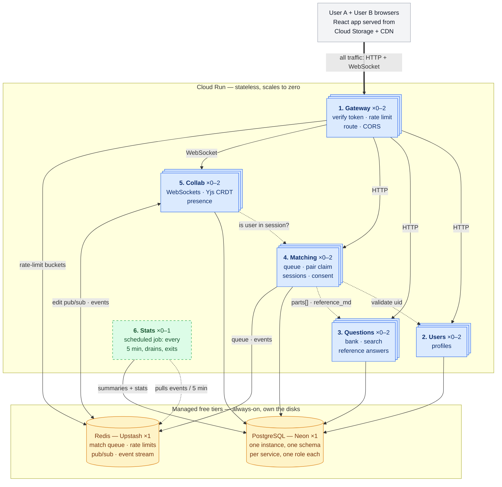
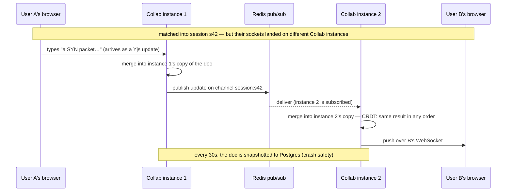

# DeepCS — Design Doc

> A deliberately lean, production-grade web backend: **real-time collaboration,
> microservices + gateway, auth, rate limiting, and a live cloud deploy.**

**Repo description:** CS fundamentals question bank with real-time
collaborative solving. Practice solo or get matched with someone.

---

## How to read this doc

This is a learning project with a real deploy, so some choices optimise for the
product and some optimise for what I wanted to understand. Rather than blur the
two, every non-obvious decision carries one of three tags:

| Tag | Meaning |
|---|---|
| **[bought]** | Deliberately not built. There's no interesting problem inside it, so paying for it is the correct engineering call, not a shortcut. |
| **[built · learning]** | A mature off-the-shelf option exists and is what I'd use commercially. Built here because the problem underneath it is one I wanted to hit directly, and configuring a product hides exactly that problem. |
| **[detour · learning]** | Built, run, and then deliberately **not kept in production**. Exists in the repo as evidence of the work, not as part of the running system. |

Untagged decisions are ordinary product choices with no build-vs-buy tension.

The rule behind every tag: **build what has a concurrency or distributed-systems
problem inside it; buy what is risk without insight.** That's the line applied
consistently below — it's why auth is bought (ADR-04) and the gateway is built
(ADR-08), which are opposite answers from the same test.

Short *Why not X* notes appear inline throughout. The nine decisions big enough
to need full context, alternatives, and accepted tradeoffs are ADRs (§9).

---

## 1. What DeepCS proves

- Real-time collaborative editing with cross-instance sync, built on a CRDT
  (Conflict-free Replicated Data Type: concurrent edits on separate copies
  always merge to the same result, with no central referee — Yjs is the mature
  CRDT library used here). **This is the hard part of the project and the only
  one I'd defend as genuinely difficult.**
- A genuinely distributed system: **six independently deployable units** behind a
  **[built · learning]** gateway, with service-to-service authentication, no
  shared tables, and no transaction spanning a service boundary (ADR-01).
- Federated auth done properly **[bought]**: Firebase Auth issues the tokens,
  the gateway verifies them against Google's public keys and holds no credential
  that could mint one (ADR-04).
- An event-driven pipeline: services append domain events (facts like "match
  created", recorded as data) to a replayable log; a scheduled job consumes them
  into session summaries and live stats — which is where at-least-once delivery
  forces idempotency (§6).
- A system that's actually deployed at a live URL, inside a hard cost ceiling
  (§7) — the constraint that shapes more of this design than any other.

---

## 2. Product

**Core loop:**

1. Sign up.
2. Browse, search, and filter the question bank; read answers solo.
3. Optionally choose "solve with someone" and join the queue with topic +
   difficulty preferences.
4. Get matched with another waiting user.
5. Land in a shared scaffolded document seeded from the question's parts.
6. Co-write the answer in real time with presence + cursors.
7. Mutual-consent reveal of the reference answer.
8. End session; see a short summary.

**Domain:** a bank of multi-part CS fundamentals questions (OS, networking,
databases, concurrency), sourced from my existing notes repo — so the content
is already owned. Editing is symmetric: both users type into the same document
at the same time with equal rights, which is exactly the concurrent-edit
situation a CRDT exists to resolve, so the CRDT is genuinely load-bearing. The
public browsable question bank makes the live deploy useful to a single
visitor — matchmaking alone would demo as an empty room.

**In scope:** auth; public browsable question bank (search/filter/read solo);
join queue with topic + difficulty preferences; match; shared real-time
scaffolded session document with presence; mutual-consent reference reveal;
reconnect after disconnect; end session + summary; public stats endpoint
(sessions solved, popular topics — fed by the event log, §5).

**Out of scope:** AI features; mobile; polished UI (minimal functional React
only); payments; social features (friends/leaderboards); interviewer/interviewee
roles; role swapping; voice/video; rubrics and scoring; question authoring.

---

## 3. Architecture — 6 deployables


```mermaid
%%{init: {"flowchart": {"nodeSpacing": 45, "rankSpacing": 60}}}%%
flowchart TD
    U["User A + User B browsers<br/>React app served from<br/>Cloud Storage + CDN"]

    U ==>|"all traffic: HTTP + WebSocket"| GW

    subgraph RUN["Cloud Run — stateless, scales to zero"]
        GW@{ shape: procs, label: "<b>1. Gateway</b> ×0–2<br/>verify token · rate limit<br/>route · CORS" }
        USR@{ shape: procs, label: "<b>2. Users</b> ×0–2<br/>profiles" }
        QST@{ shape: procs, label: "<b>3. Questions</b> ×0–2<br/>bank · search<br/>reference answers" }
        MCH@{ shape: procs, label: "<b>4. Matching</b> ×0–2<br/>queue · pair claim<br/>sessions · consent" }
        COL@{ shape: procs, label: "<b>5. Collab</b> ×0–2<br/>WebSockets · Yjs CRDT<br/>presence" }
        STA["<b>6. Stats</b> ×0–1<br/>scheduled job: every<br/>5 min, drains, exits"]
    end

    subgraph DATA["Managed free tiers — always-on, own the disks"]
        PG[("PostgreSQL — Neon ×1<br/>one instance, one schema<br/>per service, one role each")]
        RD[("Redis — Upstash ×1<br/>match queue · rate limits<br/>pub/sub · event stream")]
    end

    GW -->|HTTP| USR
    GW -->|HTTP| QST
    GW -->|HTTP| MCH
    GW -->|WebSocket| COL
    GW -->|"rate-limit buckets"| RD
    MCH -.->|"validate uid"| USR
    MCH -.->|"parts[] · reference_md"| QST
    COL -.->|"is user in session?"| MCH
    USR --> PG
    QST --> PG
    MCH --> PG
    COL --> PG
    MCH -->|"queue · events"| RD
    COL <-->|"edit pub/sub · events"| RD
    STA -.->|"pulls events / 5 min"| RD
    STA -->|"summaries + stats"| PG

    classDef client fill:#f3f4f6,stroke:#9ca3af,color:#111827
    classDef ephemeral fill:#dbeafe,stroke:#2563eb,color:#0c2d6b
    classDef scheduled fill:#dcfce7,stroke:#16a34a,color:#14532d,stroke-dasharray: 5 5
    classDef stateful fill:#fef3c7,stroke:#d97706,color:#78350f
    class U client
    class GW,USR,QST,MCH,COL ephemeral
    class STA scheduled
    class PG,RD stateful
```

**Reading the diagram:** stacked blue boxes autoscale between 0 and 2 instances —
nobody using the app means zero instances running. The dashed green Stats job
never has an instance parked. Solid arrows are the request path; **dotted arrows
are service-to-service calls**, which exist because no service may read another's
tables. The amber cylinders are the only always-on machines.

Every browser request — HTTP or WebSocket — enters through the Gateway. No other
service is reachable from the internet, and the browser never talks to Postgres
or Redis.

### The six capabilities, and why each is its own deployable

| # | Service | Owns | Why it's separate |
|---|---|---|---|
| 1 | **Gateway** | nothing (stateless) | **Position.** A cross-cutting enforcement point has to sit *in front of* what it protects. This would be true even if its scaling profile matched everything else exactly. |
| 2 | **Users** | profile rows keyed by `firebase_uid` | One capability, one owner. Small and stable — it will change less than anything else here. |
| 3 | **Questions** | question bank, tags, full-text index, `reference_md` | Read-heavy and cacheable in a way nothing else is; also the only service holding answer keys, so a narrower blast radius is worth something. |
| 4 | **Matching** | queue state, pair claim, session rows, consent | The only service with a hard concurrency problem (the atomic pair claim, ADR-03). |
| 5 | **Collab** | live Yjs docs, snapshots | **Different scaling trigger and different failure mode.** One WebSocket occupies a concurrency slot for 20 minutes; Cloud Run needs opposite `--concurrency`/`--timeout` values from every other service, and those are per-service flags (§7). This boundary is forced by the platform, not chosen. |
| 6 | **Stats** | summaries, aggregates | **Trigger.** Time-driven, not request-driven — and a scaled-to-zero service has no running process for a timer to fire in, so it can't be a server at all. It's a job. |

**Two of these six are not really "splits."** The Gateway is a *position* and
Stats is a *job* — judging either by scaling profiles would be a category error.
The other four are ordinary services, one per capability.

*Why one service per capability rather than grouping them?* Honestly: by a strict
scaling-forces test, Users + Questions + Matching would merge — they share a
request shape, a failure domain and a deploy cadence, and an earlier draft of
this design did exactly that. They're kept separate for **independent
deployability and one clear owner per capability**, and because operating a
genuinely distributed system — service-to-service auth, validation across a
boundary, no cross-service transaction — is a large part of what this project
exists to teach. ADR-01 states the costs that buys and names the condition under
which they'd merge back.

*Why not a monolith?* Collab alone rules it out: one open WebSocket holds a
concurrency slot for the whole session, so bundling it with the question bank
means a hundred idle sockets starve a browse request, and the two scale on
incompatible signals with no way to configure both.

*Why does everything go through the Gateway?* So exactly one place verifies a
token. The cost is a network hop, and for WebSockets a doubled concurrency slot —
see §5.

---

## 4. Stack

| Layer | Choice | Why — and why not the alternative |
|-------|--------|-----|
| All services | TypeScript + Fastify (Node web framework) | One language across six deployables + the frontend = fast solo iteration, and shared types across service boundaries, which matters much more now that boundaries exist. *Not Express:* Fastify has JSON-schema validation and a real plugin/encapsulation model built in, and is meaningfully faster. *Not NestJS:* heavy structure earns its keep on a team. |
| Frontend | React + Vite (build tool) + TS | Minimal, just enough to demo; Yjs bindings for React editors are mature. *Not Next.js:* SSR buys nothing for an authenticated single-page editor and adds a server to deploy where a static bundle on a CDN costs nothing. |
| Auth | Firebase Auth (email/password) **[bought]** | Identity is a solved, security-critical problem with no design insight left in it; Google's abuse detection and key rotation beat anything hand-rolled. *Not self-hosted:* ADR-04. Free at this scale. |
| Database | PostgreSQL (Neon, free) **[bought]** — one instance, schema per service | Relational data, plus built-in tag filtering (`text[]` + GIN index) and full-text search (`tsvector`), so no separate search engine. *Not database-per-service:* ADR-09 — it would cost cross-service atomicity and force a saga. *Not Mongo:* the data is relational. *Not Cloud SQL:* no free tier, bills hourly. |
| Cache/queue/pubsub | Redis (Upstash, free) **[bought]** | One dependency covering four jobs: match queue, rate-limit state, cross-instance pub/sub, event stream. Split from Postgres by **access pattern** (ephemeral shared state vs durable relational), not by service. *Not Memorystore:* no free tier. |
| Real-time | WebSockets + Yjs (CRDT) | Concurrent edits merge without a central server ordering them (ADR-02). *Not SSE or polling:* one-directional, or too slow for ~100 ms keystroke echo. *Not Liveblocks/PartyKit:* they'd host the hard part, and the hard part is the project. |
| Event log | Redis Streams (prod) + Kafka (dev only) **[detour · learning]** | Replayable domain-event log feeding summaries/stats; one `EventLog` interface, two adapters. Kafka exists **only in docker-compose**. *Not Kafka in prod:* no free managed option, and an always-on broker breaks §7. *Not GCP Pub/Sub:* more IAM surface, and it hides the bookmark mechanics that are the point. |
| Editor | Monaco wired to Yjs | Familiar VS Code feel, mature `y-monaco` binding. *Not a plain textarea:* no cursor decorations, so presence would be invisible. *Not CodeMirror 6:* a fair alternative, lighter — Monaco chosen for recognisability in a demo. |
| Container | Docker + docker-compose | Local dev; dev/prod parity — the same image runs locally, on Cloud Run, and on GKE, which makes the §7 migration a deploy command rather than a rewrite. |
| Deploy | Cloud Run (GCP, `asia-southeast1`) **[bought]** | Scale-to-zero (idle cost $0, at the price of a cold start), free at this scale, live URL. *Not GKE:* ADR-05. *Not Vercel/Railway:* fine products, but the goal includes learning GCP's primitives. |
| CI | GitHub Actions | Lint → test → build → deploy on merge, **per service** (§7). *Not Cloud Build:* the repo is on GitHub and Actions is free for public repos. |

---

## 5. Services

### Gateway — **[built · learning]** (ADR-08)

The one service where an off-the-shelf product would do the whole job. Kong
DB-less covers routing, JWT verification, CORS and distributed rate limiting in
roughly fifteen lines of config, and that is what I'd deploy at a company. It's
built here for one reason: the rate limiter is the only place in this system
where I could write the racy version, reproduce the double-count across two
instances, and then fix it.

- **Verifies the token.** Firebase Auth signs ID tokens (RS256) with a private
  key Google holds; the Gateway verifies against Google's public keys, fetched
  from the published **JWKS** endpoint (JSON Web Key Set — the signing public
  keys, which Google rotates) and cached per its `Cache-Control`. Verified with
  `jose` against that JWKS rather than the Firebase Admin SDK, deliberately:
  verification needs only public keys, so the Gateway holds no service-account
  credential and **cannot mint or revoke a token**. It checks signature, `exp`,
  `iss`, and `aud` — an unchecked `aud` would accept a validly-signed token
  issued for a *different* Firebase project, which is the classic mistake here.
  Then injects `X-User-Id` (the Firebase UID from `sub`) and `X-Request-Id`.
- **Token-bucket rate limiting.** Each client gets a bucket of N tokens, a
  request spends one, tokens refill at a steady rate — bursts allowed, sustained
  flooding blocked. Implemented as a Redis Lua script, which Redis runs
  atomically, so two Gateway instances can't double-spend the same bucket.
- **Routes** to the four downstream services; handles CORS (locked to the one
  frontend origin).

*Why a Lua script and not `INCR`?* A fixed-window counter needs only `INCR`,
which is already atomic — that's how Kong's plugin does it. A **token bucket**
reads two values (tokens remaining, last refill time), computes a refill from
elapsed time, and writes both back. That's multi-step, so atomicity has to come
from wrapping it in a script Redis runs start-to-finish with nothing interleaved.
The bucket is worth it because it permits bursts, which a fixed window either
forbids or lets through at the boundary.

**The bug the script prevents** — the one this service exists to demonstrate
(ADR-08). Two Gateway instances, one user's bucket, one token left in it:

```
instance A: read tokens = 1
instance B: read tokens = 1     <- reads before A has written
instance A: write tokens = 0    <- A lets its request through
instance B: write tokens = 0    <- B lets its through too; A's decrement is lost
```

That's a **lost update**, and note what it does *not* require: no threads, no
shared memory. Two ordinary processes on two different machines are enough. Which
is also why an in-process mutex is not a fix — it would guard one instance's own
memory, at an address the other instance cannot reach and has never heard of.
**Atomicity has to live where the single copy of the state lives**, and that is
Redis, which runs one command — or one Lua script — start to finish before
beginning the next.

*Why not Envoy, the usual suggestion?* Its `jwt_authn` filter would replace token
verification cleanly, but its **local** rate-limit filter is per-instance —
exactly the split-bucket bug — and its **global** one delegates to a separate
gRPC rate-limit service backed by Redis. Envoy doesn't remove this problem, it
deploys another container to solve it the same way. Kong DB-less is the honest
comparison.

**The tradeoff this position costs:** every WebSocket is proxied, so one collab
connection occupies a concurrency slot on the Gateway *and* on Collab, halving
effective socket capacity under the §7 flags. Letting browsers connect straight
to Collab would avoid it, and Collab verifies tokens itself anyway (§6). It's
kept behind the Gateway for one public origin and for rate limiting on connection
establishment. If the socket ceiling ever binds, this is the first thing to
change.

### Users

- **No auth code.** Sign-up, sign-in, password storage, token issue and refresh
  all happen client-side against Firebase; no service here ever sees a password.
- Owns the **profile row**: `firebase_uid text unique` plus app-owned data
  Firebase knows nothing about (display name, preferred topics). Created lazily —
  the first authenticated request from an unknown UID does
  `INSERT … ON CONFLICT (firebase_uid) DO NOTHING`, which is also where
  `user.signed_up` is emitted, since there is no signup endpoint to emit it from.
- Exposes `GET /users/:uid/exists` for Matching's validation call.

*Why lazy upsert rather than a Firebase `onCreate` trigger?* One fewer deployed
function, and it cannot drift out of sync with Firebase's user list.

*Account deletion* is the one flow spanning Firebase and this service: delete
from Firebase first, then here. If the second half fails, the row is unreachable
(nobody can authenticate as that UID) and a retry is safe.

### Questions

- **Bank:** list / filter / search / paginate / get by id. Row shape: `parts[]`,
  `reference_md`, `tags text[]` (GIN-indexed), `difficulty`.
- Prefers **cursor pagination** (`WHERE id > $last ORDER BY id LIMIT 20`) over
  `OFFSET`, which makes Postgres read and discard every skipped row and produces
  duplicates when rows shift between requests.
- **`reference_md` is never served to a browser by this service.** It's released
  only to Matching, over the internal network, after Matching has verified
  consent (ADR-06). Questions has no way to know who consented; Matching has no
  way to know the answer text. Neither service can leak the answer alone.

### Matching

- **Reactive** — matching runs at the moment a user joins, not on a polling
  timer. On join: read the Redis queue, filter by compatible topic + difficulty,
  **atomically claim a pair via a Lua script**, create the session row, publish a
  match event on Redis pub/sub.
- Owns **session rows** and the **consent state** behind the reveal rule.
- **Validates across boundaries by API call**, not by SQL: it asks Users whether
  the UID exists and Questions for `parts[]`. It cannot join to those tables —
  the database rejects it (ADR-09).
- **Crash recovery:** the claim (Redis) and the session row (Postgres) live in
  two systems, so no transaction spans them. If Matching crashes between the two,
  a claimed pair is out of the queue with no session and would wait forever.
  Recovery is client-driven: if no match event arrives within ~10 s the client
  calls `/match/status`, which returns the active session if one exists (also
  covering a crash after insert but before publish) and otherwise re-enqueues.
  Joining is idempotent, so the retry can never double-book.

*Why reactive and not a polling loop?* A loop scanning every second is easier to
reason about but needs an always-on process, which §7 forbids, and adds up to a
second of latency for no benefit. The cost is that the claim must be atomic,
since two users can join simultaneously and race for the same partner — that's
the Lua script (ADR-03).

### Collab

- Authenticated WebSocket connections; one Yjs document per session.
- Doc seeded from the question's `parts[]` — one heading per part, plus
  "## Our answer" and "## Scratch". The scaffold lets two people work in parallel
  without colliding; "## Scratch" doubles as the chat channel.
- Presence + cursors via Yjs **awareness** (its built-in side channel).
- **Cross-instance sync** via a Redis pub/sub channel per session — needed
  because the two users may be connected to *different* Collab instances.
- **Snapshots** the Yjs doc to Postgres every 30 s, on disconnect, and before
  SIGTERM; restores on reconnect. The live doc exists only in one instance's
  memory, so without this a restart loses the session's text.
- **Authorizes its own sockets** by calling Matching: *is this UID a participant
  in this session?* The Gateway cannot answer that — it has no session data.

*Why Redis pub/sub and not sticky sessions?* The obvious fix is pinning both
users to one instance. It doesn't work: Cloud Run's session affinity is
best-effort and pins **a client**, not a group — the two people in a session are
different clients connecting at different moments, so nothing would co-locate
them in the first place, and affinity evaporates on scale-down. Fanning through
Redis makes instance placement irrelevant, which is the property that survives
autoscaling.

*Why snapshot every 30 s and not on every edit?* Per-keystroke writes would
exhaust Neon's free tier and add latency to the hot path. 30 s bounds worst-case
loss to 30 s of typing, and the SIGTERM and disconnect snapshots mean the routine
cases (deploy, scale-down, closed tab) lose nothing at all. Only an ungraceful
crash hits the full window.

*Why Yjs rather than writing the merge myself?* The interesting problem here is
understanding CRDT convergence, not reimplementing it — a hand-rolled merge
would be subtly wrong in ways that surface only under concurrent edits. The
learning is in the sync topology (cross-instance fanout, snapshot, reconnect),
which is exactly the part Yjs does *not* do for you.

The distributed-systems moment, drawn out — one edit crossing instances (the
WebSocket's hop through the Gateway omitted for clarity):


```mermaid
sequenceDiagram
    participant A as User A's browser
    participant C1 as Collab instance 1
    participant R as Redis pub/sub
    participant C2 as Collab instance 2
    participant B as User B's browser
    Note over A,B: matched into session s42 — but their sockets landed on different Collab instances
    A->>C1: types "a SYN packet…" (arrives as a Yjs update)
    C1->>C1: merge into instance 1's copy of the doc
    C1->>R: publish update on channel session:s42
    R-->>C2: deliver (instance 2 is subscribed)
    C2->>C2: merge into instance 2's copy — CRDT: same result in any order
    C2->>B: push over B's WebSocket
    Note over C1,C2: every 30s, the doc is snapshotted to Postgres (crash safety)
```

### Stats — the scheduled job + the event log

- Services call a shared `emitEvent(type, data)` at six moments:
  `user.signed_up`, `queue.joined`, `match.created`, `session.started`,
  `reveal.consented`, `session.ended`. Each appends one entry to an `events`
  **Redis Stream** (an append-only log: entries get ordered IDs, reading never
  deletes them, and each reader keeps a server-side bookmark). Fire-and-forget
  inside a try/catch — a log hiccup never fails a user request.
- The job reads everything past its bookmark, processes, then acks each entry.
  Redis keeps delivered-but-unacked entries in a pending list, so a crash
  mid-batch means redelivery, not loss. Delivery is therefore **at-least-once**,
  so every write is idempotent (§6).
- Outputs: on `session.ended`, a summary row behind `GET /sessions/:id/summary`;
  plus aggregates (sessions per day, median match wait, popular topics) behind
  `GET /stats`.
- Cloud Scheduler **[bought]** triggers it as a Cloud Run job every 5 minutes; it
  drains the backlog and exits. Worst case a summary lands ~5 minutes after the
  session ends. The retained log is what makes reprocessing possible: rewind the
  bookmark after a bug fix, or add a consumer later, and history is still there.
- **[detour · learning]** In dev only, docker-compose runs single-node Kafka
  (KRaft mode), and the same code targets it through the 3-method `EventLog`
  interface (append / readBatch / ack). **Nothing in production touches Kafka** —
  it exists so topics, offsets and consumer groups are hands-on rather than read
  about, confined behind the interface so prod is unaffected.

*Why a log and not a queue?* A queue deletes on consume, so a bug in the summary
logic means the data needed to recompute is gone. A log keeps entries after
reading, so the fix is rewinding the bookmark (ADR-07).

*Why not have Matching write summaries directly?* The write would sit on the
user's request path, and there'd be no replay when the logic changes. The async
split is also what creates the at-least-once problem that forces idempotency —
which is the reason this phase is worth building.

*Why a scheduled job and not an always-on consumer?* An always-on container is
the one thing §7 rules out. The log holds events while nobody reads, so polling
every 5 minutes costs only freshness.

---

## 6. Shared concerns

### Authentication vs authorization — where each check lives

The distinction matters more with six services than it would with one, so state
it explicitly:

- **Authentication** (*who are you*) happens **once, at the Gateway**. Downstream
  services never re-verify; they read `X-User-Id` and trust it.
- **Authorization** (*may you do this specific thing*) **cannot** be at the
  Gateway, which has no domain data. It lives with whoever owns the record:
  Collab asks whether a UID is a participant in a session; Matching enforces
  mutual consent before releasing a reference answer.

Auth is therefore spread across three places and **there is no auth service**:
Firebase owns credentials and token issuance, the Gateway owns verification, and
Users owns the profile row. Before ADR-04 there would have been a seventh
service's worth of work here — buying identity deleted it.

- **Token details:** Firebase ID tokens, RS256, ~1-hour expiry, refreshed
  transparently by the client SDK. **The tradeoff to state, not hide:** with
  plain verification, a revoked or deleted user's existing token stays valid
  until it expires — up to an hour. Server-side revocation exists
  (`revokeRefreshTokens` + `verifyIdToken(token, true)`) but needs the Admin SDK
  and a round-trip per request, so it isn't on the hot path. For a shared answer
  document that window is acceptable; with money involved it wouldn't be.

### Service-to-service authentication

Now that services call each other, "internal" has to mean something enforceable:

- Every service except the Gateway is deployed with **internal-only ingress**, so
  it has no route from the internet.
- Each service runs as its **own service account**, and is granted
  `roles/run.invoker` only on the specific services it calls — Matching on Users
  and Questions, Collab on Matching, the Gateway on all four. Callers attach a
  Google-signed ID token; Cloud Run rejects anything else.

**This is the assumption the whole design rests on.** `X-User-Id` is trusted
because only the Gateway can set it. If any service ever gains public ingress,
that header becomes forgeable and it is an authentication bypass — so the ingress
setting is a security control, not a deployment detail.

### The rest

- **Rate limiting:** token bucket via Redis Lua. Per-IP at the Gateway (unauth),
  per-user general, tighter per-user on `/match/*`. Returns `X-RateLimit-*`.
- **Input validation:** zod on every endpoint, rejecting malformed input with 400
  before business logic. Parameterized queries always.
- **Observability:**
  - Structured JSON logs via Pino, each line carrying `service` + `request_id` +
    `user_id`. `X-Request-Id` propagates across service calls, which is what
    makes a six-service request path debuggable at all.
  - `/health/live` + `/health/ready` on every service.
  - Prometheus-format `/metrics` per service: request rate, error rate, latency
    histograms, WebSocket connection count.
  - Grafana Cloud free tier **[bought]** stores and dashboards it. *Not a
    self-hosted Prometheus server:* an always-on container with a disk, which §7
    forbids. Consequence worth knowing — Prometheus normally **pulls**, and Cloud
    Run instances aren't individually addressable and vanish when idle, so
    metrics must be **pushed** (OTLP or `remote_write`), not scraped.
  - Full OpenTelemetry tracing is an explicit stretch. It's worth more here than
    it was with three services — a match request now touches four — but it's
    still not core.
- **Security:** HTTPS (Cloud Run free), CORS to one origin, helmet security
  headers, secrets in Secret Manager, Dependabot.
- **Graceful shutdown:** drain in-flight requests; Collab snapshots Yjs docs
  before exit.
- **Idempotency** (safe to run twice with the same effect as once): queue-join
  keyed by `user_id`, session-end by `session_id`, event consumption by entry ID.
  With at-least-once delivery this is not optional — it's what converts
  "at-least-once" into "effectively exactly-once".

---

## 7. Deployment

- **Local:** `docker-compose up` → 5 services + the Stats job + Postgres + Redis
  + single-node Kafka + the **Firebase Auth emulator**. The emulator keeps local
  dev and CI offline and free, lets integration tests mint tokens for arbitrary
  test users, and preserves the "one command runs everything" property that
  buying a hosted identity provider would otherwise break. It issues *unsigned*
  tokens, so the Gateway selects emulator mode purely on an env var — a flag that
  must be impossible to set in prod.
- **Prod:** Docker images → Artifact Registry → Cloud Run (`asia-southeast1`);
  Neon + Upstash via env vars; secrets in Secret Manager; frontend on Cloud
  Storage + CDN; Stats as a Cloud Run job triggered by Cloud Scheduler every 5
  minutes. One live URL.
- **CI:** GitHub Actions, **path-filtered per service** — a change under
  `services/questions/` builds and deploys only Questions. Independent deploy is
  most of the point of the split (ADR-01), and it doesn't exist unless CI is
  wired for it.

**The cost of six deployables, stated honestly:** a cold match request can chain
cold starts — Gateway → Matching → Users → Questions, each potentially starting
from zero. That's the real price of `--min-instances=0`, and it's accepted rather
than mitigated, because the alternative is paying for parked instances. It is
also why cross-service calls are kept to validation only, and never placed on the
question-browsing path a first-time visitor hits.

### Cost controls (before deploying anything)

The primary safety net is the GCP free trial ($300 / 90 days): during the trial
GCP cannot charge the card — when credits run out, services stop instead of
billing. Upgrading to a paid account is a separate decision.

GCP has no native "stop at $X" cap — budgets are alerts, not limits — so the
ceiling is built in layers. Build the kill-switch before deploying a single
service.

| Layer | Mechanism | Purpose |
|---|---|---|
| 1. Kill-switch | Billing budget → Pub/Sub → Cloud Function **[bought]** that detaches the billing account (`projects.updateBillingInfo`) at $20. Google publishes the ~40-line sample. **Three caveats that make it a backstop rather than a cap:** budget data lags, so the delay is hours not minutes and a genuine runaway can overshoot; detaching is *destructive*, not a pause — resources can be deleted, not merely suspended; and it fails **silently** unless the function's service account has Billing Account Administrator **on the billing account**, not just the project. Test it once on a throwaway project with a $0.01 budget. | The only true stop — a backstop, not the primary control. |
| 2. Cloud Run flags | On all six: `--max-instances=2` (excess requests queue or get 429 instead of spinning up 100 containers) and `--min-instances=0` (idle ~$0). Then split by unit of work, since Cloud Run counts an open WebSocket as one in-flight request for its entire life: **Users / Questions / Matching** get `--concurrency=80` and `--timeout=60s`; **Gateway and Collab** get `--concurrency=250` and `--timeout=3600s`, since a 60 s timeout would sever every collab session each minute. Concurrency is the hard cap on sockets: 250 × 2 = 500. | The real day-to-day cap: runaway bills come from autoscaling, and this caps it at the source. |
| 3. API surface | Enable only: Cloud Run, Artifact Registry, Secret Manager, Cloud Storage, Cloud Scheduler. | Every disabled API is a category of bill that can't happen. |
| 4. Public URL | The Gateway's rate limit caps traffic that would drive Cloud Run scaling. Neon (0.5 GB) and Upstash (10K cmd/day) throttle rather than overage-bill. | The stateful layer isn't the risk — Cloud Run is, because its response to load is to provision more of itself. |
| 5. Early warning | Budget alerts at 50 / 90 / 100% ($10 / $18 / $20). | Email before the kill-switch fires. |

**Note that six deployables does not multiply the bill.** Everything scales to
zero, so idle cost is unchanged; what grows is *ceiling* (12 possible instances
instead of 8) and operational surface, not baseline spend.

### What the concurrency flags actually mean

`--max-instances` and `--concurrency` are independent axes and their product is
the capacity ceiling: **2 × 80 = 160** simultaneous requests for Users, Questions
and Matching; **2 × 250 = 500** simultaneous WebSockets for the Gateway and
Collab. Past that, Cloud Run queues briefly and then returns **429 Too Many
Requests**, because max-instances is a hard ceiling — rejecting traffic is the
intended behaviour when the alternative is an unbounded bill.

**Why 80 requests on one Node process is not a typo.** Node runs all application
JavaScript on a single thread (one OS-scheduled flow of execution — two of your
own functions never execute simultaneously), driven by an **event loop** (a C
loop that asks the kernel which I/O has finished and calls the matching JS
callback). A typical Users or Matching request spends roughly **2 ms of CPU**
(parse, validate, serialise) and **30 ms waiting on Postgres**. During that wait
the request holds nothing: `await` saves the function's locals and its resume
point into a heap object and hands control back to the loop, which starts the
next request immediately. Eighty in-flight requests are eighty small heap
objects, not eighty parked threads — and the waiting itself is one `epoll_wait`
syscall (Linux: *"tell me which of these sockets are ready"*), not one thread per
socket. That is the whole reason the number is cheap.

This is **concurrency without parallelism**: tasks interleaved over a period, not
executing in the same instant. More cores do nothing for a single Node process,
which is why scaling out means more instances — the axis `--max-instances`
governs — and why the rate-limit bucket has to live in Redis rather than in
memory (§5).

**What it depends on, and the failure mode.** All of the above holds only while
the work is I/O-bound. A CPU-bound stretch with no `await` inside it holds the
thread until it finishes — the loop cannot interrupt it, because there is no
other thread to interrupt it *with*. For that whole time, completed Postgres
results for the other 79 requests sit unread in kernel buffers, p95 latency rises
across every request on the instance, and `/health/ready` can't answer either;
long enough and Cloud Run declares the instance unhealthy. Password hashing is
the one place this design would have hit that — bcrypt is deliberately expensive,
around 250 ms of pure CPU — and **ADR-04 moved it into Firebase, so no CPU-bound
work sits on any request path here.** That's what makes 80 a safe number rather
than an optimistic one.

*Why not `--concurrency=1`?* Then 100 simultaneous users demand 100 instances.
Under `--max-instances=2` the app would serve two requests at a time and 429 the
rest, which reads as broken; without the cap it's 100 containers and a real bill.
Concurrency is precisely what keeps a two-instance ceiling sufficient.

*Why Collab's numbers are the opposite.* Its unit of work is an open socket that
is idle almost all of the time — someone typing occasionally costs microseconds
of CPU — so one instance holds far more of them. But the flag also changes
meaning: for a request/response service concurrency is a throughput knob, while
for Collab `250 × 2 = 500` is a **hard ceiling on concurrent users**, and the
501st is rejected at connect. That is the number §8 has to be careful not to
mistake for a measurement.

### Infrastructure as code (Terraform) — second pass, not first · **[built · learning]**

*Why second?* Writing Terraform for infrastructure you don't yet understand means
debugging two unfamiliar things at once — the cloud resource and the provider's
model of it. Deploying manually first means the `.tf` files describe something
already known to work. Six services makes this materially more valuable than it
was with three: the service accounts, IAM invoker bindings and per-service flags
are exactly the kind of thing that drifts when clicked into a console.

First deploy is manual (console + `gcloud`). Then capture it: Cloud Run services
with their flags, service accounts and invoker bindings, Artifact Registry,
Secret Manager, the bucket, the Scheduler job, and budget alerts.

### Kubernetes — learning sprint, then migrate to Cloud Run · **[detour · learning]**

**The clearest example of the tag in this doc: built, run, demonstrated, then
deleted.** Kubernetes is not part of the production system and never will be —
GKE bills 24/7 whether or not anyone visits, violating the §7 ceiling. It's here
because orchestration can't be learned from reading, and because an idle cluster
is the single most likely way to burn $300 of trial credits by accident, so doing
it deliberately and on a deadline is safer than doing it casually.

1. **Learn on GKE (during the trial):** raw manifests for the five services —
   Deployment, Service, Ingress, ConfigMap/Secret, liveness/readiness probes —
   on GKE Autopilot. Run it for a few days: roll out with `kubectl apply`, kill a
   pod and watch it self-heal, read logs via `kubectl`. No Helm, no k3d — raw
   YAML so every line is understood.
2. **Migrate to Cloud Run**, delete the cluster, keep the manifests in `k8s/`.
   ADR-05 records it.

---

## 8. Testing + the headline load number

- **Unit:** the pair-claim logic, rate-limit token bucket, question-bank filters,
  Stats idempotency (same event twice → one summary).
- **Integration:** testcontainers (real Postgres + Redis in Docker) plus the
  Firebase Auth emulator, covering token verification and its rejection cases
  (expired, tampered, wrong `aud`), the lazy `users` upsert, the match flow, and
  — new with the split — **that a service cannot read another's schema.** That
  last one is a test, not a convention: it asserts the database rejects the
  query.
- **Contract tests** on the three internal calls (Matching→Users,
  Matching→Questions, Collab→Matching), so a response-shape change breaks CI
  rather than production. This is the tax independent deployability charges.
- **One end-to-end happy path:** sign in → match → collab edit syncs → end.
- **k6 load test on Collab, run twice:** first locally against docker-compose
  (find bugs cheaply), then against Cloud Run while watching Grafana — producing
  the headline: *"holds N concurrent WebSocket connections per instance at p95
  X ms edit-propagation latency"*. The Cloud Run run measures the system under
  the §7 flags, so the configured ceiling (250/instance), not hardware, is the
  first limit N hits — raise the flag deliberately before chasing a bigger
  number.

### How the headline number is measured

k6 (a load-testing tool: you write a script describing what *one* user does, and
it runs many copies of it and reports timing statistics) drives the Collab run.
The parts that carry weight:

```js
export const options = {
  stages: [                          // ramp, don't slam
    { duration: '30s', target: 50 },
    { duration: '2m',  target: 50 },
    { duration: '30s', target: 200 },
    { duration: '2m',  target: 200 },
    { duration: '30s', target: 0 },
  ],
  thresholds: {
    edit_latency:  ['p(95)<200'],    // custom metric — fails the run in CI
    ws_connecting: ['p(95)<1000'],
  },
};
```

- **VU (virtual user)** = one concurrent execution of that script. k6's runtime
  is Go, so a VU is a goroutine rather than an OS thread and one laptop drives
  thousands. *Why not a Node load generator?* It would be bounded by its own
  single event loop (§7), and the number it produced would describe the client
  rather than the server.
- **Ramping** is what exposes the *knee* — the load level where latency stops
  being flat and starts climbing. A flat 200-VU run only answers pass/fail; a
  ramp says where the limit is.
- **Thresholds** turn the run into a pass/fail check, which is what lets it live
  in CI instead of being something someone remembers to eyeball.
- **`edit_latency` has to be hand-written**, because k6 has no concept of edit
  propagation: the script stamps a timestamp into each Yjs update it sends and
  records the delta when the echo arrives back over the socket. The headline
  number does not exist unless this metric is built.
- **Report p95/p99, never the average.** If 95 requests take 10 ms and 5 take
  2 s, the average is 110 ms and not one request was anywhere near it. p95 means
  95% of requests were faster than the stated figure — and the tail is both what
  a user feels and where queueing, contention and cold starts appear first.
- **Measure from two directions** — k6's client-side latency *and* Collab's own
  `/metrics` socket count — so that "the server is saturated" stays
  distinguishable from "my load generator is saturated".

*Why these tests and not a coverage target?* A percentage pushes effort toward
whatever is easiest to cover, which is rarely where this system breaks. The
things tested are the places correctness is genuinely non-obvious: the token
bucket under concurrency, the atomic claim, idempotency under redelivery,
cross-instance propagation, and the schema boundary. *Why testcontainers rather
than mocks?* The bugs worth catching are in real SQL and real Redis semantics — a
mock would happily confirm that the racy rate limiter works.

---

## 9. Architecture Decision Records (ADRs)

An ADR is a one-page document recording a significant technical decision: the
context, what was chosen, the alternatives rejected, and the tradeoffs accepted.
They live in `docs/adr/`.

**Division of labour with the inline notes above:** the `**[tag]**` markers and
short *Why not X* lines exist so the doc can be skimmed. ADRs are for the nine
decisions where the *rejected* option was genuinely defensible and the tradeoff
is still being paid. An obvious choice gets a one-line inline note, not an ADR.

1. **One service per capability (6 deployables).** Context: six capabilities —
   verify/route, profiles, question bank, matching, real-time sync, stats.
   Decision: each is its own deployable. Two of the six are not really splits at
   all: the **Gateway** is a *position* (a cross-cutting enforcement point must
   sit in front of what it protects), and **Stats** is a *job* (time-triggered,
   which a scale-to-zero service physically cannot do). **Collab is forced by the
   platform:** `--concurrency` and `--timeout` are per-service Cloud Run flags,
   and a 20-minute WebSocket needs the opposite values from a 30 ms request — one
   service cannot hold both. Rejected: **grouping Users + Questions + Matching
   into one service**, which a strict scaling-forces test would recommend, since
   they share a request shape, failure domain and deploy cadence; an earlier
   draft did exactly that. Chosen against for independent deploy and rollback per
   capability, one clear owner per capability, and because operating a genuinely
   distributed system is a stated goal of the project. Also rejected: **one
   service per database table**, which aligns boundaries with no force at all.
   Tradeoffs accepted: six CI pipelines; two extra network hops on the match
   path; chained cold starts under `--min-instances=0`; contract tests as the
   price of independent deploys; and no transaction spanning a service boundary
   (see ADR-09). **The condition to merge back:** if cold-start latency on the
   match path or the per-service ops overhead starts dominating, Users +
   Questions + Matching recombine cheaply — they already share a database
   instance, so it's a code move, not a data migration.
2. **Yjs (CRDT) over Operational Transforms** — OT (the older approach, used by
   Google Docs) needs a central server to order every edit; a CRDT converges
   without one.
3. **Reactive matching** with an atomic Redis Lua-script pair claim, instead of a
   polling loop.
4. **Firebase Auth instead of self-hosted auth.** Context: the first draft built
   auth directly — bcrypt, RS256 signing, opaque refresh tokens rotated in Redis.
   Decision: buy it. Identity is security-critical, fully solved, and the flows
   that make a managed provider worth its integration cost (password reset, OAuth
   providers, MFA) are all out of scope (§2) — but so is the *risk* they carry,
   and Google's credential-stuffing detection, leaked-password checks and
   signing-key rotation are not things a solo project reproduces. Rejected:
   self-hosting for the learning value — real, but it's the one component here
   with no concurrency or distributed-systems problem inside it, so the learning
   is procedural. Tradeoffs accepted: vendor lock-in on identity (mitigated — the
   app keys off an opaque `firebase_uid`, so migration is a re-registration flow,
   not a rewrite); a revoked token stays valid up to an hour (§6); local dev and
   CI depend on the Auth emulator (§7); and login no longer traverses the
   Gateway, so its rate limiter no longer protects that endpoint — Google's abuse
   controls do instead, which is an upgrade, but it moves part of the threat
   surface off this diagram. **An unplanned benefit worth naming:** bcrypt was
   the only CPU-bound work anywhere on a request path here, and Node runs all
   application JS on one thread, so ~250 ms of hashing would stall every other
   request on that instance — buying auth deleted that hazard, and it's part of
   why `--concurrency=80` is a safe number (§7). **Deliberately kept:** the
   Gateway verifies tokens itself against a JWKS rather than delegating to an
   SDK, so the property that mattered — the edge can verify but cannot mint —
   survives the switch.
5. **Cloud Run over Kubernetes for production** — deployed to GKE during
   development to learn it, migrated to Cloud Run for scale-to-zero and zero idle
   cost; manifests retained in `k8s/`.
6. **Reference answers never enter the shared doc** — a Yjs doc replicates to all
   peers, so the answer key can't live there. Questions releases `reference_md`
   only to Matching over the internal network, and only after Matching verifies
   both participants consented. Neither service can leak it alone.
7. **A replayable event log for summaries/stats** (Redis Streams in prod, Kafka
   in dev) — log over queue semantics, so consumed events stay readable: rewind
   the bookmark to recompute after a bug, or add a consumer later and it still
   sees history. Considered: a Postgres events table (viable at this scale —
   rejected for the cleaner scale-up path and the learning value) and real Kafka
   in prod (no free managed option; an always-on broker breaks §7). Live Yjs sync
   stays on Redis pub/sub — latency-critical fanout is the wrong shape for a
   polled log.
8. **A custom gateway instead of Kong.** Context: the Gateway does JWT
   verification, routing, CORS and distributed rate limiting — all four of which
   Kong DB-less provides, the rate limiter included, via its `policy: redis`
   plugin. Decision: build it anyway. The token bucket is the one component here
   with a reproducible concurrency bug inside it — two stateless instances doing
   read-then-write on a shared bucket double-count under load — and the fix (a
   Lua script Redis executes atomically) is only meaningful if you've seen the
   broken version fail. Rejected: **Kong DB-less**, the honest alternative, ~15
   lines of config and what I'd deploy commercially; **Envoy**, frequently
   suggested but a worse fit — its local rate-limit filter is per-instance and
   its global one delegates to a separate Redis-backed service, so the problem is
   relocated, not solved; **GCP API Gateway**, which doesn't proxy WebSockets;
   **Cloud Armor**, which needs an external load balancer at roughly $18/month
   standing charge and breaks §7. Tradeoffs accepted: no circuit breaking,
   retries or mTLS, none of which this system needs; a hand-written proxy is a
   single point of failure I now own; and every WebSocket burns a concurrency
   slot on the Gateway as well as on Collab (§5). **Note the symmetry with
   ADR-04** — same test, opposite answer: auth bought because it is risk without
   insight, the gateway built because the insight is what's inside it.
9. **One Postgres instance, one schema per service, one role per service.**
   Context: six services, and the question of who owns which tables. Decision: a
   single Neon instance with a schema per service (`users`, `questions`,
   `matching`, `collab`, `stats`), each accessed by its own Postgres role granted
   privileges **only** on its own schema — so a cross-service read is rejected by
   the database, not discouraged by convention. **No foreign key crosses a schema
   boundary**: a session row stores `firebase_uid` and `question_id` as plain
   columns, validated by API call at creation time. That's the concrete thing
   given up, and it's deliberate — a cross-schema FK would re-couple the services
   through the database. Rejected: **database-per-service**, the textbook answer,
   because session creation touches profiles, questions and sessions, and across
   separate databases there is no transaction covering them — it would need a
   **saga** (each step given an explicit compensating action, plus persisted saga
   state and a sweeper for crashed runs), which is a large amount of machinery
   for a two-person editor and would want an always-on orchestrator that §7
   forbids. Also rejected: **a shared schema**, which removes the boundary
   entirely and makes the services non-independently-deployable in practice — a
   distributed monolith. Tradeoffs accepted: one instance is a shared failure
   domain and a shared connection budget (mitigated by Neon's pooled endpoint,
   since six services × two instances × a pool would otherwise exhaust the free
   tier's connection limit); and the "microservices" claim rests on services
   owning their *tables*, not their *instances*. **The condition to split:** one
   service's data outgrowing the instance, or needing a different store — Collab
   snapshots moving to object storage is the likeliest first case — or separate
   teams needing independent migrations. At that point cross-service atomicity is
   lost and session creation needs a saga; the ordering here is chosen so that
   split stays cheap, because no query crosses a boundary today.

---

## 10. Build phases

| Phase | Build | Demoable |
|---|---|---|
| 0 | Monorepo, docker-compose (PG + Redis + Firebase Auth emulator), hello-world Fastify services, per-service CI, GCP project (free trial) + billing guard, Firebase/Neon/Upstash accounts | `docker-compose up` runs |
| 1 | Firebase Auth + emulator wired in; **Gateway**: JWKS fetch/cache, verify ID token (sig/`exp`/`iss`/`aud`), inject `X-User-Id`, route, per-IP rate limit; **Users**: lazy upsert; schemas + per-service Postgres roles; internal-ingress + invoker IAM | emulator token → protected call succeeds; tampered/expired token 401s; `users` row appears once; a service querying another's schema is **rejected by Postgres** |
| 2 | **Questions**: bank (filter/search/cursor-paginate/get) + Redis cache; per-user rate limit; public bank UI | browse and read questions solo, cache hits visible |
| 3 | **Matching**: reactive matching (Redis sorted set + Lua claim), session rows, pub/sub match event, validation calls to Users + Questions, contract tests | two users join → matched → session exists; a Users outage fails the match cleanly rather than corrupting state |
| 4 | **Collab (hardest):** WebSockets + Yjs, authorize the socket via Matching, cross-instance pub/sub, presence/cursors, snapshot + reconnect, graceful shutdown | two tabs sync live; kill one instance, the other keeps working |
| 5 | Minimal React: login, question list, match button, session page (Monaco wired to Yjs) with scaffolded editor, reveal flow, end | open two browsers, match, collaborate, reveal |
| 6 | Deploy all six to Cloud Run + frontend to CDN; CI deploys per service on merge; logs + health + `/metrics` → Grafana; k6 load run; README + ADRs + demo GIF | live URL; headline load number in README; deploying Questions alone doesn't restart Collab |
| 7 | Event pipeline: `emitEvent` → `events` stream (behind the `EventLog` interface); idempotent **Stats** consumer → summaries + aggregates; Cloud Scheduler → Cloud Run job | end a session on the live URL → summary renders; `/stats` shows real counts |
| 8 | **[built · learning]** Terraform: import the manual setup (services + flags, service accounts, invoker bindings, registry, secrets, bucket, scheduler job, budget alerts) | `terraform apply` rebuilds the environment |
| 9 | **[detour · learning]** k8s sprint on trial credits: raw manifests → GKE Autopilot → roll out / self-heal demo → migrate back, delete cluster, keep `k8s/` | app runs on Kubernetes; manifests in repo; cluster deleted |
| 10 | **[detour · learning]** Kafka in dev: single-node Kafka (KRaft) in compose + a Kafka adapter for `EventLog` | same events flow through Kafka on `docker-compose up`; prod unchanged |

**The project is complete and public at phase 6.** Everything after is additive
and independently droppable, in this order: 10 first (pure adapter work behind an
existing interface), then 9, then 8. If time runs short, what gets cut is
learning detours, never the running system.

*Why is phase 0 non-negotiable?* The billing guard is the one item with no
recovery path if skipped.

*Why is Collab at phase 4 rather than last?* It's the piece that can genuinely
fail — cross-instance sync, snapshot correctness, reconnect. Hitting that in
phase 4 leaves room to change approach; hitting it in phase 9 leaves none. It
sits as early as its dependencies (a session row, phase 3) allow.

*Why do the schema roles land in phase 1?* Because a boundary that isn't enforced
from the first table will be violated by the third, and retrofitting grants means
untangling queries that already cross.

---

## Final note

Build the Collab service with the most care — it's the piece that says "real-time
distributed systems," and a clean demo (two tabs syncing, presence, cursors,
survive-an-instance-kill) lands harder than any amount of infrastructure.

That's the honest ranking of what's worth time: **Collab first, the event log and
its idempotency second, the rate limiter third, everything else plumbing.** The
**[bought]** tags exist to protect that ordering — every component handed to a
managed service is time returned to the top of the list.

The failure mode this doc is written to prevent isn't picking a wrong tool; it's
spending three weeks on infrastructure and one on the only part that's hard. Six
services makes that failure mode *easier* to hit, which is the honest cost of
ADR-01 and the reason phases 8–10 are explicitly droppable.
