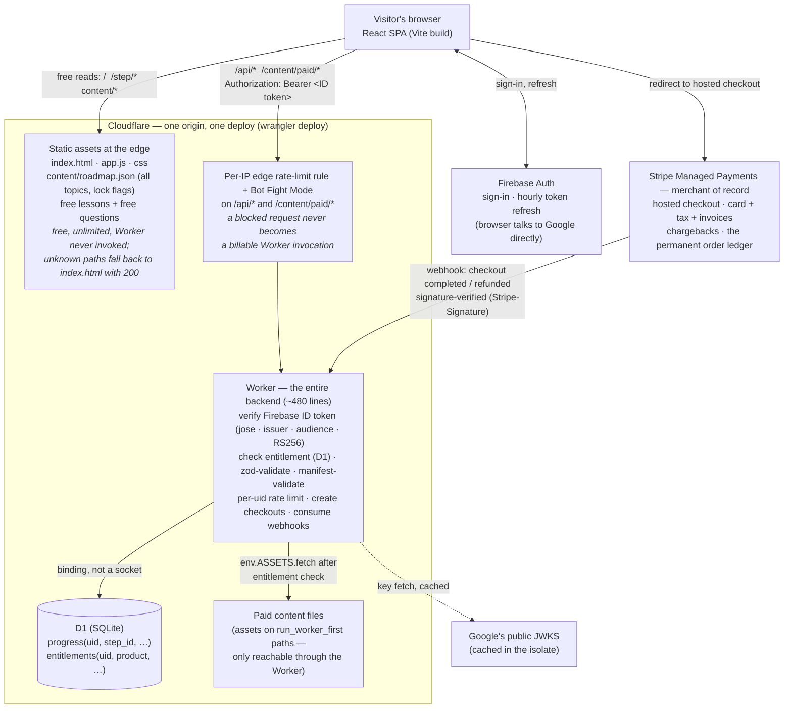
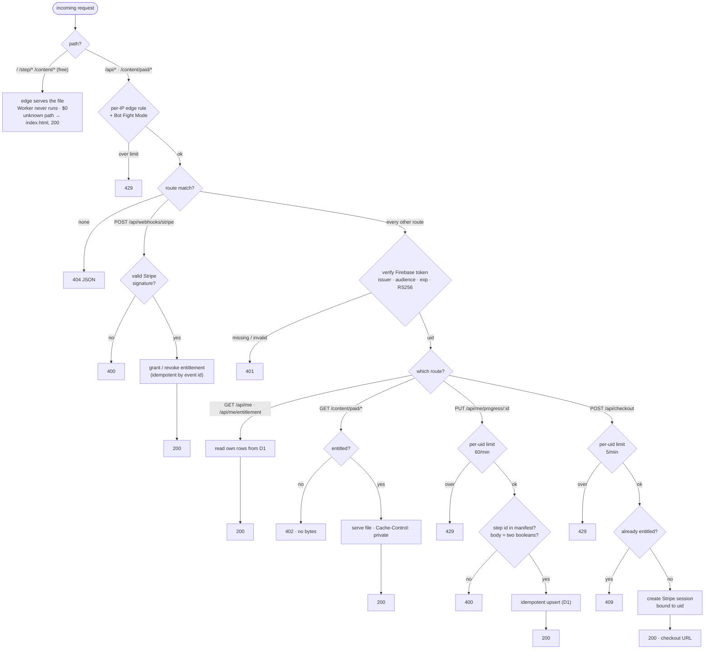

# DeepCS — design

A deployed CS-fundamentals roadmap: read the lessons in the order the map
recommends, answer the questions, tick off what you can explain. Two topics
are free; a one-time purchase unlocks the rest.

This document states **what the system is**. The reasoning behind each
choice — the alternatives it beat and the tradeoff accepted — lives in
[`docs/adr/`](docs/adr/), referenced inline as ADR-NNN.

---

## 1. Goals and non-goals

**Goals, in priority order:**

1. **Deployed and durable.** Sits at a URL, works the day a recruiter clicks
   the link, including after a month of silence.
2. **Lowest possible cost.** Idle and busy months both cost $0. Every ceiling
   fails by refusing service, never by charging.
3. **Simple.** One deployable, one deploy command, two data tables. The whole
   backend reads in one sitting.
4. **Sellable without liabilities.** A paid tier with no per-user marginal
   cost, no owned tax compliance, no subscription treadmill.
5. **Deliberately tested.** A pyramid where every test pins a real failure.
6. **Secure by shape.** The important attacks are inexpressible, not merely
   checked-for.

**Non-goals:** live collaboration, WebSockets, SSE, any long-lived
connection; multi-region writes; an admin or content-editing UI; AI features;
scoring or grading; subscription billing (ADR-006); owning tax compliance
(ADR-006); DRM-grade content protection — the paywall is a commercial gate,
not a cryptographic one (ADR-007).

---

## 2. The workload

Everything downstream derives from this.

| Property | Value | Consequence |
|---|---|---|
| Content | ~800 KB of prose: 10 topics, 30 lessons, the question bank. Identical for every reader of a tier; changes only when the author writes more. | Content is code, not data: it ships as files (ADR-003). |
| Free reads | Anonymous browsing of the free tier — the overwhelming majority of traffic. | The free read path costs zero compute and zero database. |
| Paid reads | Only from entitled users. | Gated reads cost one Worker request: token plus one entitlement read. |
| Writes | One upsert when a signed-in user ticks or stars a step; ~30 rows per user, ever. | The database is tiny and write-rare. |
| Purchases | A few a month. One checkout redirect, one webhook each. | The payment path is synchronous and optimized for idempotency, not throughput. |
| Traffic shape | Portfolio-scale: long silences, then a burst when a link is shared. **The cold path is the common path.** | A cold start or wake-up latency would punish every visit. |
| Integrity | Progress is self-reported. The one record that matters is who paid, whose source of truth is Stripe's ledger, not our database. | Free answers can be public; a stolen token exposes checkbox state and paid prose, never money. |

---

## 3. Architecture

One Cloudflare Worker deployment serves everything: the static SPA and free
content from the edge cache (free, unlimited, the Worker is never invoked),
paid content through the Worker after an entitlement check, and a small API
for progress and checkout. Progress and entitlements live in D1. Identity is
Firebase Auth, verified in the Worker; payments are Stripe Managed Payments,
their merchant-of-record product.


```mermaid
flowchart TD
    V["Visitor's browser<br/>React SPA (Vite build)"]

    subgraph CF["Cloudflare — one origin, one deploy (wrangler deploy)"]
        EDGE["Static assets at the edge<br/>index.html · app.js · css<br/>content/roadmap.json (all topics, lock flags)<br/>free lessons + free questions<br/><i>free, unlimited, Worker never invoked;<br/>unknown paths fall back to index.html with 200</i>"]
        RL["Per-IP edge rate-limit rule + Bot Fight Mode<br/>on /api/* and /content/paid/*<br/><i>a blocked request never becomes<br/>a billable Worker invocation</i>"]
        W["Worker — the entire backend (~480 lines)<br/>verify Firebase ID token (jose · issuer · audience · RS256)<br/>check entitlement (D1) · zod-validate · manifest-validate<br/>per-uid rate limit · create checkouts · consume webhooks"]
        D1[("D1 (SQLite)<br/>progress(uid, step_id, …)<br/>entitlements(uid, product, …)")]
        PAID["Paid content files<br/>(assets on run_worker_first paths —<br/>only reachable through the Worker)"]
    end

    FB["Firebase Auth<br/>sign-in · hourly token refresh<br/>(browser talks to Google directly)"]
    JWKS["Google's public JWKS<br/>(cached in the isolate)"]
    PAY["Stripe Managed Payments — merchant of record<br/>hosted checkout · card + tax + invoices<br/>chargebacks · the permanent order ledger"]

    V -->|"free reads: /  /step/*  content/*"| EDGE
    V -->|"/api/*  /content/paid/*<br/>Authorization: Bearer &lt;ID token&gt;"| RL
    RL --> W
    W -->|"binding, not a socket"| D1
    W -->|"env.ASSETS.fetch after<br/>entitlement check"| PAID
    V <-->|"sign-in, refresh"| FB
    W -.->|"key fetch, cached"| JWKS
    V -->|"redirect to hosted checkout"| PAY
    PAY -->|"webhook: checkout completed / refunded<br/>signature-verified (Stripe-Signature)"| W
```

**Reading is a file fetch. Writing is a token plus one upsert. Buying is a
redirect plus one signed webhook.**

The request paths, as the meters see them:

| Path | What runs | What it costs |
|---|---|---|
| Anonymous free read | Edge cache hands back a file | $0, no quota touched |
| Deep link / refresh on `/step/abc` | Edge serves `index.html` with a 200; the router takes over | $0 |
| Signed-in page load | `GET /api/me` | 1 Worker request, ≤ ~31 D1 reads |
| Tick or star a step | `PUT /api/me/progress/:stepId` | 1 Worker request, 1 D1 upsert |
| Paid lesson, entitled | Worker: verify token, 1 entitlement read, serve the file | 1 Worker request |
| Paid lesson, not entitled | Worker answers 402 before any bytes move | 1 Worker request |
| Buying | `POST /api/checkout` → hosted Stripe page → one webhook → 1 D1 insert | 2 Worker requests |
| Sign-in / token refresh | Browser ↔ Firebase directly | $0 to us |

### Control flow

The platform splits first: only `/api/*` and `/content/paid/*` reach the
Worker (`run_worker_first`); everything else is served from the edge without
the Worker running. Inside the Worker, each guard is ordered
cheapest-and-most-defensive first, so a bad request dies before doing work.


```mermaid
flowchart TD
    REQ(["incoming request"]) --> SPLIT{"path?"}

    SPLIT -->|"/  /step/*  /content/* (free)"| STATIC["edge serves the file<br/>Worker never runs · $0<br/>unknown path → index.html, 200"]
    SPLIT -->|"/api/*  ·  /content/paid/*"| EDGE{"per-IP edge rule<br/>+ Bot Fight Mode"}

    EDGE -->|"over limit"| R429a["429"]
    EDGE -->|"ok"| ROUTE{"route match?"}
    ROUTE -->|"none"| R404["404 JSON"]

    ROUTE -->|"POST /api/webhooks/stripe"| SIG{"valid Stripe<br/>signature?"}
    SIG -->|"no"| R400a["400"]
    SIG -->|"yes"| GRANT["grant / revoke entitlement<br/>(idempotent by event id)"] --> R200a["200"]

    ROUTE -->|"every other route"| AUTH{"verify Firebase token<br/>issuer · audience · exp · RS256"}
    AUTH -->|"missing / invalid"| R401["401"]
    AUTH -->|"uid"| KIND{"which route?"}

    KIND -->|"GET /api/me · /api/me/entitlement"| READ["read own rows from D1"] --> R200b["200"]

    KIND -->|"GET /content/paid/*"| ENT{"entitled?"}
    ENT -->|"no"| R402a["402 · no bytes"]
    ENT -->|"yes"| SERVE["serve file · Cache-Control: private"] --> R200c["200"]

    KIND -->|"PUT /api/me/progress/:id"| RLW{"per-uid limit<br/>60/min"}
    RLW -->|"over"| R429b["429"]
    RLW -->|"ok"| VALID{"step id in manifest?<br/>body = two booleans?"}
    VALID -->|"no"| R400b["400"]
    VALID -->|"yes"| UPSERT["idempotent upsert (D1)"] --> R200d["200"]

    KIND -->|"POST /api/checkout"| RLC{"per-uid limit<br/>5/min"}
    RLC -->|"over"| R429c["429"]
    RLC -->|"ok"| ENT2{"already entitled?"}
    ENT2 -->|"yes"| R409["409"]
    ENT2 -->|"no"| STRIPE["create Stripe session<br/>bound to uid"] --> R200e["200 · checkout URL"]
```

### Repository layout

One package, no workspace members. Each directory is one concern; the whole
backend is `src/worker/`, the whole frontend is `src/app/`.

```
deepcs/
├── DESIGN.md              this document
├── README.md              how to run and test it
├── CLAUDE.md              working agreements + invariants
├── TODO.md                the launch runbook
├── wrangler.toml          the entire deployment: assets, SPA fallback,
│                          run_worker_first, D1 binding, vars, rate limits
├── package.json           one package
├── pnpm-workspace.yaml    install-script policy + the single esbuild pin
├── tsconfig*.json         four: app (DOM), worker, integration, e2e
├── vite.config.ts         SPA build + the CSP + dev-only content server
├── vitest.workers.config.ts   the workerd integration pool
├── playwright.config.ts   the browser flows; starts its own wrangler dev
├── index.html
│
├── docs/adr/             one record per decision (the "why")
│
├── content/              SAMPLE FIXTURES ONLY, one paid topic so the gate
│   ├── roadmap.json        is runnable and testable here (real content is
│   ├── questions.json      the private deepcs-content repo, §7)
│   └── lessons/*.md
│
├── migrations/           D1, wrangler-tracked
│   ├── 0001_progress.sql
│   └── 0002_entitlements.sql
│
├── src/
│   ├── worker/           the entire backend (~480 lines)
│   │   ├── index.ts        the router
│   │   ├── auth.ts         Firebase token verification (jose)
│   │   ├── manifest.ts     step id → tier, from roadmap.json
│   │   ├── progress.ts     GET /api/me · PUT progress
│   │   ├── entitlement.ts  read · grant · revoke
│   │   ├── checkout.ts     create a Stripe session
│   │   ├── webhook.ts      verify signature · grant/revoke
│   │   ├── content.ts      the paid-content gate
│   │   ├── rate-limit.ts   per-uid limiter
│   │   ├── http.ts         HttpError + json()
│   │   └── env.ts          bindings and vars
│   │
│   └── app/              the React SPA
│       ├── main.tsx · App.tsx · styles.css
│       ├── api.ts · auth.ts · config.ts · progress.ts · theme.ts
│       ├── roadmap-layout.ts · lesson-sections.ts · markdown.ts
│       ├── *.test.ts       unit tests, beside the pure logic they cover
│       └── pages/          Home · Roadmap · Step · TopicDialog
│                           · ProgressPanel · Login · Upgrade · Advice
│                           · Legal (privacy, terms)
│
├── scripts/
│   ├── build-content.mjs   validate + split content by tier into dist/
│   └── reconcile.mjs       rebuild entitlements from the Stripe ledger
│
├── test/integration/    the real Worker in workerd, real local D1
│   ├── api.test.ts · paywall.test.ts · platform.test.ts
│   ├── helpers.ts         mint real JWTs · sign real webhooks
│   └── setup.ts · env.d.ts · tsconfig.json
│
├── test/e2e/            a real browser against wrangler dev
│   ├── reader.spec.ts · progress.spec.ts · purchase.spec.ts
│   ├── degraded.spec.ts
│   ├── session.ts         seed a signed-in session with a real token
│   └── README.md · tsconfig.json
│
└── .github/workflows/ci.yml   typecheck · unit · integration · e2e
```

---

## 4. The stack

| Concern | Choice | In one line | Why |
|---|---|---|---|
| Deployable | one Cloudflare Worker + static assets | no idle meter, one deploy, fails to 429 not to a bill | ADR-001, ADR-002 |
| Content | static files in git, split by tier at build | reads are file fetches; a typo is a commit | ADR-003 |
| Database | D1 (SQLite), two tables | per-row meter, no server to keep up, a binding not a socket | ADR-004 |
| Identity | Firebase Auth, verified in-Worker with `jose` | a solved security problem, bought; nothing here mints a token | ADR-005 |
| Payments | Stripe Managed Payments (MoR), one-time lifetime unlock | Stripe is the seller, so tax and chargebacks are theirs; pay once | ADR-006 |
| Frontend | React + Vite SPA | the build output is the asset directory; SPA fallback is one line | ADR-009 |
| Rate limiting | per-uid Worker binding + per-IP edge rule | a bought account cannot exhaust the quota or spam Stripe | ADR-008 |
| Tests | Vitest · vitest-pool-workers · Playwright | the real Worker in the real runtime; verification never stubbed | ADR-010 |

---

## 5. Data

The entire database is two tables. They never join each other, and there is
no user table: Firebase is the user table, and the verified `sub` claim is
the only key that ever names a person. Every reference points outward, to
content or to Stripe, never sideways.

```
Firebase Auth                D1 (the only state)               external truth

token.sub ────┬──▶ progress                 one row per tick
              │      uid      PK ┐
              │      step_id  PK ┘────────▶ a step in roadmap.json (content)
              │      done · starred · updated_at
              │
              └──▶ entitlements             a cache of Stripe's ledger
                     uid      PK ┐
                     product  PK ┘  'lifetime'
                     provider_order_id ───▶ Stripe payment intent (refunds name it)
                     provider_event_id ───▶ Stripe event id (UNIQUE: idempotency)
                     purchased_at · revoked_at
```

```sql
CREATE TABLE progress (
  uid        TEXT NOT NULL,             -- Firebase sub claim, never client-supplied
  step_id    TEXT NOT NULL,             -- must exist in content/roadmap.json
  done       INTEGER NOT NULL DEFAULT 0,
  starred    INTEGER NOT NULL DEFAULT 0,
  updated_at TEXT NOT NULL DEFAULT (datetime('now')),
  PRIMARY KEY (uid, step_id)
);

CREATE TABLE entitlements (
  uid               TEXT NOT NULL,        -- Firebase sub, from client_reference_id
  product           TEXT NOT NULL DEFAULT 'lifetime',
  provider_order_id TEXT NOT NULL,        -- Stripe payment intent: what a refund names
  provider_event_id TEXT NOT NULL UNIQUE, -- Stripe event id: webhook idempotency
  purchased_at      TEXT NOT NULL,
  revoked_at        TEXT,                 -- set by the refund webhook
  PRIMARY KEY (uid, product)
);
```

Migrations are numbered `.sql` files in `migrations/`, applied and tracked by
`wrangler d1 migrations`. Writes are idempotent: progress replaces state, and
an entitlement grant leaves a live row untouched but replaces a revoked one,
so a purchase made after a refund unlocks again.
Entitlements are a cache of Stripe's ledger — `scripts/reconcile.mjs` rebuilds
them, so losing the table is an inconvenience, not a broken promise.

---

## 6. Identity and the trust boundary

Firebase Auth issues identity; the Worker only ever verifies it, with `jose`
against Google's published JWKS, held in module scope so the keys are fetched
once per isolate. There is no `firebase-admin` and no service-account
credential, so nothing in the system can mint a token.

Sign-in is Google or GitHub only, no passwords: nothing to brute force, no
verification email machinery, and a bot needs a real provider account per
fake user, which prices out mass signup. The Worker never knows which door
was used; it only verifies the token.

The load-bearing line is the audience check:

```ts
await jwtVerify(token, jwks, {
  issuer: `https://securetoken.google.com/${projectId}`,
  audience: projectId,
  algorithms: ['RS256'],
});
```

Google signs every Firebase project's tokens with the same key set, so
without `audience` a token minted in a stranger's project would verify. Deploy
note: the domain must be on Firebase's authorized-domains list.

---

## 7. Content and the two repos

Content ships as static files, split by tier at build time (ADR-003). The map
(`roadmap.json`) is public in full — locked topics are the sales page. Free
lessons and questions are public assets; paid lessons and questions deploy
under `/content/paid/*`, which `run_worker_first` routes through the Worker.

**The build, mechanically:** `pnpm build` is two writers into one output
directory. `vite build` compiles the SPA into `dist/client/`; then
`scripts/build-content.mjs` reads content from `CONTENT_DIR` (the fixtures in
`content/` when unset), validates it, and copies it in beside the app: free
files to `dist/client/content/`, paid files to `dist/client/content/paid/`.
Code and content never meet in git — only in `dist/`, which deploy uploads
and `.gitignore` keeps out. Which content is live is therefore decided
entirely by what `CONTENT_DIR` pointed at during the last deployed build.

**The gate, mechanically:** a request for a paid file always runs the Worker,
which verifies the token, reads one entitlement row, and either streams the
file (`Cache-Control: private`) or answers **402** without moving a byte.

**Two repos** (ADR-007): the public `deepcs` repo carries code and sample
fixtures only — real content never enters it. The private `deepcs-content`
repo holds all real content and the deploy workflow, which checks out both
repos, validates and builds the content, and runs `wrangler deploy`. The
Cloudflare token lives in the private repo. Local preview of real content is
`CONTENT_DIR=../deepcs-content wrangler dev`; without it, dev runs on fixtures.

---

## 8. Payments

Checkout redirect → signed webhook → entitlement row. Provider-generic in
shape; Stripe Managed Payments fills in the details (ADR-006).

1. **Checkout.** A signed-in user hits `POST /api/checkout`. The Worker
   verifies the token, creates a Stripe Checkout Session with
   `client_reference_id` set to the verified uid, and returns the hosted URL.
   Sign-in first is required — it binds the purchase to an account.
2. **Payment.** The browser lands on Stripe's hosted checkout. Card handling,
   tax, receipts, and fraud screening are all theirs; nothing card-shaped
   touches this system.
3. **The webhook is the source of the entitlement.** Stripe POSTs
   `checkout.session.completed` to `/api/webhooks/stripe`, signed via
   `Stripe-Signature` (HMAC over a timestamped payload). The Worker verifies
   the signature, checks the product, reads the uid, and inserts the row —
   idempotently, since delivery is at-least-once.
4. **Return.** The success URL lands on `/upgrade/thanks`, which polls
   `GET /api/me/entitlement` a few times (bounded) because the webhook usually
   beats the redirect, but not always.
5. **Refunds.** The refund event sets `revoked_at`. Entitled means: a row
   exists and `revoked_at IS NULL`.

Stripe's ledger is the authoritative record of who paid; D1 is a cache of it,
rebuildable by `scripts/reconcile.mjs`. Backstops: D1's 30-day
point-in-time restore and a monthly `wrangler d1 export`.

---

## 9. Security

The model: make the important attacks inexpressible, validate what remains,
rate-limit what validation cannot help.

- **The free read path is public on purpose.** No grade, no score, nothing to
  protect.
- **The paid read path is gated server-side only.** Locked bytes never reach
  an unentitled client; the UI lock is presentation, the Worker's entitlement
  check is the gate, and a 402 carries no content.
- **No route accepts a uid.** Identity comes only from the verified token's
  `sub`; the surface is `/api/me/*`. The entire IDOR class is removed by the
  shape of the API. The one deliberate exception, the checkout session's
  `client_reference_id`, is set server-side and worth nothing to forge —
  forging it means paying for someone else's upgrade.
- **The webhook route's credential is its signature**, not a token: HMAC over
  the raw body, timestamp-bounded, idempotent by event id. It trusts no field
  the signature does not cover.
- **`stepId` is validated against the shipped manifest** — an unknown id is a
  400 before any SQL, so one user cannot write unbounded distinct rows. Bodies
  are zod-validated (two booleans). Statements are parameterized.
- **Exactly two secrets, no database credential.** The Stripe secret key and
  the webhook signing secret, set with `wrangler secret put`, in no repo. D1
  is a binding; the Firebase API key and project id are public identifiers.
- **One origin, so CORS does not exist.** The SPA and `/api/*` share an origin
  by construction.
- **Headers:** a CSP that forbids inline script, `X-Content-Type-Options:
  nosniff`, `Referrer-Policy`; paid content served `Cache-Control: private`.
- **Rate limiting** is §10.
- **Residual, accepted:** a stolen Firebase ID token works up to an hour and
  nothing detects it. Behind it is checkbox state and paid prose, never money.
  The mitigation is not shipping XSS.

---

## 10. Rate limiting

On the free plan there is no overage billing, so no attacker can produce a
bill — a flood only ever fails to 429s. Rate limiting defends against
denial-of-service and Stripe abuse. Two layers (ADR-008):

- **Per-IP at the edge** — a Cloudflare rate-limit rule on `/api/*` plus Bot
  Fight Mode, both running before the Worker is invoked, so a blocked request
  is never a billable invocation. Dashboard toggles (in the launch TODO).
- **Per-uid in the Worker** — Cloudflare's native binding, keyed by the
  verified uid, because IP does not identify a person. Checkout at 5/min (each
  call reaches Stripe); progress writes at 60/min. Reads are left to the edge
  layer. An absent binding is a no-op, so local dev and tests run unthrottled.

---

## 11. Testing

A pyramid where every test pins a real failure; no coverage target (ADR-010).

```
        ▲  E2E (Playwright)        real browser · wrangler dev · real local D1
       ▲▲▲  Integration            the real Worker in workerd · real local D1
     ▲▲▲▲▲▲  Unit (Vitest)         pure logic · no I/O · milliseconds
```

- **Unit** — layout arithmetic, section splitting, markdown rendering, the
  access-policy matrix, token-claims policy, webhook-signature verification,
  the rate-limit helper, and the content validators.
- **Integration** — the real Worker in workerd against a real local D1: the
  progress round-trip and its idempotency, the trust boundary (missing,
  expired, wrong-audience tokens), per-user isolation, the paid gate
  (401/402/200 with no leaked bytes), webhook double-delivery granting once,
  refund revocation, checkout requiring a token, the SPA deep-link rewrite,
  and migrations applying twice cleanly.
- **End-to-end** — a real browser against `wrangler dev`, four whole-stack
  flows: the anonymous reader, progress across a session boundary, the
  purchase journey (test-signed webhook), and the degraded-write-path promise
  that the free site survives backend failure. Sign-in is Google and GitHub
  popups, which no offline browser can complete, so a test seeds the session
  a returning reader would have restored (ADR-011); Stripe's hosted checkout
  is likewise out of reach, so the purchase journey resumes at the webhook.

**Verification is never stubbed:** tests mint real RS256 tokens against a
committed throwaway key pair and really-sign webhook payloads, so the Worker
verifies both exactly as in production, in the browser as much as in
workerd. CI runs all three layers on the sample fixtures with zero secrets.

---

## 12. Cost

| Meter | Idle month | Realistic month* | Free ceiling | Past the ceiling |
|---|---|---|---|---|
| Static assets (site + free content) | $0 | $0 | none — free and unlimited | n/a |
| Worker (`/api/*` + gated reads) | $0 | ~6k requests | 100k requests/**day** | 429 on gated routes; free site stays up |
| D1 | $0 | ~4k rows written | 5M reads/day · 100k writes/day · 5 GB | refused, not billed |
| Firebase Auth | $0 | $0 | 3k DAU / 50k MAU | sign-in refused |
| Stripe Managed Payments | $0 — no monthly fee | processing + 3.5% MoR fee **per sale** (≈ $7 on $99) | n/a | n/a |
| **Total** | **$0** | **$0 fixed; fees only as a % of revenue** | | **no path to a surprise bill** |

*Realistic = 5,000 page views, 200 signed-in sessions, 4,000 ticks, a few
sales — more than this will get, and under 0.3% of one day's Worker allowance.

"Idle month: $0" is literal: no meter runs on wall-clock anywhere — not
compute (per-request), not the database (per-row), not payments (per-sale).
That is what makes the lifetime promise costless to honor. The only guaranteed
spend is a custom domain (~$10/year). If the free ceiling is ever hit, the one
upgrade step is Workers Paid at $5/month (~100× the headroom), no architecture
change.

---

## 13. Risks

1. **The 10 ms CPU wall.** "JWT verify ≈ 1–3 ms" is an estimate. Before
   relying on it, deploy a verification-only Worker and read CPU time off the
   dashboard. Tell: error 1102. (ADR-002.)
2. **JWKS cold fetch.** A fresh isolate pays one HTTPS subrequest for Google's
   keys; module scope amortizes it. Confirm the first-request latency is
   acceptable.
3. **D1 quotas are daily and account-wide.** A second project on the same
   account shares them. The manifest check keeps a hostile user from spending
   them.
4. **Single-vendor exposure.** Cloudflare's outage is the site's outage.
   Accepted: code and content are in git, state is two small tables (one
   rebuildable from Stripe), so redeploying elsewhere is an afternoon.
5. **Free tiers move.** Every figure here was checked 2026-08-23; re-verify
   before build-out. Sources:
   - Cloudflare Workers pricing and limits — https://developers.cloudflare.com/workers/platform/pricing/
   - Workers static assets billing and SPA routing — https://developers.cloudflare.com/workers/static-assets/billing-and-limitations/
   - D1 pricing and limits — https://developers.cloudflare.com/d1/platform/pricing/ and https://developers.cloudflare.com/d1/platform/limits
   - Rate-limiting rules on the free plan — https://developers.cloudflare.com/waf/rate-limiting-rules/best-practices/
   - Firebase Authentication pricing — https://firebase.google.com/pricing
   - Stripe Managed Payments fee — quoted in its onboarding, 2026-08-23
6. **A missed webhook.** Stripe retries for days; the structural backstop is
   `scripts/reconcile.mjs`, which rebuilds entitlements from the ledger, so a
   buyer reporting missing access is a one-command fix.
7. **Merchant-of-record dependency.** Stripe changing terms interrupts sales,
   never existing access (already in D1, recoverable from the ledger). The
   payment flow is provider-generic; classic Stripe is the fallback if a
   company is ever registered (ADR-006).
8. **Pre-rewrite copies.** Content spent ~a month in public git history before
   the rewrite (zero forks/stars/watchers). Nothing is findable through GitHub
   now, but a scrape from that window keeps what it took. Response if it ever
   surfaces: a takedown, not a redesign. (ADR-007.)
