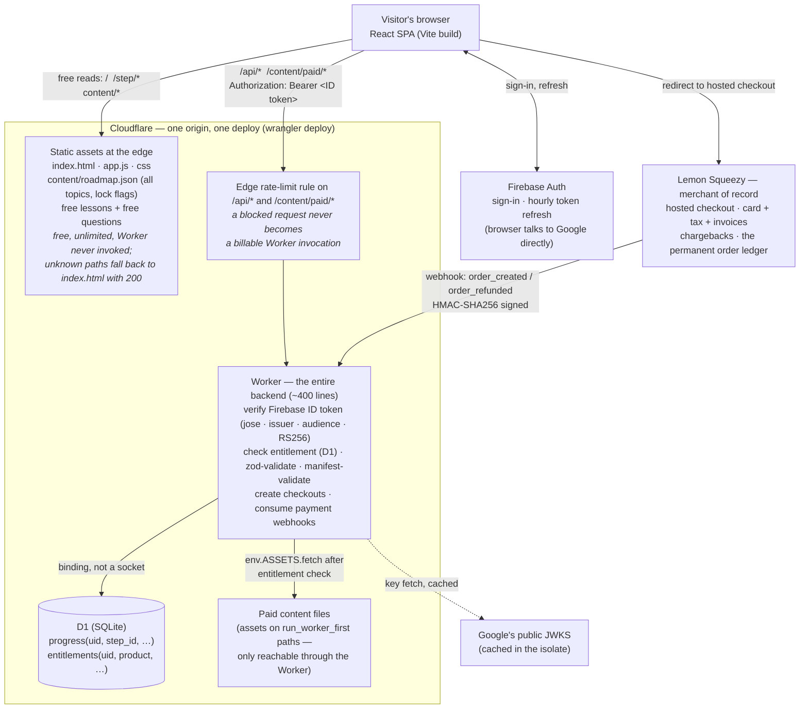

# DeepCS v2 — the simplified, deployed, paid design

**Status: accepted target state.** This document defines what this repository
becomes: a deployed CS-fundamentals roadmap with lessons, a browsable question
bank, per-user progress, and a **paid tier** (3 topics free, the rest behind a
one-time lifetime unlock). It supersedes ADR-05 ("no deployment") because
ADR-05's input changed: the workload that made deployment expensive was the
long-lived WebSocket, and live collaboration is cut — a user survey showed no
demand for pair-solving, and the product does not need it. There are **no
WebSockets anywhere in this design**, by requirement, not by accident.

Rewrite effort is explicitly not a constraint. The end state is the two-repo
structure in §16. The distributed v1 (six services, Yjs collab, matching,
Redis, local Kubernetes) is preserved at a git tag, not in the working tree.

Pricing below was checked against vendor pricing pages on 2026-08-23; the
monetization decisions were made the same day (sources in §18.5 and §7–§9).

---

## 1. Goals and non-goals

**Goals, in priority order:**

1. **Deployed and durable.** Sits at a URL, works the day a recruiter clicks
   the link, including after a month of silence.
2. **Lowest possible cost.** An idle month costs $0. A busy month costs $0.
   Every ceiling fails by refusing service, never by charging.
3. **Massively simpler.** One deployable, one deploy command, two data tables.
   The whole backend should be readable in one sitting.
4. **Sellable without liabilities.** A paid tier whose ongoing obligations are
   as close to zero as the law allows: no per-user marginal cost, no owned tax
   compliance, no subscription treadmill. The seller is an individual with no
   registered company, and every choice in §7 respects that.
5. **Deliberately tested.** A pyramid — many unit tests, fewer integration
   tests, a handful of end-to-end flows — where every test earns its place.
6. **Secure by shape.** The API should make the important attacks impossible
   to express, not merely checked-for.

**Non-goals:** live collaboration, matching, presence, WebSockets, SSE, any
long-lived connection; multi-region writes; an admin or content-editing UI;
AI features; scoring or grading; **subscription billing** (deferred, §7);
**owning tax compliance** (delegated to the merchant of record, §7);
**DRM-grade content protection** (the paywall is a commercial gate, not a
cryptographic one, §8).

---

## 2. The workload (every decision below derives from this)

State the workload first, or every platform table becomes taste.

| Property | Value | Consequence |
|---|---|---|
| Content | ~420 KB of prose: 10 topics, ~30 lessons, the question bank. Identical for every reader of a given tier. Changes only when the author writes more. | Content is **code**, not data. It ships as files, versioned in git — free content in public asset paths, paid content behind a server-side gate. |
| Free reads | Anonymous roadmap/lesson/question browsing of the free tier. The overwhelming majority of all traffic. | The free read path must cost zero compute and zero database. |
| Paid reads | Only from entitled users — the one group whose reads may cost a Worker request, because they paid. | Gated reads go through the Worker: token + one entitlement row read. Cheap, and self-limiting. |
| Writes | One upsert when a signed-in user ticks or stars a step. Bounded at ~30 rows per user, forever. | The database is tiny and write-rare. Any engine works; the meter decides. |
| Purchases | A few per month at best. One checkout redirect, one webhook each. | The payment path can be boring and synchronous. Optimize for auditability and idempotency, not throughput. |
| Traffic shape | A portfolio-scale product: long silences, then a burst when a link is shared. **The cold path is the common path.** | Anything with a cold start or a wake-up latency punishes every visit, not the worst one. |
| Integrity | Progress is self-reported: no grade, no score. The one record that matters is **who paid**, and its source of truth is the payment provider's ledger, not our database (§9). | Free-tier answers can be public. A stolen token exposes checkbox state and paid prose, never money. |

---

## 3. Architecture

One Cloudflare Worker deployment serves everything: the static SPA and free
content from the edge cache (free, unlimited, the Worker is never invoked),
paid content through the Worker after an entitlement check, and a small API
for progress and checkout. Progress and entitlements live in D1. Identity
stays with Firebase Auth; money is Lemon Squeezy's problem end to end.


```mermaid
flowchart TD
    V["Visitor's browser<br/>React SPA (Vite build)"]

    subgraph CF["Cloudflare — one origin, one deploy (wrangler deploy)"]
        EDGE["Static assets at the edge<br/>index.html · app.js · css<br/>content/roadmap.json (all topics, lock flags)<br/>free lessons + free questions<br/><i>free, unlimited, Worker never invoked;<br/>unknown paths fall back to index.html with 200</i>"]
        RL["Edge rate-limit rule on /api/* and /content/paid/*<br/><i>a blocked request never becomes<br/>a billable Worker invocation</i>"]
        W["Worker — the entire backend (~400 lines)<br/>verify Firebase ID token (jose · issuer · audience · RS256)<br/>check entitlement (D1) · zod-validate · manifest-validate<br/>create checkouts · consume payment webhooks"]
        D1[("D1 (SQLite)<br/>progress(uid, step_id, …)<br/>entitlements(uid, product, …)")]
        PAID["Paid content files<br/>(assets on run_worker_first paths —<br/>only reachable through the Worker)"]
    end

    FB["Firebase Auth<br/>sign-in · hourly token refresh<br/>(browser talks to Google directly)"]
    JWKS["Google's public JWKS<br/>(cached in the isolate)"]
    LS["Lemon Squeezy — merchant of record<br/>hosted checkout · card + tax + invoices<br/>chargebacks · the permanent order ledger"]

    V -->|"free reads: /  /step/*  content/*"| EDGE
    V -->|"/api/*  /content/paid/*<br/>Authorization: Bearer &lt;ID token&gt;"| RL
    RL --> W
    W -->|"binding, not a socket"| D1
    W -->|"env.ASSETS.fetch after<br/>entitlement check"| PAID
    V <-->|"sign-in, refresh"| FB
    W -.->|"key fetch, cached"| JWKS
    V -->|"redirect to hosted checkout"| LS
    LS -->|"webhook: order_created / order_refunded<br/>HMAC-SHA256 signed"| W
```

**Reading is a file fetch. Writing is a token plus one upsert. Buying is a
redirect plus one signed webhook.** Everything below defends those three
sentences.

The request paths, stated as the meters see them:

| Path | What runs | What it costs |
|---|---|---|
| Anonymous free read (roadmap, free lesson, free questions) | Edge cache hands back a file | $0, does not count against any quota |
| Deep link / refresh on `/step/abc` | Edge serves `index.html` with a 200; the SPA router takes over | $0 |
| Signed-in page load | `GET /api/me` (progress + entitlement) | 1 Worker request, ≤ ~31 D1 row reads |
| Tick or star a step | `PUT /api/me/progress/:stepId` | 1 Worker request, 1 D1 upsert |
| Paid lesson, entitled | Worker: verify token, 1 entitlement read, serve the file via the assets binding | 1 Worker request |
| Paid lesson, not entitled | Worker answers **402** before any file bytes move | 1 Worker request |
| Buying | `POST /api/checkout` → hosted Lemon Squeezy page → one webhook → 1 D1 insert | 2 Worker requests, total |
| Sign-in / token refresh | Browser ↔ Firebase directly | $0 to us; free to 50k MAU |

---

## 4. Decision: one deployable, not six

The v1 split existed because Collab's open sockets had a scaling profile
nothing else shared, and because operating a distributed system was itself a
goal. Both reasons are gone: there are no sockets, and the goal is now a cheap
deployed product.

| Option | Idle cost | Complexity | Failure surface | Verdict |
|---|---|---|---|---|
| **One Worker + static assets** | $0 — nothing exists between requests | ~7 routes, 2 tables, 1 deploy | One vendor's edge; one script | ✅ **Chosen** |
| Keep the six services | 6 deploy targets; each bills or idles separately | 6 images, gateway, service-to-service auth boundary, Redis | A match request chained 4 processes; that price bought nothing the product still needs | ❌ The reasons for the split (socket scaling, distributed-systems learning) are both gone |
| Modular monolith on a VM | ~$4–5/mo at full price during the 99% idle | One process, but TLS, patching, backups are yours | Unpatched box, disk full, cert expiry | ❌ Pays for absence; owns undifferentiated ops |
| Serverless function per route | $0 idle | Multiple functions to version and deploy coherently | Split-brain deploys between functions | ❌ Seven routes do not need independent deployment |

With one instance-equivalent and no replicas, everything that existed to
coordinate replicas dies with the replicas: the shared Redis rate-limit
bucket, the cross-instance pub/sub, the gateway-as-trust-boundary. That is
most of the deleted code.

---

## 5. Decision: platform — Cloudflare Workers

Judged on the two questions that matter for this workload, in order:
**what does the meter do while idle**, and **what happens at the ceiling**.
Tie-breaker: number of things to deploy.

| Option | Idle meter | Cold path | At the ceiling | Deploy targets | Verdict |
|---|---|---|---|---|---|
| **Cloudflare Workers + static assets** | $0. Static requests are free, unlimited, and never invoke the Worker | V8 isolate, no container to boot: single-digit ms cold | Past 100k req/day, `/api/*` returns 429 while **static assets keep serving** — the free tier of the site stays up, the bill does not move | 1 | ✅ **Chosen** |
| Firebase Hosting + Cloud Run (min-instances=0) | $0 compute idle, but Hosting transfer is metered (10 GB free, then **$0.15/GB billed**, not refused) | Node container start 0.5–2 s; stacked on a sleeping DB, first paint of ticks is seconds — on *every* visit, because idle-then-visited is the normal case | Over transfer limit → a bill. Wrong direction | 2 (+ dashboards) | ❌ |
| Cloud Run min-instances=1 | ~$92/mo of always-on instance time at 1 vCPU | none | n/a | 2 | ❌ Pays for absence, the exact thing this design exists to avoid |
| Small VM (Hetzner/Fly/droplet) | $4–5/mo, full price while idle | none | You are the ceiling: patching, TLS, backups | 1 | ❌ Closest call. Right answer only if a long-lived process were needed; none is |
| Vercel/Netlify + functions | $0 idle | good | Free tiers are per-project fair-use with billed overage paths; functions are a second runtime beside static hosting | 1–2 | ❌ No advantage over Workers here, weaker fail-refuse story |

**The cost this choice carries, said plainly:** the Workers free plan caps CPU
at **10 ms per request**. Verifying a JWT against a cached JWKS, one D1 read,
and an HMAC check on a webhook are each 1–3 ms of CPU (the Lemon Squeezy API
call in checkout is I/O, not CPU), so this API fits with room to spare — but
the platform choice is only correct while the API stays this small. A future
feature that needs real compute revisits this decision rather than working
around it. Risk §18.1 says how to verify before committing.

---

## 6. Decision: content ships as static files in git

The v1 stored lessons as seed SQL in Postgres, served through a service,
cached in Redis. For content that is identical for every reader of its tier
and changes only at authoring time, that is three moving parts to look up a
constant.

| Option | Read cost per view | Fixing a typo | Idle requirement | Verdict |
|---|---|---|---|---|
| **Files in git, served as static assets** | Free tier: $0 — edge cache, no compute, no DB. Paid tier: one Worker request (the gate), then the same file | `git commit` + deploy (seconds) | none | ✅ **Chosen** |
| Content in the DB behind the API | 1 compute invocation + row reads, per view, for a constant | Edit idempotent SQL, delete the `schema_migrations` row, re-run, bust the cache — four steps | DB must be awake for **anonymous** readers; on any per-hour engine that is the whole free budget | ❌ |
| Headless CMS | fetch from a third party or build-time pull | web UI | another vendor, another auth, another ceiling | ❌ Solves "non-git editors", a problem this project does not have |

Layout: `content/roadmap.json` (public — the map needs every node to draw
itself, including locked ones, because the locked map *is* the sales page),
`content/lessons/<id>.md` fetched when a step is opened (420 KB of prose does
not belong in the bundle a phone downloads to read one lesson), and the
question bank split by tier: free questions in a public JSON, paid questions
and answers served only through the gate. The existing `lesson-sections.ts`
already splits markdown on `##` headings at runtime, so the shipped format
stays markdown and that code survives unchanged.

**How the gate works mechanically:** paid files deploy as static assets like
everything else, but their paths (`/content/paid/*`) are listed in
`run_worker_first`, so the platform never serves them directly — every
request runs the Worker, which verifies the Firebase token, reads one
entitlement row, and either streams the file via the internal assets binding
(with `Cache-Control: private`, so no shared cache holds entitled bytes) or
answers **402 Payment Required** without moving a byte of content. One
deploy, no second storage product, and the free path stays exactly as fast
and free as before.

**Consequences accepted with eyes open:** content changes require a deploy
(right trade for prose the author writes in an editor anyway), and *free*
reference answers are public files (fine — progress is self-reported, so
there is no integrity property to protect on the free tier). Paid answers
never appear in any public file.

---

## 7. Decision: monetization — a lifetime unlock, sold by a merchant of record

Two separate choices, decided together on 2026-08-23: **who is legally the
seller**, and **what is being sold**.

### 7.1 Who is the seller

Whoever the merchant is owes sales tax/VAT collection and filing in every
buyer's jurisdiction (for digital goods the EU requires VAT **from the first
euro** for foreign sellers — there is no small-seller threshold), plus
chargebacks, fraud disputes, and consumer-law compliance. The seller here is
an individual with no registered company, which decides this table:

| Option | Fee per sale | Who owes global sales tax / chargebacks | Accepts individuals | Verdict |
|---|---|---|---|---|
| **Lemon Squeezy (merchant of record)** | ~5% + 50¢ | **They do** — legally the customer buys from Lemon Squeezy, which remits VAT/sales tax worldwide, eats chargebacks, and issues invoices; we receive payouts and declare them as ordinary personal income | Yes (ID verification, personal bank account) | ✅ **Chosen.** The ~2% premium over Stripe buys away the entire tax-compliance problem, which an individual cannot sensibly own. Stripe-owned, proper API + signed webhooks |
| Stripe Checkout | 2.9% + 30¢ | **You do**, personally: foreign VAT registrations and filings as a private person | Yes | ❌ Cheapest fees and the biggest name, but only sensible after a company exists and volume justifies owning compliance. Revisit then — the flow in §9 is provider-generic |
| Paddle | 5% + 50¢ | They do (also MoR) | Yes, but onboarding reviews your site before approval — slow when the product is not yet live | ❌ Same benefits as Lemon Squeezy with more friction at exactly the wrong moment |
| Gumroad | ~10% flat | They do (also MoR) | Yes | ❌ Double the fee for a weaker API and webhook story |

### 7.2 What is being sold

| Option | Entitlement machinery | The promise it makes | Verdict |
|---|---|---|---|
| **One-time lifetime unlock** | One immutable row; two webhook events matter (paid, refunded) | Access to what exists, while the product exists | ✅ **Chosen** — see the two decisive facts below |
| Annual subscription | A state machine: `expires_at`, renewals extend, failed payments open a grace window, cancellations lapse — roughly 80% of the payments code | A renewal invoice implicitly asks "what did you add this year?" — a content treadmill for a solo author | ❌ Deferred, not rejected. Additive later: a second product plus an `expires_at` column |
| Both (NeetCode's menu) | Both of the above, on day one | Both of the above | ❌ Builds the subscription machine immediately for the smaller half of the demand |

Two facts make lifetime uniquely safe *in this architecture*:

1. **Marginal cost per lifetime user is ~$0.** The reason lifetime deals
   scare businesses is recurring per-user cost against a one-time payment.
   Here a lifetime user costs static file serves plus a handful of Worker
   requests inside a free tier — there is no liability accumulating, and the
   site can be kept alive indefinitely by doing nothing (§17).
2. **Interview prep is a burst, not a habit.** People prep hard for 3–6
   months and leave; annual subscribers would churn after one cycle anyway.

What "lifetime" obligates, in writing: access while the product exists (the
ToS defines it as the product's lifetime, which is standard), and the refund
window — which, like chargebacks, is Lemon Squeezy's to process. It does not
obligate new content forever or a support SLA. The recovery story for the
entitlement records themselves is §9.

**Pricing input, with its N attached** (this repo's rule: claims travel with
the machine — or sample — that produced them): a Google Forms survey,
**N = 6, friends**, 2026-08. Both charts show lowest-option anchoring (4/6
picked the cheapest annual option, 3/6 the cheapest lifetime), so treat the
absolute numbers as ceilings-of-enthusiasm, not demand. The corridor:
$59–79/year, $149–199 lifetime, one respondent at $297. Launch price will be
picked inside **$99–149**; a price is a dashboard value in Lemon Squeezy, so
it is revisited on real sales data, not re-architected.

**Progress stays free for everyone.** It costs ~30 rows per user, it is the
habit loop that brings free users back, and returning free users are the
conversion funnel. The product sells content, not the checkbox.

---

## 8. Decision: the free/paid line, and the two-repo split

**The line: 3 topics free, 7 paid**, carried as an `access: "free" | "paid"`
field per topic in `roadmap.json` — moving the line later is editing a field,
never moving files.

### 8.1 The public-history problem, decided — and then executed

This repo is public (it is used for interviews) and the content originally
sat in seed SQL inside `packages/db/migrations/` — in public git history.
Facts that sized the risk, checked 2026-08-23: public since 2026-07-22,
**zero forks, zero stars, zero watchers**; content interleaved across the
migration files as escaped SQL strings.

| Option | Effectiveness | Cost | Verdict |
|---|---|---|---|
| **Rewrite public history (`git filter-repo` on every content-bearing file)** | Airtight going forward: content absent from the tree, from history, and (because the GitHub repo is recreated rather than force-pushed) from dangling-object access by SHA | Every SHA changes; the `v1-distributed` tag is rewritten; a checkout of the tag runs with an empty question bank | ✅ **Chosen** (2026-08-23, reversing the first call below when the paid tier became real and the seller weighed the risk). Executed the same day — see below |
| Soft gate: move content out of the public tree, leave history alone | Commercial, not cryptographic: excavatable by anyone who digs through seed SQL at an old tag | none | ❌ Initially chosen, then superseded: "invisible to customers" was true, but the zero-fork window made the airtight option nearly free, and it closes at launch |
| Only new content is paid; everything committed stays free | Airtight | Nothing to sell at launch; contradicts the surveyed product framing (3 free topics) | ❌ |

**How it was executed, for the record:** the full unfiltered history was
first pushed to a private archive (`deepcs-v1-archive`), then
`git filter-repo` stripped seven files from all 147 commits — the six
content-bearing migrations in the final tree **plus `009_lessons.sql`, a
renamed-away predecessor found only by enumerating every path that ever
existed under `migrations/`** (a filter list built from the final tree would
have missed it). Verification: zero commits reference any stripped path, and
a grep for distinctive lesson phrases across every revision returns nothing.
The GitHub repo was then deleted and recreated so no pre-rewrite object
remains fetchable by SHA. Residual exposure is Risk §18.8.

### 8.2 The two repos

Real content never touches the public repo again. That one rule, held
forever, is the whole protection — so the repo split enforces it structurally:

- **`deepcs` (public — this repo).** All the code: Worker, SPA, tests,
  DESIGN.md, plus **sample fixture content** — a mini roadmap and two or three
  clearly-labeled sample lessons, one fixture topic marked `paid`. The repo is
  fully runnable standalone: clone, `pnpm i`, `wrangler dev`, and the site
  renders completely on the fixtures — the sample lesson *text says it is
  sample content* and the README points at the live site, so a local run
  looks intentional rather than broken. The full test suite runs against the
  fixtures, including the paywall (that is why one fixture topic is paid). No
  real content, no secrets, no deploy credentials live here.
- **`deepcs-content` (private — new).** All real content, free and paid
  alike: `roadmap.json`, `lessons/*.md`, the question bank, and the deploy
  workflow. Content gets `git diff`, review, and rollback like any code.

**How a deploy works** — the deployed site is public code + private content,
joined at build time, and the workflow lives in the **private** repo (it can
check out the public repo for free; the reverse needs a token, and this way
the Cloudflare deploy credential lives where nobody can even see the repo):

```
deepcs-content CI, on push (and a manual Deploy button):
  1. checkout deepcs-content            (the content)
  2. checkout Wnayar/deepcs @ main      (the code — public, no token)
  3. content lint                       (§15.1's validators, against real content)
  4. vite build with CONTENT_DIR set    (free → public asset paths,
                                         paid → /content/paid/*)
  5. wrangler deploy                    (API token: a secret of the private repo)
  6. smoke request against the live URL
```

Day-to-day: a typo fix is a commit in `deepcs-content` and an automatic
redeploy — the public repo is untouched. A code change lands in public
`deepcs` (its own CI runs the full suite on fixtures) and ships via the
Deploy button, which always takes the latest public `main`. Local preview of
real content is `CONTENT_DIR=../deepcs-content wrangler dev`; without the
variable, dev runs on fixtures.

---

## 9. The purchase flow, end to end

Provider-generic in shape (checkout redirect → signed webhook → entitlement
row); Lemon Squeezy fills in the details.

1. **Checkout.** A *signed-in* user hits `POST /api/checkout`. The Worker
   verifies the Firebase token, calls the Lemon Squeezy API to create a
   checkout with `custom_data.uid` set to the **verified** uid, and returns
   the hosted checkout URL. (Sign-in before buying is required — it is what
   binds the purchase to an account.)
2. **Payment.** The browser lands on Lemon Squeezy's hosted page. Card
   handling, tax, receipts, and fraud screening are all theirs — nothing
   card-shaped ever touches this system.
3. **The webhook is the source of the entitlement.** Lemon Squeezy POSTs
   `order_created` to `/api/webhooks/lemonsqueezy`, HMAC-SHA256-signed. The
   Worker verifies the signature, checks the product/variant id is the one we
   sell, reads the uid from `custom_data`, and inserts the entitlement row —
   idempotently, because webhooks are delivered at least once (a `UNIQUE`
   event id and the `(uid, product)` primary key make redelivery a no-op).
   This route is the one endpoint not authenticated by Firebase: its
   credential is the signature, its trust model is §12.
4. **Return.** The success URL lands the buyer on `/upgrade/thanks`, where
   the SPA polls `GET /api/me/entitlement` a few times — bounded, like every
   poll this project has ever shipped — because the webhook usually wins the
   race against the redirect, but not always.
5. **Refunds.** `order_refunded` sets `revoked_at`. Entitled means: row
   exists and `revoked_at IS NULL`.

**The ledger, and why entitlements are recoverable from nothing.** Lemon
Squeezy's order history is permanent and queryable by API — it, not D1, is
the authoritative record of who paid. D1 is a cache of that ledger: a
`reconcile` script (fetch all orders, upsert entitlements) can rebuild the
table from scratch, which turns "the database is lost" from a broken promise
into an hour's inconvenience. Belt and braces on top: D1's built-in 30-day
point-in-time restore, and a monthly `wrangler d1 export` dump from CI.

---

## 10. Decision: database — D1 (SQLite)

The entire persistent state: which steps a uid has ticked or starred, and who
has paid. ~30 progress rows per user plus at most one entitlement row.

| Option | Idle meter | Wake-up latency | Connection model | At the ceiling | Verdict |
|---|---|---|---|---|---|
| **D1 (SQLite)** | **None — bills per row**, so a silent month is $0 without the DB needing to sleep first | none | A binding — no socket, no pool, no connection string to leak | 5M row reads/day, 100k writes/day, then refused | ✅ **Chosen** |
| Neon (Postgres) | 100 CU-hours/mo ≈ 400 awake-hours; suspends after 5 idle min | Sub-second wake, but each scattered visit burns the full 5-minute floor → ~160 scattered visits/day and then the **DB stops answering** — the site dies on exactly the day it gets shared | TCP + pooling, the classic serverless-Postgres pain | Suspension mid-month | ❌ A per-hour meter is the wrong meter for isolated single-query visits — the same lesson v1's cost analysis learned about WebSockets, applied to a different component |
| Firestore | none | none | SDK | generous | ❌ Works, but not SQL: every existing statement is discarded for nothing gained, and the data becomes vendor-shaped |
| Workers KV | none | none | binding | generous | ❌ Eventually consistent. The tell is the worst possible one: tick a box, reload, the tick is gone, then it reappears |

"There is no server to keep up" deserves one plain paragraph, because it is
the fact §7's lifetime promise leans on: D1 is not a process that is running
or stopped — the data is bytes in Cloudflare's replicated storage, queries
run on demand, and the meter counts rows touched, not hours of existence. A
month with no queries is $0 not because something went to sleep but because
nothing was ever awake. There is no patching, no disk to fill, no version to
upgrade, and nothing that can be "down" independently of Cloudflare itself.

The schema, in full — this is the entire database:

```sql
CREATE TABLE progress (
  uid        TEXT NOT NULL,             -- Firebase sub claim, never client-supplied
  step_id    TEXT NOT NULL,             -- must exist in content/roadmap.json
  done       INTEGER NOT NULL DEFAULT 0,
  starred    INTEGER NOT NULL DEFAULT 0,
  updated_at TEXT NOT NULL DEFAULT (datetime('now')),
  PRIMARY KEY (uid, step_id)
);

CREATE TABLE entitlements (
  uid               TEXT NOT NULL,      -- Firebase sub, from checkout custom_data
  product           TEXT NOT NULL DEFAULT 'lifetime',
  provider_order_id TEXT NOT NULL,      -- Lemon Squeezy order id: the ledger key
  provider_event_id TEXT NOT NULL UNIQUE, -- webhook delivery id: idempotency
  purchased_at      TEXT NOT NULL,
  revoked_at        TEXT,               -- set by order_refunded
  PRIMARY KEY (uid, product)
);
```

The upsert is the v1 statement with `?` placeholders and no schema prefix;
SQLite has supported `ON CONFLICT ... DO UPDATE ... EXCLUDED` for years. The
only Postgres-specific type in v1's schema (`depends_on text[]`) moves into
`roadmap.json`, where the graph belonged anyway.

Migrations: `wrangler d1 migrations` — numbered SQL files, applied in order,
tracked by the platform. The v1 idempotency dance (hand-deleting
`schema_migrations` rows) is gone.

---

## 11. Decision: identity — Firebase Auth, verified in-Worker

| Option | Cost | Security ownership | Status here | Verdict |
|---|---|---|---|---|
| **Firebase Auth** | Free to 50k MAU (3k DAU on the no-cost plan) | Google owns credentials, hashing, reset flows, token issuance | Already built (`auth.ts` client-side, `jose` verification exists in v1's gateway) | ✅ **Chosen** — identity is a solved, security-critical problem with no design insight left in it (v1's ADR-04, still true) |
| Clerk / Auth0 | Free tiers are tighter and price cliffs steeper | Vendor | New integration | ❌ Buys nothing Firebase doesn't already give, and it's already integrated |
| Hand-rolled sessions | $0 | **Yours: hashing, resets, breach response** | New code | ❌ Maximum risk, zero insight — the exact category v1 decided to buy, correctly. Doubly so now that an account can hold a purchase |

Verification is vendor-neutral and already written: `jose` checks the token
against Google's published JWKS. The load-bearing line is the **audience**
check — Google signs every Firebase project's tokens with the same key set, so
a token minted by a stranger's project verifies on signature, `exp`, and `iss`
shape; only `audience: projectId` rejects it:

```ts
await jwtVerify(token, jwks, {
  issuer: `https://securetoken.google.com/${projectId}`,
  audience: projectId,
  algorithms: ['RS256'],
});
```

The JWKS is held in module scope so it is fetched once per isolate, not once
per request. There is no `firebase-admin`, no service-account credential, and
therefore nothing in this system that can *mint* a token — the Worker can only
check one.

Two deploy-time notes that otherwise cost an afternoon: the Cloudflare domain
must be added to Firebase's authorized-domains list, and the issuer/audience
values come from Worker environment config so tests can substitute a local
key pair (§15).

---

## 12. Security

The model is: **make the important attacks inexpressible, then validate what
remains, then rate-limit what validation can't help.**

- **The free read path is public on purpose.** Free content, lessons,
  questions and answers are static files served to anyone; there is no grade
  and no score, so there is nothing to protect there.
- **The paid read path is gated server-side, only.** Locked lesson bytes
  never reach an unentitled client — the lock icon in the UI is presentation,
  the Worker's entitlement check is the gate, and a 402 carries no content.
  Nothing paid appears in any public file or in the JS bundle.
- **The write path cannot name another user.** The uid comes from the
  verified token's `sub`, and no route accepts a uid as a parameter — the
  surface is `/api/me/*`. There is no request a user can craft that addresses
  somebody else's data, so the entire IDOR class is removed by the shape of
  the API rather than by a check somebody could forget to write. (The one
  deliberate exception: checkout `custom_data` names the uid to entitle — set
  server-side from the verified token, and worth nothing to forge, because
  forging it means *paying for someone else's upgrade*.)
- **The webhook route has a different trust model, stated rather than
  implied.** It carries no Firebase token; its credential is the HMAC-SHA256
  signature under the Lemon Squeezy signing secret. Verification checks the
  signature over the raw body, the product/variant id, and idempotency by
  event id — so a replayed delivery is a no-op, and a forged one dies on the
  signature. It never trusts amounts or uids beyond what the signed payload
  asserts.
- **`stepId` is validated against the shipped roadmap manifest**, which the
  Worker has at hand. An unknown id is a 400 before any SQL. Without this, one
  signed-in user can write unbounded distinct rows, which is the storage meter
  and the daily write quota both.
- **Bodies are zod-validated** — two booleans; anything else is a 400.
  Parameterized statements only, as ever.
- **Exactly two secrets, and no database credential.** The Lemon Squeezy API
  key (creates checkouts, reads the order ledger) and the webhook signing
  secret, both held as Worker secrets via `wrangler secret`, in no repo. D1
  is a binding, not a connection string; the Firebase API key and project id
  are public identifiers by design. v1 had five database URLs and a Redis URL
  in a Secret; v2 has two strings whose worst-case leak is fraudulent
  checkouts on a merchant-of-record account — Lemon Squeezy's fraud problem
  more than ours, and rotation is a dashboard click plus `wrangler secret put`.
- **One origin, so CORS does not exist.** The SPA and `/api/*` are the same
  origin by construction. The whole v1 class of "method missing from the CORS
  list, browser refuses, curl passes" bugs is unrepresentable.
- **Static-asset headers** set a CSP that forbids inline script, plus
  `X-Content-Type-Options: nosniff` and `Referrer-Policy`. Paid content is
  served `Cache-Control: private`.
- **Rate limiting** is §13. Anonymous traffic cannot reach compute at all;
  checkout sits under the same edge rule, so the endpoint cannot be farmed as
  a free card-testing API (and card testing itself is the merchant of
  record's fraud surface, not ours).
- **Residual risk, accepted and named:** a stolen Firebase ID token works for
  up to an hour and nothing here detects it. What sits behind it is checkbox
  state and paid prose — never money, which lives entirely on Lemon Squeezy's
  side. The mitigation is not shipping XSS, same as v1 and no stronger. With
  money or private data behind the token, this paragraph would be a redesign
  instead of an acceptance.

---

## 13. Decision: rate limiting at the edge

The belief to drop first: "rate limiting needs Redis." It needed Redis because
several gateway replicas shared one bucket. Nothing shares anything now.

| Option | Cost of a blocked request | New components | Covers | Verdict |
|---|---|---|---|---|
| **Edge rate-limit rule on `/api/*` + `/content/paid/*` (per-IP, fixed window)** | $0 — blocked **before** the Worker is invoked, so the limiter is cheaper than what it limits | none (the free plan includes exactly one rule; one is what's needed) | volumetric abuse per IP, including hammering checkout or the gate | ✅ **Chosen**, as layer 2 of 3 |
| Per-uid counter in a Durable Object | a billable DO request per check | a new billable component with its own meter | a signed-in user across many IPs | ❌ for now — the protected resources are a boolean and prose; documented as the designated next step if it ever matters |
| In-Worker in-memory counter | a Worker invocation per check | none | almost nothing — isolates are many and short-lived, so the counter resets constantly | ❌ False comfort |
| Nothing | n/a | none | n/a | ❌ Free, but the write quota is daily and account-wide; §18.3 |

The three layers, cheapest first: (1) every write and every paid read
requires a valid Firebase token, so anonymous abuse of metered paths is
impossible and abuse costs an account; (2) the edge rule above; (3) the
free-tier ceiling itself, which fails in the right direction — past 100k
Worker requests in a day, gated routes return 429 while the free static site
keeps serving.

---

## 14. Decision: frontend — keep the React + Vite SPA

| Option | Fits "static assets + tiny API" | Rewrite value | Verdict |
|---|---|---|---|
| **React + Vite SPA (existing)** | Perfectly: `vite build` output *is* the asset directory; SPA fallback is one line of Workers config | Zero rewrite; pages, roadmap layout, lesson renderer, theme all survive | ✅ **Chosen** |
| Next.js on Workers (OpenNext) | Needs a server runtime for SSR — reintroduces compute on the read path that static assets just made free | SEO/SSR benefits this app doesn't need: it's an app, not a blog | ❌ |
| Astro SSG + islands | Good fit for the lessons | Full rewrite of every interactive screen to save markdown-to-HTML work the client already does fine | ❌ Effort is free by mandate, but the *end state* is not better: two rendering models instead of one |

What changes in the frontend: the match, session, and summary screens are
deleted; content fetches point at `content/*` static files; the `queued`
localStorage flag and the 3-second match poll die with matching. New surface:
locked topics render from `roadmap.json`'s access flags (the public manifest
is the sales page), a `/upgrade` route hosts the pitch and the checkout
button, and a 402 from any gated fetch routes to it. When built on fixtures
(§8.2), a small banner names the content as sample. One v1 rule gets
*stronger*: "every screen is a URL" now has no exception, because `/summary`
(the one screen that travelled in history state) no longer exists. Nothing
anywhere asks the server anything on a timer — the only poll left is the
bounded post-purchase entitlement check (§9.4).

---

## 15. Testing — a pyramid built on purpose

```
        ▲  E2E (4 flows)          Playwright · real browser · wrangler dev + Firebase emulator
       ▲▲▲  Integration (~20)     the real Worker in workerd · real local D1 · minted JWTs · signed webhooks
     ▲▲▲▲▲▲  Unit (~60+)          Vitest · pure functions · no I/O · milliseconds
```

**Why a pyramid holds here, structurally:** the system was shaped so each
layer has something only it can test. Pure logic is extracted into plain
functions (unit-testable in microseconds); the entire backend is one Worker
that can run *for real* in-process with a real local database (integration
tests with no docker, no network, no shared state); the only thing left above
that is browser wiring (four e2e flows). No layer re-tests the layer below.

**Why these counts and not a coverage target:** a percentage pushes effort
toward whatever is easiest to cover, which is rarely where a system breaks.
Every test below is pinned to a specific way this system can actually fail.
That philosophy is inherited from v1 unchanged; only the failure modes moved
— and payments added the most consequential ones.

### 15.1 Unit — the base (most tests, milliseconds, no I/O)

| What | The failure it pins |
|---|---|
| Roadmap layout arithmetic | A malformed graph renders overlapping or orphaned nodes (exists today; survives) |
| Lesson-section splitting on `##` | A heading edge case silently swallows a section (exists; survives) |
| Markdown rendering rules | Code fences / Prism grammars regress (exists; survives) |
| zod body schemas, accept and reject tables | A malformed body reaching SQL |
| `stepId`-against-manifest validation | Unbounded row writes per user (§12) |
| **Access-policy matrix**: (step's tier × caller's entitlement state, revoked included) → 200 / 401 / 402 | The paywall's core truth table — the single highest-value test in the suite |
| **Webhook signature verification** against locally-signed payloads: valid, tampered body, wrong secret, wrong product id, replayed event id | A forged or replayed webhook minting a free entitlement |
| Token *claims policy* via `jose` against a locally generated key pair: wrong audience, wrong issuer, expired, `alg: none`, future `iat` | The cross-project-token acceptance bug (§11) — testable as a unit because the keys are local |
| Progress display logic (ticks → bar fill, ring) | Off-by-one on the one visible number users care about |
| **Content validators, run as tests** (and in the private repo's deploy, §8.2): every roadmap node has a lesson file; every question id exists; every node carries an `access` field and the free set is exactly the intended 3 topics; no paid file sits outside `/content/paid/`; no em dashes in reader-visible content; fixtures exercise both tiers | A broken deploy of *content* — which changes more often than code — including the worst kind: a paid file accidentally placed on a public path |

### 15.2 Integration — the middle (fewer, seconds, real engine)

**Tooling decision:**

| Option | Fidelity | Speed / hermeticity | Verdict |
|---|---|---|---|
| **`@cloudflare/vitest-pool-workers`** — tests execute inside workerd, the production runtime, with a real local D1 | The actual Worker, the actual SQLite engine, the actual asset config | In-process; no docker, no services, runs anywhere including CI unmodified | ✅ **Chosen** |
| Mock the D1 binding | A mock proves it agrees with itself — v1's "the racy rate limiter passes against a mock" lesson, kept | fast but worthless | ❌ |
| Test against a deployed preview | production-true | network, credentials, flaky, unusable offline | ❌ as the suite; a smoke ping post-deploy is fine |

Auth in this layer: the Worker reads issuer/audience/JWKS location from
config, so tests mint tokens with a local key pair and serve the matching
JWKS — signature and claims checks run **for real**. Webhooks likewise: tests
sign payloads with the configured test secret, so signature verification is
never stubbed.

| Test | The failure it pins |
|---|---|
| PUT then GET round-trips | The API's one job |
| PUT twice → exactly one row, latest values | Upsert idempotency — the retry story depends on it |
| Unknown `stepId` → 400 and no row written | Quota-burning writes |
| No token / expired / wrong-audience token → 401 | The trust boundary, end to end through the real handler |
| Two users' tokens → each sees only their rows | The `/me`-shaped isolation actually isolating |
| **`order_created` webhook delivered twice → one entitlement row** | At-least-once delivery vs. the ledger — v1's idempotency discipline, applied where it now matters most |
| **Paid asset: anonymous → 401, signed-in unentitled → 402 with zero content bytes, entitled → 200 with the file** | The gate itself, through the real `run_worker_first` routing |
| **`order_refunded` → gated fetch returns 402 again** | Revocation actually revoking |
| **Checkout route without a token → 401** | The purchase-binds-to-an-account invariant (§9.1) |
| Unknown path returns `index.html` with **200** | The SPA deep-link promise — v1 documented this exact failure; now it's a test |
| Migrations apply twice cleanly on a fresh D1 | Deploy repeatability |

### 15.3 End-to-end — the tip (4 flows, real browser)

Playwright (chosen over Cypress: first-class multi-browser, no proprietary
runner, trivially CI-parallel) against `wrangler dev` on the fixtures plus
the Firebase Auth emulator — the whole stack, offline, no cloud credentials
in CI. The purchase flow's webhook is posted by the test itself, signed with
the test secret, because Lemon Squeezy cannot call localhost — signature
verification still runs for real.

| Flow | What only a browser can prove |
|---|---|
| **Anonymous reader:** open `/` → free topic → lesson → questions → reveal an answer → hard-refresh on `/step/:id` | The static content pipeline, client routing, and the deep-link rewrite as a user experiences them |
| **Progress:** sign in → tick two steps → reload → ticks persist → sign out → ticks gone from UI → sign back in → ticks return | The full auth handshake (SDK ↔ emulator ↔ Worker) and the read-your-writes loop across a session boundary |
| **Purchase:** sign in → open a locked lesson → 402 screen with the upgrade pitch → checkout initiated → (test-signed webhook lands) → the lesson unlocks without re-login | The paywall as a buyer experiences it, including the §9.4 entitlement poll winning its race |
| **Degraded write path:** API forced to 401/429 → the free site still browses fully, ticks show a visible failure state | The design's core failure promise: the read-only site survives every backend failure (§13 layer 3) |

Four flows, not ten: every additional e2e flow re-walks the same wiring at
the highest cost-per-test and the highest flake rate in the suite. Anything
below the wiring is already pinned by a cheaper layer.

**CI, whole story:** the public repo runs lint, typecheck, unit + integration
(hermetic, no services to orchestrate), and e2e on the fixtures — fully
green with zero secrets. The private repo's deploy workflow (§8.2) re-runs
the content validators against the real content, builds, deploys, and smokes
the live URL. v1's per-service path filtering, service containers, and
skip-in-CI contract tests all dissolve because the reasons for them dissolved.

---

## 16. Repository end state — two repos

**`deepcs` (public — this repo):**

```
deepcs/
├── DESIGN.md               ← this document
├── wrangler.toml           ← the entire deployment: assets dir, SPA fallback,
│                             run_worker_first globs, D1 binding, vars
├── package.json            ← ONE package. No workspace, no catalog.
├── content/                ← SAMPLE FIXTURES ONLY, clearly labeled as such;
│   ├── roadmap.json          includes one paid fixture topic so the gate
│   ├── questions.json        is runnable and testable from the public repo
│   └── lessons/sample-*.md
├── migrations/
│   ├── 0001_progress.sql
│   └── 0002_entitlements.sql
├── src/
│   ├── worker/             ← index.ts, auth.ts, progress.ts, entitlement.ts,
│   │                         checkout.ts, webhook.ts (~400 lines total)
│   └── app/                ← the React SPA: pages/, roadmap-layout.ts,
│                             lesson-sections.ts, markdown.ts, theme.ts …
├── scripts/
│   └── reconcile.ts        ← rebuild entitlements from the Lemon Squeezy ledger (§9)
├── test/
│   ├── unit/
│   ├── integration/        ← vitest-pool-workers
│   └── e2e/                ← Playwright
├── docs/
│   ├── overview.md         ← rewritten for this system
│   └── adr/                ← surviving ADRs + ADR-12 (this pivot)
└── .github/workflows/ci.yml   ← tests on fixtures; no secrets, no deploy
```

**`deepcs-content` (private — new):**

```
deepcs-content/
├── roadmap.json            ← all 10 topics, access: "free" (3) | "paid" (7)
├── questions.json
├── lessons/<id>.md         ← all real lessons, free and paid
└── .github/workflows/deploy.yml  ← §8.2: checkout both repos, lint content,
                                    build, wrangler deploy, smoke
```

Deleted from the public working tree: `services/` (all six), `packages/` (db,
shared), `k8s/`, `load/`, `docker-compose.yml`, the Makefile targets that
drove them, and every doc page describing deleted machinery. **Preserved:**
the commit before the rip-out is tagged `v1-distributed`, the README links
it, and the story stays tellable as "built it, measured demand, removed it" —
which is only honest while the code stays reachable. The one-time content
export (seed SQL → files, diffed clean against the database seed) happens
before the rip-out and becomes `deepcs-content`'s first commit.

Local development: `wrangler dev` (Worker + assets + local D1) on fixtures,
`CONTENT_DIR=../deepcs-content wrangler dev` for real content, plus the
Firebase emulator. `make up`'s ten containers become one command and zero
containers, and local runs the same engine production runs.

---

## 17. Cost, stated as a table because it is a goal, not a hope

| Meter | Idle month | Realistic month* | Free ceiling | Past the ceiling |
|---|---|---|---|---|
| Static assets (site + free content) | $0 | $0 | none — free and unlimited | n/a |
| Worker (`/api/*` + gated reads) | $0 | ~6k requests | 100k requests/**day** | 429 on gated routes; free site stays up |
| D1 | $0 | ~4k rows written | 5M reads/day · 100k writes/day · 5 GB | refused, not billed |
| Firebase Auth | $0 | $0 | 3k DAU / 50k MAU | sign-in refused |
| Lemon Squeezy | $0 — no monthly fee; the meter only moves when money does | ~5% + 50¢ **per sale**, deducted from the payout (≈ $5.45 on $99, ≈ $7.95 on $149) | n/a | n/a |
| **Total** | **$0** | **$0 fixed; fees only as a % of revenue** | | **no path to a surprise bill** |

*Realistic = 5,000 page views, 200 signed-in sessions, 4,000 ticks, a few
sales — more than this will get. That is under 0.3% of one day's Worker
allowance.

"Idle month: $0" is literal, not rounding: no meter anywhere in the system
runs on wall-clock — not compute (per-request), not the database (per-row),
not payments (per-sale). That is the property the whole design was selected
for, it is why every per-hour option (VM, min-instances=1, Neon compute) lost
its table, and it is what makes §7's lifetime promise costless to honor: a
lifetime user's continued access requires no recurring spend and no recurring
attention.

The only guaranteed spend is a custom domain (~$10/year), and only if
`*.workers.dev` won't do. If the free ceiling is ever genuinely hit, the
single upgrade step is Workers Paid at **$5/month** (10M requests, 30M
CPU-ms, D1 raised to 25B reads / 50M writes) — roughly 100× headroom for the
price of a coffee, with no architecture change.

---

## 18. Risks, in the order they will bite

1. **The 10 ms CPU wall (§5).** "JWT verify ≈ 1–3 ms" is an estimate, not a
   measurement. Before deleting anything: deploy a Worker that does only the
   verification and read CPU time off the dashboard. Tell: error 1102.
2. **JWKS cold fetch.** A fresh isolate pays one HTTPS subrequest for Google's
   keys. Held in module scope it amortizes across the isolate's life; confirm
   the added first-request latency is acceptable.
3. **D1 quotas are daily and account-wide.** A second project on the same
   Cloudflare account shares them. The manifest check (§12) keeps a hostile
   user from spending them; entitlement traffic is too small to matter.
4. **Single-vendor exposure.** Cloudflare's outage is the site's outage.
   Accepted: content and code are in git, state is two small tables (one
   rebuildable from the Lemon Squeezy ledger), so redeploying elsewhere is an
   afternoon by design.
5. **Free tiers move.** Every infrastructure figure here was checked
   2026-08-23; re-verify before build-out. Sources: Cloudflare Workers
   pricing & static-asset billing, D1 pricing & limits, WAF rate-limiting
   rules (free plan), Firebase Auth pricing, Lemon Squeezy fees, Neon plans
   (for the rejected row) — full URL list in `docs/future/deployment.md`,
   which this design supersedes and absorbs.
6. **A missed webhook.** Lemon Squeezy retries failed deliveries, but the
   backstop is structural: the reconcile script (§9) rebuilds entitlements
   from the order ledger, so a buyer reporting missing access is a
   one-command fix, never data archaeology.
7. **Merchant-of-record dependency.** Lemon Squeezy changing fees or terms,
   or an account dispute, interrupts *sales* — never existing access, which
   is already granted in D1 and recoverable from exported ledgers. The flow
   is provider-generic (§9): swapping providers touches `checkout.ts` and
   `webhook.ts` only. Revisit Stripe if a company is ever registered and
   volume justifies owning tax compliance (§7.1).
8. **Pre-rewrite copies (§8.1).** The content spent about a month
   (2026-07-22 to 2026-08-23) in public git history before the rewrite, with
   zero forks, stars, or watchers the day it was scrubbed. Nothing is
   findable through GitHub now — not in the tree, the history, or by SHA —
   but a clone or scrape made during that month keeps what it took. Accepted
   as a residual: the probability is low, and the response if leaked content
   ever surfaces is a takedown request, not an architecture change. All
   content, past and future, now exists only in the private repo.
