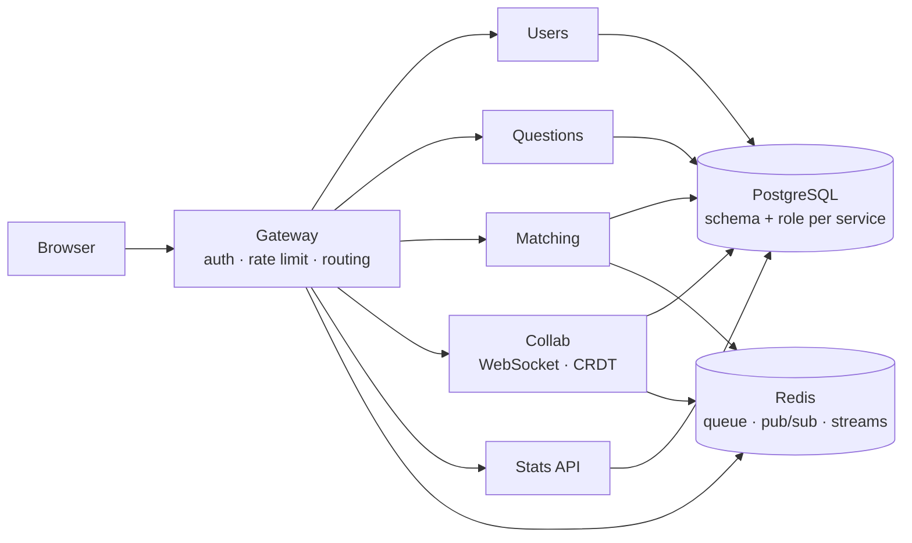

# deepcs

**Learn CS fundamentals from a roadmap, then solve the questions live with a
matched partner in a shared editor.**

Nine topics laid out by what makes what easier to read. Each opens into three
steps, and a step is a lesson plus the questions it prepares you for. Answer
them alone, or get matched with someone and work through them together.

**Stack:** TypeScript · Fastify · PostgreSQL · Redis · Yjs (CRDT) · WebSockets ·
Docker · Kubernetes · k6

---

## Architecture

Six independently deployable services. One PostgreSQL instance with a schema and
a role per service, so a query that crosses a service boundary is refused by the
database rather than by convention.



Only the Gateway is reachable from outside. It verifies a Firebase ID token
against Google's JWKS, strips any inbound `X-User-Id`, and sets its own. Because
nothing else is exposed, that header cannot be forged. Both halves are required.

The full reasoning is in [the overview](docs/system/00-overview.md), and the
decisions behind the shape are in [docs/adr/](docs/adr/), one file each.

---

## What it demonstrates

Every claim below was measured, and each one names the conditions it holds
under. Full results, including the two that needed narrowing, are in
[docs/system/09-running-it.md](docs/system/09-running-it.md).

| Claim                                             | Evidence                                                                                        |
| ------------------------------------------------- | ----------------------------------------------------------------------------------------------- |
| **A rolling update drops no requests**            | 0 non-200 out of 1,230, while every Gateway and Questions pod was replaced under load           |
| **A killed pod costs a reconnect, not any edits** | An edit written seconds before its pod was deleted was still in the document after reconnecting |
| **A service cannot read another's schema**        | An integration test asserting PostgreSQL refuses the query, not a code review convention        |
| **250 concurrent collaboration sockets**          | p50 4 ms edit propagation, 0 leaked sockets, memory returning to baseline                       |

Two of those numbers are hardware independent and two are not, and the
difference is stated rather than glossed. The rolling-update result is a
property of readiness probes and holds anywhere. The 250 sockets and 4 ms are
facts about an AMD Ryzen AI 7 350 running WSL2. **No run here makes a capacity
claim**, because every run measures one laptop.

The zero-drop figure also carries its own controls: the prober was separately
shown able to detect an outage, and the ingress was shown not to be quietly
retrying failures out of sight. A measurement that reports zero is worthless
until you know it could have reported something else.

---

## Running it

```bash
make up      # backend: Postgres, Redis, the Auth emulator, six services
make web     # frontend on http://localhost:5173
make test    # the suites, against real Postgres and Redis rather than mocks
make load    # the k6 load run against the running stack
```

The same system also runs on a local Kubernetes cluster:

```bash
make k8s-up     # the whole stack on a kind cluster, gateway on :8090
make k8s-check  # the rolling-update and pod-kill measurements
make k8s-down   # delete the cluster
```

Compose is the one to develop against, since it bind-mounts `src/` and reloads.
The cluster runs the production images and is where rolling updates and pod
failure are demonstrated. Both can be up at once, on 8080 and 8090.

---

## The docs

|                                  |                                                 |
| -------------------------------- | ----------------------------------------------- |
| [docs/system/](docs/system/)     | How it works now. Start at `00-overview.md`     |
| [docs/adr/](docs/adr/)           | The decisions worth knowing, one file each      |
| [docs/learning/](docs/learning/) | How the tooling works: Docker, Kubernetes, CI   |
| [docs/future/](docs/future/)     | Things not built, and what deploying would cost |

---

## There is no deployed version, and that is a decision

This runs on your machine and nowhere else. The deployment was designed and
priced line by line ([docs/future/cost.md](docs/future/cost.md)) before being
declined: keeping a demo online past a free trial means attaching a payment card
to it, and the behaviours worth showing need an orchestrator rather than a
hosted one. Knowing what it would cost, and why, is the deliverable.
