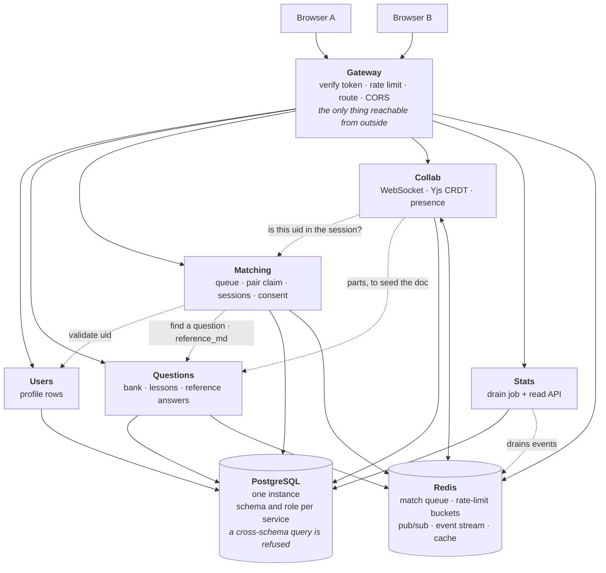
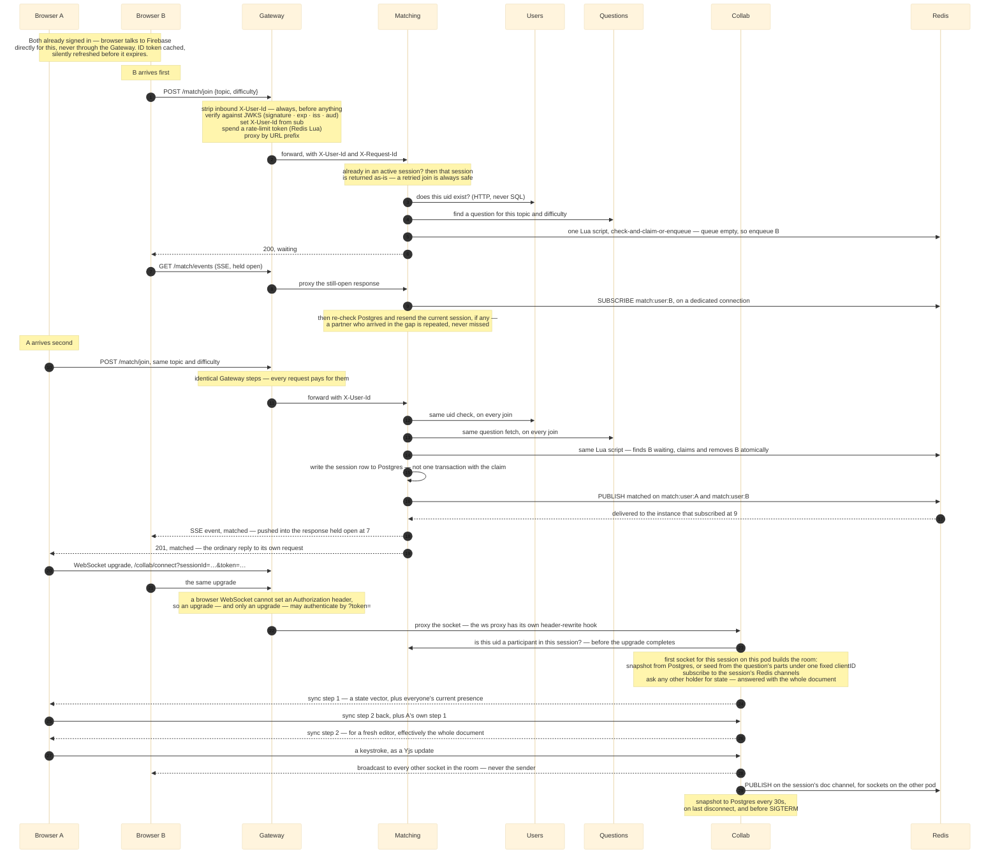

# How to get interview-solid on deepcs

## The situation you're actually in

You have ~4,500 lines of backend source and ~2,400 lines of docs that already
explain it well. That ratio matters: **you cannot fail this by not knowing
enough — you fail it by not being able to retrieve it in the shape a question
arrives in.**

Docs are organised by *component*. Interviews ask by *scenario* ("what happens
when two people join at the same millisecond?") and by *decision* ("why not a
monolith?") and, the one that separates people, by *failure* ("what broke?").
Same facts, three different indexes. Preparing means building the two indexes
the docs don't already give you.

Rough size of the job: **8–10 hours of active work**, split across 4 sessions.
Not more. Past that you're re-reading, which feels productive and isn't.

---

## Calibrate first: which interview is this?

Three formats. **Prepare for the deep dive by default** — it is the most common
and it strictly contains the other two.

**1. Resume deep dive (assume this).** 30–45 minutes where the interviewer
picks this project off your resume and drills until they find the edge of what
you know. Extremely common: Meta, Amazon, most startups, many Google
team-matching and host-matching conversations. It escalates — *what is it* →
*how does that part work* → *why that way* → *walk me through the code* → *how
would you change it*. This needs everything in this guide, **including the code
session**. You will be asked to explain an implementation, not just a decision.

**2. Behavioural story.** 3–5 minutes with 2–4 follow-ups, in a round that is
mostly about you rather than the system. A strict subset of the deep dive:
spine (§2), numbers (§6), and the three failure stories. If you're ready for
the deep dive you are already ready for this.

**3. System design whiteboard.** The project becomes the starting point for
"now scale it". Adds §7 on top of everything else.

**What this means for code.** You are not memorising line by line. You are
making sure that for the four load-bearing files (§3, session 2) you can say
what the file does, why it's shaped that way, and what would break if it were
shaped the obvious way instead — and that when asked "how would you add X" you
can name the files you'd touch. That's §5's *Change it* group, and it is the
single highest-signal thing in a deep dive, because it can't be faked by
someone who read a design doc.

**On Google specifically:** the DS&A rounds are a separate, larger fight and
this repo does not help you there. Don't let project prep eat that budget.

---

## 1. What "solid" means, concretely

Four levels. You want to hit level 4 on three or four topics, and level 3 on
everything else. Level 4 everywhere is not achievable in your timeframe and
isn't what's being tested.

1. **Names it.** "It's six services with a gateway, Postgres and Redis."
2. **Explains the mechanism.** "The gateway verifies the Firebase token against
   Google's JWKS, strips any inbound `X-User-Id` header, and sets its own."
3. **Explains why, including the alternative.** "...and authorization *can't*
   live there, because the gateway holds no domain data — it can't answer 'is
   this user in that session'. That's Collab asking Matching."
4. **Names what it cost, or where it's still wrong.** "The tradeoff is that a
   revoked user's token stays valid up to an hour, because server-side
   revocation needs the Admin SDK and a round trip per request. For a shared
   answer doc that's acceptable; with money involved it wouldn't be."

Level 4 is the whole game. It's also the level your docs are already written at
— `00-overview.md` §5 literally contains that revocation paragraph. Your job is
retrieval, not authoring.

---

## 2. The spine: one trace, drawn from memory

Everything hangs off one story. Learn this first and learn it cold, because
90% of follow-ups are branches off it, and because narrating a path is far
easier under pressure than reciting a component list.

**Draw this from a blank page before every study session.** Not read — draw, by
hand or on a whiteboard. Two boxes for browsers, one for the gateway, five
behind it, two cylinders. Solid arrows are the request path; **dotted arrows
are service-to-service calls**, which exist because no service may read
another's tables.

Then narrate the path out loud, ~90 seconds. This is the version to rehearse:

1. Signed-in browser holds a Firebase ID token. It sends
   `POST /match/join {topic, difficulty}`.
2. **Gateway** strips any inbound `X-User-Id` before anything else, then
   verifies the token against Google's JWKS — signature, `exp`, `iss`, and
   `aud` (an unchecked `aud` would accept a validly-signed token minted for a
   *different* Firebase project) — and sets its own header from `sub`. Spends a
   rate-limit token in a Redis Lua script (120 tokens refilling at 2/s for an
   authenticated caller). Proxies to Matching.
3. **Matching** zod-validates, then calls **Users** over HTTP to check the uid
   exists — by API call, never by SQL, because the database refuses the
   cross-schema join — and **Questions** to find a question for that topic and
   difficulty. Both checks run on *every* join, before anything in Redis or
   Postgres changes, so a sibling outage fails the request cleanly.
4. Only then the queue: one Lua script **claims a partner atomically**, or
   enqueues you. If it claimed one: write the session row to Postgres, publish
   to Redis so *both* people hear — the waiter through their event stream, the
   joiner as insurance against a lost response.
5. The waiting person hears via **server-sent events** — `GET /match/events`,
   one ordinary HTTP response held open. Not polling. (§5 has the story of why.)
6. Both browsers open a WebSocket through the Gateway to **Collab**. Collab
   asks Matching *"is this uid a participant in this session?"* — authorization
   lives with whoever owns the record, not at the gateway.
7. Collab holds one **Yjs document** (CRDT — a data structure where concurrent
   edits merge deterministically without a server ordering them) per session in
   memory. Edits fan out to other sockets on that pod directly, and to sockets
   on the *other* pod over a Redis channel per session. Snapshot to Postgres
   every 30 seconds, on last disconnect, and before SIGTERM.
8. Reveal needs **both** consents; only then does Matching fetch `reference_md`
   from Questions over the internal network. The answer never enters the shared
   document (ADR-06).
9. Session end appends to a Redis stream; the **Stats** job drains it into
   summaries. At-least-once delivery, so every write is idempotent and there is
   no counter column anywhere.

The same nine steps as a sequence, which is the shape a deep-dive interviewer
will keep interrupting. Every arrow here is a question they can stop you on:

**Verify you have the spine:** narrate all nine steps to a wall, no notes, in
under two minutes, twice in a row. If you stall at a step, that step is your
next reading target.

Every numbered arrow above, explained — read through this alongside the
diagram, in order, so each step lands where it happens:

**B joins first (1–9)**
- **1** — the ID token came from Firebase directly; the Gateway never issues
  one, only verifies. It holds Google's public keys and no service-account
  credential, so a compromised Gateway can read traffic but cannot mint or
  revoke an identity.
- **2** — the Gateway's steps, in their real order: delete any inbound
  `X-User-Id` first, unconditionally — the only way the header exists
  downstream is that the Gateway set it. Then verify against Google's JWKS —
  signature, `exp`, `iss`, `aud` (skip `aud` and a validly-signed token for
  someone *else's* Firebase project walks in) — and set the header from `sub`.
  Then spend a rate-limit token in a Redis Lua script: 120 refilling at 2/s
  per user, 60 at 1/s per IP for anonymous callers, failing *open* if Redis is
  down. Then proxy by prefix, forwarding `X-Request-Id` — the trace id that
  makes a six-service path debuggable. The note before 3: a retried join
  returns the existing session instead of touching the queue, which is what
  makes "call join again" a safe recovery move.
- **3** — is this uid real? Asked of Users over HTTP (`GET /users/:uid/exists`),
  never SQL — Matching's database role is refused Users' schema.
- **4** — find one question for this topic and difficulty (the topic is a
  Questions tag; it is a `limit=1` list query). Both 3 and 4 run before
  anything in Redis or Postgres changes, so a sibling outage fails the join
  cleanly — nothing half-created, nothing to roll back.
- **5** — one Lua script does check, claim, *or* enqueue as a single atomic
  operation. Nobody is waiting, so B is enqueued — scored by Redis' own clock,
  not the caller's, so queue order survives Matching replicas whose clocks
  disagree. A retried join while already queued is a no-op.
- **6** — B's request is answered `"waiting"` and closed. (A `queue.joined`
  event is appended to the Redis event stream on the way — fire-and-forget,
  for Stats.)
- **7** — a second, separate request: SSE [server-sent events — an ordinary
  HTTP response the server declines to finish]. No upgrade, no second
  protocol, so the Gateway proxies it like anything else and `X-User-Id`
  arrives as usual. A `: ping` comment line every 20s stops proxies reaping
  it as idle.
- **8** — the Gateway holds no state for the stream; Matching owns the open
  response and writes into it directly.
- **9** — Matching subscribes to `match:user:<B>` on a dedicated Redis
  connection [a subscribed ioredis connection can run no other commands].
  Then the note: it re-reads Postgres and resends the current session if one
  exists, closing the race where a partner arrived between the join response
  and this stream opening — an announcement can be repeated, never missed.

**A joins second — same checks, different outcome (10–19)**
- **10** — A's own join request, independent of B's — A doesn't know B exists.
- **11** — identical Gateway treatment as 2. No "light" path exists.
- **12–13** — the uid check and the question fetch run on *every* join, before
  the queue is touched — not only for whoever ends up waiting.
- **14** — the same Lua script now finds B: removes B from the queue and
  returns B's uid plus how long B waited, measured inside the script — the
  claim deletes the queue entry, so this is the last moment the wait exists
  to be read.
- **15** — the session row is written to Postgres. The Redis claim and this
  row are *not* one transaction: a crash between them leaves a claimed
  partner with no session, which is exactly the state `GET /match/status`
  answering `none` ("call join again") recovers from.
- **16** — the `matched` announcement is published on *both* users' channels,
  not just B's — the joiner's own HTTP response can be lost too. The payload
  names the session and never the partner: sessions are anonymous, and no
  response anywhere in the flow carries the other person's uid. (A
  `match.created` also goes to the event stream for Stats.)
- **17** — Redis delivers it to whichever Matching instance subscribed at 9 —
  publisher and subscriber can be different processes, which is what lets
  this work with more than one replica.
- **18** — written straight into B's still-open response from 7. No new
  request from B, ever.
- **19** — A learns the same thing as the ordinary `201` reply to its own
  request from 10.

**Both connect to Collab (20–29)**
- **20–21** — both browsers upgrade to a WebSocket at
  `/collab/connect?sessionId=…&token=<ID token>`. The token rides the query
  string because a browser's WebSocket constructor cannot set an
  `Authorization` header — and the Gateway reads `?token=` only on an actual
  upgrade, so ordinary routes cannot authenticate that way.
- **22** — the upgrade opens a second proxied connection whose default
  forwards almost no headers, so the Gateway's ws proxy has its own
  header-rewrite hook — without it Collab would 401 every socket, authorized
  or not.
- **23** — Collab holds no session data, so before the upgrade completes it
  asks Matching: is this uid a participant? Authorization lives with whoever
  owns the record. A "no" is a plain HTTP 403 and the socket never comes into
  being — and an ended session answers "no", which is what stops finished
  sessions being rejoined. Then the note: the first socket for a session on a
  pod builds the room — load the Postgres snapshot, or seed the scaffold from
  the question's `parts` (fetched from Questions) under one fixed `clientID`
  so every pod's seed is byte-identical; subscribe to the session's Redis
  channels; publish a state request that any pod already holding the room
  answers with the *whole* document — self-contained, merges onto any base.
- **24** — the server opens sync with step 1: a **state vector** [a compact
  summary of how much of each client's edits it holds] — not the document —
  plus everyone's current presence.
- **25** — A answers with step 2, whatever the server was missing, and sends
  its own step 1 back.
- **26** — the server's step 2 in return: everything A is missing — for a
  fresh editor, effectively the entire document.
- **27** — a keystroke lands as a Yjs update: a delta naming exactly which
  (clientID, clock) positions changed.
- **28** — broadcast to every other open socket in the room — never echoed to
  the sender, which is why the load script needed `edits_received: count>0`
  to prove it was measuring anything at all.
- **29** — and published on the session's doc channel for sockets on other
  pods — skipped when the update itself arrived *from* Redis, the one check
  that prevents an infinite republish loop. The final note: snapshots to
  Postgres every 30 seconds, on last disconnect, and before SIGTERM.

---

## 3. The reading plan — 4 sessions

Each session has a verify step. Don't move on until it passes.

### Session 1 — the shape (2h)
Read `docs/system/00-overview.md` end to end, slowly. It is the whole system.
Then skim all ten ADR filenames and read only **ADR-01** (why six services)
and **ADR-09** (one DB, schema per service).

→ **Verify:** draw the diagram from blank, then narrate the spine. Both from
memory. Expect to fail the first attempt; do it again the same evening.

### Session 2 — the two hard bits (2h) — *this is the deep-dive session*
The concurrency is concentrated in two Lua scripts and one CRDT. Read the code,
not just the docs. These are the places a deep dive goes, they are where the
project's actual difficulty lives, and they are small:

- `services/gateway/src/rate-limit.ts` (147 lines) — token bucket in Lua. Why
  Lua: read-modify-write across multiple Redis commands isn't atomic, so two
  requests can each read 1 token remaining and both spend it. Lua runs as one
  operation on the server.
- `services/matching/src/queue.ts` — the atomic pair claim. Same class of
  problem: two users joining at the same instant race for the same partner.
- `services/collab/src/rooms.ts` (608 lines, the biggest file) — rooms, the
  Redis fan-out between pods, the state reply, snapshots.
- `packages/shared/src/service.ts` (168 lines) — the four shared HTTP concerns
  in one place so no service can skip one.

→ **Verify:** two things. (a) Explain why each Lua script exists, naming the
exact race it prevents and the symptom you'd see without it. (b) Open each of
the four files and talk through it for 60 seconds with the file *closed*
afterwards — what it does, why it's shaped that way, what breaks if it's shaped
the obvious way instead. If you can't do (b), you are not ready for a deep
dive, however well §5 is going.

### Session 3 — the numbers and their conditions (2h)
Read `docs/system/09-running-it.md` end to end. This is your differentiator and
also your biggest risk — every number here has a condition attached and
quoting one without its condition is the one way to look worse than someone who
measured nothing.

Memorise exactly four figures and their conditions (§6 below). Not the table.

→ **Verify:** for each of the four, state the number *and* whether it travels
off your laptop, *and* why.

### Session 4 — drills (2–4h, spread over days)
Work §5's question bank out loud. Not reading the answers — answering first,
then checking. Anything you get wrong, note the page it lives in and re-drill
it two days later. This is the session that actually creates recall; the first
three only create familiarity.

---

## 4. The method (this is the part people skip)

- **Answer before you look.** Reading an answer you'd have got right is wasted
  time; the retrieval attempt is what builds the memory, not the reading.
- **Out loud, standing up.** Interview answers are spoken. An answer that is
  clear in your head and mush in your mouth is not prepared. You will discover
  three sentences you can't actually say.
- **Spaced, not massed.** Four 2-hour sessions across four days beats one
  8-hour day by a wide margin. You have the deadline pressure; this is where
  the pressure gets paid back.
- **Two days before, do a cold run.** Diagram from blank, spine narrated, ten
  random drill questions. Whatever fails is your last-day list.

---

## 5. The drill bank

Answer out loud. The pointer is where to check, not where to read first.

### Opening / scope
1. What is deepcs, in 30 seconds? *(Roadmap of nine CS topics; read a lesson
   alone or get matched and solve its questions live in a shared editor.)*
2. Why is the roadmap the front door rather than the question bank?
   → overview §1
3. What's deliberately *not* in it, and why? → overview §1 ("Not in scope")
4. How long did it take and how big is it? *(Three weeks, 117 commits, ~4.5k
   lines of backend source.)*

### Architecture
5. Why six services and not one? What's the actual forcing function?
   *(Collab: one WebSocket holds a slot for a whole session; bundling it with
   the question bank means idle sockets starve browse requests, and the two
   scale on incompatible signals.)* → overview §2
6. Two of the six aren't really "splits". Which, and why? *(Gateway is a
   position; Stats is a job plus the read surface for what the job wrote.)*
7. **Which services would you merge if you were being strict?** *(Users,
   Questions, Matching — same request shape, failure domain and deploy
   cadence.)* Have the honest answer ready: kept separate for independent
   deployability and because operating a distributed system is what the project
   exists to teach. → ADR-01
8. Why one Postgres with a schema per service, not a database per service?
   *(Cross-service atomicity; database-per-service forces a saga.)* → ADR-09
9. Why is the boundary enforced by the database rather than by code review?
   *(A role per service; a cross-schema query is refused. There's an
   integration test asserting the refusal.)*
10. What are the *costs* of the split? *(A match request chains four processes
    — four hops, four chances to hit a rescheduled pod. Accepted, not
    mitigated; which is why cross-service calls are validation-only and never
    on the browse path.)* → overview §6

### Auth (highest-yield area — security questions are common and this is tidy)
11. Walk through what happens to a request's identity, end to end.
12. Why is authentication at the gateway but authorization *not*?
13. What exactly makes `X-User-Id` trustworthy? *(Two halves: the gateway
    strips any inbound copy, **and** nothing else is publicly reachable. Both
    required. If any service gained ingress it's an authentication bypass — so
    the ingress setting is a security control, not a deployment detail.)*
14. What's the danger with the *public* routes? *(`X-User-Id` is absent, and
    absent must be read as anonymous, never as "skip the check" — the same
    header-forgery mistake from the other direction.)*
15. Why buy auth but build the gateway? *(Same test: build what has a
    concurrency or distributed-systems problem inside it, buy what is risk
    without insight.)* → ADR-04, ADR-08
16. **What does buying auth cost you?** *(A revoked user's token stays valid up
    to an hour; server-side revocation needs a round trip per request.)*
17. Why does `aud` matter? *(Without it you accept a validly-signed token
    issued for a different Firebase project.)*

### Concurrency (go deep here — it's what the project is *for*)
18. Two users join the same queue in the same millisecond. What stops them
    claiming each other's partner? Why can't this be done in application code?
19. Why is the rate-limit bucket in Redis and not in memory?
    *(More replicas than one, and a single Node process is one event loop —
    in-memory state would give each replica its own bucket.)*
20. Why a CRDT rather than operational transforms? → ADR-02
21. Two Collab pods, one session. How does an edit on pod A reach a socket on
    pod B? *(Redis channel per session.)*
22. **The claim (Redis) and the session row (Postgres) are not one transaction.
    What happens if it crashes between them?** *(`GET /match/status` answering
    `none` is the documented recovery, and `Match.tsx` has a crash-recovery
    timer for a lost pair claim.)* This is a great question to be asked — you
    already know the gap and named the recovery.
23. How does one Node process handle 250 sockets? *(Single thread, event loop;
    an `await` saves locals and a resume point into a heap object; the waiting
    is one `epoll_wait` syscall, not a thread per socket. Concurrency without
    parallelism.)* → overview §6
24. What would break that? *(A CPU-bound stretch with no `await` — the loop
    can't interrupt it because there's no other thread to interrupt it with.
    p95 rises instance-wide and `/health/ready` can't answer either. bcrypt at
    ~250ms would have been exactly this; ADR-04 moved it to Firebase, so no
    CPU-bound work sits on any request path.)*

### Real-time delivery
25. How does a waiting user find out they were matched? Why not polling?
    *(Polling kept every layer awake for people who were only waiting; slowing
    it enough to afford made a partner's arrival up to 20s late. Now SSE.)*
26. What's the failure mode of SSE and how is it caught? *(Silent: anything in
    the path that buffers turns the stream into one long pause then everything
    at once — request succeeds, headers right, events never arrive. Can't be
    caught by reading code, so it's a wall-clock assertion through the gateway
    in `frontend/src/matchEvents.test.ts`.)*
27. Is an open SSE stream free? *(No — it holds a concurrency slot for its
    life, so one is opened only by somebody actually waiting, and given up
    after 15 minutes.)*

### Data & events
28. Why are reference answers never in the shared document? → ADR-06
29. Why Redis Streams for events, and why is every write idempotent?
    *(At-least-once delivery; idempotency is what converts at-least-once into
    effectively-exactly-once. No counter column anywhere.)* → ADR-07
30. Cursor pagination rather than `OFFSET` — why? *(OFFSET makes the database
    walk and discard the skipped rows, and a row inserted mid-scroll shifts
    every later page.)*

### Ops
31. What does Kubernetes give you that compose doesn't? *(Rolling updates and
    self-healing — the two behaviours compose cannot show.)*
32. Why is there no deployment? → §6 below, and ADR-05
33. What makes a rolling update lossless? *(Readiness probes: a pod failing
    `/health/ready` is removed from the Service endpoints.)*
34. Why are `/health/live` and `/health/ready` separate endpoints?
35. What's the highest-value line in the Dockerfile? *(The `manifests` stage
    copying eight `package.json` files by name rather than `COPY . .` — Docker
    invalidates a cached layer when any copied file changes, so `COPY . .` +
    `pnpm install` reinstalls everything whenever you edit a `.ts` file.)*
36. Why does CI run the built image and curl `/health/ready` when typecheck and
    tests already passed? *(Because it once passed with a bundle that died at
    import — `tsup` exits 0 on a broken bundle and `pnpm test` runs from source
    and never touches `dist/`. A green build is not a working artifact.)*

### Testing
37. Why real Postgres and Redis rather than mocks? *(The properties under test
    are a Lua script's atomicity, a role being refused a schema, cursor
    pagination not skipping rows. A mock only proves it agrees with itself —
    it would happily confirm a racy rate limiter works.)*
38. Why no coverage target? *(A percentage pushes effort toward whatever is
    easiest to cover, which is rarely where this breaks.)*
39. **What isn't tested?** *(No end-to-end test of sign-in → summary. The
    pieces are covered, nothing joins them. A gap, not a decision.)* Say this
    unprompted if asked "what would you do next" — it reads as ownership.

### Change it (deep-dive specific, and the highest-signal group here)
These cannot be answered by someone who read a design doc. They are the
questions that separate "I built this" from "I was near this", so drill them
hardest. Name **files**, not concepts.

40. **How would you add a seventh event type?** *(Three places, and missing any
    one is the bug: `EventType` in `packages/shared/src/events.ts`, the `switch`
    in `services/stats/src/consumer.ts`, and a table keyed so that reprocessing
    the event changes nothing — because delivery is at-least-once.)*
41. **How would you add a seventh service?** *(A schema and a role in a
    migration; a route prefix on the Gateway; a Deployment, Service and probes
    in `k8s/`; the CI path filter. And the one people forget: the Dockerfile's
    `manifests` stage copies the eight `package.json` files **by name**, so
    missing it means "module not found" for that service alone. That cost is
    accepted knowingly in exchange for the layer cache.)*
42. **Walk me through adding one endpoint, end to end.** *(zod schema on the
    input, a repository function with fully schema-qualified SQL, the route with
    a short comment carrying one concrete example request, and a Gateway prefix
    if it's a new one. Parameterized query, always.)*
43. **Add a spectator who can read a session but not write to it.** *(Good
    question because authorization lives with the record owner: Matching's
    participant check is what Collab asks, so the role has to be expressed
    there, and then the Yjs document has to be attached read-only on the client
    while the server still refuses writes — client-side alone is not a control.)*
44. **Make the question bank full-text searchable.** *(Today tags are `text[]`
    with a GIN index. Full text is a different index and a different query;
    say so rather than implying the current one stretches to cover it.)*
45. **A user reports their partner's edits aren't showing up. Debug it live.**
    *(Structured Pino logs, every line carrying `service` and `request_id`, with
    `X-Request-Id` propagated across service calls — that propagation is what
    makes a six-service path debuggable at all. Then Collab's `/metrics` for
    socket and room counts. Then the honest part: there are **no** request-rate,
    error-rate or latency histograms and **no** tracing, so past that point
    you're reading logs. Naming your own blind spot here scores better than
    inventing a dashboard that doesn't exist.)*
46. **Something in here you'd rip out and redo?** Have one real answer. The
    lack of an end-to-end test is the honest one.

### The killer question
47. **What went wrong / what would you do differently?** Have three ready, and
    §6 gives you them. This question decides more interviews than any other.

### When they reach the edge

A deep dive is *designed* to reach the limit of what you know — a 45-minute
drill on a three-week project will get there, and an interviewer who never
reaches it learns nothing about your ceiling. So being stumped is the expected
end state, not the failure. The score comes from what you do at the edge:

- **Say "I don't know" fast, then keep going.** "I don't know — my guess is X,
  and the way I'd check is Y" is a strong answer. Bluffing is the only
  genuinely fatal move, and it is obvious from the outside, because a
  confident wrong answer collapses under one follow-up.
- **Separate what you measured from what you reasoned.** You already have the
  perfect instance of this in the `preStop` finding (§6). Using that
  distinction unprompted signals more seniority than any number you can quote.
- **Don't defend a decision you'd now make differently.** "That's a fair hit —
  I'd merge Users and Questions if I did it again, and ADR-01 already names the
  condition under which they'd merge back" is a better answer than a defence.

---

## 6. Your four numbers, and the honesty that carries them

Learn these four with their conditions welded on. Quoting a number without its
condition is the single fastest way to lose credibility in this conversation —
and it's avoidable, because your repo already does this correctly.

| Number | The condition, always said in the same breath |
|---|---|
| **0 non-200 out of 1,230** during a rolling update | Travels. Property of readiness probes, not of the hardware. |
| **250 concurrent sockets, p50 4ms / p95 11ms** | Does **not** travel. One laptop, AMD Ryzen AI 7 350, WSL2. Not a configured limit — nothing caps concurrency anywhere. |
| **An edit written seconds before its pod was deleted survived** | Travels. By the SIGTERM snapshot path and no other — the 30s periodic and the on-disconnect snapshots were both ruled out. |
| **A service cannot read another's schema** | Travels. Asserted by a test that the *database* refuses the query. |

**Three "what went wrong" stories, ready to tell.** Each is a real one from the
repo, and each ends with you catching it:

1. **The load test's headline number was meaningless twice over.** Against two
   Collab replicas, p95 read 18.72s next to a 5ms median. The tell was in the
   row above: *more edits arrived than were ever sent* (69,048 vs 58,870). When
   a second pod opens a room another pod holds, the holder replies with the
   whole document; the script stamps timestamps into the text, so it counted
   re-delivered minutes-old markers as fresh edits. A measurement artifact, not
   a defect — but the run went green. Same mechanism bit inside one process
   too: on connect the server sends the entire document, so the script counts
   nothing until initial sync lands.
2. **The load script was originally written against an echo that doesn't
   exist.** `broadcast` sends to every socket *except* the sender. A script
   written to the original description records nothing — and would have gone
   green anyway, because a threshold over a metric with no samples passes.
   Hence `edits_received: ['count>0']` sitting next to the latency threshold.
3. **The zeros needed proving they could be non-zero.** Force-deleting both
   Gateway pods produced 20×502 and 20×000, so the prober can detect an outage.
   And ingress-nginx silently retries a second upstream on connection error,
   which would turn a real drop into an invisible one — checked the access log,
   zero of 3,579 requests used more than one upstream. *A measurement that
   reports zero is worthless until you know it could have reported something
   else.*

**And one thing you should volunteer as not proven:** every Deployment sets a
5-second `preStop` pause, but the *forced* kill — no preStop, no SIGTERM —
also dropped nothing. So the run doesn't demonstrate the pause is what causes
the zeros; on a one-node cluster propagation appears to beat teardown. It stays
on reasoning, not on measurement, and those are different things. Saying this
unprompted is worth more than any number in the table.

**Why there's no deployment.** Don't be defensive about this — it's a priced
decision, not a shortfall. It was designed and costed line by line
(`docs/future/cost.md`) before being declined: keeping a demo online past a
free trial means attaching a payment card, and the behaviours worth showing
need an orchestrator rather than a hosted runtime. Knowing what it would cost,
and why, is the deliverable. Rehearse this in two sentences so it lands as a
decision rather than an excuse.

---

## 7. If the interview turns into system design

Three extensions you should be able to reason about live. Don't memorise
answers — memorise the *constraint* each one hits.

- **10× the concurrent editors.** First thing that binds: every WebSocket burns
  a slot on the Gateway *as well as* Collab, so enough live sockets and nobody
  can browse the question bank. First change: let browsers connect straight to
  Collab, at the price of Collab having to verify tokens itself.
- **Multi-region / real cluster.** The preStop finding flips — endpoint
  propagation no longer beats container teardown with a remote control plane.
- **Collab rooms are in-memory per pod.** There's no sticky routing; correctness
  comes from Redis fan-out plus the CRDT converging. The cost is bandwidth: a
  whole document over Redis and every local socket each time a room opens on a
  pod that didn't have it. Fine because rooms open rarely in real use.

---

## 8. The done test

You're ready when all eight pass cold, no notes:

1. Diagram from a blank page in under 90 seconds.
2. Spine narrated in under two minutes.
3. Both Lua scripts explained by the race they prevent.
4. Any one of the four load-bearing files talked through for 60 seconds with
   the file closed.
5. Any *Change it* question (40–46) answered by **naming files**.
6. All four numbers quoted with their conditions.
7. Three "what went wrong" stories told in under a minute each.
8. "Why no deployment" answered as a decision, in two sentences, without
   sounding apologetic.

Items 4 and 5 are the deep-dive ones. Everything else is also true of the
behavioural format, which is why passing 1–3 and 6–8 feels like being ready
and isn't.

**If you only have one evening:** §2 spine, §6 numbers and stories, questions
5, 13, 18, 22, 40, 47. That covers the behavioural format and the opening ten
minutes of a deep dive — but it will not survive the back half of one, so treat
it as triage rather than a plan.
