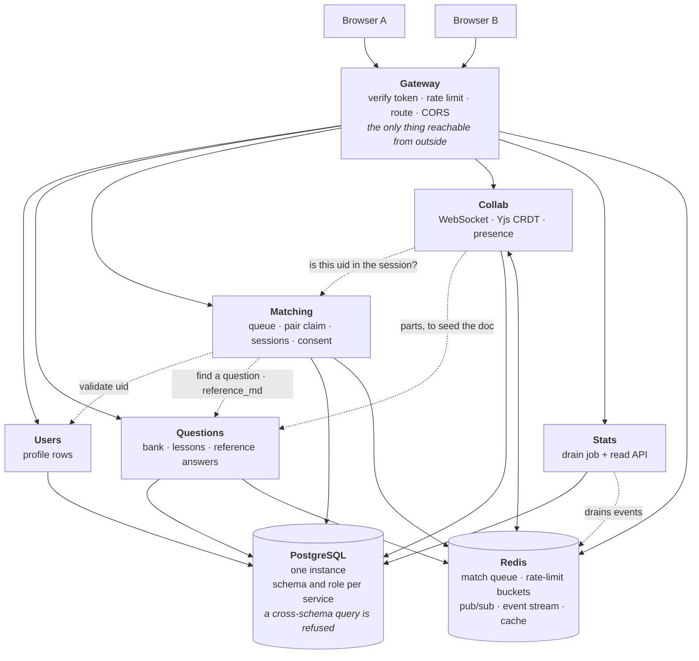
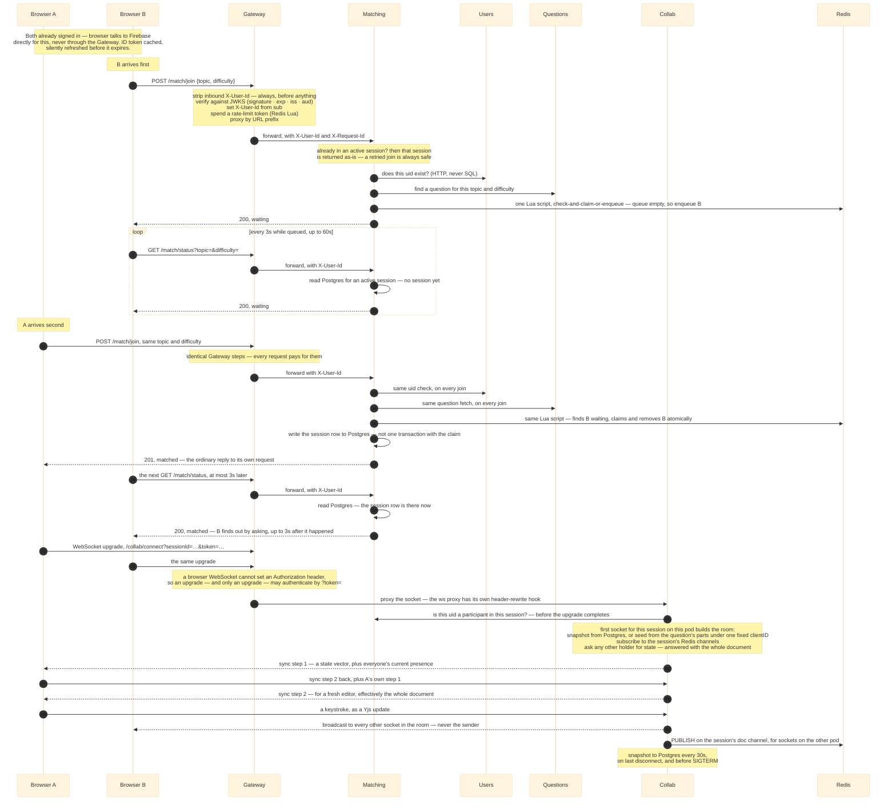

# How to get interview-solid on deepcs

## The situation you're actually in

You have ~4,000 lines of backend source and ~4,300 lines of system docs and
ADRs that already explain it well. That ratio matters. **You cannot fail this
by not knowing enough. You fail it by not being able to pull the right fact
out when a question arrives in an unexpected shape.**

Here's the mismatch. The docs are organised by *part*: one page on the
Gateway, one on Matching, and so on. Interviews don't ask by part. They ask
by *scenario* ("what happens when two people join at the same millisecond?"),
by *decision* ("why not a monolith?"), and — the one that separates people —
by *failure* ("what broke?"). Same facts, three different ways in. Preparing
means building those other two ways in, because the docs only give you the
first.

Rough size of the job: **8–10 hours of active work, split across 4
sessions.** Not more. Past that you're re-reading, which feels productive and
isn't.

---

## Calibrate first: which interview is this?

Three formats. **Prepare for the deep dive by default** — it is the most
common, and it contains the other two completely.

**1. Resume deep dive (assume this).** 30–45 minutes where the interviewer
picks this project off your resume and drills until they find the edge of
what you know. Extremely common: Meta, Amazon, most startups, many Google
team-matching conversations. It escalates in a fixed shape: *what is it*,
then *how does that part work*, then *why that way*, then *walk me through
the code*, then *how would you change it*. This needs everything in this
guide, **including the code session**. You will be asked to explain an
implementation, not just a decision.

**2. Behavioural story.** 3–5 minutes with a few follow-ups, in a round that
is mostly about you rather than the system. A strict subset of the deep
dive: the spine (§2), the numbers (§6), and the three failure stories. If
you're ready for the deep dive you are already ready for this.

**3. System design whiteboard.** The project becomes the starting point for
"now scale it". Adds §7 on top of everything else.

**What this means for code.** You are not memorising lines. For the four
load-bearing files (§3, session 2), you need three sentences each: what the
file does, why it's shaped that way, and what would break if it were shaped
the obvious way instead. And when asked "how would you add X", you need to
name the files you'd touch. That's §5's *Change it* group, and it is the
single highest-signal thing in a deep dive — because nobody who only read a
design doc can do it.

**On Google specifically:** the data-structures-and-algorithms rounds are a
separate, larger fight, and this repo does not help you there. Don't let
project prep eat that budget.

---

## 1. What "solid" means, concretely

Four levels. You want level 4 on three or four topics, level 3 everywhere
else. Level 4 everywhere is not achievable in your timeframe, and isn't what
is being tested.

1. **Names it.** "It's six services with a gateway, Postgres and Redis."
2. **Explains the mechanism.** "The gateway strips any inbound `X-User-Id`
   header, verifies the Firebase token against Google's JWKS, and sets its
   own from `sub`."
3. **Explains why, including the alternative.** "...and authorization
   *can't* live there, because the gateway holds no domain data — it cannot
   answer 'is this user in that session'. That's Collab asking Matching."
4. **Names what it cost, or where it's still wrong.** "The tradeoff is that
   a revoked user's token stays valid up to an hour, because checking
   revocation server-side needs a round trip on every request. For a shared
   answer doc that's acceptable; with money involved it wouldn't be."

Level 4 is the whole game. It is also the level the docs are already written
at — `00-overview.md` §5 literally contains that revocation paragraph. Your
job is retrieval, not authoring.

---

## 2. The spine: one trace, drawn from memory

Everything hangs off one story: two people join, get matched, and edit
together. Learn this first and learn it cold, because 90% of follow-ups are
branches off it — and because telling a story under pressure is far easier
than reciting a parts list.

**Draw this from a blank page before every study session.** Not read —
draw, by hand or on a whiteboard. Two boxes for browsers, one for the
gateway, five behind it, two cylinders. Solid arrows are requests; **dotted
arrows are one service calling another over HTTP** — those calls exist
because no service is allowed to read another service's database tables.

Then say the story out loud, about 90 seconds. This is the version to
rehearse:

1. A signed-in browser holds a Firebase ID token [the signed proof of who
   you are, issued by Firebase when you log in]. It sends
   `POST /match/join {topic, difficulty}`.
2. The **Gateway** deletes any `X-User-Id` header the client tried to send —
   always, before anything else. Then it verifies the token against Google's
   JWKS [Google's published list of public keys]: the signature, the expiry,
   the issuer, and the audience. The audience check matters most — without
   it, a validly-signed token from a *different* Firebase project would be
   accepted. Then it sets its own `X-User-Id` from the token's subject,
   spends a rate-limit token (120 per user, refilling at 2 a second), and
   forwards the request to Matching.
3. **Matching** checks the request body shape, then makes two HTTP calls
   before touching anything: asks **Users** "does this uid exist?" — over
   HTTP, never SQL, because the database refuses cross-schema queries — and
   asks **Questions** for a question matching the topic and difficulty. Both
   checks run on *every* join, before anything changes, so an outage in
   either service fails the request cleanly with nothing to undo.
4. Only then the queue. One Lua script [a small program Redis runs as one
   uninterruptible step] either **claims a waiting partner** or adds you to
   the queue. If it claimed one: write the session row to Postgres. The
   joiner learns from the reply to their own request; the waiter has to find
   out some other way.
5. The waiting person finds out by **asking** — `GET /match/status` every
   three seconds, answered from the Postgres session row. Bounded on three
   sides so that asking is affordable: only while queued, only for a minute,
   and inside the Gateway's per-user budget. Why asking rather than being
   told is [ADR-11](../adr/11-polling-over-server-sent-events.md) and drill 25.
6. Both browsers open a **WebSocket** ([`websockets.md`](./websockets.md))
   through the Gateway to **Collab**. Collab asks Matching: "is this uid a
   participant in this session?" — authorization lives with whoever owns the
   record, not at the gateway.
7. Collab holds one **Yjs document** per session in memory. Yjs is a CRDT
   [a data structure where two people's simultaneous edits merge to the same
   result on every machine, without a server deciding an order]. Edits fan
   out to the other sockets on that pod directly, and to sockets on the
   *other* pod over a Redis channel. The document is snapshotted to Postgres
   every 30 seconds, when the last person disconnects, and before shutdown.
8. Revealing the reference answer needs **both** people to consent. Only
   then does Matching fetch `reference_md` from Questions, over the internal
   network. The answer never enters the shared document (ADR-06).
9. Ending the session appends an event to a Redis stream; the **Stats** job
   drains the stream into summary rows. Delivery is at-least-once [the same
   event can arrive twice], so every write is built to be safe to repeat —
   which is why there is no counter column anywhere.

The same nine steps as a sequence, which is the shape a deep-dive
interviewer will keep interrupting. Every numbered arrow is a place they can
stop you:

**Verify you have the spine:** say all nine steps to a wall, no notes, in
under two minutes, twice in a row. If you stall at a step, that step is your
next reading target.

Every numbered arrow, explained. Read this alongside the diagram, in order,
so each step lands where it happens.

**B joins first (1–10)**

- **1** — The ID token came from Firebase directly. The Gateway never issues
  tokens — it only checks them. It holds Google's *public* keys and no
  secret credential, so even a fully hacked Gateway could read traffic but
  could not create or revoke an identity.
- **2** — The Gateway's steps, in their real order. First: delete any
  `X-User-Id` header the client sent. Always, unconditionally — this is what
  makes the header trustworthy, because the only way it can exist downstream
  is that the Gateway itself wrote it. Second: verify the token — signature,
  expiry, issuer, audience. Skip the audience check and a validly-signed
  token for someone *else's* Firebase project walks straight in. Third: set
  `X-User-Id` from the token's subject. Fourth: spend a rate-limit token —
  each user gets a bucket of 120, refilling at 2 per second; anonymous
  callers share a bucket per IP address (60, refilling at 1). If Redis is
  down, the limiter lets requests through rather than blocking everything —
  it "fails open". Then forward by URL prefix, attaching `X-Request-Id`
  [an id stamped on the request so its log lines can be found later].
  And the note before arrow 3: Matching first checks whether you are
  *already* in an active session, and if so hands that same session back —
  so retrying a join can never create a duplicate. That is what makes "just
  call join again" safe recovery advice.
- **3** — "Is this uid real?" Asked of Users over HTTP. It cannot be asked
  with SQL: Matching's database login is refused access to Users' tables.
- **4** — Find one question for this topic and difficulty. The topic is just
  a tag on questions; the call is a list query with `limit=1`. Notice both
  arrow 3 and arrow 4 happen *before* anything in Redis or Postgres changes.
  So if Users or Questions is down, the join fails cleanly — nothing was
  half-created, nothing needs undoing.
- **5** — One Lua script does the whole queue interaction as a single
  uninterruptible step: check for a waiting partner, claim one, *or* add
  yourself. Nobody is waiting, so B is added — timestamped by Redis' own
  clock, not the caller's, so queue order stays correct even if two Matching
  servers disagree about the time. Calling join again while already queued
  does nothing.
- **6** — B's request is answered `"waiting"` and closed. (On the way out, a
  `queue.joined` event is dropped onto the Redis event stream for Stats —
  fire-and-forget, meaning a Redis hiccup there can never fail B's request.)
- **7** — The loop starts, and it exists because of one fact: **HTTP gives a
  server no way to speak first.** B being matched is caused by *A's* request,
  and there is no way for Matching to reach into B's browser and say so. So B
  asks. These are separate, ordinary requests — nothing is held open, so the
  Gateway proxies them like any other route and keeps nothing between them.
- **8** — And each one pays the full Gateway toll from arrow 2: strip, verify,
  set, spend a rate-limit token, forward. **This is the cost of asking, made
  concrete** — twenty times a minute, for somebody who is doing nothing.
  It fits only because a user's bucket is 120 a minute, so one waiter spends a
  sixth of their own allowance and none of anybody else's.
- **9** — The answer comes from **Postgres**, not from Redis and not from
  memory. That is the property that makes this work with more than one replica:
  there is nothing to route to a particular process, because no process is
  holding anything on B's behalf. Any instance can answer, because the answer is
  a row.
- **10** — `"waiting"`, and the loop goes round. The bounds are the design, and
  there are three: B asks **only while queued** (a `localStorage` flag, so it
  survives navigation and refresh — React state would not), **only for 60
  seconds**, and **only every 3 seconds**. Matching drops a queue entry of that
  same age inside the Lua script, so a browser that has stopped asking also
  stops being claimable. Without that second half, a closed tab leaves an entry
  that pairs the next joiner with nobody.

**A joins second — same checks, different outcome (11–21)**

- **11** — A's own join request. Independent of B's; A has no idea B exists.
- **12** — Identical Gateway treatment as arrow 2. There is no shortcut
  path — every request pays the full toll.
- **13–14** — The uid check and the question fetch run on *every* join,
  before the queue is touched. Not just for whoever ends up waiting.
- **15** — The same Lua script runs — and this time finds B waiting. It
  removes B from the queue and returns two things: B's uid, and how long B
  waited. The wait is measured inside the script because the claim deletes
  the queue entry — this is the last instant the number exists to be read.
- **16** — The session row is written to Postgres. Important: the Redis
  claim (arrow 15) and this row are *not* one transaction. A crash between
  them leaves B claimed out of the queue but with no session existing. That
  exact state is what `GET /match/status` answering `none` detects — and the
  recovery is "call join again", which arrow 2's note made safe. (A
  `match.created` event also goes onto the event stream for Stats, carrying
  the wait from arrow 15.)
- **17** — A learns the boring way: as the `201` reply to its own request. **A
  never has to ask, and B never gets told.** That asymmetry is the whole
  problem in one line — the person who causes the match gets the answer for
  free, and the person who was waiting is the one with no way to be reached.
- **18–20** — B's next scheduled ask, at most three seconds later. Same
  requests as 7–9, same full Gateway toll, same Postgres read — except this
  time the row exists.
- **21** — `"matched"`, with the session id. **B finds out by asking, up to
  three seconds after it happened.** That lateness is the price, and it is
  the honest thing to say out loud: the alternative is holding a response
  open, which delivers in milliseconds and pins B to one specific process for
  the whole wait (ADR-11). Note what B is *not* told: the session names the
  question and never the partner. Sessions are anonymous, and nothing in this
  flow ever reveals the other person's uid.

**Both connect to Collab (22–31)**

- **22–23** — Both browsers upgrade to a WebSocket at
  `/collab/connect?sessionId=…&token=…`. The token rides the URL because a
  browser's WebSocket cannot attach the normal login header — and the
  Gateway accepts a token there *only* on upgrade requests, so normal routes
  can't be authenticated that way.
- **24** — The upgrade means the Gateway opens a second connection of its
  own to Collab and copies messages between the two ([`websockets.md`](./websockets.md)
  has the full picture). That second connection carries a request the
  Gateway composes itself, and by default it would carry almost no headers —
  so the ws proxy has its own separate header-rewrite step. Without it,
  Collab would see no `X-User-Id` and reject every socket, logged-in or not.
- **25** — Collab holds no session data of its own, so before agreeing to
  the upgrade it asks Matching: "is this uid a participant in this
  session?" The rule behind this: authorization lives with whoever owns the
  record. A "no" is a plain HTTP 403 and the socket never comes into
  existence. An *ended* session also answers "no" — which is the entire
  mechanism stopping finished sessions from being rejoined.
  Then the note: if this is the first socket for this session on this pod,
  the pod builds the room. It loads the saved snapshot from Postgres — or,
  for a brand-new session, builds the starting text from the question's
  parts, under one fixed Yjs client id so every pod builds byte-identical
  starting text. It subscribes to the session's Redis channels. And it
  publishes a "who has current state?" request that any *other* pod already
  holding this room answers with the whole document.
- **26** — The server opens the sync with **step 1: a state vector** [a
  compact summary of "how much of each person's edits I already have"] —
  not the document itself. It also sends everyone's current presence
  (cursors).
- **27** — A replies with step 2 — whatever the server was missing — and
  sends its own step 1 back, asking the same question in the other
  direction.
- **28** — The server's step 2 in return: everything A is missing. For a
  browser that just connected with an empty editor, that is effectively the
  whole document.
- **29** — A keystroke travels as a Yjs update: a small delta saying exactly
  which positions changed, not the whole text.
- **30** — Collab sends it to every *other* open socket in the room. Never
  back to the sender — there is no echo. (That detail once mattered a lot:
  the load test was originally written to measure an echo that doesn't
  exist, and §6 story 2 is what that taught.)
- **31** — And publishes it on the session's Redis channel, for sockets
  attached to the other pod. One guard here: if the update itself *arrived*
  from Redis, it is not re-published — that single check is what prevents an
  infinite loop of two pods forwarding each other the same edit forever.
  The final note: the document is saved to Postgres every 30 seconds, when
  the last socket disconnects, and before the process shuts down.

---

## 3. The reading plan — 4 sessions

Each session has a verify step. Don't move on until it passes.

### Session 1 — the shape (2h)
Read `docs/system/00-overview.md` end to end, slowly. It is the whole
system. Then skim all ten ADR filenames and read only **ADR-01** (why six
services) and **ADR-09** (one database, one schema per service).

→ **Verify:** draw the diagram from blank, then say the spine. Both from
memory. Expect to fail the first attempt; do it again the same evening.

### Session 2 — the two hard bits (2h) — *this is the deep-dive session*
The concurrency lives in two Lua scripts and one CRDT. Read the code, not
just the docs. These are where a deep dive goes, they are where the
project's real difficulty lives, and they are small:

- `services/gateway/src/rate-limit.ts` (147 lines) — the token bucket in
  Lua. Why Lua: reading and then writing a counter as two separate Redis
  commands leaves a gap where two requests both read "1 token left" and both
  spend it. A Lua script runs on the Redis server as one uninterruptible
  step, so the gap cannot exist.
- `services/matching/src/queue.ts` (141 lines) — the atomic pair claim, and
  the queue's expiry. Same shape of problem as the limiter: two people joining
  at the same instant race for the same partner. The expiry shares the same
  script because there is no always-on process to sweep the queue from, so the
  cleanup rides on the operations that already touch it.
- `services/collab/src/rooms.ts` (608 lines, the biggest file) — rooms, the
  Redis fan-out between pods, the whole-document state reply, snapshots.
- `packages/shared/src/service.ts` (168 lines) — the four things every HTTP
  service owes (structured logs, request ids, the two health endpoints,
  graceful shutdown), in one place so no service can quietly skip one.

→ **Verify:** two things. (a) For each Lua script, explain the exact race it
prevents and what you would *see* happen without it. (b) Open each of the
four files, talk through it for 60 seconds, then close it and do the same
from memory — what it does, why it's shaped that way, what breaks if it's
shaped the obvious way. If you can't do (b), you are not ready for a deep
dive, however well §5 is going.

### Session 3 — the numbers and their conditions (2h)
Read `docs/system/09-running-it.md` end to end. This is your differentiator
and also your biggest risk: every number has a condition attached, and
quoting a number without its condition is the one way to look worse than
someone who measured nothing.

Memorise exactly four figures and their conditions (§6 below). Not the
table.

→ **Verify:** for each of the four, say the number, *and* whether it stays
true off your laptop, *and* why.

### Session 4 — drills (2–4h, spread over days)
Work §5's question bank out loud. Answer first, then check — not the other
way around. Anything you get wrong, note which page it lives in and re-drill
it two days later. This is the session that actually creates recall; the
first three only create familiarity.

---

## 4. The method (this is the part people skip)

- **Answer before you look.** Reading an answer you would have gotten right
  is wasted time. The act of *trying to retrieve* is what builds the memory,
  not the reading.
- **Out loud, standing up.** Interview answers are spoken. An answer that is
  clear in your head and mush in your mouth is not prepared. You will
  discover three sentences you cannot actually say.
- **Spaced, not massed.** Four 2-hour sessions across four days beats one
  8-hour day by a wide margin.
- **Two days before, do a cold run.** Diagram from blank, spine out loud,
  ten random drill questions. Whatever fails is your last-day list.

---

## 5. The drill bank

Answer out loud first. The pointer says where to check — not where to read
first.

### Opening / scope
1. What is deepcs, in 30 seconds? *(A roadmap of nine CS topics; read a
   lesson alone, or get matched with a stranger and work through questions
   together in a shared editor.)*
2. Why is the roadmap the front door rather than the question bank?
   → overview §1
3. What's deliberately *not* in it, and why? → overview §1 ("Not in scope")
4. How long did it take and how big is it? *(About four weeks, ~120 commits,
   ~4,000 lines of backend source.)*

### Architecture
5. Why six services and not one? What's the actual forcing reason?
   *(Collab. One WebSocket occupies a connection slot for a whole session.
   Bundle that with the question bank, and enough idle editing sessions
   starve people just trying to browse — the two workloads grow on signals
   that have nothing to do with each other.)* → overview §2
6. Two of the six aren't really "splits". Which, and why? *(The Gateway is a
   position — the one front door — not a domain. Stats is a background job
   plus a read API for what the job wrote.)*
7. **Which services would you merge if you were being strict?** *(Users,
   Questions, Matching — same request shape, same failure blast radius, same
   release rhythm.)* Have the honest follow-up ready: they stayed separate
   because operating a distributed system is what this project exists to
   teach. → ADR-01
8. Why one Postgres with a schema [a named group of tables with its own
   permissions] per service, instead of a separate database per service?
   *(One database can update rows for two services in a single transaction.
   Separate databases can't — you'd need a saga [a chain of compensating
   steps that undo earlier writes when a later one fails], which is a lot of
   machinery this project doesn't need.)* → ADR-09
9. Why is the boundary enforced by the database rather than by code review?
   *(Each service logs into Postgres as its own role, and each role is
   simply refused access to the other schemas. A cross-schema query isn't a
   style violation — it's an error the database throws. A test asserts the
   refusal.)*
10. What are the *costs* of the split? *(A match request chains four
    processes — Gateway, Matching, Users, Questions. Four network hops, four
    chances to hit a pod that's mid-restart. Accepted, not mitigated — and
    the reason cross-service calls are kept to quick validations, never on
    the browsing path.)* → overview §6

### Auth (highest-yield area — security questions are common and this is tidy)
11. Walk through what happens to a request's identity, end to end.
12. Why is authentication [proving who you are] at the gateway, but
    authorization [deciding what you may do] *not*?
13. What exactly makes `X-User-Id` trustworthy? *(Two halves, both
    required: the gateway deletes any copy a client sends, **and** no other
    service can be reached from outside at all. If any service gained a
    door to the internet, a client could hand it a forged header directly —
    so "only the Gateway is exposed" is a security control, not a
    deployment detail.)*
14. What's the danger with the *public* routes? *(There, `X-User-Id` is
    absent — and absent must mean "anonymous person", never "skip the
    check". Reading absence as permission is the same header-forgery
    mistake from the other direction.)*
15. Why buy auth but build the gateway? *(One test, applied twice: build
    what has a concurrency or distributed-systems problem inside it — the
    gateway has the rate limiter. Buy what is pure risk with no insight —
    password storage teaches nothing and one mistake is a breach.)*
    → ADR-04, ADR-08
16. **What does buying auth cost you?** *(A revoked user's token stays
    valid for up to an hour, because checking revocation on every request
    would mean a round trip to Firebase every time.)*
17. Why does the audience check matter? *(Google signs every Firebase
    project's tokens with the same keys. Without checking which project a
    token was issued *for*, a valid token from any other Firebase app in
    the world would log its holder into yours.)*

### Concurrency (go deep here — it's what the project is *for*)
18. Two users join the same queue in the same millisecond. What stops them
    both claiming the same partner? Why can't application code fix this?
    *(Two Node processes on two machines can both read "B is waiting"
    before either removes B. No lock inside one process helps — the two
    processes share nothing. The fix has to live where the single copy of
    the queue lives: Redis runs the check-and-claim Lua script one at a
    time, so the overlap cannot happen.)*
19. Why is the rate-limit bucket in Redis and not in the gateway's memory?
    *(There are two gateway replicas. In-memory buckets would mean each
    replica keeps its own count, and a client bouncing between them gets
    double the allowance. The count has to live in the one place both
    replicas share.)*
20. Why a CRDT rather than operational transforms [the other collaborative-
    editing approach, where a central server rewrites each edit against the
    ones that beat it there]? → ADR-02
21. Two Collab pods, one session. How does an edit on pod A reach a socket
    on pod B? *(Each room subscribes to a Redis channel for its session;
    pod A publishes the update, pod B receives and re-broadcasts to its own
    sockets.)*
22. **The claim (Redis) and the session row (Postgres) are not one
    transaction. What happens if the process crashes between them?** *(B is
    out of the queue but no session exists. `GET /match/status` answers
    `none`, which means "call join again" — and joining again is safe by
    design. The shell's poll does exactly this inline on its next tick, so
    the same loop that notices a match also recovers from a lost claim.)*
    This is a great question to get — you already know the gap and named
    the recovery.
23. How does one Node process hold 250 sockets? *(One thread. When code
    hits an `await`, its local variables and resume point are saved as a
    small object on the heap, and the thread moves on. The actual waiting
    is one `epoll_wait` call [the Linux syscall meaning "sleep until any of
    these connections has data"] — not 250 threads. Many things in flight,
    one thing executing.)* → overview §6
24. What would break that? *(Any long CPU-bound stretch with no `await` in
    it. The event loop can't interrupt running code — there is no second
    thread to take over — so every socket and even the health endpoint
    stalls behind it. Password hashing at ~250ms per check would have been
    exactly this; ADR-04 moved it to Firebase, so no CPU-heavy work sits on
    any request path.)*

### Real-time delivery
25. How does a waiting user find out they were matched? *(They ask:
    `GET /match/status` every three seconds, answered from the Postgres
    session row. HTTP gives a server no way to speak first, and being
    matched is caused by somebody else's request, so asking is the only
    option that does not involve holding something open.)*
26. Why not server-sent events — one response held open and written into?
    *(It was built, and it worked, delivering in 23 ms. The problem is not
    the mechanism, it is where the state lives: a held-open response sits in
    the memory of one process, so scaling that process down severs it, every
    rolling update severs all of them at once, load stops rebalancing
    because connected clients never re-land anywhere, and a CPU-based
    autoscaler reads thousands of idle connections as an idle instance. A
    queue people leave within a minute does not need to buy any of that for
    one notification. → ADR-11.)*
27. Then why is polling not the thing you just argued against? *(Because
    every one of its costs is bounded, and unbounded is the version that was
    wrong here first. It runs only for somebody actually waiting, it stops
    after 60 seconds, and at 20 requests a minute it fits inside a rate-limit
    budget that already exists. Say the cost out loud: news up to 3 seconds
    late, and 20 requests that mostly answer "no".)*
28. What stops a closed tab from breaking matching for the next person?
    *(Nothing tells the server a tab closed, and there is no leave endpoint,
    so the queue entry would outlive its owner and be claimed — pairing
    somebody with a session nobody opens. Entries are claimable for 60
    seconds only, pruned inside the same Lua scripts that read the queue,
    against Redis' own clock. It is the server-side half of the same bound
    the browser keeps.)*

### Data & events
29. Why are reference answers never in the shared document? → ADR-06
30. Why Redis Streams for events, and why is every Stats write safe to
    repeat? *(Delivery is at-least-once — a crash mid-processing means the
    same event arrives again. Writes keyed by a natural id (session id,
    user id) just overwrite the same row on a repeat. A counter column is
    the one shape that can't be saved: adding 1 twice is wrong, no matter
    how careful the code is. Hence: no counter columns anywhere.)* → ADR-07
31. Cursor pagination rather than `OFFSET` — why? *(`OFFSET 500` makes the
    database walk and throw away 500 rows to reach yours, and a row
    inserted while you scroll shifts every later page by one — you see
    duplicates or miss rows. A cursor says "give me rows after this id",
    which is a cheap indexed lookup and unaffected by inserts behind it.)*

### Ops
32. What does Kubernetes give you that compose doesn't? *(Rolling updates
    and self-healing — replacing pods one at a time with no gap, and
    restarting what dies. The two behaviours compose cannot show.)*
33. Why is there no deployment? → §6 below, and ADR-05
34. What makes a rolling update lossless? *(Readiness probes. A pod that
    fails `/health/ready` is removed from the list of pods receiving
    traffic before it's touched, and a new pod isn't added until it passes.
    Requests only ever land on pods that answered "ready".)*
35. Why are `/health/live` and `/health/ready` separate endpoints?
    *(They answer different questions. Live: "is this process stuck? if so
    restart it." Ready: "may traffic come here yet?" A service still
    connecting to Postgres is live but not ready — conflate the two and
    the orchestrator kills healthy processes that are merely starting.)*
36. What's the highest-value line in the Dockerfile? *(The `manifests`
    stage copying every `package.json` by name — the root plus the eight
    workspace manifests — rather than `COPY . .`. Docker re-runs a cached
    step when any file it copied changes, so `COPY . .` before the
    dependency install means every code edit re-installs everything.
    Copying only the manifest files keys the install step to dependency
    changes alone.)*
37. Why does CI run the built image and curl `/health/ready` when typecheck
    and tests already passed? *(Because green once shipped a bundle that
    died at import: the bundler exits 0 even when its output is broken, and
    the tests run from source and never touch the built output. A green
    build is not a working artifact — the only proof is running the thing
    you actually ship.)*

### Testing
38. Why real Postgres and Redis rather than mocks? *(The properties under
    test are a Lua script running atomically, a database role being
    refused, pagination not skipping rows. A mock only proves the code
    agrees with itself — it would happily confirm a racy rate limiter
    works.)*
39. Why no coverage target? *(A percentage pushes effort toward whatever is
    easiest to cover, which is rarely where this system breaks.)*
40. **What isn't tested?** *(No end-to-end test of sign-in through to
    summary. Every piece is covered; nothing joins them. A gap, not a
    decision.)* Say this unprompted if asked "what would you do next" — it
    reads as ownership.

### Change it (deep-dive specific, and the highest-signal group here)
These cannot be answered by someone who read a design doc. They separate
"I built this" from "I was near this", so drill them hardest. Name
**files**, not concepts.

41. **How would you add a seventh event type?** *(Three places, and missing
    any one is the bug: the `EventType` list in
    `packages/shared/src/events.ts`; the `switch` in
    `services/stats/src/consumer.ts`; and a table keyed so that processing
    the same event twice changes nothing — because delivery is
    at-least-once.)*
42. **How would you add a seventh service?** *(A schema and a role in a
    migration; a route prefix on the Gateway; a Deployment, Service and
    probes in `k8s/`; the CI path filter. And the one people forget: the
    Dockerfile's `manifests` stage lists every workspace `package.json`
    **by name**, so missing it means "module not found" for that service
    alone. That cost is accepted knowingly in exchange for the build
    cache.)*
43. **Walk me through adding one endpoint, end to end.** *(A zod schema for
    the input; a repository function with fully schema-qualified SQL; the
    route with a short comment showing one example request; a Gateway
    prefix if it's a new one. Parameterized query, always.)*
44. **Add a spectator who can read a session but not write to it.** *(Good
    question because authorization lives with the record owner: the role
    has to be expressed in Matching's participant answer, since that is
    what Collab asks. Then the client attaches the document read-only —
    but the server must also refuse writes from that socket, because
    anything enforced only in the browser is not a control.)*
45. **Make the question bank full-text searchable.** *(Today tags are a
    text array with a GIN index [an index type that can answer "which rows
    contain this element"]. Full text search is a different index and a
    different query — say so, rather than implying the current one
    stretches to cover it.)*
46. **A user reports their partner's edits aren't showing up. Debug it
    live.** *(Structured logs first: every line carries `service` and
    `request_id`. The id the Gateway assigns follows a request into the
    first service and back to the browser — but the internal service-to-
    service calls do **not** forward it, so each hop starts a fresh id, and
    tracing across services means grepping each one. Then Collab's
    `/metrics` for socket and room counts. Then the honest part: there are
    no request-rate, error-rate or latency dashboards and no tracing, so
    past that point you're reading logs. Naming your own blind spots here
    scores better than inventing a dashboard that doesn't exist.)*
47. **Something in here you'd rip out and redo?** Have one real answer. The
    missing end-to-end test is the honest one.

### The killer question
48. **What went wrong / what would you do differently?** Have three ready,
    and §6 gives you them. This question decides more interviews than any
    other.

### If they dig into the measurements
Two that reward having actually read `docs/system/09-running-it.md` rather
than its summary — both are real, and both end with a method point.

49. **The load run's minimum edit latency was -522ms. What happened?**
    *(Both simulated users run in one process reading one clock, so it
    can't be two clocks disagreeing. The one clock itself stepped backwards
    mid-run — WSL2 does this when it resyncs against Windows. The tell that
    it was a step, not noise: a few samples went negative by about half a
    second, and nothing went *positive* by that much. It moves neither p50
    nor p95, and it stays in the results — a script that silently discards
    impossible samples can't tell you when they stop being rare.)*
50. **Why does `make k8s-check` probe with forty identities rather than
    one?** *(Each user gets 120 rate-limit tokens refilling at 2 per
    second. One prober running flat out would empty its own bucket and end
    up measuring the rate limiter instead of the rolling update. Forty
    identities at ~70 requests a second keeps every bucket comfortable. The
    lesson: a measurement harness has to be designed around the system's
    own defences, or it measures them.)*

### When they reach the edge

A deep dive is *designed* to reach the limit of what you know. A 45-minute
drill on a four-week project will get there, and an interviewer who never
reaches your edge learns nothing about where it is. So being stumped is the
expected ending, not a failure. The score comes from what you do at the
edge:

- **Say "I don't know" fast, then keep going.** "I don't know — my guess is
  X, and the way I'd check is Y" is a strong answer. Bluffing is the only
  genuinely fatal move, and it's visible from the outside, because a
  confident wrong answer collapses under one follow-up.
- **Separate what you measured from what you reasoned.** You have the
  perfect example in the preStop finding (§6). Using that distinction
  unprompted signals more seniority than any number you can quote.
- **Don't defend a decision you'd now make differently.** "Fair hit — I'd
  merge Users and Questions if I did it again, and ADR-01 already names the
  condition for merging them" beats any defence.

---

## 6. Your four numbers, and the honesty that carries them

Learn these four with their conditions welded on. A number quoted without
its condition is the fastest way to lose credibility in this conversation —
and it's avoidable, because the repo already does this correctly.

(Reading the table: p50 means the median — half of all measurements were
faster. p95 means 95% were faster, so it describes the slow tail.)

| Number | The condition, always said in the same breath |
|---|---|
| **0 non-200 out of 1,230** during a rolling update | Travels. A property of readiness probes, not of the hardware. |
| **250 concurrent sockets, p50 4ms / p95 11ms** | Does **not** travel. One laptop, AMD Ryzen AI 7 350, WSL2 — and one Collab replica (the cluster figure; compose read p50 3ms / p95 4ms). Not a configured limit — nothing caps concurrency anywhere. |
| **An edit written seconds before its pod was deleted survived** | Travels. By the shutdown-snapshot path and no other — the 30-second periodic snapshot and the on-disconnect snapshot were both ruled out. It is why Collab's grace period is 45s, not the default 30: the pause plus the snapshot write have to fit inside it. |
| **A service cannot read another's schema** | Travels. Asserted by a test that the *database* refuses the query. |

**Three "what went wrong" stories, ready to tell.** Each is real, and each
ends with you catching it.

**Story 1 — the headline number was meaningless, twice over.** Running the
load test against *two* Collab replicas, the p95 read 18.72 **seconds**,
sitting right next to a 5ms median. A system that got slower looks nothing
like that — so what happened? The tell was one row up in the results: more
edits *arrived* than were ever *sent* — 69,048 against 58,870. Impossible,
unless something was re-delivering old edits. And something was: when a
second pod opens a room the first pod already holds, the holder replies
with the whole document. The receiving pod broadcasts that to its own
sockets. The test script stamps timestamps into the text it types and
measures age-on-arrival — so a re-delivered document handed it hundreds of
markers that were minutes old, each recorded as a minutes-slow "edit". A
measurement artifact, not a defect — the editor itself was fine. But the
run went green. The same mechanism bites inside a single process too: on
connect, the initial sync delivers the entire document, so the script
counts nothing until that sync has landed.

**Story 2 — the script originally measured an echo that doesn't exist.**
The first design said: stamp a timestamp into each edit, record the delay
when it echoes back. But Collab never echoes — `broadcast` sends to every
socket *except* the sender. A script written to that design records zero
samples — **and passes anyway**, because a threshold over a metric with no
samples has nothing to fail on. That is why `edits_received: ['count>0']`
sits next to the latency threshold: it exists to prove the measurement
measured anything at all.

**Story 3 — the zeros had to prove they could be non-zero.** The rolling
update showed zero failed requests. Before believing a zero, break the
system on purpose: force-deleting *both* Gateway pods produced 20 responses
of 502 [the ingress saying "I have no working backend"] and 20 of 000 [the
probe tool's code for "the connection failed entirely"] — so the prober can
detect an outage when one exists. Second check: ingress-nginx will silently retry a failed request
against the other pod, which would hide a real drop. The access log showed
zero of 3,579 requests used more than one upstream. *A measurement that
reports zero is worthless until you know it could have reported something
else.*

**And one thing to volunteer as not proven.** Every Deployment sets a
5-second `preStop` pause [a deliberate wait between "this pod is being
removed" and the shutdown signal, so traffic routing catches up before the
process stops answering]. The reasoning is sound. But the *forced* kill —
no pause, no shutdown signal, process just gone — also dropped nothing. So
the measurements do **not** show the pause is what makes the zeros happen;
on a one-node cluster, routing updates appear to win the race anyway. On a
real multi-node cluster they wouldn't. The pause stays — but it stays on
*reasoning*, not on *measurement*, and saying that distinction out loud,
unprompted, is worth more than any number in the table.

**Why there's no deployment.** Don't be defensive — it's a priced decision,
not a shortfall. Deploying was designed and costed line by line
(`docs/future/cost.md`) before being declined: keeping a demo online past a
free trial means attaching a payment card, and the behaviours worth showing
need an orchestrator rather than a hosted runtime. Knowing what it would
cost, and why, is the deliverable. Rehearse this in two sentences so it
lands as a decision rather than an excuse.

---

## 7. If the interview turns into system design

Three extensions to reason about live. Don't memorise answers — memorise
the *constraint* each one hits first.

- **10× the concurrent editors.** The first thing that binds: every
  WebSocket occupies a slot on the Gateway *as well as* Collab, because the
  Gateway proxies every socket. Enough live editors and nobody can browse
  the question bank. First change: let browsers connect straight to Collab
  — at the price of Collab having to verify tokens itself, since it would
  now be exposed and could no longer blindly trust a header.
- **A real multi-node cluster.** The preStop finding flips. With the
  control plane on another machine, routing updates no longer beat
  container teardown, and the pause becomes load-bearing instead of
  precautionary.
- **Collab rooms are in-memory, per pod.** There's no rule sending both
  people in a session to the same pod. Correctness comes from the Redis
  fan-out plus the CRDT merging to the same result everywhere. The cost is
  bandwidth: the whole document crosses Redis, and every local socket, each
  time a room opens on a pod that didn't have it. Fine, because in real use
  rooms open rarely.

---

## 8. The done test

You're ready when all eight pass cold, no notes:

1. Diagram from a blank page in under 90 seconds.
2. Spine said out loud in under two minutes.
3. Both Lua scripts explained by the race each prevents.
4. Any one of the four load-bearing files talked through for 60 seconds
   with the file closed.
5. Any *Change it* question (41–47) answered by **naming files**.
6. All four numbers quoted with their conditions.
7. Three "what went wrong" stories told in under a minute each.
8. "Why no deployment" answered as a decision, in two sentences, without
   sounding apologetic.

Items 4 and 5 are the deep-dive ones. Everything else is also true of the
behavioural format — which is why passing 1–3 and 6–8 feels like being
ready, and isn't.

**If you only have one evening:** §2 spine, §6 numbers and stories,
questions 5, 13, 18, 22, 40, 47. That covers the behavioural format and the
opening ten minutes of a deep dive — but it will not survive the back half
of one, so treat it as triage rather than a plan.
