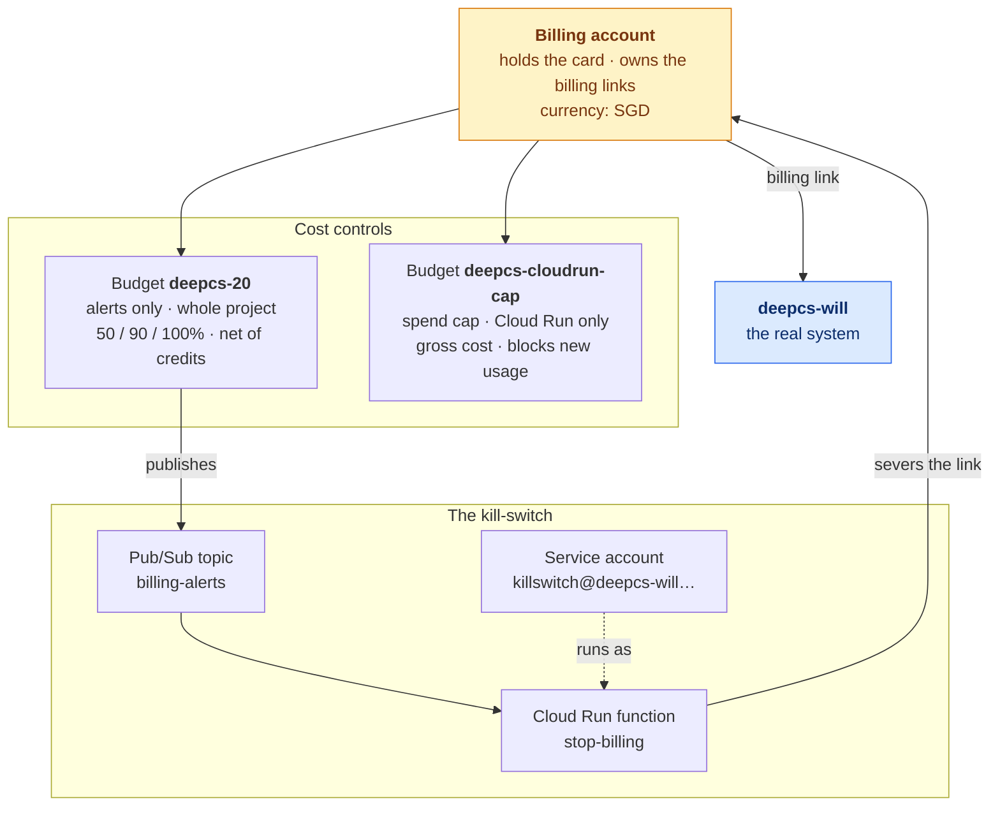
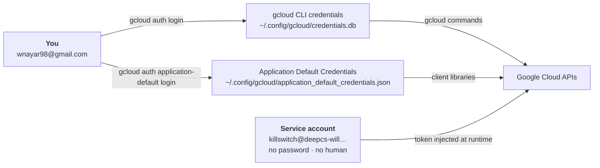
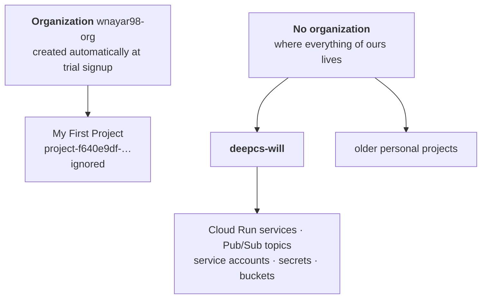
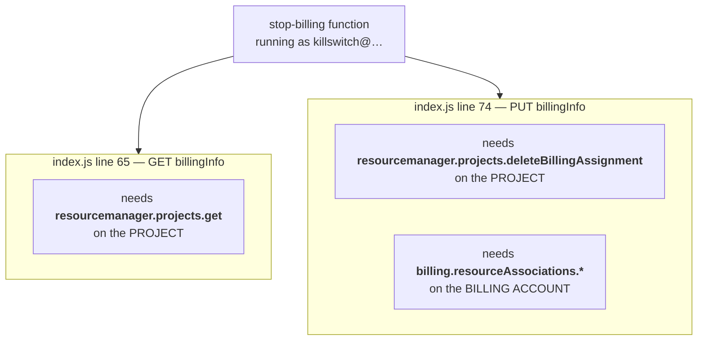
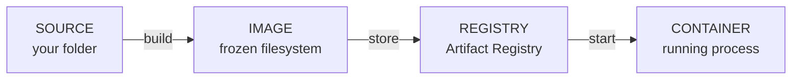
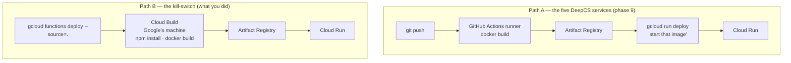
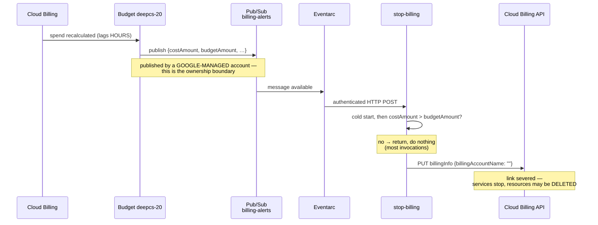
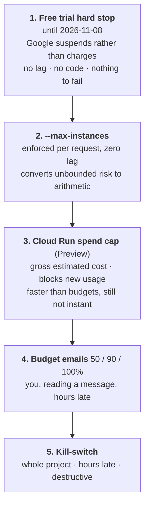

# Google Cloud, as actually set up

A record of what phase 0 built and why each piece is there, written after doing
it on 2026-08-08. Prerequisite: [`docker.md`](docker.md) Part 1 — the three
objects (Dockerfile, image, container) and the two nouns (registry, build
context). Nothing else is assumed.

The companion is [`../phases/0-cloud-setup.md`](../phases/0-cloud-setup.md),
which is the runbook. This document is the explanation: what the objects are,
which of them contain which, and where the setup fought back.

---

# Part 0 — What exists at the end

A throwaway project, `deepcs-kstest-will`, existed for about an hour to prove the
kill-switch worked, then was deleted. Its only purpose was to be somewhere the
destructive path could run without consequence.

---

# Part 1 — Identity: who you are to Google

Every request to a Google Cloud API is authenticated. Three separate identities
were established, and confusing them is a real source of errors.

**gcloud credentials** are what almost every command in the runbook used. Created
once by `gcloud auth login`, stored in a file with `600` permissions (owner
read/write only). No keyring exists on WSL, so gcloud warns that it's storing
them in plaintext — the protection is filesystem permissions, the same as your
SSH keys.

**Application Default Credentials (ADC)** are a *separate* store, read by Google's
client libraries rather than by gcloud itself. A handful of gcloud commands —
`gcloud billing budgets` among them — are thin wrappers over a client library, so
they read ADC. Having one does not give you the other. You'll need ADC again in
phase 1 when local code talks to Google services.

**Service accounts** are identities for code. `killswitch@deepcs-will…` has an
email address but no password and nobody signs in as it. When Cloud Run starts
the function's container, the runtime injects a short-lived token for that
account; the code never handles a credential. It starts with **zero**
permissions — everything it can do comes from IAM bindings granted afterwards.

**Why a dedicated one rather than the project's default:** every project has a
default compute service account carrying broad `Editor` rights. The kill-switch
holds the most destructive permission in the project — disable billing — and that
should belong to an identity that does exactly one thing.

---

# Part 2 — The resource hierarchy

**Project** — the boundary every Google Cloud resource is scoped to. It is
simultaneously a permission boundary (who can do what), a quota boundary (how
much you can use), and a billing boundary (what gets charged where). Deleting a
project deletes everything scoped to it.

A project has **two identifiers**: the **id** you choose (`deepcs-will`, globally
unique across all of Google Cloud, permanent, appears in URLs and service account
emails forever) and a **number** Google assigns (`1051065874502`). Some
Google-managed service accounts are addressed by number, which is why the runbook
looks it up before granting IAM to Pub/Sub's service agent.

**Billing account** — where the payment method lives. It sits *above* projects,
not inside one, and can pay for many. The arrow between them is a **billing
link**, and severing that link is exactly what the kill-switch does. Without a
link, a project can't use most services at all, even free-tier ones.

**Organization** — an optional scope above projects, for imposing policy across
many. One appeared automatically during trial signup and holds only the
auto-created project. Ours deliberately sits under "No organization": no benefit
for a single-person project, and org policies are an extra failure mode.

That choice has one concrete consequence, and it caused the main failure of the
setup. See Part 4.

## The console's project scoping

Three separate views, and they behave differently:

- The **welcome dashboard** describes exactly one project — whichever is
  selected. It has no all-projects view, which makes it look like other projects
  vanished.
- The **project picker** defaults to a "Recent" tab and a "Select from"
  organization filter. Set the filter to **No organization** to see ours.
- **`console.cloud.google.com/cloud-resource-manager`** is the flat table of
  everything you own, ignoring the picker.

`gcloud projects list` is faster than all three and is the source of truth.

---

# Part 3 — APIs: what "enabling" means

Every Google Cloud service is reached at a network endpoint — `run.googleapis.com`,
`pubsub.googleapis.com`. A new project starts with nearly all of them switched
off, meaning requests from that project are rejected. `gcloud services enable`
flips a per-project switch so the endpoint accepts calls. It often also creates a
**service agent** [a Google-managed service account the service uses to act inside
your project] — those are the `service-<number>@gcp-sa-*` entries that appear in
the project's IAM policy without you granting anything.

**Enabling is free.** You're billed for use, not availability. The reason not to
enable everything is the reverse: a disabled API can't be called, so it can't run
up a bill. DESIGN.md §7 treats the enabled list as layer 3 of the cost ceiling.

**Nine APIs for one 50-line function**, because a gen2 Cloud Function is not a
standalone product. Split by *when* each is used and the list stops looking
arbitrary:

**Used once, at deploy:** `cloudbuild` (builds the image), `artifactregistry`
(stores it), `run` (runs it — a gen2 function *is* a Cloud Run service),
`cloudfunctions` (the wrapper that orchestrates all of it), `eventarc` (creates
the trigger wiring).

**Used every time it fires:** `pubsub` (the channel), `eventarc` again (delivery),
`logging` (where the function's output goes — it has no terminal attached),
`cloudbilling` (the API the code calls), `billingbudgets` (creating and reading
the budget).

Three more went on the real project only — `secretmanager`, `storage`,
`cloudscheduler` — for the actual system in later phases.

---

# Part 4 — IAM, and the mistake that cost the most time

IAM works by **bindings**, each one a sentence:

> **this principal** has **this role** on **this resource**.

A principal is a person or a piece of code. A role is a bundle of permissions.
The resource is what the role applies to — and *that* is the half people get
wrong, because a role granted on a project says nothing about the billing
account. They are two different resources.

## The failure

`index.js` makes two calls to the Cloud Billing API, and they are authorised
against different resources:

The runbook granted only `roles/billing.admin` on the billing account. That
covers the billing-account end. Nothing covered the project end, so the function
failed on line 65 — the **read**, before reaching anything destructive — with
`The caller does not have permission`.

The fix was two project-level grants, chosen as the narrowest roles that work:

- **`roles/browser`** — the smallest role containing `resourcemanager.projects.get`.
  Read-only, nothing else.
- **`roles/billing.projectManager`** — holds exactly the two project-side billing
  assignment permissions and nothing more.

Deliberately not `roles/viewer` or `roles/editor`. This identity can disable
billing; it gets the minimum.

**Why "No organization" caused this.** A `roles/billing.admin` grant made at the
*organization* level would have covered both ends, and the two extra grants would
be redundant. With no org above the project, the project end must be granted
explicitly.

## Why this mattered more than an ordinary bug

The kill-switch's signature failure mode is that it runs, logs, and does nothing.
Section 5.5 of the runbook exists specifically to force that failure into the
open on a throwaway project. It worked exactly as designed: the test caught a
real, silent gap that would otherwise have surfaced during the incident the thing
was built for.

The supporting grants, for completeness: `eventarc.eventReceiver` (may receive
events), `run.invoker` (may be invoked as a Cloud Run service), and
`iam.serviceAccountTokenCreator` granted to **Pub/Sub's own** service agent —
which is what lets the delivered request arrive authenticated.

---

# Part 5 — Getting code onto Google Cloud

Google Cloud does not run *code*. It runs **images**. An image is a frozen
filesystem — Node's binaries, your source, your dependencies — plus metadata
saying what command to run. Inert. It lives in a **registry**.

So every path is the same three steps, and the only thing that ever differs is
**whose machine performs the build**.

This repo uses both possible builders, which is genuinely confusing until you see
them side by side.

**Path A** is what [`docker.md`](docker.md) describes: *"Images are built once, on
GitHub's machines, and merely started on Google Cloud. Google never reads your
Dockerfile."* True for the five services.

**Path B** is the exception, and `docker.md` doesn't mention it. `--source=.`
uploads the *folder*; Cloud Build reads `package.json`, generates a Dockerfile,
installs dependencies and builds the image on Google's machine. That's why
`cloudbuild` is in the enabled-API list for something you deploy with
`gcloud functions deploy`.

**Why the difference is deliberate.** The five services already have CI that
builds and tests them; handing Google a finished image means one build, not two.
The kill-switch is 50 lines with no CI, no Dockerfile and no build worth owning,
so `--source=.` hands the problem to Google.

Two identities appear in the deploy output and they are not the same thing:
`buildConfig.serviceAccount` is the account that **built** the image (the project
default), and `serviceConfig.serviceAccountEmail` is the account the function
**runs as** (`killswitch@…`). Only the second one matters for permissions.

---

# Part 6 — Events: Pub/Sub and Eventarc

The problem: **Cloud Run only understands HTTP.** A container starts when an HTTP
request arrives; that's the only trigger it has. But the kill-switch's trigger is
"Google's billing system recalculated your spend". Something must convert one
into the other, and it takes two services because they do different jobs.

**Pub/Sub** is the channel. A **topic** is a named channel; a publisher sends
messages to it; subscribers receive them. Neither knows the other exists. The
budget publishes; it has no knowledge of your function and shouldn't need any.

**Eventarc** is the adapter. It subscribes to the topic and, for each message,
makes an **authenticated HTTP POST** to your Cloud Run service. Without it you'd
need a permanently running process polling the topic — a VM rented 24/7 to wait
for something that may never happen, which is precisely what serverless avoids.

One Pub/Sub property shapes the code: delivery is **at-least-once**, so the same
message can legitimately arrive twice. That's why `index.js` is idempotent —
detaching an already-detached project must be a harmless no-op, not an error.

## The whole chain when it fires

**Everything above the topic is Google's; everything below is yours.** That
boundary is why the runbook insists the budget be created in the *console*: the
publisher is a Google-managed service account that needs permission to publish to
*your* topic, and ticking "Connect a Pub/Sub topic to this budget" grants it
automatically. The CLI path leaves you to grant it by hand — miss it and the
budget publishes into a topic it can't write to, and nothing happens. The same
silent failure as Part 4, arriving from a third direction.

**A correction worth carrying:** the budget doesn't publish only at thresholds.
It publishes as cost data updates, several times a day, with current
`costAmount` and `budgetAmount` in every message. The function runs on all of
them and takes the no-op branch on nearly all. Only the *emails* are
threshold-only.

---

# Part 7 — The cost ceiling, ranked by what actually protects you

**The trial is doing all the work right now.** Until 8 November 2026 there is no
path to owing Google anything — credits run out, services stop. Everything else
built in phase 0 is rehearsal for after you upgrade, which is a decision to make
deliberately rather than by clicking a banner.

**`--max-instances` is the only control with no lag.** Cloud Run checks it at
request admission: when N instances are running, request N+1 waits rather than
starting instance N+1. It doesn't stop spending; it makes the worst case
computable in advance instead of unbounded.

**The spend cap is new** — it shipped in Preview in 2026 and covers four
services: Gemini API, Agent Platform, Cloud Run, and Cloud Run functions. One
project **and one service** per budget, monthly periods only. At 100% it blocks
all *new* usage of that service; in-flight requests finish and bill, persistent
resources keep running, nothing is deleted, and lifting it is manual (up to an
hour to resume).

> **Never cap "Cloud Run functions" in this project.** The kill-switch bills under
> that service. Capping it would block the backstop.

It enforces on **gross** cost, ignoring credits — unlike the `deepcs-20` budget,
which tracks spend *net* of credits and therefore stays near $0 and never fires
during the trial. So the cap can fire while credits are still paying. If Cloud
Run goes quiet unexpectedly in phase 9, check there first.

**The kill-switch is last, and it is a backstop.** Budget data lags by hours, so
a genuine runaway overshoots before it fires. What it does reliably is stop the
meter: with no billing link, Google shuts the project's paid services down.
Charges accrued *before* it fires are still owed — detaching removes the billing
link, not the bill.

## What none of this covers

- **GKE (phase 9).** Nodes bill per hour whether or not anything runs on them.
  Spend caps don't cover GKE; `--max-instances` is a Cloud Run concept. The only
  control is deleting the cluster when you stop working. This is also why the
  trial's 8 November expiry matters for that sprint.
- **Anything outside Google Cloud billing.** Neon and Upstash keep running and
  keep charging regardless. Their free tiers throttle rather than overage-bill,
  which is the actual protection there.

---

# Part 8 — What phase 0 proved, and what it didn't

**Proved**, by firing a hand-published message at the throwaway project and
observing `billingEnabled: false`:

- the function's code and its over-budget branch
- `roles/billing.admin` on the billing account
- `roles/browser` + `roles/billing.projectManager` on the project
- the full Pub/Sub → Eventarc → Cloud Run → Cloud Billing path

**Not proved:** that a *real* budget publishes to the topic. The message was
published by hand. That last link is created by the console step in 6.2 and
confirms itself the first time a threshold email arrives.

This gap is worth stating plainly rather than letting a green result imply more
coverage than it has.

---

# Part 9 — Three failures worth remembering

**429 on `projects create`.** The error named `consumer: project_number:32555940559`
— not your project, but the OAuth client id the gcloud CLI ships with, shared by
every gcloud user. You hit a global write-quota ceiling. Transient; retry after a
minute. gcloud then appended "This may be due to network connectivity issues,"
which was false and misdirecting.

**`SyntaxError: Bad control character in string literal`.** The test message's
JSON was pasted across two terminal lines, putting a literal newline inside
`"budgetAmount"`. A newline inside a JSON string is invalid. Publish long
`--message` payloads on a single line.

**`gcloud billing budgets list` failing with a permission error.** That command
runs through a client library needing a **quota project** — the project an API
call is attributed to for quota accounting. Without one, gcloud attributes the
call to its own shared project where `billingbudgets` is disabled, and reports
`SERVICE_DISABLED` phrased as a permission error on *your* billing account. Fix:
`--billing-project="$PROJECT_ID"`. Running `gcloud auth application-default login`
does **not** fix it.

A pattern connects all three: the error text named an internal identifier or
guessed at a cause, and in each case the real explanation was one layer away from
what was printed.

---

# The sentence to keep

> **Cloud Run runs images. Everything upstream of it is a question of who built
> the image and where it was stored. Everything downstream is a question of which
> identity is asking and what it has been granted on which resource.**
