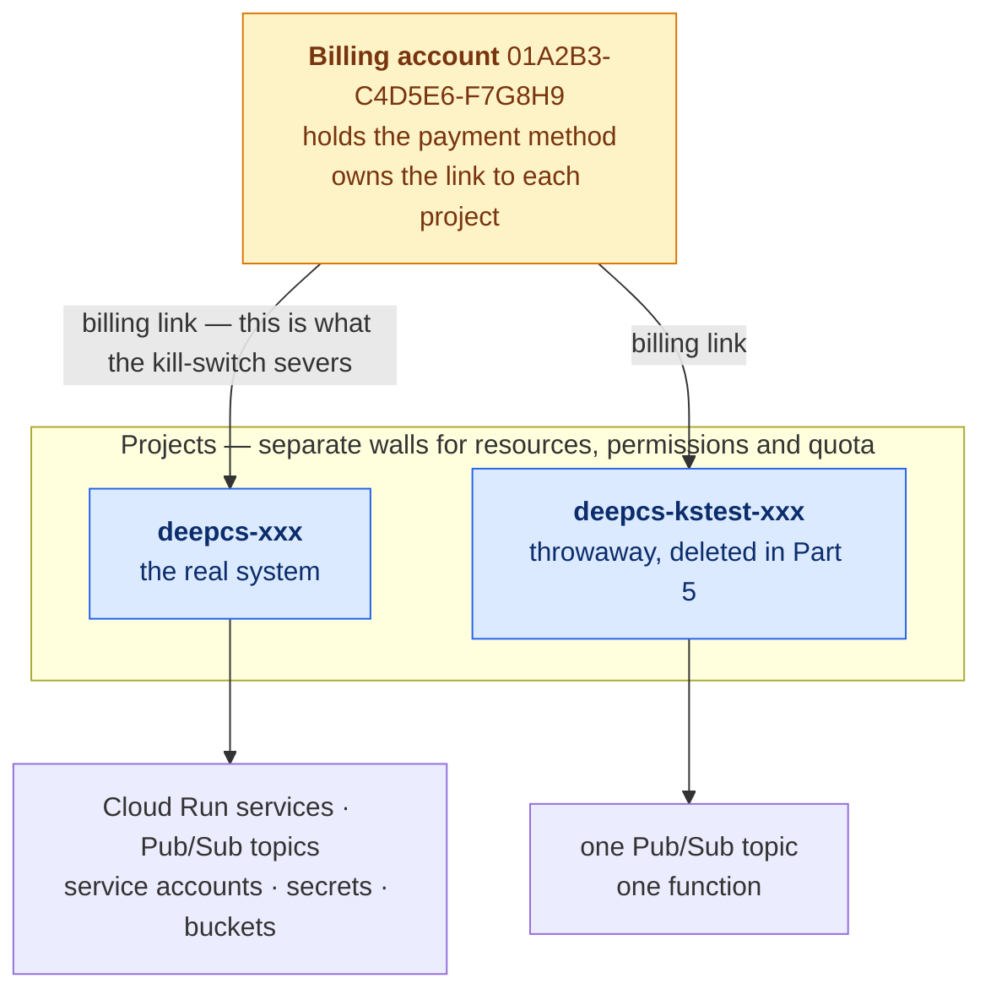
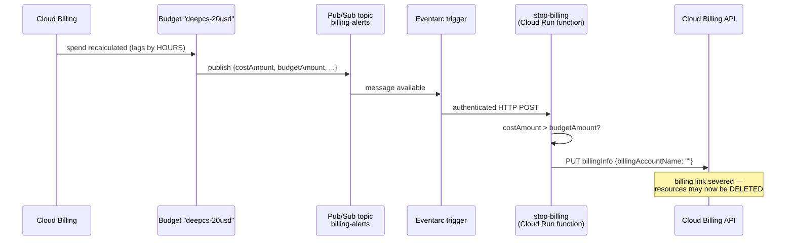

# Phase 0 — cloud setup

A tutorial. Every command says what it creates, why it exists, and what breaks
without it. Work top to bottom — the order matters in one place.

## Before you start

**On "the UI today":** my knowledge runs to January 2026 and it's now August —
seven months, so console layouts have had real time to shift. This guide leans
on `gcloud` (the command-line tool for Google Cloud), which barely changes, and
uses the web console only where there's no CLI path or where the console wires
up permissions for you. Where I give console steps I give the URL too, because
URLs outlive buttons.

If a screen doesn't match what's described, **tell me what you see** rather than
clicking the nearest-looking thing — especially anywhere near billing.

**Cost:** everything here is free. The card is required to start the trial, but
Google cannot charge it during the trial. When credits run out, services stop.

**Time:** 45–90 minutes. One step (deploying the kill-switch function) is where
it usually fights back.

---

# Part 1 — The map

Everything below hangs off this structure. Read it once and the rest of the
guide stops being a list of magic commands.



Five terms, defined here and used throughout:

**Project** — the box every Google Cloud resource lives in. It's simultaneously a
permission boundary (who can do what), a quota boundary (how much you can use),
and a billing boundary (what gets charged where). Deleting a project deletes
everything inside it. You'll create two.

**Billing account** — where the payment method lives. It is *not* inside a
project; it sits above them, and one billing account can pay for many projects.
The arrow between them is a **billing link**, and severing that link is exactly
what the kill-switch does. **This separation is the single most important thing
on the diagram** — it's why one IAM grant later has to be made on the billing
account rather than on the project, and why getting that wrong produces a
kill-switch that runs, reports success, and does nothing.

**API** — every Google Cloud service is reached through an API endpoint
(a network address you send requests to). A new project starts with almost all
of them switched off. "Enabling an API" turns the endpoint on for that one
project. An API that's off can't be used, and therefore can't be billed — which
is why DESIGN.md §7 treats the enabled list as a cost control and not just
setup.

**IAM (Identity and Access Management)** — Google's permission system. It works
by *bindings*, each one a sentence of the form: **this principal** has **this
role** on **this resource**. A principal is a person or a piece of code; a role
is a bundle of permissions; the resource is what the role applies to. The
resource half is what people get wrong: a role granted on a project says nothing
about the billing account, because those are two different resources.

**Service account** — an identity for code rather than for a person. It has an
email address (`something@project-id.iam.gserviceaccount.com`) but no password
and no human behind it. When your function runs, it runs *as* a service account,
and can do exactly what that account has been granted. You'll create one.

---

# Part 2 — Install the tools

## 2.1 gcloud

`gcloud` is the CLI for Google Cloud. Everything the console does, it can do —
and unlike the console, it's scriptable and doesn't move its buttons.

The tarball installer needs no `sudo` and installs into your home directory:

```bash
curl -sSL https://sdk.cloud.google.com | bash
exec -l $SHELL
gcloud version
```

`exec -l $SHELL` replaces your shell with a fresh login shell, which is how the
installer's PATH change takes effect without you closing the terminal. Accept
the prompt to modify your profile when it asks.

Now authenticate:

```bash
gcloud auth login --no-launch-browser
```

**Why `--no-launch-browser` on WSL:** by default gcloud tries to open a browser
on the machine it's running on. Your WSL environment is a Linux system with no
graphical browser installed, so the default either fails or hangs. The flag
makes it print a URL instead — paste that into Windows, approve, and paste the
resulting code back into the terminal.

## 2.2 gh

The GitHub CLI. Needed because phase 0's CI runs on GitHub Actions and phase 10
deploys from it.

```bash
(type -p wget >/dev/null || sudo apt install wget -y) \
  && sudo mkdir -p -m 755 /etc/apt/keyrings \
  && wget -qO- https://cli.github.com/packages/githubcli-archive-keyring.gpg \
     | sudo tee /etc/apt/keyrings/githubcli-archive-keyring.gpg > /dev/null \
  && sudo chmod go+r /etc/apt/keyrings/githubcli-archive-keyring.gpg \
  && echo "deb [arch=$(dpkg --print-architecture) signed-by=/etc/apt/keyrings/githubcli-archive-keyring.gpg] https://cli.github.com/packages stable main" \
     | sudo tee /etc/apt/sources.list.d/github-cli.list > /dev/null \
  && sudo apt update && sudo apt install gh -y

gh auth login
```

That block adds GitHub's package signing key, registers their apt repository,
and installs from it. The key step is what lets apt verify the packages actually
came from GitHub. Then: GitHub.com → HTTPS → authenticate with a browser.

**Run these with a `!` prefix in our session** — `! gcloud auth login --no-launch-browser`
— so the output lands in the conversation and I can see failures.

---

# Part 3 — Account, trial, and two projects

## 3.1 Create the account and start the trial

No CLI path exists for this; it needs the console.

1. Go to **https://console.cloud.google.com** and sign in with the Google account
   that should own this.
2. A banner offers the free trial — labelled **"Start free"**, **"Activate"**, or
   **"Try for free"** depending on where you see it. Click it.
3. Step 1 of the wizard: country and terms.
4. Step 2: payment profile — name, address, card.
5. Finish. You land in the console with a default project you can ignore.

**Read what the page says the trial is.** It's normally $300 over 90 days, but it
varies by region, and DESIGN.md §7 builds an argument on the 90-day figure. Tell
me if yours differs.

**Note today's date.** The 90 days start now, and that clock decides how much of
the deploy (phase 10) is free.

*The Kubernetes sprint no longer depends on this clock at all: it is phase 8 and
runs locally on `kind`, so there is no cluster billing by the hour and nothing
to race.*

**Why the card can't be charged during the trial:** the trial is a hard stop, not
a warning. When credits run out Google suspends resources rather than billing
you. That's the strongest protection in this whole setup — everything in Part 4
exists for the period *after* you upgrade to a paid account, when the protection
disappears.

## 3.2 Find your billing account id

```bash
gcloud billing accounts list
```

You'll get something like `01A2B3-C4D5E6-F7G8H9`. That's the `BA` box on the
map. Save it into your shell so later commands can use it:

```bash
export BILLING_ACCOUNT=01A2B3-C4D5E6-F7G8H9   # <- yours
```

`export` puts a variable into the environment of this shell and every command
you launch from it. It disappears when you close the terminal — if you come back
tomorrow, re-run the exports.

## 3.3 Create both projects

```bash
export PROJECT_ID=deepcs-<your-suffix>
export TEST_PROJECT=deepcs-kstest-<your-suffix>

gcloud projects create "$PROJECT_ID"   --name="DeepCS"
gcloud projects create "$TEST_PROJECT" --name="DeepCS killswitch test"
```

**Project ids are globally unique across all of Google Cloud** — not unique to
your account, unique across every customer. Plain `deepcs` was taken years ago.
Pick a suffix. The id is permanent and appears in URLs, service account emails
and deploy commands forever, so choose something you can live with.

`--name` is the human-readable display name and *is* changeable. The id is not.

Now link both to the billing account — the arrows on the map:

```bash
gcloud billing projects link "$PROJECT_ID"   --billing-account="$BILLING_ACCOUNT"
gcloud billing projects link "$TEST_PROJECT" --billing-account="$BILLING_ACCOUNT"
```

Without a billing link a project can't use most services at all, even free-tier
ones.

**Why a throwaway project.** The kill-switch is destructive — it doesn't pause
resources, it removes the billing link, after which Google may delete them. It
also fails *silently* when its permissions are wrong: the function runs, logs
success, and detaches nothing. A component that is both destructive and silently
breakable has to be proven somewhere it can't hurt you. The throwaway is deleted
in Part 5.

## 3.4 Enable the APIs

```bash
for P in "$PROJECT_ID" "$TEST_PROJECT"; do
  gcloud services enable --project="$P" \
    run.googleapis.com \
    artifactregistry.googleapis.com \
    cloudfunctions.googleapis.com \
    cloudbuild.googleapis.com \
    eventarc.googleapis.com \
    pubsub.googleapis.com \
    logging.googleapis.com \
    cloudbilling.googleapis.com \
    billingbudgets.googleapis.com
done

# Only the real project needs the rest of the system's APIs.
gcloud services enable --project="$PROJECT_ID" \
  secretmanager.googleapis.com \
  storage.googleapis.com \
  cloudscheduler.googleapis.com
```

Takes a minute or two per project.

**Why nine APIs for one small function.** This is the contradiction I found in
DESIGN.md §7 and fixed: the doc's cost table said to enable only five APIs
total, but a gen2 Cloud Function is not a standalone thing. It is a **Cloud Run**
service, built by **Cloud Build**, stored in **Artifact Registry**, triggered
through **Eventarc**, fed by **Pub/Sub**, writing to **Logging**, and calling the
**Cloud Billing** API. Every one of those has to be on. Layer 3 of the cost table
forbade layer 1 of the same table.

---

# Part 4 — What the kill-switch is

Before running anything, understand the thing you're building. Six moving parts:



**Why this exists at all: Google Cloud has no *general* "stop at $X" setting.** An
ordinary budget is an alert, not a limit — it can notify and nothing else. So a
whole-project cap has to be assembled from an alert, a message bus, and code that
reacts to it.

**Updated 2026-08-08.** There is now a partial exception: **spend cap
enforcement**, in Preview, which does hard-stop usage. It covers four services —
Gemini API, Agent Platform, Cloud Run and Cloud Run functions — one project and
one service per budget, and it cannot see storage, egress, Cloud Build or GKE.
You'll create one for Cloud Run in Part 6 alongside this. It doesn't replace what
you're building here: this function is still the only thing that can stop an
entire project.

**Budget** — a spending threshold with notification rules. Watching it costs
nothing and it enforces nothing; all it can do is notify.

**Pub/Sub** — Google's message bus. A **topic** is a named channel; a publisher
sends **messages** to it; subscribers receive them. Publisher and subscriber
never know about each other, which is what lets the billing system notify your
code without either being wired to the other. The budget publishes; your function
subscribes.

**Eventarc** — the routing layer that turns an event (a Pub/Sub message arriving)
into an HTTP request against your service, with authentication attached.

**Cloud Run function** (what used to be called a Cloud Function gen2 — the
console may show either name) — your code, packaged into a container by Cloud
Build, running on Cloud Run, invoked by Eventarc. It is *the same platform the
five DeepCS services will deploy to in phase 10*, with a build pipeline and an
event trigger bolted on the front.

**Cloud Billing API** — the endpoint that can read and change a project's billing
link. Setting `billingAccountName` to an empty string severs it.

The code is already written: `infra/killswitch/index.js`. Read it — it's about
50 lines. Two things in it are worth noticing before you deploy:

- It **no-ops when `costAmount <= budgetAmount`.** Budgets fire at every
  threshold you configure (50%, 90%, 100%), so most invocations are
  informational and must do nothing.
- It's **idempotent** — safe to run twice. Pub/Sub delivers at-least-once, meaning
  a message can legitimately arrive more than once, so "detach an already
  detached project" has to be a harmless no-op rather than an error.

## The three caveats, stated plainly

DESIGN.md §7 calls this a backstop rather than a cap. Here's why, concretely:

1. **Budget data lags by hours, not minutes.** A genuine runaway can overshoot
   $20 substantially before this ever fires.
2. **Detaching is destructive.** It is not a pause button. Resources can be
   deleted rather than suspended.
3. **It fails silently** if the IAM bindings in 5.2 *or* 5.3 are wrong — the
   billing link has two ends and both must be granted.

The actual day-to-day cost control is layer 2 in DESIGN.md §7: `--max-instances`
on Cloud Run, which caps the thing that actually generates runaway bills —
autoscaling. This function is the last line, not the first.

---

# Part 5 — Build and prove it on the throwaway

## 5.1 Create the service account

```bash
gcloud iam service-accounts create killswitch \
  --project="$TEST_PROJECT" \
  --display-name="Billing kill-switch"

export KS_SA="killswitch@${TEST_PROJECT}.iam.gserviceaccount.com"
```

This is the identity the function runs as. It starts with **no permissions at
all** — a fresh service account can do nothing. Everything it can do comes from
bindings you add next.

**Why a dedicated one rather than the project's default service account:** this
identity is about to be given the power to disable billing. That is the most
destructive permission in this entire project, and it should belong to one
account that does exactly one thing.

## 5.2 The binding everything depends on

```bash
gcloud billing accounts add-iam-policy-binding "$BILLING_ACCOUNT" \
  --member="serviceAccount:${KS_SA}" \
  --role="roles/billing.admin"
```

Read that as the IAM sentence from Part 1: principal `killswitch@…` has role
`billing.admin` on resource **the billing account**.

**This is the step people miss, and here is the exact mechanism.** Look back at
the map: the thing being changed is the *link between the project and the
billing account*. Grant only on the project and the billing-account half is
missing, so the call is refused. Since the function's code is fine and the
trigger fires normally, what you get is a function that runs and leaves billing
fully enabled — a kill-switch that reports success while doing nothing. You
would discover this during the incident it was built for.

**This grant is necessary but not sufficient.** The link has two ends, and IAM
checks both. `billing.admin` here covers the billing-account end; the project
end is granted separately in 5.3. Verified empirically on 2026-08-08 — with only
this binding in place, the function failed on its *first* Cloud Billing call
(`index.js:65`, the read) with `The caller does not have permission`, before
reaching anything destructive.

Section 5.5 is designed specifically to catch both halves.

## 5.3 Supporting IAM

```bash
export TEST_NUMBER=$(gcloud projects describe "$TEST_PROJECT" --format='value(projectNumber)')

gcloud projects add-iam-policy-binding "$TEST_PROJECT" \
  --member="serviceAccount:${KS_SA}" --role="roles/eventarc.eventReceiver"

gcloud projects add-iam-policy-binding "$TEST_PROJECT" \
  --member="serviceAccount:${KS_SA}" --role="roles/run.invoker"

gcloud projects add-iam-policy-binding "$TEST_PROJECT" \
  --member="serviceAccount:service-${TEST_NUMBER}@gcp-sa-pubsub.iam.gserviceaccount.com" \
  --role="roles/iam.serviceAccountTokenCreator"

# The project end of the billing link — see 5.2.
gcloud projects add-iam-policy-binding "$TEST_PROJECT" \
  --member="serviceAccount:${KS_SA}" --role="roles/browser"

gcloud projects add-iam-policy-binding "$TEST_PROJECT" \
  --member="serviceAccount:${KS_SA}" --role="roles/billing.projectManager"
```

Every project has both an **id** (the string you chose) and a **number** (assigned
by Google). Some Google-internal service accounts are addressed by number, which
is why the first line looks it up.

The first three: the function may receive Eventarc events; the function may be
invoked as a Cloud Run service; and Pub/Sub's own service account may mint tokens
on behalf of yours, which is how the delivered request arrives authenticated.
These are pre-granted to save you a round of deploy failures — the deploy would
otherwise stop and tell you about them one at a time.

**The last two are the project end of the billing link**, and they are the
reason 5.2 alone isn't enough. `index.js` makes two Cloud Billing calls, and
each is authorised against a different resource:

- `GET …/billingInfo` (line 65) needs `resourcemanager.projects.get` **on the
  project** — `roles/browser` is the smallest role containing it.
- `PUT …/billingInfo` (line 74) needs
  `resourcemanager.projects.deleteBillingAssignment` **on the project**, plus the
  `billing.resourceAssociations` permissions **on the billing account** from 5.2.
  `roles/billing.projectManager` holds exactly the two project-side billing
  permissions and nothing else.

Deliberately not `roles/viewer` or `roles/editor`: this identity can disable
billing, so it gets the narrowest roles that work.

If the project sat inside an **organization**, `roles/billing.admin` granted at
the org level would cover both ends and these two lines would be redundant. Ours
sits under "No organization", so they are required.

## 5.4 Topic and deploy

```bash
gcloud pubsub topics create billing-alerts --project="$TEST_PROJECT"

cd ~/deepcs/infra/killswitch

gcloud functions deploy stop-billing \
  --gen2 \
  --project="$TEST_PROJECT" \
  --region=asia-southeast1 \
  --runtime=nodejs22 \
  --source=. \
  --entry-point=stopBilling \
  --trigger-topic=billing-alerts \
  --service-account="$KS_SA" \
  --set-env-vars="TARGET_PROJECT_ID=${TEST_PROJECT}" \
  --max-instances=1
```

Flag by flag:

| Flag | What it does |
|---|---|
| `--gen2` | Deploy on Cloud Run rather than the legacy runtime |
| `--source=.` | Upload this directory; Cloud Build installs from its `package.json` and containerises it |
| `--entry-point=stopBilling` | The name registered by `cloudEvent('stopBilling', …)` in `index.js` |
| `--trigger-topic` | Create the Eventarc trigger wiring that topic to this function |
| `--service-account` | Run as the identity from 5.1 — omit it and you get the default account, which lacks the billing grant |
| `--set-env-vars=TARGET_PROJECT_ID=…` | **Which project to disable.** The function refuses to start without it, deliberately: a kill-switch that guesses its target is worse than one that fails to deploy |
| `--max-instances=1` | Never run two copies concurrently |

**This is the fiddliest command in phase 0.** Gen2 deploys pull in Cloud Build,
Artifact Registry and Eventarc, and newer projects no longer grant the default
compute service account broad permissions, so builds sometimes stop on a missing
role. **The error names the exact binding that's missing — paste it to me rather
than guessing.** And if `nodejs22` is rejected, check what's available:

```bash
gcloud functions runtimes list --gen2 --region=asia-southeast1
```

## 5.5 Fire it

Don't wait for real spend. A fresh project may never reach $0.01, and budget
data lags hours. Publish the notification shape directly instead:

```bash
gcloud pubsub topics publish billing-alerts \
  --project="$TEST_PROJECT" \
  --message='{"budgetDisplayName":"killswitch-test","costAmount":9999,"budgetAmount":0.01,"currencyCode":"USD"}'
```

That JSON is the payload shape a real budget notification uses. `costAmount`
9999 against `budgetAmount` 0.01 forces the over-budget branch.

Wait ~30 seconds, then:

```bash
gcloud billing projects describe "$TEST_PROJECT"
```

**Pass condition: `billingEnabled: false`.**

If it still says `true`:

```bash
gcloud functions logs read stop-billing --gen2 \
  --region=asia-southeast1 --project="$TEST_PROJECT" --limit=30
```

| What the logs show | What it means |
|---|---|
| Nothing at all | The trigger didn't fire — check the topic name and that the Eventarc trigger exists |
| `budget notification received` then `under budget` | The payload parsed but took the no-op branch — check your JSON |
| `The caller does not have permission` at `index.js:65` (the read) | The **project** end is missing — the two `roles/browser` / `roles/billing.projectManager` grants at the end of 5.3 |
| `The caller does not have permission` at `index.js:74` (the write) | The **billing account** end is missing — step 5.2 didn't take, or the account email is wrong |
| `SyntaxError: Bad control character in string literal` | Your terminal wrapped the `--message` JSON across lines. Re-publish it on a single line |
| `TARGET_PROJECT_ID is not set` | The `--set-env-vars` flag didn't land |

**What this test proves, and what it doesn't.** It proves the function code, the
`billing.admin` binding on the billing account, and the Pub/Sub → Eventarc →
function path — everything that is yours to get wrong. It does **not** prove that
a real budget publishes to the topic, because we published the message by hand.
That last link gets wired in Part 6 and confirmed by the first threshold email
that arrives. I'm flagging the gap rather than letting the green result imply
more coverage than it has.

## 5.6 Delete the throwaway

```bash
gcloud projects delete "$TEST_PROJECT"
```

Deletion is scheduled, not immediate — you get roughly 30 days to undo it.

---

# Part 6 — Arm the real project

## 6.1 Repeat 5.1 through 5.4 against `$PROJECT_ID`

Same commands, substituting `$PROJECT_ID` for `$TEST_PROJECT` **everywhere** —
including inside `--set-env-vars`, and including the `projectNumber` lookup.

`TARGET_PROJECT_ID` is the one that matters most: it names the project the
function will disable. Pointing a live kill-switch at the wrong project is the
one mistake in this guide with no undo.

Skip 5.5 this time. Don't fire a real kill-switch to see whether it works — you
already know it does, which is the entire reason the throwaway existed.

## 6.2 Create the budget — use the console

**https://console.cloud.google.com/billing/** → your billing account → **Budgets
& alerts** → **Create budget**.

1. **Scope** — set Projects to just `deepcs-<suffix>`; leave services as all.
   There's a checkbox controlling whether **promotions and other credits** count
   toward tracked spend. Leave it at the default. During the trial your credits
   cover everything, so tracked cost stays near $0 and the switch never fires —
   which is correct, because Google can't charge you during the trial anyway.
   This starts mattering the moment you upgrade to a paid account.
2. **Amount** — Specified amount, **20**, USD.
3. **Actions** — thresholds at **50%, 90%, 100% of actual spend** ($10 / $18 /
   $20). Then tick **"Connect a Pub/Sub topic to this budget"** and select
   project `deepcs-<suffix>`, topic `billing-alerts`.
4. Finish.

**Why the console and not `gcloud billing budgets create`.** Specifically for
step 3. When the budget publishes, it does so as a Google-managed service
account, which needs permission to publish to *your* topic. The console grants
that automatically. The CLI path leaves you to grant it by hand, and if you miss
it the budget fires into a topic it cannot write to and nothing happens — the
same silent failure as 5.2, arriving from a different direction. One
console-wired step is cheaper than that risk.

## 6.3 Confirm

```bash
gcloud billing budgets list --billing-account="$BILLING_ACCOUNT" \
  --billing-project="$PROJECT_ID"
```

You should see the budget with three threshold rules and the Pub/Sub topic
attached.

**`--billing-project` is not optional here**, unlike everywhere else in this
guide. This command runs through a client library that requires a **quota
project** — the project an API call is attributed to for quota accounting.
Without the flag, gcloud attributes the call to its own shared client project
(`32555940559`), where `billingbudgets` is not enabled, and returns
`SERVICE_DISABLED` phrased as a permission error on *your* billing account.
Misleading enough to waste ten minutes. Running
`gcloud auth application-default login` does **not** fix it.

Two things this listing will not show you:

- The **currency is your billing account's**, not USD. A Singapore account
  denominates the budget in SGD, so "20" is roughly USD 15 — stricter than
  intended, which is the safe direction.
- **Spend cap budgets do not appear at all.** Verified 2026-08-08 against both
  `v1` and `v1beta1` of the Cloud Billing Budgets API: a spend cap budget that
  the console lists as "Configured" is absent from both. The console is the only
  place to see or manage them. Don't read the absence as a failed creation.

## 6.4 The spend cap budget — a second, separate budget

This is layer 6 of DESIGN.md §7, and it did not exist when this guide was first
written. Console only; there is no CLI path.

Billing → **Budgets & alerts** → **Create budget**:

1. **Define** → **Spend cap enforcement** (marked Preview) → name
   `deepcs-cloudrun-cap`
2. **Scope** → Project `deepcs-<suffix>` → Service **Cloud Run**
3. **Amount** → `20`
4. Finish

**Pick "Cloud Run", never "Cloud Run functions".** Your kill-switch bills under
*Cloud Run functions*. Capping that service would block new invocations of the
backstop itself — a cost control that disables your other cost control.

Two behaviours that differ from the budget in 6.2, and both matter:

- **It enforces on gross cost, ignoring credits.** The 6.2 budget tracks spend
  *net* of trial credits, so it stays near $0 and never fires during the trial —
  correct, since Google can't charge you then anyway. The spend cap counts gross,
  so it *can* fire while credits are still paying. If Cloud Run goes quiet
  unexpectedly during phase 10, check here first.
- **Its thresholds are fixed at 50 / 80 / 100%** and its notifications aren't
  configurable. You can't attach a Pub/Sub topic, which is why this cannot
  replace 6.2.

Recovery is trivial compared to the kill-switch: lift the cap in the console and
the service resumes within about an hour. Nothing is deleted.

---

# Part 7 — Firebase

Firebase Auth is the **[bought]** component from ADR-04: it handles sign-up,
sign-in, password storage and token issuing, so no DeepCS service ever sees a
password. Phase 1 wires the Gateway to verify the tokens it issues.

1. **https://console.firebase.google.com** → **Create a project** (or **Add
   project**).
2. **Critical: do not create a new project.** The name field also searches
   existing Google Cloud projects — select **`deepcs-<suffix>`**, the one you
   already made. A Firebase project *is* a GCP project with extra services
   switched on; making a second one splits your IAM, your billing and your
   kill-switch's scope across two boxes on the map.
3. Decline Google Analytics.
4. Left nav → **Build → Authentication → Get started**.
5. **Sign-in method** tab → **Email/Password** → enable the top toggle only.
   Leave "Email link (passwordless sign-in)" **off** — out of scope per §2.
6. Gear icon → **Project settings** → **General** → scroll to **Your apps** →
   click the web icon **`</>`** → nickname `deepcs-web` → **do not** tick Firebase
   Hosting → **Register app**.
7. Copy the `firebaseConfig` object. You need `apiKey`, `authDomain`, `appId` —
   `projectId` is just `$PROJECT_ID` again, nothing new to save. Add the three
   to `.env` as `FIREBASE_API_KEY`, `FIREBASE_AUTH_DOMAIN`, `FIREBASE_APP_ID`
   (new lines; `.env.example` now has them). Nothing in the repo reads them
   yet — no frontend exists — you're saving them now because the console tab
   is already open.

**On that `apiKey`:** it is not a secret. It's a public identifier that tells
Firebase which project a request is for — it ships inside your JavaScript bundle
where any visitor can read it, and that's by design. What protects your data is
token verification and Firebase's own rules, not the key. Keep it out of git
anyway, as an env var, so that switching projects doesn't mean a code change.

**Heads-up:** adding Firebase silently enables several more APIs
(`identitytoolkit`, `firebase`, and others). That widens the surface past §7's
layer-3 list again. It's unavoidable — auth is bought — but worth knowing that
the list in the doc is a floor, not a description of the running state.

---

# Part 8 — Neon (Postgres)

1. **https://console.neon.tech** → sign up (GitHub is easiest; you're already
   authenticated there).
2. **New Project**:
   - Name: `deepcs`
   - Postgres version: **17**
   - Cloud: **AWS**
   - Region: **Asia Pacific (Singapore)** — `ap-southeast-1`
3. Create.
4. Open **Connect** / **Connection string** on the dashboard. **Make sure the
   pooled option is selected** — the hostname will contain `-pooler`.

## Why the pooled endpoint is not optional

This is worth understanding properly, because it's the kind of thing that works
in development and falls over in production.

**PostgreSQL allocates one operating-system process per connection.** Not a
thread — a process, with its own memory. So connections are genuinely expensive
and every Postgres deployment caps how many exist at once; on a free tier that
cap is low.

Now count what DeepCS will open. ADR-09 puts all five schemas on one Neon
instance. Five services, each scaling to two Cloud Run instances, each holding
its own connection pool of several connections. That multiplies out past the free
tier's limit, and the failure mode isn't graceful degradation — it's
`FATAL: too many connections`, and whichever service starts last simply doesn't.

A **connection pooler** (Neon uses PgBouncer) sits in front and multiplexes: it
keeps a small number of real Postgres connections and hands them out to many
client connections, only for the duration of each transaction. Your services
think they have a connection each; Postgres sees far fewer real ones.

The cost — and this is the part to remember, because it bites in phase 1 — is
that in transaction-pooling mode, anything relying on state persisting *between*
transactions on the same connection stops working: session-level `SET`,
`LISTEN`/`NOTIFY`, and prepared statements that outlive a transaction. Nothing
in DESIGN.md needs those, but if a later phase reaches for `LISTEN`/`NOTIFY`,
this is why it won't work and why Redis pub/sub is the design's answer instead.

Save the string as `DATABASE_URL` in your `.env` (gitignored):

```
postgresql://<user>:<password>@ep-xxxx-pooler.ap-southeast-1.aws.neon.tech/neondb?sslmode=require
```

Free tier is 0.5 GB. Tell me if signup states otherwise.

---

# Part 9 — Upstash (Redis)

1. **https://console.upstash.com** → sign up.
2. **Create Database** → Redis.
   - Name: `deepcs`
   - Primary region: **AWS · Singapore (ap-southeast-1)**. Upstash also offers
     Google Cloud regions, which would put Redis in the same cloud as Cloud Run
     — but as of 2026-08-09 its only Asian GCP region is `asia-northeast1`
     (Tokyo), ~5,300 km away and ~70–80 ms round trip. Redis is on the hot path
     of every request via the rate limiter, so physical distance beats
     same-cloud. Take AWS Singapore.
   - Type: **Regional**, not Global. Global replicates writes across regions,
     which costs extra commands out of your daily budget and buys nothing when
     all your compute is in one region.
   - **Eviction: off.**
3. Copy the **`rediss://`** connection string — the one for a normal Redis client,
   not the REST URL. The extra `s` is TLS. Save as `REDIS_URL`.

## Why eviction off, and what it costs you

Eviction is what Redis does when it hits its memory limit: with eviction *on*, it
silently deletes existing keys to make room for new ones.

Redis does five jobs in this system (§4), and four of them are correctness-
critical: the match queue, rate-limit buckets, cross-instance pub/sub, and the
event stream. Silent deletion of any of those is a real bug that's nearly
impossible to trace — an evicted queue entry is a user who waits forever for a
match that will never come; an evicted rate-limit bucket is someone's limit
quietly resetting.

With eviction off, Redis **errors on writes** once memory is full instead of
discarding state. A loud failure you can see in logs beats a silent one you
can't.

What that costs: the question-bank cache (job five, and the only one that's a
pure optimisation) now has to bound its own size with explicit TTLs, because
nothing will clean up after it. That's a phase-2 task, and I'll handle it there.

**The free-tier limit is 500,000 commands per month**, not the 10,000/day this
guide and DESIGN.md §8 originally claimed — confirmed from the console on
2026-08-09, which reads `COMMANDS 0 / 500k per month`. The 10,000 figure is
Upstash's commands-per-*second* rate ceiling, a different limit that appears in
the same pricing table. Both docs are now corrected.

Also on that page: **256 MB** storage and **50 GB** bandwidth per month.

The monthly period is the part that matters. A daily allowance refills each
morning, so overspending it costs a day; a monthly one doesn't, so one heavy load
test can leave the rest of the month short — and the Gateway's rate limiter draws
on the same pool for every ordinary request. DESIGN.md §8 has the arithmetic.

---

# Checklist

- [ ] `gcloud` and `gh` installed and authenticated
- [ ] Free trial active — terms noted, start date noted
- [ ] `$PROJECT_ID` created and linked to billing
- [ ] APIs enabled on the real project
- [ ] Kill-switch proven on the throwaway (`billingEnabled: false` observed)
- [ ] Throwaway deleted
- [ ] Kill-switch deployed to the real project with the right `TARGET_PROJECT_ID`
- [ ] $20 budget with 50/90/100% thresholds and the Pub/Sub topic connected
- [ ] Spend cap budget on **Cloud Run** (not Cloud Run functions) created
- [ ] Firebase added to the **same** project; Email/Password enabled; web app config saved
- [ ] Neon project in Singapore; **pooled** connection string saved
- [ ] Upstash regional database in Singapore; eviction off; `rediss://` string saved
- [ ] `.env` populated locally, still gitignored

# Send me

Nothing secret. Just:

- Your real project id
- Confirmation that `billingEnabled: false` appeared on the throwaway
- The trial terms, if not $300 / 90 days
- Neon's stated free storage and Upstash's stated free command limit
- Any error output, verbatim

Then phase 0 is done, and phase 1 starts: JWKS verification, the token bucket,
and the first break-it exercise — where I deploy the racy rate limiter, we watch
two instances double-count the same bucket, and you write the fix.
