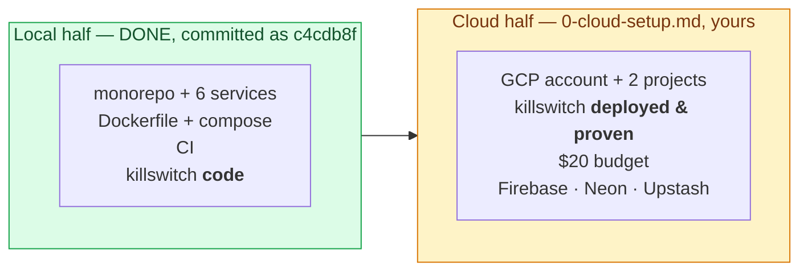
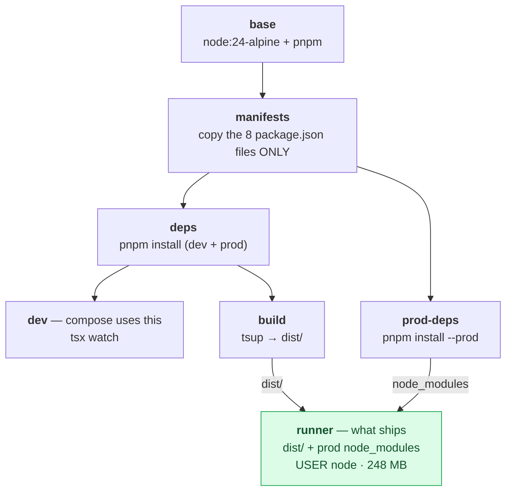
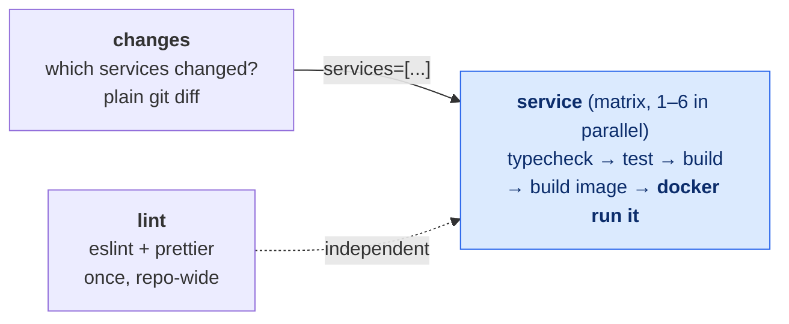

# Phase 0 — repo tour

What every file in this repo is for, in the order the pieces depend on each
other. Written to be read *before* you work through
[`0-cloud-setup.md`](0-cloud-setup.md).

Links are clickable in the editor; `#L44` jumps to a line.

---

## The end goal, in one line

**Phase 0 ends when `docker compose up` brings the whole system up locally, and a
tested billing kill-switch stands between you and a runaway cloud bill.**

Nothing in phase 0 does anything a user would want. Every line of it exists so
that phases 1–10 have a place to land: a repo that builds six things the same
way, a local environment that matches production closely enough to be worth
trusting, and a cloud account that can't quietly bankrupt you.

## Which half you're standing in

The local half was verified end-to-end — the evidence table is in
[`0-review.md`](0-review.md#L29). The cloud half creates **zero repo changes**
except filling in a gitignored `.env`. You are not going to be editing code
during `0-cloud-setup.md`; the only file you'll even open is
[`infra/killswitch/index.js`](../../infra/killswitch/index.js), and only to read it.

The three phase-0 docs, so you know which is which:

| Doc | Step of the loop | What it is |
|---|---|---|
| [`0-prebrief.md`](0-prebrief.md) | 1 — decide | The five decisions (D1–D5) taken before any code existed, each with the reasoning |
| [`0-review.md`](0-review.md) | 3 — review | What got built, what was verified, two real bugs hit along the way, and 8 questions with answers |
| [`0-cloud-setup.md`](0-cloud-setup.md) | 2 — build (your half) | The tutorial you're about to work through |

---

## The tour

### Layer 0 — the repo is a monorepo

**[monorepo]** one git repository holding several independently-built packages.
**[workspace]** pnpm's word for one of those packages; each has its own
`package.json` and can depend on its siblings by name.

| File | What it does |
|---|---|
| [`pnpm-workspace.yaml`](../../pnpm-workspace.yaml) | Declares which directories are workspaces (`services/*`, `packages/*`), plus the **catalog** and one build exception. Look closer below. |
| [`package.json`](../../package.json) | The root package. Not a deployable — it holds the repo-wide scripts (`pnpm test` → `pnpm -r test`, run in **every** workspace) and the dev tools shared by all of them. |
| [`pnpm-lock.yaml`](../../pnpm-lock.yaml) | 93 KB of machine-written exact versions for every package and its transitive dependencies. You never edit it. Its job is that `pnpm install` on your laptop, in CI, and inside Docker all produce byte-identical trees. |
| [`.npmrc`](../../.npmrc) | Two pnpm settings. `auto-install-peers=true` installs peer dependencies rather than warning about them. |
| [`tsconfig.base.json`](../../tsconfig.base.json) | The TypeScript compiler settings every package extends. `strict` plus `noUncheckedIndexedAccess` (indexing an array gives you `T \| undefined`, because `arr[5]` on a 3-element array really is undefined). |
| [`eslint.config.js`](../../eslint.config.js) | Lint rules. Note [the `infra/**/*.js` block](../../eslint.config.js#L9) — the kill-switch is plain JS that never goes through TypeScript, so `process`/`console`/`Buffer` have to be declared as globals or lint reports them undefined. |
| [`.prettierrc.json`](../../.prettierrc.json) / [`.prettierignore`](../../.prettierignore) | Formatting. `DESIGN.md` is excluded — Prettier reflows markdown tables and mermaid blocks in ways that make diffs unreadable. |
| [`.gitignore`](../../.gitignore) | Keeps `node_modules/`, `dist/` and **`.env`** out of git. That third one is the one that matters: `.env` is where your Neon and Upstash credentials will live. |
| [`.dockerignore`](../../.dockerignore) | Keeps the same things out of the **build context** — the tarball of your working directory that Docker uploads to the daemon before building. Without it you'd ship `node_modules` and `.env` into the build. |
| [`.env.example`](../../.env.example) | The template you copy to `.env`. Every key is documented with which phase starts needing it. Commented-out lines are phase-6 things you'll collect during cloud setup. |
| [`README.md`](../../README.md) | Four lines, pointing at DESIGN.md. Phase 6 turns this into the real one with the load number and demo GIF. |
| [`DESIGN.md`](../../DESIGN.md) | 61 KB. The architecture and the reasoning. Everything else in the repo cites it by section — `§3` is the six-deployable split, `§5` the per-service specs, `§6` cross-cutting concerns, `§7` deployment and cost. |

**Look closer — [the catalog](../../pnpm-workspace.yaml#L15).** Seven
`package.json` files declare `"fastify": "catalog:"` instead of a version
number, and the single real version lives in `pnpm-workspace.yaml`.

- *Scenario:* you bump Fastify in `services/gateway` and forget the other four.
- *Failure:* Gateway is on 5.7, Collab is on 5.6, and
  `packages/shared/src/service.ts` — which is compiled into **both** — is
  type-checked against whichever version pnpm happened to hoist. It compiles.
  It breaks at runtime in one service.
- *Fix:* one version per dependency, declared once.

**Look closer — [`allowBuilds: esbuild`](../../pnpm-workspace.yaml#L9).** pnpm
refuses to run dependencies' install scripts by default. A `postinstall` script
runs arbitrary code on your machine and in CI, with your credentials, before any
of your own code executes — the classic supply-chain attack. esbuild is the one
exception here because its postinstall is what downloads the platform-native
binary; without it `tsup` and `vitest` are both dead. The cost is real and named
in [`0-review.md`](0-review.md#L206): an esbuild compromise now reaches you.

---

### Layer 1 — `packages/shared`, the code every service is built from

| File | What it does |
|---|---|
| [`src/services.ts`](../../packages/shared/src/services.ts) | 18 lines, and the source of truth for "what are the six deployables". A frozen object of names → local ports. `stats: { port: null }` is the interesting entry — it has no port because it isn't a server. |
| [`src/service.ts`](../../packages/shared/src/service.ts) | `createService()`. The four things DESIGN.md §6 requires of every HTTP service, implemented once so no service can skip one. Deep-dived below. |
| [`src/logger.ts`](../../packages/shared/src/logger.ts) | `createJobLogger()`. The same log *shape* for Stats, which has no Fastify instance to get a logger from. |
| [`package.json`](../../packages/shared/package.json) | Three **subpath exports** and deliberately no barrel. This is load-bearing — see the bundling deep-dive. |
| [`tsconfig.json`](../../packages/shared/tsconfig.json) | Four lines: extend the base, compile `src`. Identical in all seven packages. |

**Look closer — [`createService()`](../../packages/shared/src/service.ts#L45).**
It fixes four things:

1. **Structured logs** — JSON lines carrying `service` and `request_id`, with
   `messageKey: 'message'` and level renamed to `severity`, because Cloud
   Logging reads those keys and ignores pino's defaults.
2. **Request-id propagation** — [`genReqId`](../../packages/shared/src/service.ts#L53)
   reuses an inbound `x-request-id` and mints a UUID only when there isn't one,
   and an [`onSend` hook](../../packages/shared/src/service.ts#L66) echoes it
   back. That one header is what turns six separate log streams into one
   traceable request path once a call goes Gateway → Matching → Users.
3. **Split health endpoints** — `/health/live` and `/health/ready`.
4. **Graceful shutdown** — SIGTERM stops accepting new connections and lets
   in-flight requests finish.

Two details in there are the kind of thing a reviewer picks at:

- **The SIGTERM handlers are registered inside `start()`**, not next to the rest
  of the setup ([line 93](../../packages/shared/src/service.ts#L93)).
  `process.once(...)` is process-global, not app-local. The test file builds two
  apps in one process; registering at construction would leave two listeners
  behind, and a suite that built eleven would trip Node's max-listeners warning.
  `start()` happens once per process, so the handler's lifetime matches.
- **Liveness vs readiness return the same thing today**, and that's temporary.
  Liveness answers "is this process wedged — restart it"; readiness answers "may
  traffic be routed here yet". Phase 1 gives Users a Postgres pool and Gateway a
  JWKS cache, and in the seconds after boot the process is alive but cannot
  serve a request that needs either. Collapse the two and the orchestrator
  either routes traffic into a service that 500s, or never restarts a process
  that has permanently hung.

---

### Layer 2 — `services/*`, the six deployables

Five of them are byte-identical apart from the name. This is intentional: all
the substance is in `packages/shared`, so a service file is just a declaration
of which service this is.

| File (× gateway, users, questions, matching, collab) | What it does |
|---|---|
| [`src/index.ts`](../../services/gateway/src/index.ts) | 8 lines. Call `createService`, add a `/` route, `await start()`. Phase 1+ fills these in. |
| [`src/health.test.ts`](../../services/gateway/src/health.test.ts) | Two vitest tests: the two health endpoints answer separately, and an inbound `x-request-id` is propagated rather than replaced. They use `app.inject()` — Fastify's in-process request simulator, so no port is bound and the tests can't collide. |
| [`tsup.config.ts`](../../services/gateway/tsup.config.ts) | Bundler config. [`noExternal`](../../services/gateway/tsup.config.ts#L16) is the load-bearing line — deep-dive below. |
| [`package.json`](../../services/gateway/package.json) | Scripts (`dev` = tsx watch, `build` = tsup, `start` = node dist), and `"@deepcs/shared": "workspace:*"` — resolve that name from this repo, never npm. |
| `tsconfig.json` | Extend base, compile `src`. |

Ports, from [`services.ts`](../../packages/shared/src/services.ts#L9):
gateway 8080 · users 8081 · questions 8082 · matching 8083 · collab 8084.

**The sixth is different.** [`services/stats/src/index.ts`](../../services/stats/src/index.ts)
has no `listen()` and never will, and it's the one service file worth reading in
full. It's a **job**: Cloud Scheduler starts it every 5 minutes, it drains the
event log, it exits. The reason it can't be a server is on
[line 8](../../services/stats/src/index.ts#L8) — a scaled-to-zero Cloud Run
*service* has no running process for a timer to fire inside. So the trigger has
to come from outside, and the **exit code is the entire contract**: 0 means the
run succeeded, anything else marks it failed and retryable.

That's also why Stats has no `health.test.ts` and why its `test` script carries
`--passWithNoTests` — vitest exits 1 on an empty suite otherwise, and a red CI
job for "this package correctly has no tests yet" trains you to ignore red.

---

### Layer 3 — containers

| File | What it does |
|---|---|
| [`Dockerfile`](../../Dockerfile) | One file, seven stages, six images. `--build-arg SERVICE=questions` selects which. Deep-dived below. |
| [`docker-compose.yml`](../../docker-compose.yml) | The local environment: 5 services + the Stats job + Postgres + Redis + Firebase Auth emulator = 9 containers. |
| [`docker/firebase-emulator/Dockerfile`](../../docker/firebase-emulator/Dockerfile) | Google publishes no official emulator image, so this builds one: Node + a JRE (the Auth emulator is a Java jar wrapped by the Node CLI) + `firebase-tools`. |
| [`docker/firebase-emulator/firebase.json`](../../docker/firebase-emulator/firebase.json) | Emulator config: Auth on 9099, UI on 4000, both bound to `0.0.0.0`. |

**If Docker itself is the unfamiliar part**, not just this repo's use of it,
[`reading-docker.md`](../reading-docker.md) is the primer: image vs container, the
nine instructions this repo uses, the layer cache, Compose, and a line-by-line
walk of both files. The rest of this section assumes the vocabulary.

**Look closer — [the seven stages](../../Dockerfile#L11).** A **multi-stage
build** is several `FROM` blocks in one file; later stages copy selected files
out of earlier ones, and anything not copied never reaches the final image.

The [`manifests` stage](../../Dockerfile#L32) copies eight `package.json` files
**by name** instead of `COPY . .`, and that's the single highest-value line in
the file.

- *Scenario:* you edit one `.ts` file and rebuild.
- *Failure with `COPY . .`:* Docker invalidates a cached layer when any file it
  copied has changed. The copy layer changed, so the `pnpm install` layer
  beneath it is invalid too — you reinstall 234 packages to fix a typo. This is
  the most common reason Node images rebuild slowly.
- *Fix:* copy only the files the install actually reads. Now the install layer
  is keyed on dependency changes alone.
- *Cost, accepted knowingly:* a seventh service means editing this file, and
  forgetting means a "module not found" for that one service.

The [`runner` stage](../../Dockerfile#L72) starts from a clean `node:24-alpine`
rather than continuing from `build`, so none of pnpm, tsup, TypeScript, or the
dev dependency tree exists in the shipped image. `USER node` drops root — a
container process running as root that gets compromised has root on the
container filesystem.

**Look closer — [`docker-compose.yml`](../../docker-compose.yml).** Three things
to notice:

- **[The `x-service` anchor](../../docker-compose.yml#L13)** — YAML's copy-paste
  mechanism (`&service` defines, `<<: *service` merges in). Shared env vars and
  `depends_on` live there. `build` and `volumes` are deliberately *not* in it,
  because every service overrides both anyway and inheriting-then-overriding
  reads as if it were shared when it isn't.
- **[`depends_on: condition: service_healthy`](../../docker-compose.yml#L21)** —
  this is what makes `depends_on` mean *ready* rather than merely *started*.
  Without the health condition, the five services boot before Postgres accepts
  connections and crash-loop.
- **[The bind mounts](../../docker-compose.yml#L90)** — only `src/` directories,
  read-only, never the repo root. **[bind mount]** the host directory is
  mapped into the container, so a save on your laptop is instantly visible
  inside and `tsx watch` restarts (measured: 2 s). Mounting `.` to `/app`
  instead would *replace* `/app` — including `/app/node_modules`, which was
  installed inside the image for the container's platform and contains pnpm
  symlinks pointing at paths that only exist inside the container. The
  dependency tree vanishes; the container dies on its first import.

---

### Layer 4 — CI

[`.github/workflows/ci.yml`](../../.github/workflows/ci.yml) has three jobs:

- **[`changes`](../../.github/workflows/ci.yml#L21)** — computes the changed
  file list with plain `git diff` and emits a JSON array of service names.
  Touching anything shared (`packages/`, `Dockerfile`, the lockfile, root
  configs) rebuilds all six, because those are compiled into every image.
- **[`lint`](../../.github/workflows/ci.yml#L78)** — repo-wide checks belong in
  one job, not repeated six times in the matrix.
- **[`service`](../../.github/workflows/ci.yml#L92)** — a **matrix** job: one
  parallel copy per changed service, `fail-fast: false` so one failure doesn't
  cancel the others' results.

**Look closer — [the smoke test](../../.github/workflows/ci.yml#L139), the step
that looks redundant.** It builds the real `runner` image and `docker run`s it,
then curls `/health/ready`. Typecheck and test already passed at that point — so
why?

Because during phase 0 exactly that scenario happened, and it's written up in
[`0-review.md`](0-review.md#L51): `pnpm build` exited 0 and produced a bundle
that died at import with `Dynamic require of "os" is not supported`. `tsup`
exits 0 on a broken bundle, and `pnpm test` runs from source and never touches
`dist/`. **A green build is not a working artifact.** The only check that would
have caught it is running the thing you actually ship — which is now this step.

Stats is smoke-tested differently ([line 142](../../.github/workflows/ci.yml#L142)):
it's a job, so success is `docker run` exiting 0, not a port answering.

The deploy step is [deliberately absent](../../.github/workflows/ci.yml#L156)
until there's a GCP project with a tested billing guard in front of it. That's
what you're about to build.

---

### Layer 5 — `infra/`, and this is the one you're about to use

| File | What it does |
|---|---|
| [`infra/killswitch/index.js`](../../infra/killswitch/index.js) | ~50 lines of plain JS. Detaches the billing account from the project when spend passes the budget. |
| [`infra/killswitch/package.json`](../../infra/killswitch/package.json) | Its own two dependencies. **Deliberately outside the pnpm workspace** — Cloud Functions installs from this file at deploy time, and nothing else in the repo imports it. |

This is why `--source=.` in the deploy command works: you `cd` into that
directory and Cloud Build reads *that* `package.json`, not the monorepo's.

Read the code alongside the diagram in
[`0-cloud-setup.md` Part 4](0-cloud-setup.md#L264). Four things in it:

1. **[It refuses to start without `TARGET_PROJECT_ID`](../../infra/killswitch/index.js#L30)** —
   a kill-switch that guesses which project to disable is worse than one that
   fails to deploy. This is the flag you pass as `--set-env-vars`, and the one
   mistake in the whole guide with no undo is pointing it at the wrong project.
2. **[It no-ops when `cost <= limit`](../../infra/killswitch/index.js#L57)** —
   your budget fires at 50%, 90% and 100%, so most invocations are
   informational and must do nothing.
3. **[It's idempotent](../../infra/killswitch/index.js#L65)** — it reads the
   current billing info first and returns early if already detached. Pub/Sub
   delivers *at-least-once*, meaning the same message can legitimately arrive
   twice, so "detach an already-detached project" has to be a harmless no-op.
4. **[The detach itself](../../infra/killswitch/index.js#L74)** is a `PUT` with
   `billingAccountName: ''`.

**The failure this code cannot protect you from** — and the reason
`0-cloud-setup.md` spends a whole section on it. The thing being changed is the
*link between the project and the billing account*, and that link is owned by
the billing-account side.

- *Scenario:* you grant `roles/billing.admin` on the **project** instead of on
  the **billing account**.
- *Failure:* the trigger fires, the code runs, `cost > limit` is true, the PUT
  is rejected — and you find out during the incident it was built for. The
  guide's [step 5.2](0-cloud-setup.md#L356) is the grant; [step 5.5](0-cloud-setup.md#L444)
  on a throwaway project is what proves it took.
- *Fix:* the binding goes on the billing account, and you verify with
  `billingEnabled: false` on a project you don't care about.

---

## What cloud setup actually changes in this repo

| | |
|---|---|
| Files you edit | **`.env`** (gitignored, doesn't exist yet — copy `.env.example`) |
| Files you read | `infra/killswitch/index.js` |
| Files you upload | `infra/killswitch/*` → Cloud Build, via `gcloud functions deploy` |
| Everything else | untouched |

The values you'll collect and paste into `.env`: `DATABASE_URL` (Neon, pooled —
hostname must contain `-pooler`), `REDIS_URL` (Upstash, `rediss://`),
`GCP_PROJECT_ID`, and the Firebase web config. Keys are already named in
[`.env.example`](../../.env.example).

---

## One thing I found while writing this — and fixed

**Status: fixed in the same commit that added this file. Nothing to do; this is
here because the bug is worth understanding.**

The `changes` job used to fail the whole CI run on any commit that touched no
service — a docs-only change, or a tweak to `README.md` / `eslint.config.js` /
`.prettierrc.json`.

`grep` exits 1 when it matches nothing, which is exactly what a docs-only commit
looks like. Under `set -euo pipefail` that status propagates through the pipe and
out of the command substitution, so the assignment itself fails and `set -e`
kills the step — before the empty-list guard on
[line 79](../../.github/workflows/ci.yml#L79) and the `count` output on
[line 82](../../.github/workflows/ci.yml#L82), which exist precisely for this
case, can ever be reached. Reproduced locally: the step exits 1 with no output,
`changes` goes red, `service` is skipped, the run is red.

The fix is on [line 75](../../.github/workflows/ci.yml#L75) —
`{ grep -oE '^services/[^/]+' || true; }`. Two details in it are deliberate:

- **The braces scope `|| true` to `grep` alone.** Appending it to the whole
  pipeline would also swallow a genuine `cut` or `jq` failure and hand the build
  matrix a silently empty list — a worse bug, because it looks like success.
- **`set -o pipefail` is what makes this necessary at all.** Without it, only the
  last command's status would count and `grep`'s 1 would be invisible. The
  option is correct to keep; the explicit `|| true` is how you say "this
  particular non-match is expected".

**The general lesson**, which will come up again in phase 6's deploy scripts: under
`set -euo pipefail`, a command whose "nothing found" case is *normal* needs that
case handled explicitly, or your error handling becomes unreachable code.

---

## Suggested reading order

If you read three files before starting cloud setup, read these:

1. [`packages/shared/src/service.ts`](../../packages/shared/src/service.ts) —
   every service is this file plus 8 lines.
2. [`Dockerfile`](../../Dockerfile) — how those 8 lines become something Cloud
   Run can start, which is phase 6's whole job.
3. [`infra/killswitch/index.js`](../../infra/killswitch/index.js) — the thing
   you're about to deploy.

Then [`0-review.md`](0-review.md#L111)'s eight questions. Answer them before
reading the answers; the gap is the signal.
