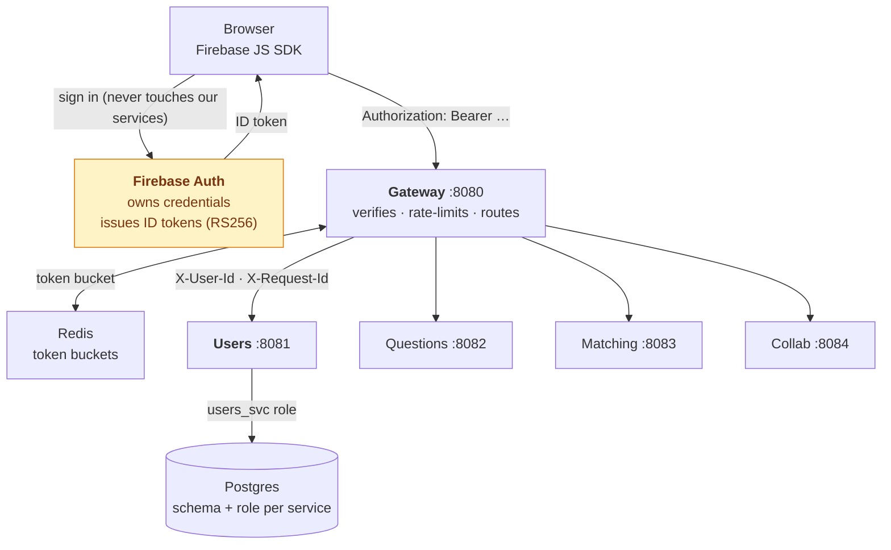
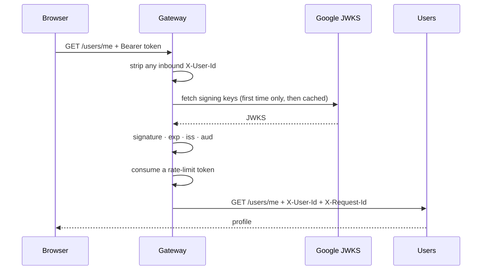
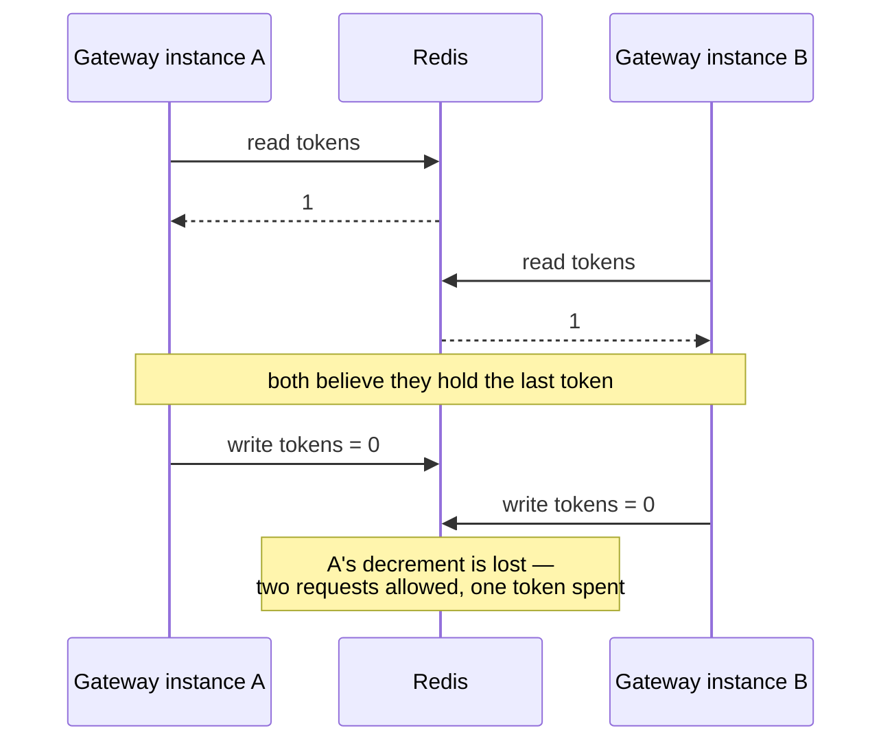
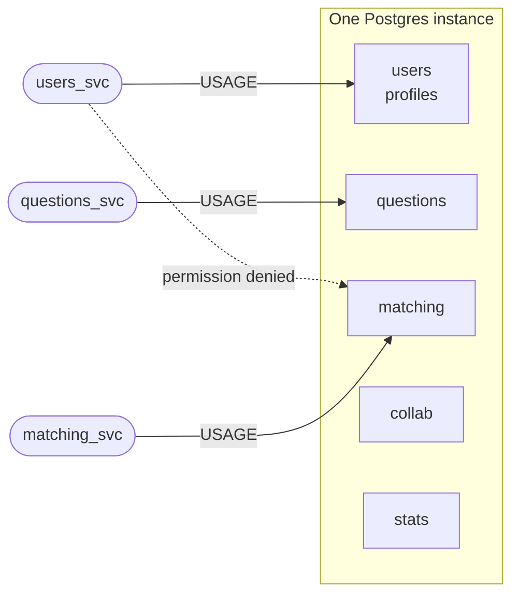

# Phase 1 — Auth, the Gateway, and the schema boundary

**What this phase proves** (DESIGN.md §10):

- an emulator token → a protected call succeeds
- a tampered or expired token → 401
- the `users` row appears **once**, no matter how many times the client calls
- a service querying another's schema is **rejected by Postgres**

**Time:** the code is written. This document is why it looks the way it does,
and how to demonstrate each of those four claims.

---

# Part 1 — The map



Three things are true about that diagram and each is load-bearing:

**Login does not traverse the Gateway.** The browser talks to Firebase directly,
so no service here ever sees a password (ADR-04). The consequence, stated in the
ADR rather than hidden: the Gateway's rate limiter does not protect the login
endpoint — Google's abuse controls do instead.

**Authentication happens once**, at the Gateway (§6). Downstream services never
re-verify; they read `X-User-Id` and trust it.

**Authorization cannot happen at the Gateway**, which has no domain data. It
lives with whoever owns the record. Nothing in phase 1 needs it yet; Matching and
Collab will.

---

# Part 2 — Verifying a token

## Why `jose` and not the Firebase Admin SDK

Verification needs only Google's **public** keys. Using the Admin SDK would mean
this service holding a service-account credential, and therefore holding the
ability to **mint and revoke** tokens. It does not need that ability, so it does
not get it: the blast radius of a compromised Gateway is "can read traffic", not
"can issue identities".

## What is actually checked



**`aud` is the line that matters most.** Google signs every Firebase project's
tokens with the *same* key set. A validly-signed token issued for someone
*else's* project therefore passes signature, `exp`, and an `iss`-shaped check.
Without an audience check the Gateway would accept it and hand the request a
stranger's UID. This is the classic mistake in Firebase verification and it is
tested explicitly.

**JWKS caching is one function call.** `createRemoteJWKSet` fetches on first use,
honours the response's `Cache-Control`, and re-fetches when a token arrives with
a `kid` it has not seen — which is what turns Google's roughly-daily key rotation
into a non-event. It is constructed once at module scope; per-request would add a
network round trip to Google on the hot path of every request.

## The three cases, and the one people miss

| Request | Result |
|---|---|
| No `Authorization` header | **Anonymous.** Valid — the question bank and `/stats` are public (§2). Falls back to per-IP rate limiting. |
| A malformed or expired token | **401.** Presenting something broken is an attempt to authenticate, and a failed one. |
| A valid token | `X-User-Id` injected from `sub`. |

The middle row is the one that gets skipped. "No token" and "bad token" are
different states and collapsing them either locks anonymous users out of public
routes or lets broken tokens through.

## The header-forgery line

```ts
delete req.headers[USER_ID_HEADER];
```

Without that one line the entire scheme is decorative. A client could send
`X-User-Id: <someone else>` and — since downstream services trust the header *by
design* — be that person. Deleting it unconditionally, before any other work,
means the only way the header exists downstream is because the Gateway put it
there.

That guarantee has **two** halves and both are required. The other is Cloud Run's
internal ingress (phase 6), which makes the four downstream services unreachable
from the public internet. Either half alone leaves the header forgeable.

## The emulator, and the guard around it

The Auth emulator issues **unsigned** tokens — `"alg": "none"`, empty signature.
There is nothing to verify, so `jwtVerify` would reject them outright and local
development would be impossible.

Emulator mode therefore skips the signature and checks **everything else**:
`iss`, `aud`, `exp`, and the presence of `sub`. Keeping those checks on the local
path is what stops a bug in the claim logic hiding until deploy day.

Because that path accepts tokens anyone can forge in a text editor, DESIGN.md §7
requires it be **impossible in production**. Impossible is enforced by refusing
to boot:

```
FIREBASE_AUTH_EMULATOR_HOST is set with NODE_ENV=production.
The emulator issues unsigned tokens; accepting them in production means
accepting forged identities. Refusing to start.
```

A crash on boot is loud. A Gateway that started with signature checking disabled
would look completely healthy while accepting anything.

**One consequence worth stating plainly:** in emulator mode, tampering with the
*signature* is undetectable, because there is no signature. Only payload and
claim tampering are caught locally. Signature verification is exercised in
production and by the `aud`/`iss`/`exp` tests, not by the local path.

---

# Part 3 — The rate limiter

This is why the Gateway is built rather than bought (ADR-08). Kong DB-less would
do routing, JWT verification, CORS and rate limiting in fifteen lines of config —
and would solve the one race in this system that a product would otherwise solve
*on your behalf*.

## The bug it prevents

Two Gateway instances, one user's bucket, one token left in it:



Note what that does **not** require: no threads, no shared memory. Two ordinary
processes on two different machines are enough.

Which is also why an in-process mutex is not a fix — it would guard one
instance's own memory, at an address the other instance cannot reach and has
never heard of. **Atomicity has to live where the single copy of the state
lives**, and that is Redis.

## Why a Lua script and not `INCR`

A fixed-window counter needs only `INCR`, which is already atomic — that is how
Kong's plugin does it. A **token bucket** reads two values (tokens remaining,
last refill time), computes a refill from elapsed time, and writes both back.
That is multi-step, so atomicity has to be wrapped around it. Redis runs a script
start-to-finish with nothing interleaved.

The bucket is worth the extra work because it permits bursts, which a fixed
window either forbids or lets through at the boundary.

## Details that are easy to get wrong

**The clock comes from Redis, not the caller.** `redis.call('TIME')` inside the
script. Two Gateway instances have two clocks that disagree by an unknown amount;
taking the timestamp from the single place the state lives removes skew from the
refill maths entirely.

**Buckets expire.** `EXPIRE capacity/refill + 1`. Per-IP buckets are an unbounded
key space, and Upstash caps both storage and commands per month (§7).

**The limiter fails open.** A Redis outage logs an error and allows the request.
Failing closed would turn a cache outage into a total outage. This is a
deliberate availability-over-enforcement choice, defensible only because the
thing being protected is request volume rather than money or data — `--max-instances`
still caps what the traffic can cost.

**Buckets:** per-IP 60 tokens refilling at 1/s; per-user 120 at 2/s. Per-user is
larger because an IP can be an entire university NAT while a user is one person.

---

# Part 4 — Users, and why the upsert is written that way

```sql
INSERT INTO users.profiles (firebase_uid)
VALUES ($1)
ON CONFLICT (firebase_uid) DO NOTHING
RETURNING id, firebase_uid, display_name, preferred_topics, created_at
```

**`RETURNING` is load-bearing.** `ON CONFLICT … DO NOTHING` returns **no row**
when the UID already existed. An empty result is therefore the signal that this
was a genuine first sight of the UID — and since there is no signup endpoint
(§5), it is the **only** place `user.signed_up` can be emitted from in phase 7.

Get it wrong and the event fires on every request, and the sign-up count in
`/stats` becomes a request count.

**Why not `DO UPDATE SET firebase_uid = EXCLUDED.firebase_uid`?** It returns a
row every time, which destroys the signal — and it takes a row lock on every
sign-in for no reason.

**Why the ordering is pinned to this call.** Matching validates a UID against
Users, so a user going straight from sign-in to the queue would be rejected for
having no row yet. The client calls `GET /users/me` immediately after sign-in,
and that is what guarantees the row exists before anything else asks about it.

---

# Part 5 — The schema boundary

ADR-09: one Postgres instance, one schema per service, **one role per service**,
each granted privileges only on its own schema — so a cross-service read is
rejected by the database, not discouraged by convention.



**`USAGE` on the schema is the gate.** Without it every reference to a table
inside that schema fails with `permission denied for schema`, regardless of any
table-level grant. That single missing grant is the whole boundary.

**`ALTER DEFAULT PRIVILEGES` matters as much as the grants.** It covers tables
created by *later* migrations. Without it every future migration would have to
remember to re-grant, and the one that forgets produces a service that starts
fine and fails on its first query.

**Why this is phase 1 and not later.** DESIGN.md §10 answers it: *"a boundary
that isn't enforced from the first table will be violated by the third, and
retrofitting grants means untangling queries that already cross."*

**No foreign key crosses a schema.** Other services store `firebase_uid` as a
plain column and validate it by calling `GET /users/:uid/exists`. That is the
concrete thing given up, and it is deliberate — a cross-schema FK would re-couple
the services through the database.

---

# Part 6 — Demonstrating the four claims

```bash
docker compose up -d --build
```

Migrations run first (the `migrate` service) and every other service waits on
`service_completed_successfully`, so nothing races a half-migrated database.

## Get a token from the emulator

```bash
curl -s -X POST "http://localhost:9099/identitytoolkit.googleapis.com/v1/accounts:signUp?key=fake-api-key" \
  -H 'Content-Type: application/json' \
  -d '{"email":"you@example.com","password":"password123","returnSecureToken":true}'
```

Save the `idToken` from the response as `$TOKEN`.

## Claim 1 — a valid token reaches a protected route

```bash
curl -i -H "Authorization: Bearer $TOKEN" http://localhost:8080/users/me
```
**201** the first time with a profile body; **200** and the same `id` thereafter.

## Claim 2 — broken tokens are refused

```bash
# no token at all
curl -i http://localhost:8080/users/me                          # 401

# forged X-User-Id with no token — the header is stripped
curl -i -H "X-User-Id: victim" http://localhost:8080/users/me   # 401
```

Both 401. The second is the one worth pausing on: it is the difference between
an authentication system and a suggestion.

## Claim 3 — the row appears once

```bash
for i in $(seq 1 5); do
  curl -s -o /dev/null -w "%{http_code} " -H "Authorization: Bearer $TOKEN" \
    http://localhost:8080/users/me
done
```
`201 200 200 200 200`. One creation, four reads.

## Claim 4 — Postgres rejects a cross-schema read

```bash
docker compose exec postgres psql -U users_svc -d deepcs \
  -c "SELECT count(*) FROM users.profiles;"      # works

docker compose exec postgres psql -U users_svc -d deepcs \
  -c "SELECT 1 FROM matching.sessions;"          # ERROR: permission denied for schema matching
```

## Bonus — watch the bucket empty

```bash
for i in $(seq 1 70); do
  curl -s -o /dev/null -w "%{http_code} " http://localhost:8080/questions/
done
```
Sixty responses, then `429`s. `x-ratelimit-remaining` and `retry-after` are on
every reply.

---

# Part 7 — What phase 1 does *not* do

Stated so a green demo does not imply more than it covers.

- **Internal ingress and invoker IAM** are listed in §10's phase 1 row but are
  Cloud Run settings, and nothing is deployed until phase 6. They land there.
  Until then, the "downstream services are unreachable directly" half of the
  header-forgery guarantee is **not** in force — locally, ports 8081–8084 are
  open on your machine.
- **`user.signed_up` is a log line**, not an event. Phase 7 puts it behind the
  `EventLog` interface. It is logged now so the once-per-user property is
  observable before there is a consumer to prove it.
- **No per-user rate limit on `/match/*`** — §6 asks for a tighter bucket there.
  Phase 3, when the routes exist.
- **Signature verification is not exercised locally.** The emulator issues
  unsigned tokens; the signature path runs only against real Firebase.
- **`GET /users/me` does not accept a profile update yet.** `display_name` and
  `preferred_topics` are columns with no write path until the frontend needs one.
