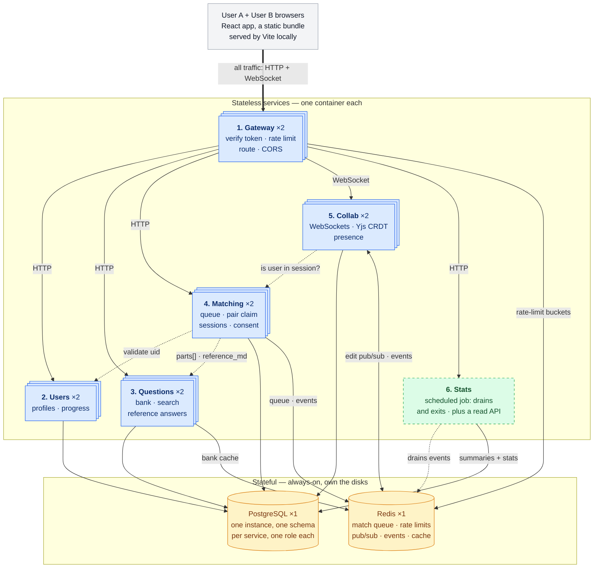

# How the system works

DeepCS is a CS-fundamentals question bank with real-time collaborative solving:
read a lesson alone, or get matched with someone and work through its questions
together in a shared editor.

This page is the whole system in one place — the six services, what each owns,
how a request travels through them, and how it is run and tested. Each part then
has a page of its own in this folder, which is where the failure modes, the
measured numbers and the code pointers live:

[Gateway](01-gateway.md) ·
[Users](02-users.md) ·
[Questions](03-questions.md) ·
[Matching](04-matching.md) ·
[Collab](05-collab.md) ·
[Events and Stats](06-events-and-stats.md) ·
[Frontend](07-frontend.md) ·
[Data](08-data.md) ·
[Running it](09-running-it.md) ·
[The workspace](10-the-workspace.md)

The decisions behind the shape are in [`../adr/`](../adr/), one file each. It
runs under `docker compose` and on a local Kubernetes cluster; nothing is
deployed, and [ADR-05](../adr/05-kubernetes-locally-no-deployment.md) says why.

One rule decides what is built and what is bought: **build what has a
concurrency or distributed-systems problem inside it, buy what is risk without
insight.** That is why identity is Firebase's job and the gateway is
hand-written — opposite answers from the same test.

---

## 1. The product

1. Arrive at a roadmap of ten topics, laid out in a recommended reading order.
   No account needed.
2. Open a topic, pick one of its three lessons, and read it. The questions it
   prepares you for are at the end, in the Key summary.
3. Sign in, or create an account with a display name.
4. Tick off what you have finished, which fills a bar per topic and a ring over
   the map. Nothing checks the claim; it is what you said about yourself.
5. Optionally join the queue with a topic and difficulty, usually straight from
   the lesson you just read.
6. Get matched with another waiting user, whose display name the room shows.
7. Land in a shared document seeded from the question's parts.
8. Co-write the answer in real time, with presence and remote cursors.
9. Reveal the reference answer, once you both agree.
10. End the session and see a short summary.

The roadmap is the front door rather than the question bank, because a list of
questions you cannot answer yet is not somewhere to start learning. The bank
still exists and matching still searches it.

Editing is symmetric: both people type into the same document at the same time
with equal rights, which is the concurrent-edit situation a CRDT exists to
resolve — so the CRDT is genuinely load-bearing rather than decorative.

**Not in scope:** AI features, mobile, polished UI, payments, social features,
interviewer and interviewee roles, voice or video, scoring, question authoring.

---

## 2. Six deployables

**Reading the diagram:** stacked blue boxes run two replicas each on the cluster
and one each under compose, which is the difference that lets a rolling update
be lossless (§6). The dashed green Stats job has no instance parked between
runs; its read API is an ordinary service. Solid arrows are the request path;
**dotted arrows are service-to-service calls**, which exist because no service
may read another's tables. The amber cylinders are the only always-on machines.

Every browser request, HTTP or WebSocket, enters through the Gateway. No other
service is reachable from outside, and the browser never talks to Postgres or
Redis.

| # | Service | Owns | Why it is its own deployable |
|---|---|---|---|
| 1 | **Gateway** | nothing | **Position.** A cross-cutting enforcement point has to sit *in front of* what it protects. This would be true even if its scaling profile matched everything else exactly. |
| 2 | **Users** | profile rows keyed by `firebase_uid`, the display name shown to a partner, and what each reader has ticked or starred | One capability, one owner. Both are state about a *person*, so they live here rather than beside the questions they point at. |
| 3 | **Questions** | the bank, tags, lessons, `reference_md` | Read-heavy and cacheable in a way nothing else is, and the only service holding answer keys, so a narrower blast radius is worth something. |
| 4 | **Matching** | queue state, the pair claim, session rows, consent | A concurrency problem of its own: two users joining at the same instant race for the same partner, so the claim has to be atomic. |
| 5 | **Collab** | live Yjs documents, snapshots | **Different scaling trigger and different failure mode.** One WebSocket occupies a concurrency slot for the length of a session, so it needs the opposite settings from every other service, and those are per-service. |
| 6 | **Stats** | session summaries and public aggregates | **A job.** Its trigger is time, and a service that is not running between requests has no process for a timer to fire inside. Its read API is a second entrypoint on the same image. |

**Two of those six are not really "splits."** The Gateway is a *position* and
Stats is a *job plus the read surface for what the job wrote*. Judging either by
scaling profiles would be a category error. The other four are ordinary
services, one per capability.

*Why not group them?* By a strict scaling-forces test, Users, Questions and
Matching would merge — they share a request shape, a failure domain and a deploy
cadence. They are kept separate for independent deployability and one clear
owner per capability, and because operating a genuinely distributed system is
much of what this project exists to teach.
[ADR-01](../adr/01-one-service-per-capability.md) states the costs that buys and
the condition under which they would merge back.

*Why not a monolith?* Collab alone rules it out: one open WebSocket holds a
concurrency slot for the whole session, so bundling it with the question bank
means a hundred idle sockets starve a browse request, and the two scale on
incompatible signals with no way to configure both.

---

## 3. The stack

| Layer | Choice | Why, and why not the alternative |
|-------|--------|-----|
| All services | TypeScript + Fastify | One language across six deployables and the frontend, and shared types across service boundaries. *Not Express:* Fastify has schema validation and a real encapsulation model built in. *Not NestJS:* heavy structure earns its keep on a team. |
| Frontend | React + Vite + TS, with `react-router` and `marked` | Minimal, and the Yjs editor bindings are mature. *Not Next.js:* SSR buys nothing for an authenticated single-page editor. `marked` renders the seeded lesson markdown and needs no sanitizer, because that markdown is seeded by a migration and no route writes it. |
| Auth | Firebase Auth **[bought]** | Identity is a solved, security-critical problem with no design insight left in it. [ADR-04](../adr/04-managed-auth.md). |
| DB access | `pg` + hand-written parameterized SQL, numbered `.sql` migrations | No schema DSL on the critical path, and ADR-09's per-schema grants stay literal SQL. *Not Drizzle:* deferred, not rejected — [ADR-10](../adr/10-hand-written-sql-for-now.md). |
| Database | PostgreSQL, one instance, a schema per service | Relational data, plus `text[]` with a GIN index for tag filtering. *Not database-per-service:* [ADR-09](../adr/09-one-database-one-schema-per-service.md) — it would cost cross-service atomicity and force a saga. |
| Cache / queue / pub-sub | Redis | One dependency covering five jobs: match queue, rate-limit state, cross-instance pub/sub, event stream, question cache. Split from Postgres by **access pattern**, not by service. |
| Real-time | WebSockets + Yjs (CRDT) | Concurrent edits merge without a central server ordering them ([ADR-02](../adr/02-crdt-over-operational-transforms.md)). *Not SSE or polling:* one-directional, or too slow for keystroke echo. *Not Liveblocks:* it would host the hard part, and the hard part is the project. |
| Match notification | Polling `/match/status` | Bounded to somebody actually waiting, and to one minute ([ADR-11](../adr/11-polling-over-server-sent-events.md)). *Not SSE:* a held-open response pins a waiting user to one process, which a queue that empties every minute does not need. |
| Event log | Redis Streams | A replayable domain-event log behind one `EventLog` interface, so a second adapter is a swap rather than a rewrite ([ADR-07](../adr/07-a-replayable-event-log.md)). |
| Editor | CodeMirror wired to Yjs | The shared document is prose, so no highlighting, language services or autocomplete are wanted; what is needed is an editing surface and somewhere to draw the other person's caret. *Not Monaco:* a code editor rendering sentences, and 70% of the bundle. *Not a plain textarea:* it cannot show another person's caret at all. |
| Containers | Docker + docker compose | The unit everything ships as, and the reason the same image runs under compose and on the cluster without a rebuild. |
| Orchestration | Kubernetes on `kind`, locally | Rolling updates and self-healing are the two behaviours compose cannot show. *Not a hosted cluster:* it bills by the hour whether or not anyone visits. [ADR-05](../adr/05-kubernetes-locally-no-deployment.md). |
| CI | GitHub Actions | Lint, typecheck, test, build, then run the image and check `/health/ready` — **per service**. There is no deploy step. |

---

## 4. What each service does

Each of these has a page of its own; this is the shape, not the detail.

**[Gateway](01-gateway.md)** verifies the Firebase ID token against Google's
JWKS (signature, `exp`, `iss`, and `aud` — an unchecked `aud` would accept a
validly-signed token issued for a *different* Firebase project), strips any
inbound `X-User-Id` and sets its own, spends a token-bucket rate-limit token in
a Redis Lua script, and proxies eight prefixes to five services. It holds no
data, which is why authorization cannot live here.

**[Users](02-users.md)** owns the profile row. It contains no auth code at all:
sign-up, sign-in and token refresh happen client-side against Firebase. The row
is created lazily by `GET /users/me` after sign-in, and the `RETURNING` on that
`ON CONFLICT ... DO NOTHING` is what makes "first sight of this uid" detectable,
which is the only place `user.signed_up` can be emitted from.

It also owns what each reader has ticked off the roadmap and starred, and their
display name, because those are state about a person rather than about a
question. The name is set once at sign-up and has no write path: it goes in on
the insert, and `ON CONFLICT DO NOTHING` means a later call carrying a different
one does not write. The visible
consequence is that the roadmap screen fetches the map from Questions and the
marks from Users and joins them in the browser — a query spanning the two
schemas is refused by the database, not merely discouraged.

**[Questions](03-questions.md)** owns the bank, the lessons and the roadmap
layout. Cursor pagination rather than `OFFSET`, list results cached in Redis for
60 seconds, and `reference_md` never served to a browser by this service —
released only to Matching, over the internal network, after Matching has
verified consent ([ADR-06](../adr/06-answers-never-enter-the-shared-doc.md)).

**[Matching](04-matching.md)** runs pairing at the moment a user joins rather
than on a timer: read the Redis queue for that topic and difficulty, claim a
pair atomically in a Lua script, create the session row, publish to both people.
It validates across boundaries by API call, never by SQL, because the database
refuses the join. The claim (Redis) and the session row (Postgres) are not one
transaction, so `GET /match/status` answering `none` is the documented recovery.

**[Collab](05-collab.md)** holds one Yjs document per session in memory,
authorizes each socket by asking Matching whether that uid is a participant,
fans edits between instances over a Redis channel per session, and snapshots to
Postgres every 30 seconds, on the last disconnect, and before SIGTERM.

**[Stats](06-events-and-stats.md)** is one image run two ways: a scheduled job
that drains the event log into summaries and exits, and a read server behind
`GET /stats` and `GET /sessions/:id/summary`. Six moments append to the log;
delivery is at-least-once, so every write it makes is idempotent, and there is
no counter column anywhere.

---

## 5. What every service shares

### Authentication and authorization live in different places

- **Authentication** (*who are you*) happens **once, at the Gateway**.
  Downstream services never re-verify; they read `X-User-Id` and trust it.
- **Authorization** (*may you do this specific thing*) **cannot** be at the
  Gateway, which has no domain data. It lives with whoever owns the record:
  Collab asks whether a uid is a participant in a session, Matching enforces
  mutual consent before releasing a reference answer.
- **Not every route is authenticated.** The bank, the roadmap and `/stats` are
  public, so the Gateway verifies a token when one is present, rejects a broken
  one outright, and falls back to per-IP rate limiting when there is none. The
  consequence downstream is easy to get wrong: `X-User-Id` is *absent* on those
  requests, and absent has to be read as anonymous rather than as "trust
  whatever arrived" — the same header-forgery mistake reached from the other
  direction.

So auth is spread across three places and **there is no auth service**: Firebase
owns credentials and token issuance, the Gateway owns verification, Users owns
the profile row.

**The assumption the whole design rests on:** `X-User-Id` is trustworthy because
only the Gateway can set it. Under compose nothing else publishes a port a
browser can reach; on the cluster only the Gateway has an Ingress and everything
else is a ClusterIP Service. If any service ever gains public ingress, that
header becomes forgeable and it is an authentication bypass — so the ingress
setting is a security control, not a deployment detail.

Inside the network, service-to-service calls carry no credential of their own,
which is exactly why that boundary has to hold. The call graph is deliberately
narrow: Matching calls Users and Questions, Collab calls Matching, the Gateway
calls all of them, and nothing else calls anything.

**One tradeoff stated rather than hidden:** with plain token verification, a
revoked or deleted user's existing token stays valid until it expires, up to an
hour. Server-side revocation needs the Admin SDK and a round trip per request,
so it is not on the hot path. For a shared answer document that window is
acceptable; with money involved it would not be.

### The rest

- **Rate limiting:** a token bucket in a Redis Lua script. Per-IP for
  anonymous traffic (60, refilling at 1/s), per-user for authenticated (120 at
  2/s). Returns `X-RateLimit-*` and `Retry-After`.
- **Input validation:** zod on every endpoint, rejecting malformed input with
  400 before any business logic. Parameterized queries always.
- **Observability:** structured JSON logs through Pino, every line carrying
  `service` and `request_id`, with `X-Request-Id` propagated across service
  calls — which is what makes a six-service request path debuggable at all.
  `/health/live` and `/health/ready` on every service, as separate endpoints.
  Prometheus-format `/metrics` on Collab only, and gauges only: socket count,
  room count, memory. Request-rate, error-rate and latency histograms are not
  built, and neither is tracing.
- **Security:** CORS locked to one origin, helmet headers, credentials in a
  Kubernetes Secret rather than in an image or a manifest.
- **Graceful shutdown:** in-flight requests drain on SIGTERM, and Collab
  snapshots every room it holds before exiting.
- **Idempotency:** queue-join keyed by uid, session-end by session id, event
  consumption by natural key or by the log's entry id. With at-least-once
  delivery this is not optional — it is what converts "at-least-once" into
  "effectively exactly-once".

All four of the shared HTTP concerns are fixed in one place,
[`packages/shared/src/service.ts`](../../packages/shared/src/service.ts), so no
service can quietly skip one.

---

## 6. Running it

**This system runs locally and is not deployed anywhere.** Two targets, one
image set: `docker compose` for development, and a local Kubernetes cluster for
everything compose cannot show. The commands, the measured results and the
conditions attached to each are in [`09-running-it.md`](09-running-it.md).

- **Compose** brings up Postgres, Redis, the Firebase Auth emulator, the five
  servers, the Stats read API and the Stats job. The emulator keeps local dev
  and CI offline and free and lets tests mint tokens for arbitrary users. It
  issues *unsigned* tokens, so the Gateway selects emulator mode purely on an
  env var — and refuses to boot if that var is set alongside
  `NODE_ENV=production`, because accepting unsigned tokens there means accepting
  forged identities.
- **Kubernetes** runs the same images: a Deployment and Service per service, a
  ConfigMap and Secret for configuration, one Ingress in front of the Gateway,
  and probes pointed at the health endpoints §5 already requires.
- **The frontend must serve `index.html` for unknown paths.** Routing is
  client-side, so `/step/<uuid>` exists only once the bundle is running. Without
  a rewrite, whatever serves the files answers 404 for every link into the app
  except the root — and the failure shows up only for shared links and
  refreshes, never while clicking around. Vite's dev server does it already,
  which is exactly why it is easy to miss.
- **CI is path-filtered per service:** a change under `services/questions/`
  builds and health-checks only Questions. Independent buildability is most of
  the point of the split, and it does not exist unless CI is wired for it.

### How a waiting user finds out they were matched

Being matched is caused by somebody else's request, and HTTP gives a server no
way to speak first, so a client has to ask. The shell calls
`GET /match/status?topic=&difficulty=` every three seconds and reads the answer
out of the Postgres session row, so it is correct whichever instance serves the
call and whichever one made the match.

Asking is the expensive shape, so the asking is bounded on three sides rather
than left running:

- **Only somebody actually waiting asks.** The queued flag is in `localStorage`,
  so it survives navigation and refresh, and the shell checks it first. An
  earlier version asked whenever anyone was signed in without a session, which
  kept a database and two services awake for readers who were not waiting for
  anything.
- **It stops after a minute**, on both sides: the browser gives up, and Matching
  drops a queue entry that old so nobody is paired with somebody who has gone.
- **Three seconds costs a sixth of one user's rate-limit budget**, and none of
  anybody else's.

**What it costs, plainly:** the news is up to three seconds late, and a waiting
user spends 20 requests a minute that mostly answer "no". Holding a response
open instead would fix both — and pin every waiting user to one specific
process, which is what makes scaling down and rolling updates visible to them.
That trade is [ADR-11](../adr/11-polling-over-server-sent-events.md).

### How much one replica can hold, and why

**Nothing here caps concurrency, and that is worth saying plainly.** There is no
per-process request limit configured on any service: Fastify accepts connections
until memory or the operating system says otherwise. The only ceilings that
exist are the replica count and the rate limiter. So the numbers below are
*about* what a Node process can comfortably hold, not settings you can go and
read somewhere — and the one measured figure, 250 collaboration sockets, is a
fact about one laptop rather than a configured limit
([`09-running-it.md`](09-running-it.md) §7).

What is worth understanding is why the answer is "a lot" rather than "one per
thread".

**Why one Node process handles many requests at once.** Node runs all
application JavaScript on a single thread (one OS-scheduled flow of execution —
two of your own functions never execute simultaneously), driven by an **event
loop** (a C loop that asks the kernel which I/O has finished and calls the
matching JS callback). A typical Users or Matching request spends roughly **2 ms
of CPU** (parse, validate, serialise) and **30 ms waiting on Postgres**. During
that wait the request holds nothing: `await` saves the function's locals and its
resume point into a heap object and hands control back to the loop, which starts
the next request immediately. Eighty in-flight requests are eighty small heap
objects, not eighty parked threads — and the waiting itself is one `epoll_wait`
syscall (Linux: *"tell me which of these sockets are ready"*), not one thread
per socket. That is the whole reason concurrency here is cheap.

This is **concurrency without parallelism**: tasks interleaved over a period,
not executing in the same instant. More cores do nothing for a single Node
process, which is why scaling out means more replicas, and why the rate-limit
bucket has to live in Redis rather than in memory.

**What it depends on, and the failure mode.** All of that holds only while the
work is I/O-bound. A CPU-bound stretch with no `await` inside it holds the
thread until it finishes — the loop cannot interrupt it, because there is no
other thread to interrupt it *with*. For that whole time, completed Postgres
results for every other in-flight request sit unread in kernel buffers, p95
latency rises across the instance, and `/health/ready` cannot answer either;
long enough and the kubelet's liveness probe restarts the pod. Password hashing
is the one place this design would have hit that — bcrypt is deliberately
expensive, around 250 ms of pure CPU — and
[ADR-04](../adr/04-managed-auth.md) moved it into Firebase, so **no CPU-bound
work sits on any request path here.**

**Collab is the opposite shape.** Its unit of work is an open socket that is
idle almost all of the time, so one replica holds many of them — but each one
lasts for a whole session rather than 30 ms, so the count is a population rather
than a throughput. And every WebSocket burns a slot on the Gateway *as well as*
on Collab, sharing the Gateway with every HTTP request in the system: enough
live sockets and nobody can browse the question bank. If that ever binds,
letting browsers connect straight to Collab is the first thing to change, at the
price of Collab having to verify tokens itself.

### The cost of six deployables, stated honestly

A match request chains four processes — Gateway, Matching, Users, Questions — so
it carries four network hops and four chances to be waiting on a pod that has
just been rescheduled. That is the real price of the split, and it is accepted
rather than mitigated. It is also why cross-service calls are kept to validation
only, and never placed on the question-browsing path a first-time visitor hits.

---

## 7. Testing, and what a local run may claim

- **Unit:** the pair-claim logic, the rate-limit token bucket, the question-bank
  filters, Stats idempotency (the same event twice produces one summary), the
  roadmap layout arithmetic.
- **Integration against real Postgres and Redis, never mocks.** The properties
  under test are a Lua script's atomicity, a role being refused a schema, cursor
  pagination not skipping rows, and `ON CONFLICT` semantics — a mock would only
  prove it agrees with itself, and would happily confirm that the racy rate
  limiter works. `make test` needs `make up` for that reason; CI provides both
  as service containers.
- **The schema boundary is a test, not a convention.** It asserts that the
  database *refuses* a cross-schema query.
- **Contract tests on the three internal calls** (Matching to Users, Matching to
  Questions, Collab to Matching), which parse every response with zod, so a
  renamed field throws immediately rather than surfacing three steps later.
  These run locally and **skip in CI**, which brings up only Postgres and Redis
  per service and does not orchestrate siblings ([`09-running-it.md`](09-running-it.md) §9).
- **Two measurement harnesses, answering different questions.** `make load` is
  the k6 script: it holds 250 collaboration sockets and measures how long an
  edit takes to reach the other person in the pair. It *cannot* measure dropped
  requests, because it sends its HTTP in `setup()` and `teardown()` and holds
  sockets in between, so during a rolling update there is nothing in flight to
  drop. That is what `make k8s-check` is for.

**What a local run may and may not claim.** It measures a laptop, not a system,
so it cannot support a capacity claim: "holds N concurrent connections" is a
number about the machine that produced it. What it supports perfectly well are
correctness-under-concurrency claims, which do not depend on the hardware:

- zero dropped requests during a rolling update,
- no lost edits while an instance is replaced,
- no leaked sockets, and memory returning to baseline, over a long run.

The first is the payoff for the readiness probes: a pod failing `/health/ready`
is removed from the Service endpoints, and that is the mechanism that makes the
update lossless.

*Why these tests and not a coverage target?* A percentage pushes effort toward
whatever is easiest to cover, which is rarely where this system breaks. What is
tested is where correctness is genuinely non-obvious: the token bucket under
concurrency, the atomic claim, idempotency under redelivery, cross-instance
propagation, and the schema boundary.

**No test drives the full sign-in-to-summary path end to end.** The pieces of it
are covered — the match flow, the collab protocol from both sides, the event
stream through the Gateway — but nothing joins them, and that is a gap rather
than a decision.
