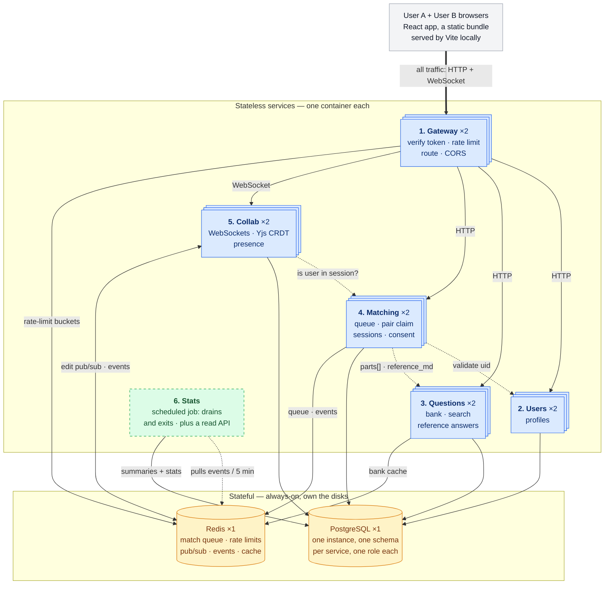
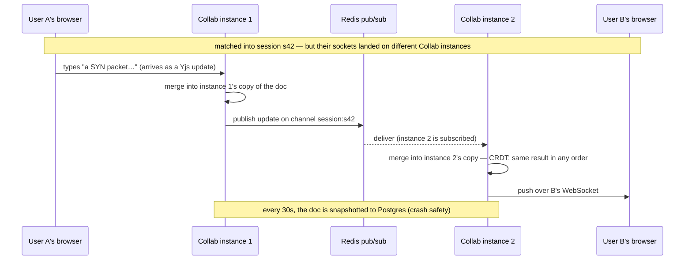

# How the system works

DeepCS is a CS-fundamentals question bank with real-time collaborative solving:
practise alone, or get matched with someone and work through a question together
in a shared editor.

This page is the whole system in one place — what the six services are, how a
request travels through them, and what each one owns. The decisions behind the
shape are in [`../adr/`](../adr/), one file each. It runs locally, under
`docker compose` and on a local Kubernetes cluster; nothing is deployed.

Each part of it also has a page of its own in this folder, which is where the
failure modes and the code pointers live:
[Gateway](01-gateway.md) ·
[Users](02-users.md) ·
[Questions](03-questions.md) ·
[Matching](04-matching.md) ·
[Collab](05-collab.md) ·
[Events and Stats](06-events-and-stats.md) ·
[Frontend](07-frontend.md) ·
[Data](08-data.md) ·
[Running it](09-running-it.md).

---

## How to read this page

Some things here are built and some are deliberately not, and the line between
them is one rule: **build what has a concurrency or distributed-systems problem
inside it; buy what is risk without insight.** That is why identity is Firebase's
job and the gateway is hand-written — opposite answers from the same test.

Where a choice had a defensible alternative, the reasoning lives in
[`../adr/`](../adr/) rather than here. Short *Why not X* notes appear inline.

---

## 1. What DeepCS proves

- Real-time collaborative editing with cross-instance sync, built on a CRDT
  (Conflict-free Replicated Data Type: concurrent edits on separate copies
  always merge to the same result, with no central referee — Yjs is the mature
  CRDT library used here). **This is the hard part of the project and the only
  one I'd defend as genuinely difficult.**
- A genuinely distributed system: **six independently deployable units** behind a
  **[built · learning]** gateway, with service-to-service authentication, no
  shared tables, and no transaction spanning a service boundary ([decision 1](../adr/)).
- Federated auth done properly **[bought]**: Firebase Auth issues the tokens,
  the gateway verifies them against Google's public keys and holds no credential
  that could mint one ([decision 4](../adr/)).
- An event-driven pipeline: services append domain events (facts like "match
  created", recorded as data) to a replayable log; a scheduled job consumes them
  into session summaries and live stats — which is where at-least-once delivery
  forces idempotency (§6).
- A system that runs on Kubernetes locally at no cost (§7), which is the
  constraint that shapes more of this design than any other: everything here
  has to work on one machine, with no managed service standing in for a
  decision.

---

## 2. Product

**Core loop:**

1. Arrive at a roadmap of nine topics, laid out in a recommended reading order.
   No account needed.
2. Open a topic, pick one of its three steps, and read the lesson with the
   questions it prepares you for.
3. Sign up.
4. Optionally choose "solve with someone" and join the queue with topic +
   difficulty preferences, usually straight from the step you just read.
5. Get matched with another waiting user.
6. Land in a shared scaffolded document seeded from the question's parts.
7. Co-write the answer in real time with presence + cursors.
8. Mutual-consent reveal of the reference answer.
9. End session; see a short summary.

*The roadmap is the front door rather than the question bank, because a list of
questions you cannot answer yet is not somewhere to start learning. The bank
still exists and matching still searches it; it just is not where you arrive.
See [`03-questions.md`](03-questions.md).*

**Domain:** a bank of multi-part CS fundamentals questions (OS, networking,
databases, concurrency), sourced from my existing notes repo — so the content
is already owned. Editing is symmetric: both users type into the same document
at the same time with equal rights, which is exactly the concurrent-edit
situation a CRDT exists to resolve, so the CRDT is genuinely load-bearing. The
public roadmap and its lessons make the live deploy useful to a single
visitor — matchmaking alone would demo as an empty room.

**In scope:** auth; a public roadmap of topics, each with lessons and the
questions that drill them, readable solo and signed out; join queue with topic + difficulty preferences; match; shared real-time
scaffolded session document with presence; mutual-consent reference reveal;
reconnect after disconnect; end session + summary; public stats endpoint
(sessions solved, popular topics — fed by the event log, §5).

**Out of scope:** AI features; mobile; polished UI (minimal functional React
only); payments; social features (friends/leaderboards); interviewer/interviewee
roles; role swapping; voice/video; rubrics and scoring; question authoring.

---

## 3. Architecture — 6 deployables



**Reading the diagram:** stacked blue boxes run two replicas each on the cluster
and one each under compose, which is the difference that lets a rolling update be
lossless (§7). The dashed green Stats job has no instance parked between runs;
its read API is an ordinary service. Solid arrows are the request path; **dotted
arrows are service-to-service calls**, which exist because no service may read
another's tables. The amber cylinders are the only always-on machines.

Every browser request — HTTP or WebSocket — enters through the Gateway. No other
service is reachable from the internet, and the browser never talks to Postgres
or Redis.

### The six capabilities, and why each is its own deployable

| # | Service | Owns | Why it's separate |
|---|---|---|---|
| 1 | **Gateway** | nothing (stateless) | **Position.** A cross-cutting enforcement point has to sit *in front of* what it protects. This would be true even if its scaling profile matched everything else exactly. |
| 2 | **Users** | profile rows keyed by `firebase_uid` | One capability, one owner. Small and stable — it will change less than anything else here. |
| 3 | **Questions** | question bank, tags, full-text index, `reference_md` | Read-heavy and cacheable in a way nothing else is; also the only service holding answer keys, so a narrower blast radius is worth something. |
| 4 | **Matching** | queue state, pair claim, session rows, consent | A hard concurrency problem of its own: two users joining at the same instant race for the same partner, so the pair claim has to be atomic ([decision 3](../adr/)). |
| 5 | **Collab** | live Yjs docs, snapshots | **Different scaling trigger and different failure mode.** One WebSocket occupies a concurrency slot for 20 minutes, so it needs the opposite concurrency and timeout settings from every other service, and those are per-service (§7). This boundary is forced by the workload, not chosen. |
| 6 | Event pipeline: `emitEvent` → `events` stream (behind the `EventLog` interface); idempotent **Stats** consumer → summaries + aggregates; the job run on a schedule | end a session → summary renders; `/stats` shows real counts |

**Two of these six are not really "splits."** The Gateway is a *position* and
Stats is a *job plus the read surface for what the job wrote* — judging either
by scaling profiles would be a category error.
The other four are ordinary services, one per capability.

*Why one service per capability rather than grouping them?* Honestly: by a strict
scaling-forces test, Users + Questions + Matching would merge — they share a
request shape, a failure domain and a deploy cadence, and an earlier draft of
this design did exactly that. They're kept separate for **independent
deployability and one clear owner per capability**, and because operating a
genuinely distributed system — service-to-service auth, validation across a
boundary, no cross-service transaction — is a large part of what this project
exists to teach. decision 1 states the costs that buys and names the condition under
which they'd merge back.

*Why not a monolith?* Collab alone rules it out: one open WebSocket holds a
concurrency slot for the whole session, so bundling it with the question bank
means a hundred idle sockets starve a browse request, and the two scale on
incompatible signals with no way to configure both.

*Why does everything go through the Gateway?* So exactly one place verifies a
token. The cost is a network hop, and for WebSockets a doubled concurrency slot —
see §5.

---

## 4. Stack

| Layer | Choice | Why — and why not the alternative |
|-------|--------|-----|
| All services | TypeScript + Fastify (Node web framework) | One language across six deployables + the frontend = fast solo iteration, and shared types across service boundaries, which matters much more now that boundaries exist. *Not Express:* Fastify has JSON-schema validation and a real plugin/encapsulation model built in, and is meaningfully faster. *Not NestJS:* heavy structure earns its keep on a team. |
| Frontend | React + Vite (build tool) + TS, with `react-router` and `marked` | Minimal, just enough to demo; Yjs bindings for React editors are mature. *Not Next.js:* SSR buys nothing for an authenticated single-page editor and adds a server to deploy where a static bundle on a CDN costs nothing. `react-router` arrived once there were six screens: navigating by React state meant the whole site lived at one address, so the browser Back button left it entirely and no lesson could be linked to. `marked` renders the seeded lesson markdown, and needs no sanitizer because that markdown is seeded by a migration and no route writes it. |
| Auth | Firebase Auth (email/password) **[bought]** | Identity is a solved, security-critical problem with no design insight left in it; Google's abuse detection and key rotation beat anything hand-rolled. *Not self-hosted:* decision 4. Free at this scale. |
| DB access | `pg` driver + hand-written parameterized SQL; migrations as numbered `.sql` files ([decision 10](../adr/)) | No schema DSL on the critical path, and decision 9's per-schema grants stay literal SQL. *Not Drizzle:* deferred, not rejected — it is the first item in the additive backlog. |
| Database | PostgreSQL — one instance, schema per service | Relational data, plus built-in tag filtering (`text[]` + GIN index) and full-text search (`tsvector`), so no separate search engine. *Not database-per-service:* decision 9 — it would cost cross-service atomicity and force a saga. *Not Mongo:* the data is relational. |
| Cache/queue/pubsub | Redis | One dependency covering five jobs: match queue, rate-limit state, cross-instance pub/sub, event stream, question-bank cache. Split from Postgres by **access pattern** (ephemeral shared state vs durable relational), not by service. |
| Real-time | WebSockets + Yjs (CRDT) | Concurrent edits merge without a central server ordering them ([decision 2](../adr/)). *Not SSE or polling:* one-directional, or too slow for ~100 ms keystroke echo. *Not Liveblocks/PartyKit:* they'd host the hard part, and the hard part is the project. |
| Event log | Redis Streams | Replayable domain-event log feeding summaries/stats, behind one `EventLog` interface so a second adapter is a swap rather than a rewrite. *Not Kafka:* an always-on broker for one stream of a few events a minute, though a Kafka adapter behind the same interface is in the backlog. |
| Editor | Monaco wired to Yjs | Familiar VS Code feel, mature `y-monaco` binding. *Not a plain textarea:* no cursor decorations, so presence would be invisible. *Not CodeMirror 6:* a fair alternative, lighter — Monaco chosen for recognisability in a demo. |
| Container | Docker + docker-compose | The unit everything ships as, and the reason the same image runs under compose and on the cluster without a rebuild. |
| Orchestration | Kubernetes on `kind`, locally | Rolling updates and self-healing are the two behaviours compose cannot show, and both are claims this project wants to be able to make (§7). *Not a hosted cluster:* it bills by the hour whether or not anyone visits. decision 5. |
| CI | GitHub Actions | Lint → typecheck → test → build → run the image and check `/health/ready`, **per service** (§7). There is no deploy step and there is not going to be one. |

---

## 5. Services

### Gateway — **[built · learning]** ([decision 8](../adr/))

The one service where an off-the-shelf product would do the whole job. Kong
DB-less covers routing, JWT verification, CORS and distributed rate limiting in
roughly fifteen lines of config, and that is what I'd deploy at a company. It's
built here for one reason: the rate limiter is the only race in this system that
a product would otherwise solve *on my behalf*. Matching's pair claim ([decision 3](../adr/))
has exactly the same shape, but nobody sells you a matchmaker — so the rate
limiter is the one place where buying is a real option, and therefore the one
place where writing the racy version, reproducing the double-count across two
instances, and then fixing it is a choice rather than a chore.

- **Verifies the token.** Firebase Auth signs ID tokens (RS256) with a private
  key Google holds; the Gateway verifies against Google's public keys, fetched
  from the published **JWKS** endpoint (JSON Web Key Set — the signing public
  keys, which Google rotates) and cached per its `Cache-Control`. Verified with
  `jose` against that JWKS rather than the Firebase Admin SDK, deliberately:
  verification needs only public keys, so the Gateway holds no service-account
  credential and **cannot mint or revoke a token**. It checks signature, `exp`,
  `iss`, and `aud` — an unchecked `aud` would accept a validly-signed token
  issued for a *different* Firebase project, which is the classic mistake here.
  Then injects `X-User-Id` (the Firebase UID from `sub`) and `X-Request-Id`.
- **Token-bucket rate limiting.** Each client gets a bucket of N tokens, a
  request spends one, tokens refill at a steady rate — bursts allowed, sustained
  flooding blocked. Implemented as a Redis Lua script, which Redis runs
  atomically, so two Gateway instances can't double-spend the same bucket.
- **Routes** to the four downstream services; handles CORS (locked to the one
  frontend origin).

*Why a Lua script and not `INCR`?* A fixed-window counter needs only `INCR`,
which is already atomic — that's how Kong's plugin does it. A **token bucket**
reads two values (tokens remaining, last refill time), computes a refill from
elapsed time, and writes both back. That's multi-step, so atomicity has to come
from wrapping it in a script Redis runs start-to-finish with nothing interleaved.
The bucket is worth it because it permits bursts, which a fixed window either
forbids or lets through at the boundary.

**The bug the script prevents** — the one this service exists to demonstrate
([decision 8](../adr/)). Two Gateway instances, one user's bucket, one token left in it:

```
instance A: read tokens = 1
instance B: read tokens = 1     <- reads before A has written
instance A: write tokens = 0    <- A lets its request through
instance B: write tokens = 0    <- B lets its through too; A's decrement is lost
```

That's a **lost update**, and note what it does *not* require: no threads, no
shared memory. Two ordinary processes on two different machines are enough. Which
is also why an in-process mutex is not a fix — it would guard one instance's own
memory, at an address the other instance cannot reach and has never heard of.
**Atomicity has to live where the single copy of the state lives**, and that is
Redis, which runs one command — or one Lua script — start to finish before
beginning the next.

*Why not Envoy, the usual suggestion?* Its `jwt_authn` filter would replace token
verification cleanly, but its **local** rate-limit filter is per-instance —
exactly the split-bucket bug — and its **global** one delegates to a separate
gRPC rate-limit service backed by Redis. Envoy doesn't remove this problem, it
deploys another container to solve it the same way. Kong DB-less is the honest
comparison.

**The tradeoff this position costs:** every WebSocket is proxied, so one collab
connection occupies a concurrency slot on the Gateway *and* one on Collab — two
slots per socket instead of one. The sharp end isn't the socket ceiling itself
(both are 250 per instance, §7) but that the Gateway's slots are shared with
**every HTTP request in the system**: at 500 live sockets the Gateway has nothing
left with which to serve a browse request. Letting browsers connect straight to
Collab would remove that, at the price of Collab having to verify tokens itself —
which today only the Gateway does (§6), so it is a real addition, not a
formality. It's kept behind the Gateway for one public origin and for rate
limiting on connection establishment. If the socket ceiling ever binds, this is
the first thing to change.

### Users

- **No auth code.** Sign-up, sign-in, password storage, token issue and refresh
  all happen client-side against Firebase; no service here ever sees a password.
- Owns the **profile row**: `firebase_uid text unique` plus app-owned data
  Firebase knows nothing about (display name, preferred topics). Created lazily:
  the client calls `GET /users/me` immediately after sign-in, and that request
  runs `INSERT … ON CONFLICT (firebase_uid) DO NOTHING RETURNING id`. The
  `RETURNING` is load-bearing — a conflicting insert returns **no row**, so it is
  the signal that this was a genuine first sight of the UID, and therefore the
  only place `user.signed_up` can be emitted (there is no signup endpoint to emit
  it from). Without it the event fires on every request and the sign-up count in
  `/stats` means nothing.
- **The upsert has to precede matching.** Matching validates the UID against this
  service, so a user who went straight from sign-in to the queue would be
  rejected for having no row yet. Pinning the upsert to the post-sign-in call is
  what guarantees the ordering.
- Exposes `GET /users/:uid/exists` for Matching's validation call.

*Why lazy upsert rather than a Firebase `onCreate` trigger?* One fewer deployed
function, and it cannot drift out of sync with Firebase's user list.

*Account deletion* is the one flow spanning Firebase and this service: delete
from Firebase first, then here. If the second half fails, the row is unreachable
(nobody can authenticate as that UID) and a retry is safe.

### Questions

- **Bank:** list / filter / search / paginate / get by id. Row shape: `parts[]`,
  `reference_md`, `tags text[]` (GIN-indexed), `difficulty`.
- Prefers **cursor pagination** (`WHERE id > $last ORDER BY id LIMIT 20`) over
  `OFFSET`, which makes Postgres read and discard every skipped row and produces
  duplicates when rows shift between requests.
- **Caches list and search results in Redis**, since the bank is read-heavy and
  almost never written. This is the fifth job Redis does here (§4), and the only
  one that is a pure optimisation rather than a correctness requirement.
- **`reference_md` is never served to a browser by this service.** It's released
  only to Matching, over the internal network, after Matching has verified
  consent ([decision 6](../adr/)). Questions has no way to know who consented; Matching has no
  way to know the answer text. Neither service can leak the answer alone.

### Matching

- **Reactive** — matching runs at the moment a user joins, not on a polling
  timer. On join: read the Redis queue, filter by compatible topic + difficulty,
  **atomically claim a pair via a Lua script**, create the session row, publish a
  match event on Redis pub/sub.
- Owns **session rows** and the **consent state** behind the reveal rule.
- **Validates across boundaries by API call**, not by SQL: it asks Users whether
  the UID exists and Questions for `parts[]`. It cannot join to those tables —
  the database rejects it ([decision 9](../adr/)).
- **Crash recovery:** the claim (Redis) and the session row (Postgres) live in
  two systems, so no transaction spans them. If Matching crashes between the two,
  a claimed pair is out of the queue with no session and would wait forever.
  Recovery is client-driven: if no match event arrives within ~10 s the client
  calls `/match/status`, which returns the active session if one exists (also
  covering a crash after insert but before publish) and otherwise re-enqueues.
  Joining is idempotent, so the retry can never double-book.

*Why reactive and not a polling loop?* A loop scanning every second is easier to
reason about but needs an always-on process, which §7 forbids, and adds up to a
second of latency for no benefit. The cost is that the claim must be atomic,
since two users can join simultaneously and race for the same partner — that's
the Lua script ([decision 3](../adr/)).

### Collab

- Authenticated WebSocket connections; one Yjs document per session.
- Doc seeded from the question's `parts[]` — a numbered line per part with room
  under each to answer in. There are no separate answer and scratch sections:
  they meant deciding where a thought belonged before writing it down, and the
  numbering now matches how the questions read everywhere else in the app.
- Presence + cursors via Yjs **awareness** (its built-in side channel).
- **Cross-instance sync** via a Redis pub/sub channel per session — needed
  because the two users may be connected to *different* Collab instances.
- **Snapshots** the Yjs doc to Postgres every 30 s, on disconnect, and before
  SIGTERM; restores on reconnect. The live doc exists only in one instance's
  memory, so without this a restart loses the session's text.
- **Authorizes its own sockets** by calling Matching: *is this UID a participant
  in this session?* The Gateway cannot answer that — it has no session data.

*Why Redis pub/sub and not sticky sessions?* The obvious fix is pinning both
users to one replica. It doesn't work: session affinity pins **a client**, not
a group — the two people in a session are different clients connecting at
different moments, so nothing would co-locate them in the first place, and the
pinning is lost the moment that replica is replaced. Fanning through
Redis makes instance placement irrelevant, which is the property that survives
autoscaling.

*Why snapshot every 30 s and not on every edit?* Per-keystroke writes would put
a database round trip on the hot path of every character typed. 30 s bounds worst-case
loss to 30 s of typing, and the SIGTERM and disconnect snapshots mean the routine
cases (deploy, scale-down, closed tab) lose nothing at all. Only an ungraceful
crash hits the full window.

*Why Yjs rather than writing the merge myself?* The interesting problem here is
understanding CRDT convergence, not reimplementing it — a hand-rolled merge
would be subtly wrong in ways that surface only under concurrent edits. The
learning is in the sync topology (cross-instance fanout, snapshot, reconnect),
which is exactly the part Yjs does *not* do for you.

The distributed-systems moment, drawn out — one edit crossing instances (the
WebSocket's hop through the Gateway omitted for clarity):



### Stats — the scheduled job + the event log

- Services call a shared `emitEvent(type, data)` at six moments:
  `user.signed_up`, `queue.joined`, `match.created`, `session.started`,
  `reveal.consented`, `session.ended`. **Users** emits the first, on the lazy
  upsert; **Collab** emits `session.started` when a session's first socket
  connects — that's the Collab→Redis `events` arrow in §3; **Matching** emits the
  other four, since it owns queue and session lifecycle. Each appends one entry
  to an `events` **Redis Stream** (an append-only log: entries get ordered IDs, reading never
  deletes them, and each reader keeps a server-side bookmark). Fire-and-forget
  inside a try/catch — a log hiccup never fails a user request.
- The job reads everything past its bookmark, processes, then acks each entry.
  Redis keeps delivered-but-unacked entries in a pending list, so a crash
  mid-batch means redelivery, not loss. Delivery is therefore **at-least-once**,
  so every write is idempotent (§6).
- Outputs: on `session.ended`, a summary row behind `GET /sessions/:id/summary`;
  plus aggregates (sessions per day, median match wait, popular topics) behind
  `GET /stats`. Both are served by the read entrypoint of the Stats image, not
  by the job.
- **Idempotency is per event, and there are two ways to get it.** A *natural
  key* where the event names something that exists once, so `ON CONFLICT` writes
  the same row again: a session id, a user id. The *log's entry id* where it
  does not, because a user may join the queue, give up and join again and both
  are real, so there is nothing in the payload to key on. No counters anywhere:
  `count = count + 1` run twice is wrong and no care at the call site fixes it,
  which is why `/stats` groups over rows on read.
- **Acknowledge after the commit, never before.** An acked entry is never
  redelivered, so acking first turns a crash into silent loss instead of a
  repeat, and a repeat is the thing every write above is built to survive.
- A scheduled run triggers it every few minutes — `docker compose run --rm
  stats` locally, a Kubernetes CronJob on the cluster; it drains the backlog and
  exits. Worst case a summary lands ~5 minutes after the
  session ends. The retained log is what makes reprocessing possible: rewind the
  bookmark after a bug fix, or add a consumer later, and history is still there.
- **The `EventLog` interface has exactly three methods** (append / readBatch /
  ack) because those are what Redis Streams and Kafka genuinely share. A Kafka
  adapter behind that surface is in the backlog and is **not built**: nothing in
  this repo runs a broker.

*Why a log and not a queue?* A queue deletes on consume, so a bug in the summary
logic means the data needed to recompute is gone. A log keeps entries after
reading, so the fix is rewinding the bookmark ([decision 7](../adr/)).

*Why not have Matching write summaries directly?* The write would sit on the
user's request path, and there'd be no replay when the logic changes. The async
split is also what creates the at-least-once problem that forces idempotency —
which is the reason this pipeline is worth building at all.

*Why a scheduled job and not an always-on consumer?* An always-on container is
the one thing §7 rules out. The log holds events while nobody reads, so polling
every 5 minutes costs only freshness.

---

## 6. Shared concerns

### Authentication vs authorization — where each check lives

The distinction matters more with six services than it would with one, so state
it explicitly:

- **Authentication** (*who are you*) happens **once, at the Gateway**. Downstream
  services never re-verify; they read `X-User-Id` and trust it.
- **Authorization** (*may you do this specific thing*) **cannot** be at the
  Gateway, which has no domain data. It lives with whoever owns the record:
  Collab asks whether a UID is a participant in a session; Matching enforces
  mutual consent before releasing a reference answer.
- **Not every route is authenticated.** The question bank and `/stats` are
  public (§2), so the Gateway verifies a token when one is present, rejects a
  malformed or expired one outright, and falls back to per-IP rate limiting when
  there is none at all. The consequence downstream is easy to get wrong:
  `X-User-Id` is *absent* on those requests, and absent has to be handled as
  anonymous rather than as "trust whatever arrived" — the same header-forgery
  mistake as public ingress, just reached from the other direction.

Auth is therefore spread across three places and **there is no auth service**:
Firebase owns credentials and token issuance, the Gateway owns verification, and
Users owns the profile row. Before decision 4 there would have been a seventh
service's worth of work here — buying identity deleted it.

- **Token details:** Firebase ID tokens, RS256, ~1-hour expiry, refreshed
  transparently by the client SDK. **The tradeoff to state, not hide:** with
  plain verification, a revoked or deleted user's existing token stays valid
  until it expires — up to an hour. Server-side revocation exists
  (`revokeRefreshTokens` + `verifyIdToken(token, true)`) but needs the Admin SDK
  and a round-trip per request, so it isn't on the hot path. For a shared answer
  document that window is acceptable; with money involved it wouldn't be.

### Service-to-service authentication

Now that services call each other, "internal" has to mean something enforceable:

- Every service except the Gateway is a **ClusterIP Service**, so it has no route
  in from outside the cluster; under compose, nothing but the Gateway publishes a
  port a browser can reach.
- The call graph is deliberately narrow — Matching calls Users and Questions,
  Collab calls Matching, the Gateway calls all of them, and nothing else calls
  anything. Inside the cluster those calls carry no credential of their own,
  which is exactly why the ingress boundary has to hold.

**This is the assumption the whole design rests on.** `X-User-Id` is trusted
because only the Gateway can set it. If any service ever gains public ingress,
that header becomes forgeable and it is an authentication bypass — so the ingress
setting is a security control, not a deployment detail.

### The rest

- **Rate limiting:** token bucket via Redis Lua. Per-IP at the Gateway (unauth),
  per-user general, tighter per-user on `/match/*`. Returns `X-RateLimit-*`.
- **Input validation:** zod on every endpoint, rejecting malformed input with 400
  before business logic. Parameterized queries always.
- **Observability:**
  - Structured JSON logs via Pino, each line carrying `service` + `request_id` +
    `user_id`. `X-Request-Id` propagates across service calls, which is what
    makes a six-service request path debuggable at all.
  - `/health/live` + `/health/ready` on every service.
  - Prometheus-format `/metrics` per service: request rate, error rate, latency
    histograms, WebSocket connection count.
    Scraped rather than pushed, which is the ordinary Prometheus model and is
    available precisely because pods are individually addressable inside a
    cluster. Only Collab's socket count and memory are built; the rest is a
    stretch.
  - Full OpenTelemetry tracing is an explicit stretch. It's worth more here than
    it was with three services — a match request now touches four — but it's
    still not core.
- **Security:** CORS to one origin, helmet security headers, credentials in a
  Kubernetes Secret rather than in an image or a manifest, Dependabot.
- **Graceful shutdown:** drain in-flight requests; Collab snapshots Yjs docs
  before exit.
- **Idempotency** (safe to run twice with the same effect as once): queue-join
  keyed by `user_id`, session-end by `session_id`, event consumption by entry ID.
  With at-least-once delivery this is not optional — it's what converts
  "at-least-once" into "effectively exactly-once".

---

## 7. Running it

**This system runs locally and is not deployed anywhere.** Two targets, one
image set: `docker compose` for development, and a local Kubernetes cluster for
everything that compose cannot show. There is no cloud environment, no hosted
URL, and nothing here costs money to run. decision 5 records why.

- **Compose:** `docker compose up` → the 5 services + the Stats job + Postgres +
  Redis + the **Firebase Auth emulator**. The emulator keeps local dev and CI
  offline and free, lets integration tests mint tokens for arbitrary test users,
  and preserves the "one command runs everything" property that a hosted
  identity provider would otherwise break. It issues *unsigned* tokens, so the
  Gateway selects emulator mode purely on an env var — a flag that must be
  impossible to set anywhere real.
- **Kubernetes:** the same images, a Deployment and Service per service,
  ConfigMap and Secret for configuration, one Ingress in front of the Gateway,
  and probes pointed at the `/health/live` and `/health/ready` endpoints §6
  already requires. Only the Gateway is reachable from outside the cluster;
  everything else is a ClusterIP Service, which is what keeps `X-User-Id`
  unforgeable (§6).
- **The frontend must serve `index.html` for unknown paths.** Routing is
  client-side, so `/step/<uuid>` exists only once the bundle is running: without
  a rewrite, whatever serves the files answers 404 for every link into the app
  except the root, and the failure shows up only for shared links and refreshes,
  never while clicking around. Vite's dev server and `vite preview` both do it
  already, which is exactly why it is easy to miss.
- **CI:** GitHub Actions, **path-filtered per service** — a change under
  `services/questions/` builds and health-checks only Questions. Independent
  buildability is most of the point of the split ([decision 1](../adr/)), and it doesn't exist
  unless CI is wired for it.

**How a waiting user finds out they were matched.** Being matched is caused by
somebody else's request, and HTTP gives a server no way to speak first, so a
client either asks repeatedly or is told. It asked, at first, and that turned out
to keep every layer awake: the database never went idle and no service was ever
without work, because a request arrived every few seconds whether or not
anything had happened. Slowing it down to fix that made a partner's arrival up
to twenty seconds late, with the partner sitting alone in the editor meanwhile.

It is now server-sent events: `GET /match/events` holds one ordinary HTTP
response open and Matching writes into it when the Redis message for that user
arrives. Nothing is spent while nothing happens, and delivery is immediate
(23 ms end to end through the Gateway, measured). Two things about it are worth
knowing rather than discovering:

- **A connection is not free either.** An open stream occupies a concurrency
  slot for its whole life and keeps that replica busy, so a stream is opened
  only by somebody actually waiting, never by everyone signed in, and it is
  given up after fifteen minutes.
- **Its failure mode is silent.** Anything in the path that buffers turns the
  stream into one long pause and then everything at once: the request succeeds,
  the headers are right, and events simply never arrive. That cannot be caught
  by reading code, so it is caught by a wall-clock assertion through the Gateway
  in `frontend/src/matchEvents.test.ts`.

**The cost of six deployables, stated honestly:** a match request chains four
processes — Gateway → Matching → Users → Questions — so it carries four network
hops and four chances to be waiting on a pod that has just been rescheduled.
That is the real price of the split, and it is accepted rather than mitigated.
It is also why cross-service calls are kept to validation only, and never placed on the
question-browsing path a first-time visitor hits.

### How much one replica can hold, and why

Replica count and per-process concurrency are independent axes, and their
product is the capacity ceiling **per service**. Two replicas of Users,
Questions or Matching handling 80 requests each is **160** simultaneous
requests; two of the Gateway or Collab at 250 each is **500**. Past that,
requests queue and then fail, which is the intended behaviour: a ceiling you
chose beats an unbounded one you did not.

The Gateway's 500 are not a second pool of sockets, though. Every WebSocket
burns one slot there *and* one on Collab, and the Gateway's slots are the same
ones every HTTP request needs — so 500 live sockets is also the point at which
nobody can browse the question bank (§5).

**Why 80 requests on one Node process is not a typo.** Node runs all application
JavaScript on a single thread (one OS-scheduled flow of execution — two of your
own functions never execute simultaneously), driven by an **event loop** (a C
loop that asks the kernel which I/O has finished and calls the matching JS
callback). A typical Users or Matching request spends roughly **2 ms of CPU**
(parse, validate, serialise) and **30 ms waiting on Postgres**. During that wait
the request holds nothing: `await` saves the function's locals and its resume
point into a heap object and hands control back to the loop, which starts the
next request immediately. Eighty in-flight requests are eighty small heap
objects, not eighty parked threads — and the waiting itself is one `epoll_wait`
syscall (Linux: *"tell me which of these sockets are ready"*), not one thread per
socket. That is the whole reason the number is cheap.

This is **concurrency without parallelism**: tasks interleaved over a period, not
executing in the same instant. More cores do nothing for a single Node process,
which is why scaling out means more replicas, and why the rate-limit bucket has
to live in Redis rather than in memory (§5).

**What it depends on, and the failure mode.** All of the above holds only while
the work is I/O-bound. A CPU-bound stretch with no `await` inside it holds the
thread until it finishes — the loop cannot interrupt it, because there is no
other thread to interrupt it *with*. For that whole time, completed Postgres
results for the other 79 requests sit unread in kernel buffers, p95 latency rises
across every request on the instance, and `/health/ready` can't answer either;
long enough and the kubelet's liveness probe declares the pod unhealthy and
restarts it. Password hashing is
the one place this design would have hit that — bcrypt is deliberately expensive,
around 250 ms of pure CPU — and **decision 4 moved it into Firebase, so no CPU-bound
work sits on any request path here.** That's what makes 80 a safe number rather
than an optimistic one.

*Why not `--concurrency=1`?* Then 100 simultaneous users demand 100 instances.
With two replicas the app would serve two requests at a time and queue the rest,
which reads as broken. Concurrency is precisely what keeps a two-replica ceiling
sufficient.

*Why Collab's numbers are the opposite.* Its unit of work is an open socket that
is idle almost all of the time — someone typing occasionally costs microseconds
of CPU — so one replica holds far more of them. But the number also changes
meaning: for a request/response service concurrency is a throughput knob, while
for Collab `250 × 2 = 500` is a **hard ceiling on concurrent users**, and the
501st is rejected at connect. That is the number §8 has to be careful not to
mistake for a measurement.

### Kubernetes, locally · **[the deployment target]**

The cluster is `kind` (Kubernetes in Docker: a cluster whose nodes are
containers on this machine), created and destroyed with `make k8s-up` and
`make k8s-down`. Raw YAML in `k8s/` — no Helm, no operators — so every line is
something to be able to explain.

What it demonstrates that compose cannot, both measured — the numbers and their
conditions are in [`09-running-it.md`](09-running-it.md):

1. **A rolling update drops no requests.** `make k8s-check` holds a steady
   stream of requests through the Ingress while every Gateway and Questions pod
   is replaced: zero non-200 out of 1,230, with the prober separately shown able
   to detect an outage and the ingress shown not to be retrying. The mechanism
   is the readiness probe: a pod that fails `/health/ready` is removed from the
   Service's endpoints, so traffic only reaches replicas that can serve it.
   "Zero dropped requests, and here is why" is a better answer to what
   Kubernetes buys than listing object kinds.
2. **A killed pod costs a reconnect, not any edits.** An edit written seconds
   before its Collab pod was deleted was in the document after reconnecting,
   saved by the SIGTERM path in §6 and by nothing else. The socket itself does
   close — no Deployment setting can prevent that — and the client reconnects
   and resumes from the snapshot. The narrower claim is the true one.

Postgres and Redis run in the cluster too, as ordinary Deployments with no
persistence beyond the pod: this is a place to run the system, not to keep data
in.

---


## 8. Testing + the headline load number

- **Unit:** the pair-claim logic, rate-limit token bucket, question-bank filters,
  Stats idempotency (same event twice → one summary).
- **Integration:** testcontainers (real Postgres + Redis in Docker) plus the
  Firebase Auth emulator, covering token verification and its rejection cases
  (expired, tampered, wrong `aud`), the lazy `users` upsert, the match flow, and
  — new with the split — **that a service cannot read another's schema.** That
  last one is a test, not a convention: it asserts the database rejects the
  query.
- **Contract tests** on the three internal calls (Matching→Users,
  Matching→Questions, Collab→Matching), so a response-shape change breaks CI
  rather than production. This is the tax independent deployability charges.
- **One end-to-end happy path:** sign in → match → collab edit syncs → end.
- **Two measurement harnesses, and they answer different questions.**

  **`make load` is the k6 script**, run against compose and against the cluster.
  It ramps 250 collaboration sockets, holds them, and measures how long an edit
  takes to reach the other person in the pair. Ramping WebSocket connections is
  where the volume goes and where bugs are cheap to find — a socket leak, an
  unbounded map, a missing `await` — and it is what produces the concurrency and
  propagation figures.

  **`make k8s-check` is the disruption prober**, and it exists because the k6
  script *cannot* measure dropped requests: it sends its HTTP in `setup()` and
  `teardown()` and holds sockets in between, so during a rolling update there is
  nothing in flight to drop.

  **What a local run may and may not claim.** It measures a laptop, not a
  system, so it cannot support a capacity claim: "holds N concurrent
  connections" is a number about the machine that produced it. What it supports
  perfectly well are correctness-under-concurrency claims, which do not depend
  on the hardware at all:

  - zero dropped requests during a rolling update,
  - no lost edits while an instance is replaced,
  - flat memory and no leaked sockets over a long run.

  The first of those is the payoff for the readiness probes: a pod failing
  `/health/ready` is removed from the Service endpoints, and that is the
  mechanism that makes the update lossless. "Zero dropped requests, and here is
  why" is a better answer to what Kubernetes buys than listing object kinds.

### How the headline number is measured

k6 (a load-testing tool: you write a script describing what *one* user does, and
it runs many copies of it and reports timing statistics) drives the Collab run.
The parts that carry weight:

```js
export const options = {
  stages: [                          // ramp, don't slam
    { duration: '30s', target: 50 },
    { duration: '2m',  target: 50 },
    { duration: '30s', target: 200 },
    { duration: '2m',  target: 200 },
    { duration: '30s', target: 0 },
  ],
  thresholds: {
    edit_latency:  ['p(95)<200'],    // custom metric — fails the run in CI
    ws_connecting: ['p(95)<1000'],
  },
};
```

- **VU (virtual user)** = one concurrent execution of that script. k6's runtime
  is Go, so a VU is a goroutine rather than an OS thread and one laptop drives
  thousands. *Why not a Node load generator?* It would be bounded by its own
  single event loop (§7), and the number it produced would describe the client
  rather than the server.
- **Ramping** is what exposes the *knee* — the load level where latency stops
  being flat and starts climbing. A flat 200-VU run only answers pass/fail; a
  ramp says where the limit is.
- **Thresholds** turn the run into a pass/fail check, which is what lets it live
  in CI instead of being something someone remembers to eyeball.
- **`edit_latency` has to be hand-written**, because k6 has no concept of edit
  propagation: the script stamps a timestamp into the text it inserts, and the
  *other* VU in that session subtracts it from its own clock when the insert
  arrives. The headline number does not exist unless this metric is built.

  **It has to be read from the partner, and not from an echo, because there is
  no echo.** `broadcast` in services/collab/src/rooms.ts sends an update to
  every socket in the room *except* the one it came from, so a sender never sees
  its own edit return and a script written to expect one measures nothing at
  all. Reading it from the partner is also the better measurement: it is the
  delay a person actually experiences, rather than a round trip to a server and
  back to the person who already knows what they typed.
- **Report p95/p99, never the average.** If 95 requests take 10 ms and 5 take
  2 s, the average is 110 ms and not one request was anywhere near it. p95 means
  95% of requests were faster than the stated figure — and the tail is both what
  a user feels and where queueing, contention and cold starts appear first.
- **Measure from two directions** — k6's client-side latency *and* Collab's own
  `/metrics` socket count — so that "the server is saturated" stays
  distinguishable from "my load generator is saturated".

Every number this test produces is a number about one machine, and it travels
with the machine that produced it or it means nothing. Quoting a laptop figure
as though it described a deployed system is the dishonest version of this test,
and it is worth naming so that it doesn't happen by accident.

*Why these tests and not a coverage target?* A percentage pushes effort toward
whatever is easiest to cover, which is rarely where this system breaks. The
things tested are the places correctness is genuinely non-obvious: the token
bucket under concurrency, the atomic claim, idempotency under redelivery,
cross-instance propagation, and the schema boundary. *Why testcontainers rather
than mocks?* The bugs worth catching are in real SQL and real Redis semantics — a
mock would happily confirm that the racy rate limiter works.

---

---

## Final note

Build the Collab service with the most care — it's the piece that says "real-time
distributed systems," and a clean demo (two tabs syncing, presence, cursors,
survive-an-instance-kill) lands harder than any amount of infrastructure.

That's the honest ranking of what's worth time: **Collab first, the event log and
its idempotency second, the rate limiter third, everything else plumbing.** The
**[bought]** tags exist to protect that ordering — every component handed to a
managed service is time returned to the top of the list.

The failure mode this doc is written to prevent isn't picking a wrong tool; it's
spending three weeks on infrastructure and one on the only part that's hard. Six
services makes that failure mode *easier* to hit, which is the honest cost of
decision 1, and it is why everything in the backlog is explicitly droppable.
