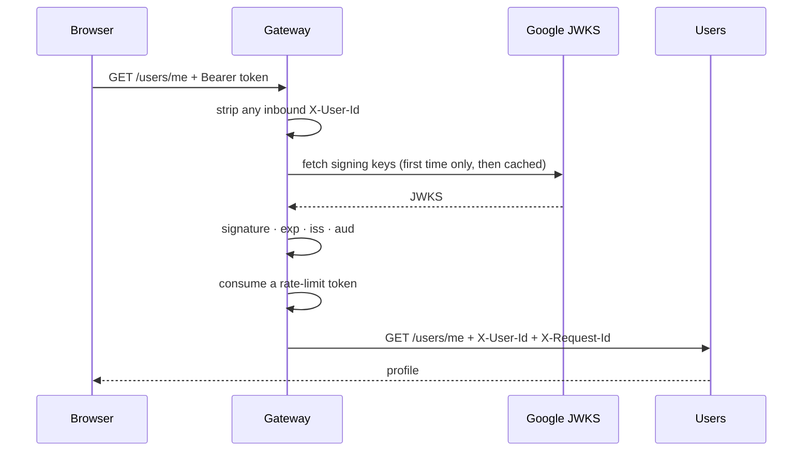

# Gateway

Every request from a browser enters here, HTTP and WebSocket alike, and nothing
else is reachable from outside. The Gateway owns no data. It is a *position*:
the one place a token is verified, the one place a rate-limit bucket is spent,
and the one place `X-User-Id` is set.

It is the service where an off-the-shelf product would do the whole job, and it
is hand-written anyway. The reason is in
[`../adr/08-a-custom-gateway.md`](../adr/08-a-custom-gateway.md): the rate
limiter is the only race in this system that a product would otherwise solve on
my behalf.

Code: [`services/gateway/src/`](../../services/gateway/src/) — `auth.ts`,
`rate-limit.ts`, `index.ts`.

---

## 1. What a request goes through



The order matters in one place: **rate limiting runs after authentication**,
because which bucket a request draws on depends on whether it turned out to be
authenticated. Keying an authenticated request by IP instead would let one user
on a shared NAT exhaust everyone else's allowance.

Signing in never touches this service. The browser talks to Firebase directly
and arrives holding a token, so the Gateway's rate limiter does not protect the
login endpoint; Google's abuse controls do
([`../adr/04-managed-auth.md`](../adr/04-managed-auth.md)).

---

## 2. Verifying a token

[`auth.ts`](../../services/gateway/src/auth.ts)

**`jose` against Google's published JWKS, not the Firebase Admin SDK.**
Verification needs only public keys, so this service holds no service-account
credential and **cannot mint or revoke a token**. The blast radius of a
compromised Gateway is "can read traffic", not "can issue identities".

`createRemoteJWKSet` is the entire JWKS story: it fetches on first use, honours
the response's `Cache-Control`, and re-fetches when a token arrives carrying a
`kid` it has not seen, which is what turns Google's roughly-daily key rotation
into a non-event. It is built once at module scope. Per-request would put a
network round trip to Google on the hot path of every request.

### `aud` is the line that matters most

Google signs **every** Firebase project's ID tokens with the same key set. A
validly-signed token issued for someone else's project therefore passes the
signature check, `exp`, and an `iss`-shaped check. Without an audience check the
Gateway would accept it and hand the request a stranger's UID. This is the
classic mistake in Firebase verification and it is tested explicitly in
[`auth.test.ts`](../../services/gateway/src/auth.test.ts).

**The UID comes from `sub`, not `user_id`.** Firebase puts the same value in
both, but `sub` is the registered JWT claim and `user_id` is Firebase's own
addition. Keying off the standard one is what keeps the managed-auth decision's
"migration is a re-registration flow, not a rewrite" true.

**Failure reasons are logged, not returned.** `asTokenError` maps jose's error
codes so the log says *expired* or *audience*, while the client gets a flat 401.
Telling a caller whether a token was expired, forged, or issued for another
project is free information about what to try next.

### Three cases, and the one people miss

| Request | Result |
|---|---|
| No `Authorization` header | **Anonymous.** Valid: the question bank, the roadmap and `/stats` are public. Falls back to per-IP rate limiting. |
| A malformed or expired token | **401.** Presenting something broken is an attempt to authenticate, and a failed one. |
| A valid token | `X-User-Id` injected from `sub`. |

The middle row is the one that gets skipped. "No token" and "bad token" are
different states, and collapsing them either locks anonymous users out of public
routes or lets broken tokens through. `bearerToken` returns `null` for the first
and the verifier throws for the second; that is the whole distinction.

A WebSocket upgrade is a fourth case in practice. A browser's native `WebSocket`
constructor cannot set headers, so the token arrives as `?token=` instead —
read **only** when `Upgrade: websocket` is actually present, so it never widens
how an ordinary HTTP route can be authenticated. Widening it would put
credentials in access logs for no reason.

### The emulator, and the guard around it

The Auth emulator issues **unsigned** tokens: `"alg": "none"`, empty signature.
There is nothing to verify, so `jwtVerify` would reject them outright and local
development would be impossible.

Emulator mode therefore skips the signature and checks everything else — `iss`,
`aud`, `exp`, and the presence of `sub`. Keeping those on the local path is what
stops a bug in the claim logic from hiding until it is somewhere that matters.

Because that path accepts tokens anyone can forge in a text editor, it has to be
impossible to reach in production, and impossible is enforced by refusing to
boot:

```
FIREBASE_AUTH_EMULATOR_HOST is set with NODE_ENV=production.
The emulator issues unsigned tokens; accepting them in production means
accepting forged identities. Refusing to start.
```

A crash on boot is loud. A Gateway that started with signature checking disabled
would look completely healthy while accepting anything.

**One consequence worth stating plainly:** locally, tampering with a *signature*
is undetectable, because there is no signature. Only payload and claim tampering
are caught. The signature path runs only against real Firebase.

---

## 3. The header-forgery line

```ts
delete req.headers[USER_ID_HEADER];
```

Without that one line the entire scheme is decorative. A client could send
`X-User-Id: <someone else>` and — since downstream services trust the header *by
design* — be that person. Deleting it unconditionally, before any other work,
means the only way the header exists downstream is because this file put it
there.

**That guarantee has two halves and both are required.** The other is that only
the Gateway is reachable from outside: under compose nothing else publishes a
port a browser can use, and on the cluster only the Gateway has an Ingress while
the rest are ClusterIP Services. Either half alone leaves the header forgeable,
which is why the ingress setting is a security control and not a deployment
detail.

The other side of the same idea is in
[`packages/shared/src/headers.ts`](../../packages/shared/src/headers.ts):
downstream, **absent means anonymous**, never "skip the check".

---

## 4. The rate limiter

[`rate-limit.ts`](../../services/gateway/src/rate-limit.ts)

Each client gets a bucket of N tokens, a request spends one, and tokens refill at
a steady rate: bursts allowed, sustained flooding blocked.

### The bug it prevents

Two Gateway instances, one user's bucket, one token left in it:

```
instance A: read tokens = 1
instance B: read tokens = 1     <- reads before A has written
instance A: write tokens = 0    <- A lets its request through
instance B: write tokens = 0    <- B lets its through too; A's decrement is lost
```

That is a **lost update**, and note what it does *not* require: no threads, no
shared memory. Two ordinary processes on two different machines are enough.
Which is also why an in-process mutex is not a fix — it would guard one
instance's own memory, at an address the other instance cannot reach and has
never heard of. **Atomicity has to live where the single copy of the state
lives**, and that is Redis, which runs one script start to finish before
beginning the next.

The regression test is
[`rate-limit.test.ts`](../../services/gateway/src/rate-limit.test.ts): twenty
concurrent consumes against a ten-token bucket, asserting exactly ten pass.
Without atomicity, more would.

*Why a script and not `INCR`?* A fixed-window counter needs only `INCR`, which is
already atomic — that is how Kong's plugin does it. A **token bucket** reads two
values (tokens remaining, last refill time), computes a refill from elapsed time,
and writes both back. That is multi-step, so atomicity has to be wrapped around
it. The bucket is worth the extra work because it permits bursts, which a fixed
window either forbids or lets through at the boundary.

### Five details that are easy to get wrong

- **The clock comes from Redis, not the caller.** Two Gateway instances have two
  clocks that disagree by an unknown amount; taking the timestamp from the single
  place the state lives removes skew from the refill maths entirely.
- **A backwards clock cannot remove tokens.** The `math.max(0, …)` around
  `elapsed` is what stops a negative interval silently draining a bucket.
- **Buckets expire** after the time a full refill takes. Per-IP buckets are an
  unbounded key space and Redis holds every key in memory.
- **The limiter fails open.** A Redis outage logs an error and allows the
  request. Failing closed would turn a cache outage into a total outage. This is
  a deliberate availability-over-enforcement choice, defensible only because the
  thing being protected is request volume rather than money or data.
- **`/health*` is exempt.** Registering the health routes before this hook exists
  does not exempt them — Fastify binds hooks to every route at boot — so an
  uptime probe was drawing from the same anonymous bucket as real traffic, and at
  more than one probe a second it exhausts capacity 60 on its own. A perfectly
  healthy Gateway then answers 429, which reads as an outage.

### The buckets

| Bucket | Capacity | Refill | Why |
|---|---|---|---|
| per-IP (anonymous) | 60 | 1/s | An IP can be an entire university NAT |
| per-user | 120 | 2/s | A user is one person |

Both counts matter outside this file: `make k8s-check` runs forty identities
rather than one precisely because a single prober flat out would measure the rate
limiter rather than the rolling update
([`09-running-it.md`](09-running-it.md) §4).

**`trustProxy: 1` is what makes the per-IP bucket work at all**, and it lives in
[`packages/shared/src/service.ts`](../../packages/shared/src/service.ts).
Fastify's `req.ip` is the socket's peer address, which behind anything that
proxies is the proxy rather than the caller, so every anonymous request would
share one bucket and one client could lock out everyone. `1` and not `true`:
whatever sits in front appends to any `X-Forwarded-For` the caller supplied, so
only the rightmost entry is trustworthy, and trusting the whole chain would let a
client mint a fresh bucket per forged header. Both behaviours are pinned by
tests in
[`service.test.ts`](../../packages/shared/src/service.test.ts). The number is a
property of what is actually in front of the service — an Ingress included — so
it is worth re-checking rather than inheriting.

**Script registration.** `defineCommand` registers the script once and calls it
by SHA thereafter, falling back to a full `EVAL` if Redis has forgotten it, which
happens after a restart and on any replica that has not seen it. Doing this by
hand is the usual source of a rate limiter that works until the first failover.

---

## 5. Routing

One proxy registration per downstream service, and the prefix list is the whole
routing table:

| Prefix | Service | Notes |
|---|---|---|
| `/users` | Users | |
| `/questions` | Questions | the bank, and the signed-in answer route |
| `/roadmap` | Questions | the map |
| `/steps` | Questions | a lesson with its questions |
| `/match` | Matching | including the status poll and the participant check |
| `/collab` | Collab | `websocket: true` |
| `/stats` | Stats read server | public aggregates |
| `/sessions` | Stats read server | one session's summary |

Three prefixes reach Questions, one per screen it feeds. They could have been one
prefix, but everything under `/questions/` takes a uuid as its next segment, so a
prefix meaning "read the material" should not be nested inside one meaning "read
a question".

**The prefix list is a security boundary, not a convenience.** The Gateway
forwards a prefix wholesale and does no filtering on what follows, so *every*
path under a listed prefix is reachable from a browser. That is why the route
releasing a reference answer to Matching lives at `/internal/questions/:id/reference`:
nothing proxies `/internal`, so it is callable only from inside the network. "Nobody
would call it" is not a control; not being routable is
([`03-questions.md`](03-questions.md) §4).

**The upstream WebSocket needs its own header rewrite.** `@fastify/http-proxy`
opens a *second*, separate connection for a WS upgrade, with its own rewrite
hook, and its default forwards nothing but `cookie`. Without `rewriteWsHeaders`,
Collab would never see `X-User-Id` and would 401 every socket, authorized or not.
Note the reversed argument order against the HTTP variant — that is the proxy
library's own inconsistency, not a typo.

**CORS is locked to one origin**, not `*`. The frontend sends an `Authorization`
header, and a wildcard origin cannot be combined with credentialed requests
anyway, so `*` would be both less safe and non-functional. Response headers a
browser is allowed to *read* have to be named explicitly: `retry-after` (a
frontend backing off would otherwise read null), `x-ratelimit-*`, `x-cache` and
`x-request-id`.

**No CSP here.** The Gateway serves JSON, not HTML, so a content policy protects
nothing. It belongs on whatever serves the frontend
([`07-frontend.md`](07-frontend.md)).

---

## 6. The tradeoff this position costs

Every WebSocket is proxied, so one collab connection occupies a concurrency slot
on the Gateway *and* one on Collab: two slots per socket instead of one. The
sharp end is not the socket ceiling itself but that the Gateway's slots are
shared with **every HTTP request in the system**, so at enough live sockets the
Gateway has nothing left with which to serve a browse request.

Letting browsers connect straight to Collab would remove that, at the price of
Collab having to verify tokens itself — which today only this service does, so it
is a real addition rather than a formality. It stays behind the Gateway for one
public origin and for rate limiting on connection establishment. If the socket
ceiling ever binds, this is the first thing to change.

*Why not Envoy, the usual suggestion?* Its `jwt_authn` filter would replace token
verification cleanly, but its **local** rate-limit filter is per-instance, which
is exactly the split-bucket bug above, and its **global** one delegates to a
separate gRPC rate-limit service backed by Redis. Envoy does not remove this
problem, it deploys another container to solve it the same way. Kong DB-less is
the honest comparison.

---

## 7. Known gaps

- **No tighter bucket on `/match/*`.** The general per-user bucket covers those
  routes and has been sufficient, because they turned out cheap. It is a known
  gap rather than a scheduled one.
- **Revocation is not on the hot path.** A revoked or deleted user's existing
  token stays valid until it expires, up to an hour. Server-side revocation
  exists (`revokeRefreshTokens` plus `verifyIdToken(token, true)`) but needs the
  Admin SDK and a round trip per request. For a shared answer document that
  window is acceptable; with money involved it would not be.
- **`/metrics` is not implemented here.** Only Collab exposes one, and only
  gauges ([`05-collab.md`](05-collab.md) §8).
