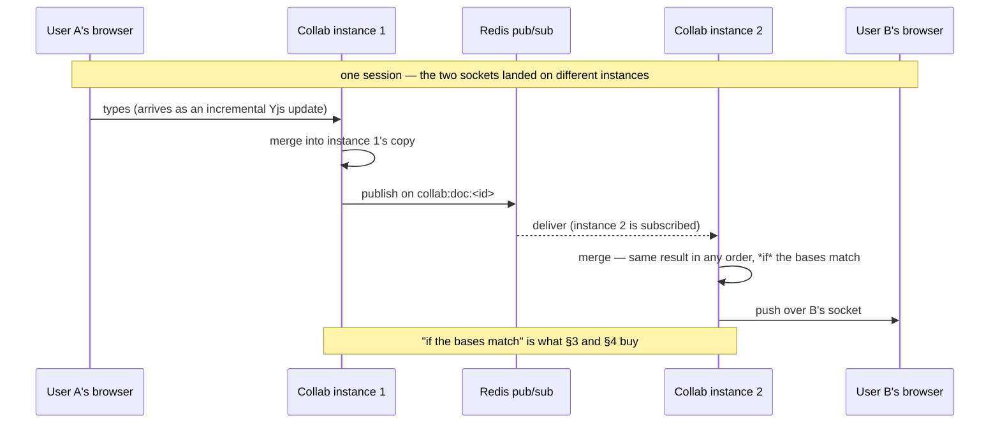

# Collab

The hard part of the project, and the only piece I would defend as genuinely
difficult. Two people type into one document at the same time from two different
processes, and it converges with nothing but Redis between them.

Collab owns the live Yjs documents — which exist only in one instance's memory —
and the snapshots that let them survive anything. It authorizes its own sockets,
because the Gateway structurally cannot: the Gateway holds no session data.

Code: [`services/collab/src/`](../../services/collab/src/) — `rooms.ts` (the one
file worth the most time), `index.ts`, `repository.ts`, `clients.ts`.

Yjs is the CRDT library (Conflict-free Replicated Data Type: concurrent edits on
separate copies always merge to the same result, with no central referee). Why a
CRDT rather than operational transforms is
[`../adr/02-crdt-over-operational-transforms.md`](../adr/02-crdt-over-operational-transforms.md);
why not hand-roll the merge is that the interesting problem here is the sync
topology, which is exactly the part Yjs does *not* do for you.

---

## 1. The distributed-systems moment



*Why Redis pub/sub and not sticky sessions?* The obvious fix is pinning both
users to one replica, and it does not work: session affinity pins **a client**,
not a group. The two people in a session are different clients connecting at
different moments, so nothing would co-locate them in the first place, and the
pinning is lost the moment that replica is replaced. Fanning through Redis makes
instance placement irrelevant, which is the property that survives a rolling
update.

**Three Redis channels per session, plus one that belongs to Matching:**

| Channel | Carries |
|---|---|
| `collab:doc:<id>` | document updates |
| `collab:awareness:<id>` | presence and cursors |
| `collab:sync:<id>` | a new instance asking for current state (§4) |
| `match:session:<id>` | Matching's lifecycle events, named by Matching (§6) |

Both listeners check who caused the change. A local socket's update is broadcast
to the room's *other* local sockets and published to Redis; an update that
arrived **from** Redis (`origin === 'redis'`) is broadcast locally and **not**
republished. That one branch is the entire loop-prevention story.

`messageBuffer`, not `message`: a Yjs update is arbitrary binary, and the string
event would run it through UTF-8 coding and silently corrupt it.

---

## 2. Letting a socket in

```
wss://gateway/collab/connect?sessionId=<id>&token=<firebase-id-token>
```

Two checks, answering two different questions, in the two places that can answer
them.

**The Gateway answers *who is this*.** A browser's native `WebSocket` constructor
cannot set an `Authorization` header, so for an upgrade — and only for an upgrade
— the token is accepted from `?token=` instead
([`01-gateway.md`](01-gateway.md) §2).

**Collab answers *is this uid in this session*.** `authorizeConnect` calls
Matching's participant route with the Gateway-verified uid, before the socket
upgrades: `@fastify/websocket` only hijacks the connection once every hook has let
the request through. 401 with no identity, 400 for a malformed `sessionId`, 403
for someone who is not in the session, 503 if Matching is unreachable.

**A rejection looks different depending on which layer catches it**, and that is
worth knowing rather than being surprised by. A *bad token* never leaves the
Gateway: ordinary HTTP status, no upgrade. Collab's own refusal is different when
it comes through the Gateway, because `@fastify/http-proxy` completes the 101
handshake with the client *before* it opens its own connection upstream. So a
caller Collab rejects still sees `101 Switching Protocols`, and the tell is not
the status code — it is that the socket closes immediately having received no
document bytes at all. Straight to Collab, bypassing the proxy, the same
rejection is a plain `403`.

---

## 3. Two instances must agree on the document's *identity*, not just its text

This is the failure the service actually shipped with, and the one worth the most
time.

**What happens:** both users are matched at the same moment and connect at the
same moment, landing on two instances. Neither finds a snapshot — the first is 30
seconds away — so each builds the scaffold from the question independently. Print
both documents and they are *identical*. Every test passes. Then somebody types,
and their edit never appears on the other screen. Ever.

Yjs identifies each character by the pair `(clientID, clock)`, and a fresh
`Y.Doc` picks a **random** `clientID`. Two independently seeded documents
therefore hold the same *text* built out of entirely unrelated *structs*. An edit
is a delta saying "insert after the struct owned by client 770768811", the other
instance has never heard of client 770768811, and so Yjs does the correct CRDT
thing: it parks the update in `pendingStructs` and waits for a base it will never
receive. Both sides stay silently, permanently out of sync while looking
completely healthy.

**The fix is one line, and it is not the obvious one.** The obvious fix is to
make the instances talk more. The actual fix is to make the seed *not a fresh
document*: build it under a fixed `SEED_CLIENT_ID = 0` and apply it as an update.
Every instance seeding the same question now produces byte-identical structs, so
the second copy merges into the first instead of being a stranger to it.

Two replicas agreeing on the bytes is not the same as agreeing on the identity of
the bytes. A CRDT merges by identity, so two documents that print the same and
were built independently are not the same document, and nothing you send between
them will make them one.

To watch the test catch it, comment out `seed.clientID = SEED_CLIENT_ID` in
[`rooms.ts`](../../services/collab/src/rooms.ts) and run
[`sync.test.ts`](../../services/collab/src/sync.test.ts) again.

**What the scaffold is:** a numbered list of the question's parts, with blank
lines under each to answer in, all in a single `Y.Text` named `"content"`. That
field name is a contract with the frontend, where `y-monaco` binds to it —
binding to anything else yields an empty editor that syncs with nobody. There are
no separate "answer" and "scratch" sections: they meant deciding where a thought
belonged before writing it down, and the numbering now matches how the questions
read everywhere else in the app.

**A missing question fails the build** rather than seeding an empty document.
Matching validated the id when it created the session, so a 404 means Questions
lost the row afterwards. Seeding empty looks like it worked, gets snapshotted 30
seconds later, and the scaffold can then never come back for that session.

---

## 4. A late joiner has to ask for what it missed

Fixing §3 makes simultaneous joins converge and does nothing for the ordinary
case: the second person clicks ten seconds after the first. Their instance was
not subscribed while those ten seconds of edits went past on Redis, and the
snapshot that would have carried them does not exist yet. Same ending — parked
deltas, silent divergence.

So on building a room, an instance publishes its own id on `collab:sync:<id>`.
Any instance already holding that session replies with
`Y.encodeStateAsUpdate(doc)` — the **whole** document, not a delta, because a
full state is self-contained and integrates onto any base. Nothing waits for the
answer: the deltas Yjs parked in the meantime apply themselves the moment the
missing base arrives.

The instance id is per *manager* rather than per process, so its own rooms ignore
the echo of their own request (Redis delivers a published message to every
subscriber, the publisher included) while two managers sharing one process — which
is how the tests model two instances — can still answer each other.

**This reply is also why `edit_latency` is only meaningful against one replica.**
A whole document re-delivered to a pod that did not have it is, to a load script
that stamps timestamps into the text, hundreds of "edits" that took minutes to
arrive. The full reasoning and the numbers are in
[`09-running-it.md`](09-running-it.md) §6. It is a measurement artifact, not a
defect; the real cost of the state reply is bandwidth, and in real use rooms open
rarely.

---

## 5. Three failures around the socket itself

**A frame can arrive before there is anywhere to put it.** Opening a room is not
free: a Postgres round trip, and on a new session an HTTP call to Questions. A
real client does not wait for that — it opens the socket and can send the moment
`onopen` fires. Attach the `message` listener *after* that await and everything
sent in between hits a socket with no listener, and Node's `EventEmitter` keeps
no backlog for an event nobody was listening for. It is simply gone. So the
listeners go on **before** the await and early frames are queued into an array,
replayed once the room is ready, and only then does the listener stop queueing —
replaying first would let a frame arriving mid-replay overtake the ones already
waiting.

**One bad frame must cost one client, not the process.** `handleMessage` throws
on a truncated frame, an empty one, an unknown sync sub-type, or awareness bytes
that are not JSON. A throw inside a `ws` event listener is not a failed request —
there is no request. It is an `uncaughtException`, and the process dies, taking
every other session on that instance with it. One `try/catch` around the dispatch
closes the offending socket with 1002 and nobody else notices. In a
request/response server an unhandled throw costs you one response; in an
event-driven one it costs you the process, so the blast radius of a malformed
input is a property of where you handle it rather than of how bad the input was.

**The client can give up while the room is being built.** The close handler ran
with `joined` still false, so nothing has released the room — and if this socket
is the one that created it, leaving now is the only thing that will ever tear it
down.

### The wire protocol

Every frame starts with one byte: `MESSAGE_SYNC` (0) or `MESSAGE_AWARENESS` (1).
That is `y-websocket`'s convention rather than Yjs's, adopted so `y-protocols`'
own `readSyncMessage` and `writeSyncStep1` can be used directly instead of
inventing an equivalent. A sync frame goes to `readSyncMessage`, which itself
distinguishes step 1 (a handshake — reply with step 2), step 2, and a plain
update. `readSyncMessage` only writes a reply for step 1, so an encoder length of
1 is just the type byte and means there is nothing to send back.

The two branches are **not symmetric**, and this is the detail that costs an
afternoon if missed: a sync message writes its body directly, an awareness
message is length-prefixed with `writeVarUint8Array`.

Presence and cursors ride the same socket under the awareness type. Yjs's
**awareness** protocol is a small side channel built for exactly this kind of
ephemeral per-client state, so cursors need neither a second connection nor a
second protocol, and none of it ends up in the document's history.

**`awareness.setLocalState(null)` on construction.** Constructing an `Awareness`
registers its own document as a client. Left alone, the server becomes a
participant who never types: a ghost cursor in the editor, and a heartbeat
re-announcing itself to every other instance for as long as the room lives.

---

## 6. Snapshot, disconnect, reconnect, end

One row per session: `session_id uuid PRIMARY KEY, state bytea, updated_at`.
`state` is the output of `Y.encodeStateAsUpdate(doc)`, upserted on conflict.

**Three moments write a snapshot**, all through the same call:

- **Every 30 seconds** per live room.
- **When a room's last socket leaves**, after which the room is torn down.
- **Before the process exits**, from the `onClose` hook.

*Why 30 seconds and not every edit?* Per-keystroke writes would put a database
round trip on the hot path of every character typed. 30 seconds bounds worst-case
loss, and the disconnect and SIGTERM snapshots mean the routine cases — deploy,
scale-down, closed tab — lose nothing at all. Only an ungraceful crash hits the
full window.

**Reconnect and restart are deliberately the same code path.** There is no
"restore after crash" branch to keep in sync with the normal one: a reconnecting
tab and a freshly started instance both call `getOrCreateRoom`, find nothing in
memory, and load the snapshot. Nothing is kept in memory once nobody is watching
a session.

**Two orderings inside `leaveRoom` were wrong at some point, and both matter:**

- **Snapshot before dropping the room from the map.** Reversed, a reconnect
  landing in the gap rebuilds from the *previous* snapshot — up to 30 seconds
  stale — and then overwrites the good one with it.
- **Remove the socket from `sockets` before clearing its presence.**
  `removeAwarenessStates` fires the awareness listener synchronously, and that
  listener re-registers any sender still in the set, so clearing presence first
  puts the departing socket back into the tracking map where it stays for the
  life of the room.

Somebody may also have joined while the snapshot write was in flight, so the
socket count is re-checked afterwards: the room is live again and must not be
torn down.

**Teardown releases four things**, and each one is a leak if forgotten: the
snapshot interval, the Redis subscriber (unsubscribed *and* disconnected), the
`Awareness` and the `Y.Doc`. Both of the last two hold interval timers of their
own — an `Awareness` re-announces every few seconds until destroyed, which for a
torn-down room means publishing to Redis forever.

**Ending is a fourth path.** When Matching publishes `session.ended` on
`match:session:<id>`, every instance holding that session gets it, which is what
makes ending work across instances rather than only on whichever one the person
who pressed the button was talking to. The room takes a final snapshot, tears
down, and closes each socket with **4001** — a code in the application range, so
the browser can tell "this is over" from "the connection dropped" and does not
reconnect forever against a session that will never accept it. The frontend
matches on the same number.

Ordering matters twice there too: `closing` goes up first so nothing else is
relayed or published while the work happens, and the sockets are closed *after*
the room leaves the map, so each close handler finds nothing and returns
immediately rather than racing the teardown.

**A dedicated Redis connection per room.** A subscribed ioredis connection cannot
issue any other command, so publishing and subscribing can never share one.
`duplicate()` copies the main connection's options without re-reading
`REDIS_URL`, and re-enables `enableOfflineQueue`, which `@deepcs/shared/redis`
turns off: that setting exists so a *user-facing request* fails fast instead of
hanging, and a long-lived listener is not a request. Subscribing before the socket
finishes connecting should queue, not throw. (It threw, the first time this was
written.) If the subscribe fails anyway, the connection is disconnected
explicitly, or it sits there reconnecting for the life of the process, once per
failed room build.

---

## 7. What the pod-kill test actually proved

An edit was written into a live document, the Collab pod holding that room was
identified from its `/metrics` and deleted while the socket was still open, and
the marker was read back after reconnecting. The kill happened a few seconds
after the write, well inside the 30-second interval, and the socket never closed
on its own — so the periodic snapshot and the on-disconnect snapshot are both
ruled out. **The only thing that could have saved that edit is the SIGTERM path.**

The socket itself does close. Nothing in a Deployment can prevent that: the pod
is going away and the socket lives in the pod. What makes it survivable is the
client, which reconnects after 1.5 seconds and resumes from the snapshot. So the
accurate claim is **"a replaced Collab pod costs a reconnect, not any edits"**,
not "interrupts nobody". Full conditions in
[`09-running-it.md`](09-running-it.md) §5.

This is also why Collab gets a 45-second termination grace period rather than 30:
long enough for the preStop pause plus the snapshot write.

---

## 8. `/metrics`

Prometheus-format gauges: socket count, room count, resident memory, used heap.
Deliberately **not** routed through the Gateway, so it is reachable from inside
the network and nowhere else.

Both counts come from the manager's own state rather than from the operating
system's open sockets, and that is the point: **a leak is precisely the case
where the two disagree**, because the connection is gone and the bookkeeping
still has it. `live` holds the rooms that finished building, because the room map
holds promises and a metrics scrape has to answer without awaiting one.

It exists to be read next to the load generator's own numbers. When the client
says 250 sockets and the server agrees, the number is real; when only the client
says it, it is a queue in the client
([`09-running-it.md`](09-running-it.md) §6).

Request rate, error rate and latency histograms are not here, on this service or
any other.

---

## 9. Why this service is its own deployable

**Different scaling trigger and different failure mode.** One WebSocket occupies
a concurrency slot for the length of a session, so Collab needs the opposite
concurrency and timeout settings from every other service here. Bundling it with
the question bank means a hundred idle sockets starve a browse request, and the
two scale on incompatible signals with no way to configure both.

Concurrency also *means* something different here. For a request/response
service it is a throughput knob: 80 in-flight requests are 80 small heap objects
waiting on Postgres for 30 ms each. For Collab it is a **population** — each
socket is held for the length of a session, so the count is how many people are
in the system at once rather than how fast it gets through work.

**Nothing configures a limit on either.** No per-process concurrency setting
exists in this repo, so what has been established is that 250 sockets are
comfortable on one laptop, which is a fact about the laptop and not a ceiling
anybody chose ([`09-running-it.md`](09-running-it.md) §7).
